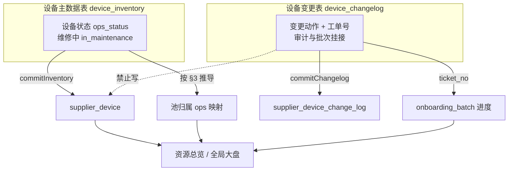

# 设备运维状态 · 资源池归属 · 主数据真源 — 口径修订设计

**文档性质**：在既有导入 / 总览 / 大盘设计之上的 **口径修订与实现清单**；确认后按本文改代码，本文优先于冲突的旧描述。

**版本**：v1.0（2026-05-29）

**状态**：**v1.0 已确认**（2026-05-29 按 §13 结论实施代码）

**关联文档**（本文修订后需同步勘误）：

- [supplier-device-import-schema.md](./supplier-device-import-schema.md)
- [supplier-onboarding-plan-changelog-tracking-design.md](./supplier-onboarding-plan-changelog-tracking-design.md) §3.4.5
- [global-dashboard-resource-composition-chart-design.md](./global-dashboard-resource-composition-chart-design.md) — 大盘资源构成互斥分桶（优先于重叠池展示）
- [supplier-overview-scenarios-from-zero.md](./supplier-overview-scenarios-from-zero.md)

**关联实现**（确认后修改）：

- `packages/db/src/supply-lifecycle-dictionary.ts`
- `apps/web/src/lib/supplier/device-pool-membership.ts`
- `apps/web/src/lib/server/dataaccess/supplier/device-import.ts`
- `apps/web/src/lib/server/dataaccess/supplier/overview.ts`
- `apps/web/src/lib/server/aggregation/overview-aggregation.ts`
- `apps/web/src/lib/server/dataaccess/dashboard/global-ops.ts`
- `apps/web/src/lib/server/dataaccess/dashboard/global-period.ts`

---

## 1. 决策摘要（已确认）

| # | 决策 | 说明 |
|---|------|------|
| D1 | **设备主数据表为真源** | `device_inventory` Excel 的「设备状态」「维修中」决定 `ops_status`、`in_maintenance`、资源池归属与 CRM `lifecycle_status`（重算） |
| D2 | **变更表仅做工单与审计** | `device_changelog` commit **只**写 `supplier_device_change_log`、挂接业务批次、`refreshBatchProgress`；**不再**更新 `supplier_device` |
| D3 | **`在集群中` 仅属弹性池** | 稳态弹性设备用 `在集群中`；代理裸金属完成后运维 **保持** `网关代理裸金属上架中`（双池），**不**改为 `在集群中` |
| D4 | **内部占用统一口径** | `其他部门使用中` 与 L1 内部测试 / `internal_test_hold` **合并**计入「内部占用」KPI |
| D5 | **新增运维字典** | 增加 `单机直连裸金属上架中`（与 `网关直连裸金属上架中` 并列，均计裸金属池） |
| D6 | **维修中为叠加标记** | `in_maintenance` 不是第四种池；不改变池归属，仅影响 lifecycle / 维护 KPI / 可售 |
| D7 | **进程态 KPI 边界** | 待接入 = 上架批次且未接收；下线中 = 下架批次进行中且 **未** `已退订`；`已退订` 后从下线中与库存计数退出 |
| D8 | **异常设备含故障 GPU** | 未关闭故障关联设备 **与** 故障下架 GPU（`fault_down`）均计入「异常设备」KPI |

---

## 2. 数据真源与职责边界



| 导入类型 | 写入 | 不写入 |
|----------|------|--------|
| `device_inventory` | `supplier_device`、`compute_node`、重算 `lifecycle_status`、刷新 L1 库存 | 业务批次进度 |
| `device_changelog` | `supplier_device_change_log`、`onboarding_batch_device_link`、批次 `refreshBatchProgress` | `supplier_device.ops_status` / `lifecycle_status` / `in_maintenance` |

**运维约定**：

- 设备状态、池归属变化 → **重新导入设备主数据表**（全量/增量均可，以 SN/IP/设备 ID 匹配更新）。
- 变更表用于证明「某工单下已执行某动作」，驱动 **批次 touched/online/retired 计数**，不驱动设备截面。

---

## 3. `device_ops_status` 字典（12 条）

在 `lifecycle_state_definition`（`domain = device_ops_status`）与 `supply-lifecycle-dictionary.ts` 中维护 **12** 条种子（原 11 条 + 新增 1 条）。

### 3.1 完整对照表

| code | 中文（Excel 原文） | `pool_memberships` | `overview_bucket` | 其他 KPI 分桶 | 参考 `lifecycle` |
|------|-------------------|--------------------|--------------------|--------------|-------------------|
| A | `预留闲置中` | — | `reserved` | 预留闲置 | `接入中` |
| B | `在集群中` | `elastic_service` | `in_cluster` | 可售候选 | `在线` |
| C | `集群组件运行中` | `elastic_service` | `in_cluster` | 可售候选；**infra/CPU 计 0 卡** | `在线` |
| D | `网关直连裸金属上架中` | `bare_metal` | `bare_metal_onboarding` | — | `在线` |
| E | `网关代理裸金属上架中` | `bare_metal`, `elastic_service` | `bare_metal_onboarding` | 双池；**稳态长期保持此 ops** | `在线` |
| F | **`单机直连裸金属上架中`**（**新增**） | `bare_metal` | `bare_metal_onboarding` | — | `在线` |
| G | `线下裸金属交付中` | `bare_metal` | `offline_delivery` | — | `在线` |
| H | `其他部门使用中` | — | `other_dept` | **内部占用**（§6） | `在线` |
| I | `不可调度节点运行中` | — | `in_cluster` | 不可调度 | `在线` |
| J | `网关节点上架中` | `bare_metal`, `elastic_service` | `gateway_onboarding` | 双池；**infra/CPU 计 0 卡** | `在线` |
| K | `已退订` | — | `retired` | 全 KPI 排除（库存同步移出） | `下线中` → 归档 |

> **废止旧规则 B1**：`在集群中` **不再**依赖 `resource_pool_binding` 承接池归属；binding 表降为可选审计/历史，**聚合以 `ops_status` 为准**。

### 3.2 变更动作默认 ops 调整

| `change_action` | 原 `default_ops_status` | 修订后 |
|-----------------|------------------------|--------|
| `上架单机模式裸金属` | `网关直连裸金属上架中` | **`单机直连裸金属上架中`** |
| `上架网关直连裸金属` | `网关直连裸金属上架中` | 不变 |
| `加入集群` | `在集群中` | 不变（仅审计；设备截面以主数据为准） |

---

## 4. 资源池归属解析（`resolveDevicePoolMemberships` v2）

### 4.1 唯一聚合口径

```
pool_memberships(device) =
  DICT[ops_status].pool_memberships   // §3.1 表
  // infra 设备：metricGpuCount = 0，池列不累加 GPU
```

**废止**：从 `resource_pool_binding` 叠加池归属（只读历史时可保留查询，**不参与** KPI）。

### 4.2 输出字段（与资源总览列一致）

| 字段 | 条件 |
|------|------|
| `elasticServiceGpu` | `memberships ∋ elastic_service` → `+= metricGpuCount(device)` |
| `bareMetalPoolGpu` | `memberships ∋ bare_metal` → `+= metricGpuCount(device)` |
| `dualPoolGpu` | 同时含 `bare_metal` 与 `elastic_service` → `+= metricGpuCount(device)` |

**禁止** 裸金属池与弹性池互斥去重；允许双池重叠计数。

### 4.3 表底说明（UI footer）

```
裸金属池 / 弹性池 / 双池由设备主数据「设备状态」映射；
双池设备（如网关代理裸金属上架中）同时计入两列；
在集群中仅计弹性池；维修中不改变池归属。
```

---

## 5. 维修中（`in_maintenance`）— 叠加标记

`in_maintenance` **不是**资源池类型，与 `ops_status` **正交**。

### 5.1 解析优先级

```
1. IF in_maintenance = true        → lifecycle_status = '维护中'（覆盖 ops 推导的在线）
2. ELSE IF 有待进行中的下架批次且 ops ≠ '已退订' → lifecycle = '下线中'（§7.2）
3. ELSE IF ops ∈ ONLINE_OPS         → lifecycle = '在线'
4. ELSE IF ops = '预留闲置中'       → lifecycle = '接入中'
5. ELSE IF 待接入（§7.1）           → lifecycle = '待接入'
6. ELSE IF ops = '已退订'           → lifecycle = '下线中'（结案后库存移出）
```

### 5.2 对 KPI 的影响

| KPI / 指标 | `in_maintenance = true` 时 |
|------------|---------------------------|
| 弹性池 / 裸金属池 / 双池 | **不变**（仍按 `ops_status` 计池） |
| `maintenance` / 维护中 | `+1` 台 / 对应 GPU |
| `sellable`（可售） | **排除** |
| `device_online` | 仍计 **在线**（若 lifecycle 被覆盖为维护中，按实现统一：维护中设备 **不计入** 在线 KPI，与现网 `lifecycle=维护中` 一致） |

> **说明**：池归属看 `ops_status`；lifecycle 看维修标记与批次。维护中设备 **保留原池归属 GPU**，但不计可售。

---

## 6. 内部占用（`internal_test`）统一口径

**废止**：将 `其他部门使用中` 仅从可售扣减、不计入 `internal_test` 的旧逻辑。

### 6.1 定义

```
internal_occupancy_gpu =
  Σ inventory 行 internal_test 标记与 hold 解析
  + Σ metricGpuCount(device) WHERE ops_status = '其他部门使用中'
```

大盘 KPI `internal_test`、资源总览「内部占用」**统一使用** `internal_occupancy_gpu`。

### 6.2 可售量

```
sellable_gpu =
  online_gpu
  − internal_occupancy_gpu
  − fault_down_gpu
  − non_schedulable_gpu   // ops = 不可调度节点运行中
```

`other_dept` 不再单独作为可售扣减项（已并入内部占用）。

---

## 7. CRM `lifecycle_status` 与进程 KPI

### 7.1 待接入

**定义**：

```
待接入 ⇔
  设备已关联进行中的上架/订单接入业务批次（online | order_access）
  AND 尚未发生「设备接收」（变更审计或等效标记）
```

**Snapshot / Period `device_pending_access`**（**已确认：仅实体**）：

```
device_pending_access = kpiFromDevices(filteredDevices, d => d.lifecycle_status === '待接入')
```

**不叠加** pipeline 计划缺口（`planned − touched` 未入库部分不计入待接入 KPI）。

### 7.2 下线中

**定义**：

```
下线中 ⇔
  设备已关联进行中的 device_retire 下架批次
  AND ops_status ≠ '已退订'
```

| 阶段 | `lifecycle` | 计入「下架中」KPI |
|------|-------------|------------------|
| 创建下架批次、尚未退订 | `下线中` | **是** |
| 主数据 ops = `已退订` | `下线中` → 库存同步后归档 | **否**（计数减少） |

**语义**：`下线中` = **正在下架**；`已退订` = **下架完成**，退出活跃库存与下架中 KPI。

### 7.3 已退订

- `ops_status = '已退订'`
- `gpu-inventory-sync` **排除** `lifecycle_status = '退订'` / 已退订设备
- 不参与：GPU 总卡数、三池、可售、下线中（进行中）

---

## 8. 异常设备（`device_abnormal`）修订

### 8.1 含义

反映 **故障导致的异常占用**：关联未关闭故障的设备，以及故障导致的 **下架 GPU**。

### 8.2 Snapshot 公式

```
open_faults =
  fault_incident WHERE closed_at IS NULL
  OR incident_status ∉ {'已关闭','closed'}

abnormal_devices =
  |{ fault.supplier_device_id | fault ∈ open_faults AND supplier_device_id NOT NULL }|

fault_down_gpu =
  Σ 在线设备上未关闭故障造成的 GPU 损失
  + L1 行 status=maintenance 的 (quantity − online_quantity) 等既有 fault_down 规则

device_abnormal.deviceCount = abnormal_devices
device_abnormal.gpuCount    = fault_down_gpu    // 修订：原恒为 0，现展示故障 GPU
warning = deviceCount > 0 OR gpuCount > 0
```

### 8.3 与可售、维护的关系

- `fault_down_gpu` 同时从 **可售** 扣减（现有逻辑保留）
- 故障维修中 `in_maintenance=true` 的设备：维护 KPI + 异常 KPI **可同时**命中（不同维度）

---

## 9. 全局大盘 KPI 映射（8 项）

| metric_key | 标题 | 修订要点 |
|------------|------|----------|
| `gpu_total` | GPU 总卡数 | 不变；排除 infra / 已退订 |
| `device_online` | 在线设备 | `lifecycle=在线`；不含维护中覆盖态 |
| `pool_elastic` | 弹性资源池 | §4；`在集群中` / `集群组件运行中` / 双池之弹性侧 |
| `pool_bare_metal` | 裸金属池 | §4；直连/单机直连/线下交付/双池之裸金属侧 |
| `internal_test` | 内部占用 | §6 统一口径 |
| `device_abnormal` | 异常设备 | §8；台数 + 故障 GPU |
| `device_pending_access` | 待接入设备 | §7.1 |
| `idc_pending_access` | 待接入机房 | 不变 |

---

## 10. 实现变更清单（确认后执行）

### 10.1 字典与类型

- [ ] `supply-lifecycle-dictionary.ts`：新增 `单机直连裸金属上架中`；为 12 条 ops 补充 `pool_memberships` / `overview_bucket`
- [ ] `DeviceOpsStatusPayload` 类型增加 `pool_memberships?: PoolKind[]`
- [ ] DB 种子 / migration：`lifecycle_state_definition` 同步 12 条

### 10.2 池归属

- [ ] `device-pool-membership.ts`：用 §3.1 表替换 `OPS_POOL_MEMBERSHIPS` 硬编码；默认 **不读** `resource_pool_binding`
- [ ] 单测：`resolveDevicePoolMemberships` 覆盖 12 态 + infra 计 0

### 10.3 导入

- [ ] `commitInventory`：写 `supplier_device` 后按 ops 刷新池（内存聚合即可，无需写 binding 表）
- [ ] `commitChangelog`：**删除**对 `supplier_device` 的 `update` 循环；保留 log + batch link + `refreshBatchProgress`
- [ ] `CHANGE_ACTION_DEFAULT_OPS`：`上架单机模式裸金属` → `单机直连裸金属上架中`
- [ ] `parse-device-import-csv.ts`：`KNOWN_OPS_STATUS` 含新状态

### 10.4 聚合

- [ ] `overview.ts`：`internal_test` 合并 `其他部门使用中` 设备 GPU；`sellable` 去掉重复 `other_dept` 扣减
- [ ] `overview.ts` / `global-ops.ts`：`device_abnormal.gpuCount = fault_down_gpu`
- [ ] `resolveLifecycleStatus`（或 v2.4 等价函数）：实现 §5.1、§7.1、§7.2 优先级
- [ ] `global-period.ts`：与 Snapshot 同步池映射与内部占用口径

### 10.5 文档勘误

- [ ] `supplier-device-import-schema.md` §2.1：12 条字典；变更表不写设备表
- [ ] `supplier-onboarding-plan-changelog-tracking-design.md` §3.4.5：废止 B1、binding 承接
- [ ] `global-dashboard-kpi-caliber-spec.md` §4.4–§4.7：按本文更新

### 10.6 非目标（本期不做）

- 不回填历史 `resource_pool_binding`
- 不新增 Excel 池列（池完全由 `设备状态` 推导）
- 不改变故障表 `fault_records` 导入语义

---

## 11. 验收场景

| # | 场景 | 预期 |
|---|------|------|
| T1 | 主数据 `在集群中`，8 卡 compute | 弹性池 +8；裸金属 0 |
| T2 | 主数据 `网关代理裸金属上架中`，8 卡 | 弹性 +8、裸金属 +8、双池 +8 |
| T3 | 代理裸金属完成后仍写 `网关代理裸金属上架中` | 同 T2（**不**因未改成 `在集群中` 而丢裸金属） |
| T4 | 主数据 `单机直连裸金属上架中` | 裸金属 +8；弹性 0 |
| T5 | `其他部门使用中` 8 卡 | 内部占用 +8；可售不含 |
| T6 | L1 internal_test 4 卡 + H 状态 8 卡 | 内部占用 12 |
| T7 | `在集群中` + `维修中=是` | 弹性池仍 +8；维护 KPI +1；可售不含 |
| T8 | 关联下架批次，ops 非 `已退订` | 下架中 KPI +1 |
| T9 | 主数据 ops 改 `已退订` | 下架中 KPI −1；GPU 总卡数 −8 |
| T10 | 未关闭故障 1 台 + fault_down 16 卡 | 异常设备 1 台、16 卡 |
| T11 | 仅导入变更表 `设备接收` | 批次进度更新；`supplier_device` **不变** |
| T12 | 集群组件 / 网关上架中，infra CPU 台 | 池 GPU 均为 0；可计台数 |

---

## 12. 与旧版差异速查

| 旧口径 | 新口径 |
|--------|--------|
| `在集群中` 靠 binding 定池 | **仅弹性池** |
| 变更表刷新 `ops_status` | **主数据唯一真源** |
| `其他部门使用中` 只扣可售 | **并入内部占用** |
| 无 `单机直连裸金属上架中` | **新增字典** |
| 异常设备 GPU 恒 0 | **含 fault_down_gpu** |
| 代理裸金属稳态可写 `在集群中` | **保持 `网关代理裸金属上架中`** |

---

## 13. 确认项（已关闭）

| # | 问题 | **结论** |
|---|------|----------|
| 1 | `网关节点上架中` 池计数 | **双池**；**GPU 计入、infra/CPU 不计入**（`metricGpuCount`） |
| 2 | `device_abnormal` 展示 | **是**：台数 + 故障 GPU |
| 3 | 待接入 KPI pipeline 缺口 | **否**：仅统计已入库 `lifecycle=待接入` 实体 |
| 4 | 维护中 vs 在线 KPI | **排除**：`lifecycle=维护中` 不计入在线 KPI |
