# 供应域 — 库存设备平台状态探测定时任务设计方案

> 版本：v1.1  
> 日期：2026-06-15  
> 状态：**待确认 — 待实施**  
> 变更：v1.1 — 新增 §16 性能优化：临时 staging 表 + SQL 比对；Redis 作为可选读缓存层  
> 性质：在既有 `supplier_device` 主数据之上，通过算算力 OpenAPI 三路数据源交叉比对，生成 **平台侧可观测状态** 并 **小时级落库**；**不替代** Excel 主数据导入，**不自动回写** `supplier_device.ops_status`。

**关联文档**：

- [supplier-device-import-schema.md](./supplier-device-import-schema.md) — 库存设备主数据（`device_inventory`）
- [supplier-device-ops-pool-masterdata-design.md](./supplier-device-ops-pool-masterdata-design.md) — D1 主数据真源边界
- [supplier-device-masterdata-integration-api-design.md](./supplier-device-masterdata-integration-api-design.md) — 第三方状态 API（本期 **不调用**，仅 Cron 探测）
- [supplier-datacenter-import-design.md](./supplier-datacenter-import-design.md) — `data_center.container_instance_region` / `bare_metal_region`
- [bare-metal-order-schema-design.md](./bare-metal-order-schema-design.md) — 裸金属订单本地表与状态枚举
- [project-billing-scheduled-sync-design.md](./project-billing-scheduled-sync-design.md) — Cron + advisory lock 模式参考

**关联实现（待开发）**：

- `apps/web/src/lib/server/integrations/api.ts` — 已有 `getDeviceInfoList`、`getNodeDeviceListAPI`
- `apps/web/src/lib/server/integrations/request.ts` — OpenAPI 签名与鉴权
- `apps/web/src/lib/server/dataaccess/supplier/gpu-inventory-sync.ts` — `activeInventoryDeviceFilter()`
- `apps/web/src/lib/server/dataaccess/finance/cost-master-data.ts` — 机房区域/名称索引
- `apps/web/src/lib/supplier/ip-endpoint-utils.ts` — `endpointMatches` / `parseEndpointHost`
- `apps/web/src/lib/server/jobs/register-bare-metal-order-sync-cron.ts` — 小时 Cron 注册范式

---

## 1. 目标与原则

### 1.1 业务目标

| # | 目标 | 说明 |
|---|------|------|
| G1 | **全量库存探测** | 每小时对 CRM 内 **有效库存设备**（`supplier_device`）执行一次平台侧状态探测 |
| G2 | **三路交叉比对** | 分别对接 `device_info/list`（接入端）、`node_device/list`（K8s）、本地裸金属订单（等待/服务中） |
| G3 | **统一匹配键** | 机房维度 + 内网 IP；IP 比较复用 `endpointMatches` |
| G4 | **结果存库** | 每次 job 写入运行日志 + 设备级快照；保留历史供对账与 UI 展示 |
| G5 | **可观测** | 汇总 matched / unmatched / ambiguous 计数；失败可重跑 |

### 1.2 非目标（本期）

- **不**根据探测结果自动修改 `supplier_device.ops_status` / `lifecycle_status`（主数据真源仍为 Excel 导入，见 D1）
- **不**调用 §3 第三方主数据 REST API 回写
- **不**新建 `apps/workers` 独立镜像（与 billing / bare-metal cron 一致，web 进程内 `node-cron`）
- **不**在首期实现告警推送（飞书/邮件）；仅落库 + 预留 UI
- **不**对平台 API 返回的 SSH 密码等敏感字段持久化（仅存匹配结论与必要业务字段）

### 1.3 设计原则

1. **探测与真源分离**：Cron 产出 **观测态**（probe），与 **运维态**（ops_status）分表存储。
2. **全量拉取 + SQL Join（推荐）**：API 数据先写入 **job 级 staging 临时表**，匹配与聚合由 **PostgreSQL SQL** 完成；避免在 Node 进程内持有大 Map（见 §16）。
3. **幂等可重跑**：同一 `snapshot_hour` 重复执行时 upsert 覆盖，不产生重复快照行。
4. **单实例互斥**：PostgreSQL advisory lock，多副本仅一个 job 运行。
5. **部分失败可继续**：某一路 API 失败时，仍写入 job_run（`status=partial`），未失败通道的结果照常落库。

---

## 2. 探测范围

### 2.1 库存设备（CRM 侧）

与 L1 库存聚合口径一致，使用已有过滤器：

```typescript
// gpu-inventory-sync.ts
activeInventoryDeviceFilter()
// lifecycle_status != '退订' AND ops_status != '已退订'
```

附加约束：

| 项 | 规则 |
|----|------|
| 必须有内网 IP | `internal_ip` 非空；否则标记 `skip_reason=no_internal_ip`，不参与三路匹配 |
| 建议关联机房 | `data_center_id` 非空；为空时仍尝试仅用 IP 匹配，但标记 `match_flags.dc_missing` |
| 已退订设备 | 排除（见上） |

### 2.2 平台数据源

#### 2.2.1 接入端设备 — `GET /admin/device_info/list`

| 项 | 说明 |
|----|------|
| 封装 | `getDeviceInfoList`（`integrations/api.ts`） |
| 分页 | 按 `count` / `results` 全量分页（`page` + `page_size`，具体参数对齐 OpenAPI 文档） |
| 过滤 | 服务端返回 `is_delete=false` 的设备；客户端额外排除 `is_delete=true` |
| **匹配键** | `idc_name` + `inner_ip` |
| **匹配成功含义** | 该库存设备在接入端 **已注册且可按 IP 定位** → **接入端可控** |
| **需记录字段** | `rent_status`、`online_status`、`shelf_status`、`listing_mode`、`platform_device_id`（`id`）、`last_connection_time` |

示例 `rent_status`：`ElasticRenting`、`Idle` 等（平台原文落库）。

#### 2.2.2 K8s 节点设备 — `GET /admin/node_device/list`

| 项 | 说明 |
|----|------|
| 封装 | `getNodeDeviceListAPI` |
| 分页 | 全量分页 |
| 过滤 | `offline_date IS NULL`（仍在集群内） |
| **匹配键** | `region`（容器编码）+ `inner_ip` |
| **匹配成功含义** | 该库存设备对应 K8s worker 节点 **已上报** |
| **需记录字段** | `device_name`、`region`、`gpu_name`、`gpu_count`、`hash` |

#### 2.2.3 裸金属订单 — 本地 DB 查询

| 项 | 说明 |
|----|------|
| 数据源 | `bare_metal_order` + `bare_metal_order_device`（已由 bare-metal cron 同步） |
| 订单状态过滤 | **等待中 + 服务中**（见 §2.3） |
| **匹配键** | 裸金属机房区域 + 设备内网 IP |
| **匹配成功含义** | 该 IP 已被 **有效裸金属订单** 占用/交付 |
| **需记录字段** | `order_no`、`order_status`、`platform_order_id`、`tenant_id`、`rent_starts_at` / `rent_ends_at` |

> 本期 **不** 在探测 job 内再次调用 `metal_order/list`；依赖 bare-metal 小时同步（`BARE_METAL_ORDER_SYNC_CRON`，默认 `10 * * * *`）保证订单数据新鲜度。探测 Cron 建议错开 5–10 分钟（见 §6.2）。

### 2.3 裸金属「等待中 / 服务中」状态映射

| 业务语义 | `bare_metal_order.status` | 平台典型值 |
|----------|---------------------------|------------|
| 等待中 | `pending`、`paid`、`provisioning` | Pending / Paid / Processing |
| 服务中 | `active` | Active / Running |

排除：`completed`、`cancelled`、`refunded`。

明细行过滤：`allocation_status != 'released'` 且 `internal_ip` 非空。

---

## 3. 机房维度映射

CRM `data_center` 与平台字段的对应关系（探测 job 启动时加载 `CostMasterDataContext` 并扩展 bareMetalRegion 索引）：

| 探测通道 | CRM 字段 | 平台字段 | 解析函数（建议） |
|----------|----------|----------|------------------|
| 接入端 `device_info` | `data_center.name` | `idc_name` | 复用 `resolveDataCenterByName` + `normalizeDatacenterName` |
| K8s `node_device` | `data_center.container_instance_region` | `region` | 复用 `resolveDataCenterByContainerRegion` + `normalizeBillingRegion` |
| 裸金属订单 | `data_center.bare_metal_region` 或订单头 `idc_name` | 订单关联机房 | 新增 `resolveDataCenterByBareMetalRegion`；`idc_name` 仍走 `resolveDataCenterByName` |

**库存设备 → 匹配键推导**：

```text
supplier_device
  ├── data_center_id → data_center
  │     ├── name              → device_info 索引键 A
  │     ├── container_instance_region → node_device 索引键 B
  │     └── bare_metal_region → bare_metal 索引键 C
  └── internal_ip → 三路共用 IP 键（endpointMatches）
```

**匹配键落库（staging 表预计算列）**：

| 列名 | 说明 |
|------|------|
| `idc_key` | `normalizeDatacenterName(idc_name)`，proxy / bare_metal(idc) 通道 |
| `region_key` | `normalizeBillingRegion(region)`，k8s 通道 |
| `bm_region_key` | `normalizeBillingRegion(bare_metal_region)`，bare_metal 通道 |
| `ip_host` | `parseEndpointHost(inner_ip)`，三路共用 |

同一 `(job_run_id, 通道, idc_key|region_key, ip_host)` 命中 **多条** → `match_quality=ambiguous`（SQL `GROUP BY … HAVING COUNT(*) > 1` 检测）。

> v1.0 草案曾采用内存 Map Join；**v1.1 起推荐 staging + SQL**（§16）。纯 IP 相等即可覆盖绝大多数场景；含端口差异的极少数行可在 SQL 产出后由应用层二次 `endpointMatches` 复核。

---

## 4. 设备级探测结果模型

### 4.1 分通道结果

每台库存设备在每个 `snapshot_hour` 产生三个通道结论：

| 通道 | 字段前缀 | `matched` | 附加字段 |
|------|----------|-----------|----------|
| `proxy_access` | `proxy_` | 是否命中 device_info | `proxy_rent_status`, `proxy_online_status`, `proxy_shelf_status`, `proxy_platform_device_id`, `proxy_listing_mode`, `proxy_last_connection_at` |
| `k8s_node` | `k8s_` | 是否命中 node_device | `k8s_region`, `k8s_device_name`, `k8s_gpu_name`, `k8s_gpu_count` |
| `bare_metal` | `bm_` | 是否命中有效订单明细 | `bm_order_no`, `bm_order_status`, `bm_order_id`, `bm_tenant_id`, `bm_rent_ends_at` |

未命中时对应 `matched=false`，业务字段为 null。

### 4.2 综合探测状态 `probe_status`

由 CRM 主数据 `ops_status` 与三路命中 **交叉推导**（仅观测，不回写主数据）：

| 代码 | 含义 | 推导规则（优先级自上而下） |
|------|------|---------------------------|
| `no_internal_ip` | 无法探测 | 库存设备缺 `internal_ip` |
| `dc_unmapped` | 机房未映射 | 有 IP 但 `data_center_id` 为空或机房缺少三路区域配置 |
| `platform_absent` | 平台全无信号 | 三路均未命中 |
| `proxy_only` | 仅接入端 | 仅 `proxy_access.matched` |
| `k8s_only` | 仅 K8s | 仅 `k8s_node.matched` |
| `bare_metal_only` | 仅裸金属订单 | 仅 `bare_metal.matched` |
| `proxy_and_k8s` | 接入端 + K8s | 两路命中（裸金属未命中） |
| `proxy_and_bare_metal` | 接入端 + 裸金属 | 典型：网关代理裸金属上架中 |
| `k8s_and_bare_metal` | K8s + 裸金属 | 需人工关注 |
| `all_matched` | 三路齐 | 三路均命中 → **强一致信号** |
| `ambiguous` | 匹配不唯一 | 任一路 `match_quality=ambiguous` |

### 4.3 与 CRM 运维态一致性标记 `consistency_flag`

对比 `supplier_device.ops_status` 与探测结果，产出对账标记（供运维看板筛选）：

| 代码 | 含义 | 示例 |
|------|------|------|
| `consistent` | 主数据与平台信号一致 | ops=`在集群中` 且 k8s 命中 |
| `missing_platform` | 主数据称在线但平台无信号 | ops=`在集群中` 但 k8s 未命中 |
| `unexpected_platform` | 平台有信号但主数据未体现 | ops=`预留闲置中` 但 proxy 命中且 `rent_status=ElasticRenting` |
| `multi_channel_conflict` | 多通道命中但 ops 无法解释 | 三路齐但 ops=`预留闲置中` |
| `not_evaluated` | 无法评估 | `no_internal_ip` / `dc_unmapped` |

具体映射表在实现阶段以 `device_ops_status` 字典扩展 **期望通道矩阵**（见 §12 待确认项 CM-1）。

---

## 5. 数据库设计

新增表落在 `packages/db/src/supply-schema.ts` §3.x（供应域）。

### 5.1 `device_platform_probe_state`（单行游标）

| 列名 | 类型 | 说明 |
|------|------|------|
| `id` | text PK | 固定 `'default'` |
| `last_run_at` | timestamptz | 最近启动 |
| `last_success_at` | timestamptz | 最近成功完成 |
| `last_snapshot_hour` | timestamptz | 最近成功快照整点 |
| `updated_at` | timestamptz | |

### 5.2 `device_platform_probe_job_run`（任务运行）

| 列名 | 类型 | 说明 |
|------|------|------|
| `id` | text PK | UUID |
| `trigger` | varchar(16) | `scheduled` \| `manual` |
| `snapshot_hour` | timestamptz NOT NULL | 对齐东八区整点 |
| `started_at` | timestamptz NOT NULL | |
| `finished_at` | timestamptz | |
| `status` | varchar(16) | `running` \| `success` \| `partial` \| `failed` \| `skipped` |
| `inventory_device_count` | integer | 参与探测的库存设备数 |
| `proxy_fetched_count` | integer | device_info 拉取条数 |
| `k8s_fetched_count` | integer | node_device 拉取条数 |
| `bare_metal_hit_count` | integer | 有效订单明细条数 |
| `matched_proxy_count` | integer | |
| `matched_k8s_count` | integer | |
| `matched_bare_metal_count` | integer | |
| `ambiguous_count` | integer | |
| `missing_platform_count` | integer | |
| `error_summary` | text | |

索引：`(started_at DESC)`、`(status)`。

### 5.3 `device_platform_probe_snapshot`（设备 × 快照小时）

| 列名 | 类型 | 说明 |
|------|------|------|
| `id` | text PK | |
| `job_run_id` | text FK → job_run | |
| `snapshot_hour` | timestamptz NOT NULL | 与 job_run 一致 |
| `supplier_device_id` | text FK → supplier_device | |
| `supplier_id` | text | 冗余筛选 |
| `data_center_id` | text | 冗余 |
| `internal_ip` | varchar(45) | 快照时 IP |
| `ops_status` | varchar(64) | 快照时 CRM 运维态 |
| `lifecycle_status` | varchar(32) | 快照时 CRM 生命周期 |
| `in_maintenance` | boolean | |
| `probe_status` | varchar(32) NOT NULL | §4.2 |
| `consistency_flag` | varchar(32) NOT NULL | §4.3 |
| `proxy_matched` | boolean NOT NULL DEFAULT false | |
| `proxy_rent_status` | varchar(64) | |
| `proxy_online_status` | varchar(32) | |
| `proxy_shelf_status` | varchar(32) | |
| `proxy_platform_device_id` | varchar(128) | |
| `proxy_payload` | jsonb DEFAULT `{}` | 裁剪后的平台原文 |
| `k8s_matched` | boolean NOT NULL DEFAULT false | |
| `k8s_region` | varchar(128) | |
| `k8s_device_name` | varchar(255) | |
| `k8s_payload` | jsonb DEFAULT `{}` | |
| `bare_metal_matched` | boolean NOT NULL DEFAULT false | |
| `bare_metal_order_id` | text | FK 可空 |
| `bare_metal_order_no` | varchar(128) | |
| `bare_metal_order_status` | varchar(32) | |
| `bare_metal_payload` | jsonb DEFAULT `{}` | |
| `match_flags` | jsonb DEFAULT `{}` | `dc_missing`、`ambiguous` 等 |
| `created_at` | timestamptz | |

**唯一约束**：`(supplier_device_id, snapshot_hour)` — 支持 upsert。

**索引**：

- `(snapshot_hour DESC, supplier_id)`
- `(snapshot_hour DESC, data_center_id)`
- `(snapshot_hour DESC, probe_status)`
- `(snapshot_hour DESC, consistency_flag)`
- `(supplier_device_id, snapshot_hour DESC)`

### 5.4 最新态视图（可选）

物化视图或查询视图 `device_platform_probe_latest`：`DISTINCT ON (supplier_device_id) ORDER BY snapshot_hour DESC`，供设备详情页展示「最近探测结果」而无需扫全表。

---

## 6. 定时任务设计

### 6.1 调度

| 项 | 默认值 | 环境变量 |
|----|--------|----------|
| 启用 | `false` | `DEVICE_PLATFORM_PROBE_ENABLED=true` |
| Cron | `20 * * * *`（每小时第 20 分） | `DEVICE_PLATFORM_PROBE_CRON` |
| 时区 | `Asia/Shanghai` | `DEVICE_PLATFORM_PROBE_TIMEZONE` |
| Advisory lock | 独立 key | `DEVICE_PLATFORM_PROBE_LOCK_KEY=89451236791` |

注册位置：`init-cron-jobs.ts` 新增 `registerDevicePlatformProbeCron()`。

手动触发：内部 API `POST /api/internal/cron/device-platform-probe`（与 billing-sync 内部 route 同模式，需 `CRON_SECRET`）。

### 6.2 与 bare-metal 同步的时序

```text
:10  bare_metal_order sync（默认）
:20  device_platform_probe（默认）
```

保证探测读取的订单数据至少落后 bare-metal sync 一轮；若 bare-metal job 失败，探测仍运行但在 `match_flags.bare_metal_stale=true` 标记（比较 `bare_metal_sync_state.last_success_at` 与当前时间差 > 2h）。

### 6.3 执行流程（v1.1 推荐：staging + SQL）

```mermaid
flowchart TB
  START([Cron 触发]) --> LOCK{获取 advisory lock}
  LOCK -->|失败| SKIP[status=skipped]
  LOCK -->|成功| RUN[插入 job_run running]
  RUN --> STG0[TRUNCATE / 按 job_run 写入 staging_inventory]
  RUN --> API1[分页拉取 device_info → staging_proxy COPY]
  RUN --> API2[分页拉取 node_device → staging_k8s COPY]
  RUN --> STG3[SQL 物化 bare_metal → staging_bare_metal]
  STG0 --> SQL[单事务：INSERT snapshot SELECT … JOIN staging]
  API1 --> SQL
  API2 --> SQL
  STG3 --> SQL
  SQL --> AMB[SQL 标记 ambiguous 行]
  AMB --> APP[应用层：probe_status / consistency_flag 批量 UPDATE]
  APP --> REDIS{Redis 启用?}
  REDIS -->|是| CACHE[Pipeline 写 probe:latest:*]
  REDIS -->|否| STATE
  CACHE --> STATE[更新 probe_state + job_run 汇总]
  STATE --> CLEAN[删除本 job staging 或保留 24h]
  CLEAN --> UNLOCK[释放 lock]
```



**snapshot_hour 对齐**：取东八区当前时刻所在小时的整点，例如 `2026-06-15 15:20:00` → `snapshot_hour = 2026-06-15 15:00:00 +08:00`。

### 6.4 失败处理

| 场景 | 行为 |
|------|------|
| device_info API 失败 | job `partial`；k8s + bare_metal 仍写入；`error_summary` 记录 |
| node_device API 失败 | 同上 |
| 两路 API 均失败 | job `failed`；不 upsert snapshot（保留上一小时数据） |
| 单设备匹配异常 | 跳过该设备，`match_flags.probe_error=true`，不阻断 job |

---

## 7. 服务端模块划分

| 模块 | 建议路径 | 职责 |
|------|----------|------|
| OpenAPI 拉取 | `integrations/suanli-device-probe-api.ts` | 分页封装 device_info / node_device；Zod 校验；限流复用 `suanli-billing-api-throttle` |
| Staging 写入 | `dataaccess/supplier/device-platform-probe-staging.ts` | API 批量 COPY / `INSERT … SELECT` 进临时表 |
| SQL 比对 | `dataaccess/supplier/device-platform-probe-sql.ts` | `INSERT snapshot SELECT … JOIN`、ambiguous 检测 |
| 状态推导 | `dataaccess/supplier/device-platform-probe-match.ts` | `probe_status` / `consistency_flag`（SQL 后批量 UPDATE） |
| 裸金属物化 | `dataaccess/supplier/device-platform-probe-bare-metal.ts` | 有效订单 → `staging_bare_metal` |
| Redis 缓存 | `dataaccess/supplier/device-platform-probe-cache.ts` | 可选；最新探测结果读加速 |
| 调度入口 | `dataaccess/supplier/device-platform-probe-scheduled.ts` | `runScheduledDevicePlatformProbe` |
| 配置 | `dataaccess/supplier/device-platform-probe-config.ts` | env 读取 |
| Cron 注册 | `jobs/register-device-platform-probe-cron.ts` | |
| tRPC（可选） | `routers/supplier/device-platform-probe.ts` | 手动触发、查询最近 job、设备探测历史 |

---

## 8. API 拉取细节

### 8.1 分页与限流

- 首次请求 `page=1`，根据 `data.count` 计算总页数。
- 页间 delay 复用 `SUANLI_API_PAGE_DELAY_MS`（若已配置）。
- 单次 job 总请求量预估：`ceil(device_info_count/page_size) + ceil(node_device_count/page_size)`；默认 page_size=100。

### 8.2 敏感字段处理

`device_info` 返回含 `pub_ssh_password` 等字段：

| 字段 | 持久化 |
|------|--------|
| `pub_ssh_password` | **禁止** 写入 DB |
| `pub_ssh_username` | **禁止** |
| `inner_ip` / `idc_name` / `rent_status` 等 | 允许写入 snapshot |

`proxy_payload` 入库前白名单裁剪。

### 8.3 响应结构（Zod 示意）

```typescript
const deviceInfoRecordSchema = z.object({
  id: z.number(),
  idc_name: z.string(),
  inner_ip: z.string(),
  rent_status: z.string().nullable().optional(),
  online_status: z.string().nullable().optional(),
  shelf_status: z.string().nullable().optional(),
  listing_mode: z.string().nullable().optional(),
  last_connection_time: z.string().nullable().optional(),
  is_delete: z.boolean().optional(),
})

const nodeDeviceRecordSchema = z.object({
  id: z.number(),
  device_name: z.string(),
  region: z.string(),
  inner_ip: z.string(),
  gpu_name: z.string().nullable().optional(),
  gpu_count: z.number().nullable().optional(),
  offline_date: z.string().nullable().optional(),
})
```

---

## 9. 匹配算法

> **生产实现**：见 §16（staging + SQL）。本节保留 v1.0 应用层逻辑说明，供 PoC 或 SQL 后 `consistency_flag` 推导参考。

### 9.1 IP 规范化

统一使用 `parseEndpointHost(internal_ip)` 作为 Map 键；匹配时用 `endpointMatches(crmIp, platformIp)`。

### 9.2 单设备匹配伪代码

```typescript
function probeDevice(device: InventoryDevice, ctx: ProbeContext): ProbeSnapshot {
  const ip = device.internalIp
  if (!ip) return skipped('no_internal_ip')

  const dc = ctx.dataCenterById.get(device.dataCenterId)
  const flags: MatchFlags = {}

  // 1) proxy_access
  const idcKey = dc ? normalizeDatacenterName(dc.name) : null
  const proxyHits = idcKey
    ? ctx.proxyIndex.get(idcKey)?.get(normalizeIp(ip)) ?? []
    : []
  const proxy = pickUnique(proxyHits, 'proxy')

  // 2) k8s_node
  const regionKey = dc?.containerInstanceRegion
    ? normalizeBillingRegion(dc.containerInstanceRegion)
    : null
  const k8sHits = regionKey
    ? ctx.k8sIndex.get(regionKey)?.get(normalizeIp(ip)) ?? []
    : []
  const k8s = pickUnique(k8sHits, 'k8s')

  // 3) bare_metal
  const bmRegionKey = dc?.bareMetalRegion
    ? normalizeBillingRegion(dc.bareMetalRegion)
    : null
  const bmHits = [
    ...(bmRegionKey ? ctx.bmIndex.get(bmRegionKey)?.get(normalizeIp(ip)) ?? [] : []),
    ...(idcKey ? ctx.bmIndexByIdcName.get(idcKey)?.get(normalizeIp(ip)) ?? [] : []),
  ]
  const bm = pickUnique(bmHits, 'bare_metal')

  return buildSnapshot({ device, proxy, k8s, bm, flags })
}
```

### 9.3 `pickUnique`

- 0 条 → `matched=false`
- 1 条 → `matched=true`
- \>1 条 → `matched=true`, `match_quality=ambiguous`, payload 存数组

---

## 10. UI 与查询（二期可选）

| 页面 | 能力 |
|------|------|
| 供应商 → 物理设备列表 | 列：最近 `probe_status`、`proxy_rent_status`、`consistency_flag` |
| 设备详情 | 最近 24 小时探测时间线 |
| 机房详情 | 按 `consistency_flag` 汇总异常台数 |
| 管理 → 定时任务 | 最近 job_run 列表、手动触发按钮 |

首期 **仅落库 + 内部 API/tRPC**，UI 可跟进。

---

## 11. 环境变量汇总

| 变量 | 默认 | 说明 |
|------|------|------|
| `DEVICE_PLATFORM_PROBE_ENABLED` | `false` | 是否注册 Cron |
| `DEVICE_PLATFORM_PROBE_CRON` | `20 * * * *` | |
| `DEVICE_PLATFORM_PROBE_TIMEZONE` | `Asia/Shanghai` | |
| `DEVICE_PLATFORM_PROBE_PAGE_SIZE` | `100` | OpenAPI 分页 |
| `DEVICE_PLATFORM_PROBE_BARE_METAL_STALE_HOURS` | `2` | 订单数据过期警告阈值 |
| `SUANLI_OPENAPI_BASE_URL` | （已有） | |
| `SUANLI_OPENAPI_TOKEN` | （已有） | |

---

## 12. 待确认项

| # | 议题 | 建议 | 状态 |
|---|------|------|------|
| CM-1 | `ops_status` ↔ 期望通道矩阵 | 由运维提供 12 条字典与三路命中的期望关系，驱动 `consistency_flag` | 待确认 |
| CM-2 | 裸金属区域键 | 优先 `data_center.bare_metal_region`；fallback 订单 `idc_name` | 建议采纳 |
| CM-3 | 历史保留策略 | snapshot 全保留 vs 仅保留 90 天 | 建议 90 天分区/清理 job |
| CM-4 | Cron 与 bare-metal 间隔 | 默认 10 分钟错开 | 建议采纳 |
| CM-5 | `rent_status` 枚举文档 | 是否需与 CRM 运维态映射表 | 待平台侧枚举清单 |
| CM-6 | 无机房设备 | 是否允许仅 IP 在全平台扫描（性能差） | 建议 **不允许**，标记 `dc_unmapped` |

---

## 13. 测试计划

| # | 场景 | 预期 |
|---|------|------|
| T1 | 库存设备 IP + 机房名与 device_info 一致 | `proxy_matched=true`，写入 `proxy_rent_status` |
| T2 | container_instance_region + IP 与 node_device 一致 | `k8s_matched=true` |
| T3 | bare_metal_region + IP 命中 active 订单 | `bare_metal_matched=true` |
| T4 | 三路均不命中 | `probe_status=platform_absent` |
| T5 | 同 IP 同机房两条 device_info | `ambiguous`，`match_flags.proxy_ambiguous` |
| T6 | advisory lock 占用 | 第二次 job `skipped` |
| T7 | device_info API 500 | job `partial`，k8s/bare_metal 快照仍写入 |
| T8 | 重复同一小时执行 | upsert 覆盖，无重复行 |

---

## 14. 实施清单

| 阶段 | 任务 |
|------|------|
| P1 | Drizzle 迁移：§5 结果表 + §16.3 staging 四表 + normalize 函数 |
| P2 | `suanli-device-probe-api.ts` 分页拉取 → COPY staging |
| P3 | §16.4 SQL 比对 + ambiguous 检测 |
| P4 | `probe_status` / `consistency_flag` 批量 UPDATE |
| P5 | `runScheduledDevicePlatformProbe` + advisory lock + staging 清理 |
| P6 | Cron 注册 + internal route |
| P7 | Redis 读缓存（可选，`DEVICE_PLATFORM_PROBE_REDIS_CACHE_ENABLED`） |
| P8 | tRPC 查询 / 手动触发 + UI（可选） |

> 详细阶段划分见 §16.8。

---

## 15. 变更记录

| 版本 | 日期 | 说明 |
|------|------|------|
| v1.0 | 2026-06-15 | 初稿：三路探测 + 小时 Cron + 快照存库 |
| v1.1 | 2026-06-15 | 新增 §16：staging 临时表 + SQL 比对 + Redis 可选层 |

---

## 16. 性能优化方案（staging 临时表 + SQL + Redis）

### 16.1 动机与规模预估

| 维度 | 典型量级 | 原方案（内存 Join）风险 | 优化后收益 |
|------|----------|-------------------------|------------|
| 库存设备 | 500–5,000 | 单进程 Map 可接受，但峰值内存 + GC | 内存恒定，比对在 DB |
| device_info | 数十–数百 | 尚可 | COPY 批量写入更快 |
| node_device | 100–500 | 尚可 | 同上 |
| 裸金属明细 | 数十–数百 | 每次复杂 JOIN | 物化到 staging 一次 |
| 未来扩容 | 1 万+ 设备 | **Node OOM / 长 GC** | SQL hash join + 索引稳定 |

**结论**：小时级 Cron **默认采用 PostgreSQL staging + SQL**；Redis **不参与核心比对**，仅作 UI 读缓存（可选）。

### 16.2 架构对比

```text
┌─────────────────────────────────────────────────────────────────┐
│ 方案 A（v1.0 草案）— 不推荐作为默认                               │
│   API → Node 内存 Map → 逐条 buildSnapshot → 批量 upsert         │
└─────────────────────────────────────────────────────────────────┘

┌─────────────────────────────────────────────────────────────────┐
│ 方案 B（v1.1 推荐）— staging + SQL                               │
│   API → staging_* (job_run_id) → INSERT…SELECT JOIN → snapshot  │
│   → 可选 Redis 写 latest 缓存                                    │
└─────────────────────────────────────────────────────────────────┘

┌─────────────────────────────────────────────────────────────────┐
│ 方案 C（极端规模）— staging + SQL + Redis 热索引                  │
│   在 B 基础上：手动重跑 / UI 实时查时用 Redis HASH 避免扫 snapshot │
└─────────────────────────────────────────────────────────────────┘
```

| 方案 | 适用 | Node 内存 | 调试 | 推荐 |
|------|------|-----------|------|------|
| A 内存 Join | <500 台、PoC | 中 | 难 | 仅 PoC |
| B staging + SQL | **生产默认** | 低 | staging 可 SQL 查 | ✅ |
| C + Redis 读缓存 | 高频 UI / 万台级 | 低 | 中 | UI 上线后 |

### 16.3 Staging 临时表设计

所有 staging 表 **按 `job_run_id` 分区逻辑**（列级关联，非 PG 原生分区），job 结束后清理或 TTL 删除。

#### 16.3.1 表清单

| 表名 | 来源 | 生命周期 |
|------|------|----------|
| `device_platform_probe_staging_inventory` | CRM `supplier_device` + `data_center` | 每 job 重建 |
| `device_platform_probe_staging_proxy` | API `device_info/list` | 每 job 重建 |
| `device_platform_probe_staging_k8s` | API `node_device/list` | 每 job 重建 |
| `device_platform_probe_staging_bare_metal` | SQL 从 `bare_metal_order*` 物化 | 每 job 重建 |

**表选项**：staging 四表可使用 `UNLOGGED`（不写 WAL，崩溃可丢），因数据源可重拉；**snapshot / job_run 必须 logged**。

#### 16.3.2 `staging_inventory`（库存侧匹配键）

| 列名 | 类型 | 说明 |
|------|------|------|
| `job_run_id` | text NOT NULL | FK → job_run |
| `supplier_device_id` | text NOT NULL | |
| `supplier_id` | text | |
| `data_center_id` | text | |
| `internal_ip` | varchar(45) | 原文 |
| `ip_host` | varchar(45) NOT NULL | `parseEndpointHost` |
| `idc_key` | varchar(128) | `normalizeDatacenterName(dc.name)` |
| `region_key` | varchar(128) | k8s 用 |
| `bm_region_key` | varchar(128) | bare_metal 用 |
| `ops_status` | varchar(64) | |
| `lifecycle_status` | varchar(32) | |
| `in_maintenance` | boolean | |

索引：`(job_run_id, idc_key, ip_host)`、`(job_run_id, region_key, ip_host)`、`(job_run_id, bm_region_key, ip_host)`。

填充 SQL（示意）：

```sql
INSERT INTO device_platform_probe_staging_inventory (...)
SELECT
  $job_run_id,
  sd.id,
  sd.supplier_id,
  sd.data_center_id,
  sd.internal_ip,
  lower(trim(split_part(coalesce(sd.internal_ip, ''), ':', 1))), -- 简化；实现时用应用层 normalize
  normalize_idc_key(dc.name),
  normalize_region_key(dc.container_instance_region),
  normalize_region_key(dc.bare_metal_region),
  sd.ops_status,
  sd.lifecycle_status,
  sd.in_maintenance
FROM supplier_device sd
LEFT JOIN data_center dc ON dc.id = sd.data_center_id
WHERE sd.lifecycle_status <> '退订'
  AND sd.ops_status <> '已退订';
```

> `normalize_*` 函数：建议在 DB 用 **immutable SQL 函数** 封装，与 TS 侧 `normalizeDatacenterName` / `normalizeBillingRegion` / `parseEndpointHost` **同算法**，避免双端不一致。

#### 16.3.3 `staging_proxy`

| 列名 | 类型 | 说明 |
|------|------|------|
| `job_run_id` | text | |
| `platform_device_id` | varchar(128) | 平台 `id` |
| `idc_key` | varchar(128) | 来自 `idc_name` |
| `ip_host` | varchar(45) | 来自 `inner_ip` |
| `rent_status` | varchar(64) | |
| `online_status` | varchar(32) | |
| `shelf_status` | varchar(32) | |
| `listing_mode` | varchar(32) | |
| `last_connection_at` | timestamptz | |
| `payload` | jsonb | 白名单裁剪后原文 |

索引：`(job_run_id, idc_key, ip_host)`。

#### 16.3.4 `staging_k8s`

| 列名 | 类型 |
|------|------|
| `job_run_id` | text |
| `platform_node_id` | varchar(128) |
| `region_key` | varchar(128) |
| `ip_host` | varchar(45) |
| `device_name` | varchar(255) |
| `gpu_name` | varchar(64) |
| `gpu_count` | integer |
| `payload` | jsonb |

索引：`(job_run_id, region_key, ip_host)`。

#### 16.3.5 `staging_bare_metal`

| 列名 | 类型 |
|------|------|
| `job_run_id` | text |
| `bare_metal_order_id` | text |
| `bare_metal_order_device_id` | text |
| `bm_region_key` | varchar(128) | 来自 `dc.bare_metal_region` |
| `idc_key` | varchar(128) | fallback：`order.idc_name` |
| `ip_host` | varchar(45) |
| `order_no` | varchar(128) |
| `order_status` | varchar(32) |
| `tenant_id` | text |
| `rent_ends_at` | timestamptz |
| `payload` | jsonb |

索引：`(job_run_id, bm_region_key, ip_host)`、`(job_run_id, idc_key, ip_host)`。

物化 SQL（示意）：

```sql
INSERT INTO device_platform_probe_staging_bare_metal (...)
SELECT
  $job_run_id,
  o.id,
  d.id,
  normalize_region_key(dc.bare_metal_region),
  normalize_idc_key(coalesce(dc.name, o.idc_name)),
  normalize_ip_host(d.internal_ip),
  o.order_no,
  o.status,
  o.tenant_id,
  d.rent_ends_at,
  jsonb_build_object('platform_device_id', d.platform_device_id)
FROM bare_metal_order o
JOIN bare_metal_order_device d ON d.bare_metal_order_id = o.id
LEFT JOIN data_center dc ON dc.id = o.data_center_id
WHERE o.status IN ('pending', 'paid', 'provisioning', 'active')
  AND d.allocation_status <> 'released'
  AND d.internal_ip IS NOT NULL
  AND trim(d.internal_ip) <> '';
```

### 16.4 SQL 比对核心

#### 16.4.1 一步 JOIN 写入 snapshot（proxy + k8s + bare_metal）

使用 **LATERAL + DISTINCT ON** 处理「每通道取一条代表行」；ambiguous 在下一步修正。

```sql
INSERT INTO device_platform_probe_snapshot (
  id, job_run_id, snapshot_hour, supplier_device_id,
  supplier_id, data_center_id, internal_ip,
  ops_status, lifecycle_status, in_maintenance,
  proxy_matched, proxy_rent_status, proxy_online_status,
  proxy_shelf_status, proxy_platform_device_id, proxy_payload,
  k8s_matched, k8s_region, k8s_device_name, k8s_payload,
  bare_metal_matched, bare_metal_order_id, bare_metal_order_no,
  bare_metal_order_status, bare_metal_payload,
  probe_status, consistency_flag, match_flags
)
SELECT
  gen_random_uuid()::text,
  $job_run_id,
  $snapshot_hour,
  inv.supplier_device_id,
  inv.supplier_id,
  inv.data_center_id,
  inv.internal_ip,
  inv.ops_status,
  inv.lifecycle_status,
  inv.in_maintenance,
  (p.platform_device_id IS NOT NULL),
  p.rent_status,
  p.online_status,
  p.shelf_status,
  p.platform_device_id,
  coalesce(p.payload, '{}'::jsonb),
  (k.platform_node_id IS NOT NULL),
  k.region_key,
  k.device_name,
  coalesce(k.payload, '{}'::jsonb),
  (bm.bare_metal_order_id IS NOT NULL),
  bm.bare_metal_order_id,
  bm.order_no,
  bm.order_status,
  coalesce(bm.payload, '{}'::jsonb),
  'pending_derivation',  -- 由 §16.4.3 UPDATE
  'not_evaluated',
  '{}'::jsonb
FROM device_platform_probe_staging_inventory inv
LEFT JOIN LATERAL (
  SELECT * FROM device_platform_probe_staging_proxy p
  WHERE p.job_run_id = $job_run_id
    AND p.idc_key = inv.idc_key
    AND p.ip_host = inv.ip_host
  LIMIT 1
) p ON inv.idc_key IS NOT NULL
LEFT JOIN LATERAL (
  SELECT * FROM device_platform_probe_staging_k8s k
  WHERE k.job_run_id = $job_run_id
    AND k.region_key = inv.region_key
    AND k.ip_host = inv.ip_host
  LIMIT 1
) k ON inv.region_key IS NOT NULL
LEFT JOIN LATERAL (
  SELECT * FROM device_platform_probe_staging_bare_metal bm
  WHERE bm.job_run_id = $job_run_id
    AND bm.ip_host = inv.ip_host
    AND (bm.bm_region_key = inv.bm_region_key OR bm.idc_key = inv.idc_key)
  LIMIT 1
) bm ON true
WHERE inv.job_run_id = $job_run_id
  AND inv.internal_ip IS NOT NULL
  AND trim(inv.internal_ip) <> ''
ON CONFLICT (supplier_device_id, snapshot_hour) DO UPDATE SET
  proxy_matched = EXCLUDED.proxy_matched,
  proxy_rent_status = EXCLUDED.proxy_rent_status,
  -- … 其余列同理
  updated_at = now();
```

#### 16.4.2 Ambiguous 检测（SQL）

```sql
-- proxy 通道：同键多条
WITH dup AS (
  SELECT job_run_id, idc_key, ip_host, COUNT(*) AS cnt
  FROM device_platform_probe_staging_proxy
  WHERE job_run_id = $job_run_id
  GROUP BY 1, 2, 3
  HAVING COUNT(*) > 1
)
UPDATE device_platform_probe_snapshot s
SET
  match_flags = s.match_flags || '{"proxy_ambiguous": true}'::jsonb,
  probe_status = 'ambiguous'
FROM device_platform_probe_staging_inventory inv
JOIN dup ON dup.idc_key = inv.idc_key AND dup.ip_host = inv.ip_host
WHERE s.supplier_device_id = inv.supplier_device_id
  AND s.snapshot_hour = $snapshot_hour
  AND s.proxy_matched = true;
```

k8s / bare_metal 通道同理。

#### 16.4.3 `probe_status` / `consistency_flag` 批量 UPDATE

规则树（§4.2 / §4.3）可表达为 **单条 SQL CASE**（推荐），或 staging 结果导出后在 TS 中 `UPDATE … FROM (VALUES …)` 批量回写。示例（probe_status 片段）：

```sql
UPDATE device_platform_probe_snapshot s
SET probe_status = CASE
  WHEN NOT s.proxy_matched AND NOT s.k8s_matched AND NOT s.bare_metal_matched THEN 'platform_absent'
  WHEN s.proxy_matched AND s.k8s_matched AND s.bare_metal_matched THEN 'all_matched'
  WHEN s.proxy_matched AND s.k8s_matched THEN 'proxy_and_k8s'
  WHEN s.proxy_matched AND s.bare_metal_matched THEN 'proxy_and_bare_metal'
  WHEN s.k8s_matched AND s.bare_metal_matched THEN 'k8s_and_bare_metal'
  WHEN s.proxy_matched THEN 'proxy_only'
  WHEN s.k8s_matched THEN 'k8s_only'
  WHEN s.bare_metal_matched THEN 'bare_metal_only'
  ELSE s.probe_status
END
WHERE s.job_run_id = $job_run_id
  AND s.probe_status = 'pending_derivation';
```

`consistency_flag` 待 CM-1 矩阵确认后同样 CASE 化。

### 16.5 API 数据写入 staging 的批量策略

| 步骤 | 方式 | 说明 |
|------|------|------|
| 拉取 | 分页 HTTP | 复用 `suanli-device-probe-api.ts` |
| 规范化 | Node 流式 | 每页 map 出 `idc_key` / `region_key` / `ip_host` |
| 入库 | **`COPY FROM STDIN`** 或 Drizzle 批量 `insert` 500 行/批 | COPY 优先 |
| 事务 | job 级 | `BEGIN` → 清 staging → COPY → INSERT snapshot → `COMMIT` |

预估耗时（2,000 台库存、200 proxy、300 k8s）：

| 阶段 | 内存方案 | staging + SQL |
|------|----------|---------------|
| API 拉取 | ~15–30s | ~15–30s（相同） |
| 比对 | ~1–3s（内存） | ~0.5–2s（DB hash join） |
| 写 snapshot | ~2–5s | ~1–3s（单 INSERT…SELECT） |
| Node 峰值内存 | ~50–150MB | ~10–30MB |

### 16.6 Redis 可选层

项目已引入 `ioredis`（`rate-limiter.ts`、`sms-captcha-server.ts`），**Cron 比对不依赖 Redis**；Redis 用于 **读路径加速** 与 **可选的手动重探测**。

#### 16.6.1 推荐用途（P2）

| 用途 | Key 设计 | TTL | 说明 |
|------|----------|-----|------|
| 设备最新探测 | `probe:latest:{supplier_device_id}` | 2h | Hash：`probe_status`, `proxy_rent_status`, `consistency_flag`, `snapshot_hour` |
| 机房异常计数 | `probe:dc:{data_center_id}:summary` | 2h | `missing_platform_count` 等，列表页免聚合 |
| Job 进行中锁（可选） | `probe:job:lock` | 15min | **不推荐**替代 PG advisory lock |

Cron 成功后在 **同一事务外** Pipeline 写入：

```typescript
// 伪代码：snapshot COMMIT 之后
for (const row of latestRows) {
  pipeline.hset(`probe:latest:${row.supplierDeviceId}`, {
    probe_status: row.probeStatus,
    proxy_rent_status: row.proxyRentStatus ?? '',
    consistency_flag: row.consistencyFlag,
    snapshot_hour: row.snapshotHour.toISOString(),
  })
  pipeline.expire(`probe:latest:${row.supplierDeviceId}`, 7200)
}
await pipeline.exec()
```

UI 读设备列表时 **先 Redis，miss 再查 `device_platform_probe_latest` 视图**。

#### 16.6.2 不推荐用途

| 用途 | 原因 |
|------|------|
| 用 Redis 存全量 staging 再做比对 | 双份数据、无 SQL ambiguous 能力、故障恢复差 |
| 用 Redis 替代 PostgreSQL snapshot | 历史对账、审计需 PG |
| 跨 job 缓存 platform API 全量响应 | 平台无可靠 ETag；小时全量拉取更简单 |

#### 16.6.3 环境变量

| 变量 | 默认 | 说明 |
|------|------|------|
| `DEVICE_PLATFORM_PROBE_REDIS_CACHE_ENABLED` | `false` | 是否写 `probe:latest:*` |
| `DEVICE_PLATFORM_PROBE_REDIS_TTL_SECONDS` | `7200` | 与 Cron 周期对齐 |

### 16.7 Staging 清理策略

| 策略 | 说明 |
|------|------|
| **即时清理（默认）** | job `success` 后 `DELETE FROM staging_* WHERE job_run_id = $id` |
| **保留 24h（调试）** | `DEVICE_PLATFORM_PROBE_STAGING_RETENTION_HOURS=24` + 每日清理 Cron |
| **失败 job** | 保留 staging 供运维 SQL 排查，24h 后清理 |

### 16.8 实施顺序调整

| 阶段 | 任务 | 备注 |
|------|------|------|
| P1 | §5 + §16.3 staging 四表迁移 | 含 normalize SQL 函数 |
| P2 | API 分页 → COPY staging | |
| P3 | §16.4 SQL 比对 + ambiguous | 替代内存 match |
| P4 | CASE 推导 probe_status | consistency 待 CM-1 |
| P5 | Cron + advisory lock | |
| P6 | Redis 读缓存（可选） | UI 上线时启用 |
| P7 | UI | |

### 16.9 待确认项（优化相关）

| # | 议题 | 建议 | 状态 |
|---|------|------|------|
| PO-1 | staging 是否 UNLOGGED | 是（四表均可） | 建议采纳 |
| PO-2 | IP 规范化放 DB 还是 Node | **双端**：Node COPY 前算好；DB 函数用于 inventory 物化 | 建议采纳 |
| PO-3 | Redis 是否首期启用 | 否；snapshot 稳定后再开 | 建议采纳 |
| PO-4 | `endpointMatches` 边缘端口 case | SQL 后 TS 复核 ambiguous 候选集 | 建议采纳 |
