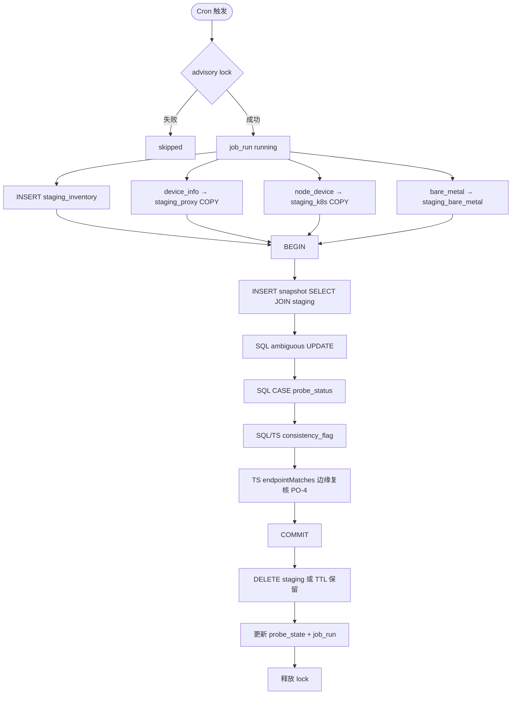

# 供应域 — 库存设备平台状态探测定时任务设计方案

> 版本：v1.4  
> 日期：2026-06-15  
> 状态：**已确认 — 待实施**  
> 变更：v1.4 — CM-5 修订：`rent_status` 仅 Idle/ElasticRenting；以 `is_container_instance` 区分裸金属与弹性服务；snapshot 落库两字段供页面展示  
> 性质：在既有 `supplier_device` 主数据之上，通过算算力 OpenAPI 三路数据源交叉比对，生成 **平台侧可观测状态** 并 **小时级落库**；**不替代** Excel 主数据导入，**不自动回写** `supplier_device.ops_status`。

**关联文档**：

- [supplier-device-import-schema.md](./supplier-device-import-schema.md) — 库存设备主数据（`device_inventory`）
- [supplier-device-ops-pool-masterdata-design.md](./supplier-device-ops-pool-masterdata-design.md) — D1 主数据真源边界
- [supplier-device-masterdata-integration-api-design.md](./supplier-device-masterdata-integration-api-design.md) — 第三方状态 API（本期 **不调用**，仅 Cron 探测）
- [supplier-datacenter-import-design.md](./supplier-datacenter-import-design.md) — `data_center.container_instance_region` / `bare_metal_region`
- [bare-metal-order-schema-design.md](./bare-metal-order-schema-design.md) — 裸金属订单本地表与状态枚举
- [project-billing-scheduled-sync-design.md](./project-billing-scheduled-sync-design.md) — Cron + advisory lock 模式参考

**关联实现（待开发）**：

- `apps/web/src/lib/server/integrations/api.ts` — 已有 `getDeviceInfoList`、`getNodeDeviceListAPI`
- `apps/web/src/lib/server/integrations/request.ts` — OpenAPI 签名与鉴权
- `apps/web/src/lib/server/dataaccess/supplier/gpu-inventory-sync.ts` — `activeInventoryDeviceFilter()`
- `apps/web/src/lib/supplier/ip-endpoint-utils.ts` — `parseEndpointHost` / `endpointMatches`（PO-4 边缘复核）
- `apps/web/src/lib/server/jobs/register-bare-metal-order-sync-cron.ts` — 小时 Cron 注册范式

---

## 1. 目标与原则

### 1.1 业务目标

| # | 目标 | 说明 |
|---|------|------|
| G1 | **全量库存探测** | 每小时对 CRM 内 **有效库存设备**（`supplier_device`）执行一次平台侧状态探测 |
| G2 | **三路交叉比对** | 分别对接 `device_info/list`（接入端）、`node_device/list`（K8s）、本地裸金属订单（等待/服务中） |
| G3 | **统一匹配键** | 机房维度 + 内网 IP；主路径用 `ip_host` 等值 Join；边缘 case 用 `endpointMatches` 复核（PO-4） |
| G4 | **结果存库** | 每次 job 写入运行日志 + 设备级快照；保留历史供对账与 UI 展示 |
| G5 | **可观测** | 汇总 matched / unmatched / ambiguous 计数；失败可重跑 |

### 1.2 非目标（本期）

- **不**根据探测结果自动修改 `supplier_device.ops_status` / `lifecycle_status`（主数据真源仍为 Excel 导入，见 D1）
- **不**调用第三方主数据 REST API 回写
- **不**新建 `apps/workers` 独立镜像（web 进程内 `node-cron`）
- **不**在首期实现告警推送（飞书/邮件）；仅落库 + 预留 UI
- **不**对平台 API 返回的 SSH 密码等敏感字段持久化
- **不**在首期启用 Redis 读缓存（PO-3）；UI 上线后再开

### 1.3 设计原则

1. **探测与真源分离**：Cron 产出 **观测态**（probe），与 **运维态**（ops_status）分表存储。
2. **Staging + SQL Join**：API 数据写入 **job 级 UNLOGGED staging 表**（PO-1），匹配由 PostgreSQL `INSERT … SELECT` 完成。
3. **双端 IP 规范化**（PO-2）：Node COPY 前计算 `ip_host`；DB immutable 函数用于 `staging_inventory` 物化，算法与 TS 一致。
4. **幂等可重跑**：同一 `snapshot_hour` upsert 覆盖。
5. **单实例互斥**：PostgreSQL advisory lock。
6. **部分失败可继续**：某一路 API 失败时 job `partial`，未失败通道照常落库。

---

## 2. 探测范围

### 2.1 库存设备（CRM 侧）

与 L1 库存聚合口径一致：

```typescript
activeInventoryDeviceFilter()
// lifecycle_status != '退订' AND ops_status != '已退订'
```

| 项 | 规则 |
|----|------|
| 必须有内网 IP | `internal_ip` 非空；否则写入 snapshot 且 `probe_status=no_internal_ip`，不参与三路 Join |
| 必须可映射机房 | `data_center_id` 非空且机房配置完整；否则 `probe_status=dc_unmapped`，**不做**全平台 IP 扫描（CM-6 ✅） |
| 已退订设备 | 排除 |

### 2.2 平台数据源

#### 2.2.1 接入端 — `GET /admin/device_info/list`

| 项 | 说明 |
|----|------|
| 封装 | `getDeviceInfoList` |
| 分页 | 全量分页（`page` + `page_size`） |
| 过滤 | 排除 `is_delete=true` |
| **匹配键** | `idc_name` → `idc_key` + `inner_ip` → `ip_host` |
| **成功含义** | 接入端已注册且可按 IP 定位 → **可控** |
| **记录字段（接入端租赁态，CM-5）** | **`rent_status`**、**`is_container_instance`** — 落库并在页面展示（§4.5）；匹配/对账亦用此二字段 |
| 其他（可选落库） | `online_status`、`shelf_status`、`listing_mode`、`platform_device_id` 等可进 `proxy_payload`，**不作为**租赁态展示列 |

#### 2.2.2 K8s — `GET /admin/node_device/list`

| 项 | 说明 |
|----|------|
| 封装 | `getNodeDeviceListAPI` |
| 过滤 | `offline_date IS NULL` |
| **匹配键** | `region` → `region_key` + `inner_ip` → `ip_host` |
| **记录字段** | `device_name`、`region`、`gpu_name`、`gpu_count`、`hash` |

#### 2.2.3 裸金属 — 本地 DB 物化至 staging

| 项 | 说明 |
|----|------|
| 数据源 | `bare_metal_order` + `bare_metal_order_device`（依赖 bare-metal cron，CM-4 ✅ 错开 10 分钟） |
| 订单状态 | 等待中 + 服务中（§2.3） |
| **匹配键** | 优先 `data_center.bare_metal_region` → `bm_region_key`；fallback 订单 `idc_name` → `idc_key`（CM-2 ✅）+ `ip_host` |
| **记录字段** | `order_no`、`order_status`、`tenant_id`、`rent_ends_at` 等 |

> 探测 job **不**再调用 `metal_order/list`。

### 2.3 裸金属「等待中 / 服务中」

| 业务语义 | `bare_metal_order.status` |
|----------|---------------------------|
| 等待中 | `pending`、`paid`、`provisioning` |
| 服务中 | `active` |

排除：`completed`、`cancelled`、`refunded`。明细：`allocation_status != 'released'` 且 `internal_ip` 非空。

---

## 3. 机房维度与匹配键

| 探测通道 | CRM 字段 | 平台字段 | staging 列 |
|----------|----------|----------|------------|
| 接入端 | `data_center.name` | `idc_name` | `idc_key` |
| K8s | `data_center.container_instance_region` | `region` | `region_key` |
| 裸金属 | `data_center.bare_metal_region`；fallback `order.idc_name` | — | `bm_region_key` / `idc_key` |
| 共用 | `supplier_device.internal_ip` | `inner_ip` | `ip_host` |

**规范化函数**（PO-2，DB 与 TS 双端同算法）：

| 函数 | 对应 TS |
|------|---------|
| `normalize_idc_key(text)` | `normalizeDatacenterName` |
| `normalize_region_key(text)` | `normalizeBillingRegion` |
| `normalize_ip_host(text)` | `parseEndpointHost` |

**ambiguous 检测**：同一 `(job_run_id, 通道, 匹配键, ip_host)` 在 staging 中 `COUNT(*) > 1` → `probe_status=ambiguous`。

**边缘 IP 复核**（PO-4）：SQL 等值 Join 完成后，对 `match_flags.endpoint_review=true` 的候选行（如原文含端口而 `ip_host` 不一致）在 TS 中调用 `endpointMatches` 二次确认；无法确认则保持 ambiguous。

---

## 4. 设备级探测结果模型

### 4.1 分通道结果

| 通道 | 前缀 | 页面展示 / 落库要点 |
|------|------|---------------------|
| `proxy_access` | `proxy_` | **`proxy_rent_status`**、**`proxy_is_container_instance`**（CM-5，§4.5） |
| `k8s_node` | `k8s_` | `k8s_region`、`k8s_device_name` 等 |
| `bare_metal` | `bare_metal_` | `bare_metal_order_no`、`bare_metal_order_status` 等 |

### 4.2 `probe_status`

| 代码 | 含义 |
|------|------|
| `no_internal_ip` | 缺内网 IP |
| `dc_unmapped` | 机房未映射或未配置区域键 |
| `platform_absent` | 三路均未命中 |
| `proxy_only` / `k8s_only` / `bare_metal_only` | 单通道命中 |
| `proxy_and_k8s` / `proxy_and_bare_metal` / `k8s_and_bare_metal` | 双通道 |
| `all_matched` | 三路均命中 |
| `ambiguous` | 任一路匹配不唯一 |

由 §8.2 SQL CASE 批量 UPDATE（`pending_derivation` → 终态）。

### 4.3 `consistency_flag`

| 代码 | 含义 |
|------|------|
| `consistent` | 主数据与平台信号一致 |
| `missing_platform` | 主数据称在线但平台无信号 |
| `unexpected_platform` | 平台有信号但主数据未体现 |
| `multi_channel_conflict` | 多通道命中但 ops 无法解释 |
| `not_evaluated` | `no_internal_ip` / `dc_unmapped` / ambiguous |

### 4.4 CM-1：`ops_status` 期望通道矩阵（`consistency_flag` 依据）

#### 4.4.1 这是什么意思？

探测任务会产生 **两套路状态**：

| 来源 | 字段 | 含义 |
|------|------|------|
| **CRM 主数据**（Excel 导入） | `supplier_device.ops_status` | 运维认为设备 **应该** 处于什么状态，如「在集群中」「预留闲置中」 |
| **平台实测**（Cron 拉取） | `proxy_matched` / `k8s_matched` / `bare_metal_matched` | 平台侧 **实际** 能否找到这台设备，以及 `rent_status` 等 |

**CM-1** 要回答的问题是：对每一种 CRM `ops_status`，平台侧 **理应** 出现哪些信号？

`consistency_flag` 就是把「CRM 说的」和「平台测到的」做自动对账：

| 标记 | 人话 |
|------|------|
| `consistent` | 主数据怎么说，平台就怎么表现 → **正常** |
| `missing_platform` | 主数据说设备已在集群/已上架，但平台查不到对应通道 → **可能漏接、IP 错、或平台故障** |
| `unexpected_platform` | 主数据说「预留闲置」，平台却显示在租 → **主数据未更新或平台误占** |
| `multi_channel_conflict` | 平台信号组合超出该 ops 状态能解释的范围 → **需人工看** |

没有这张矩阵，就只能记录「有没有命中 proxy/k8s/裸金属」（`probe_status`），无法判断 **算不算对得上**。

#### 4.4.2 矩阵约定

列含义：

| 列 | 说明 |
|----|------|
| `proxy` | 是否 **要求** 命中 `device_info`（接入端） |
| `k8s` | 是否 **要求** 命中 `node_device` |
| `bare_metal` | 是否 **要求** 命中有效裸金属订单 |
| `—` | 不要求命中；若命中则结合 CM-5 判断是否 `unexpected_platform` |
| `可选` | 命中不报错；未命中也不单独构成 `missing_platform` |

矩阵依据 [supplier-device-ops-pool-masterdata-design.md](./supplier-device-ops-pool-masterdata-design.md) §3.1 的 `pool_memberships` 与探测通道语义推导。

| CRM `ops_status` | proxy | k8s | bare_metal | 典型一致场景 |
|------------------|-------|-----|------------|--------------|
| `预留闲置中` | — | — | — | 三路均无，或 proxy 命中且 `rent_status=Idle` |
| `在集群中` | 可选 | **要求** | — | k8s 命中；proxy 若命中则 `ElasticRenting` + `is_container_instance=true` |
| `集群组件运行中` | 可选 | **要求** | — | 同上 |
| `不可调度节点运行中` | 可选 | **要求** | — | k8s 命中 |
| `网关直连裸金属上架中` | **要求** | — | 可选 | proxy：`ElasticRenting` + `is_container_instance=false`；或裸金属订单命中 |
| `单机直连裸金属上架中` | **要求** | — | 可选 | 同上 |
| `网关代理裸金属上架中` | **要求** | **要求** | 可选 | proxy + k8s 均应命中；proxy 侧 `ElasticRenting` + `is_container_instance=true`（弹性侧在租） |
| `网关节点上架中` | **要求** | 可选 | — | proxy 命中 |
| `线下裸金属交付中` | 可选 | — | **要求** | 裸金属订单命中；proxy 若命中则 `ElasticRenting` + `is_container_instance=false` |
| `其他部门使用中` | — | — | — | 三路均无；任一路命中 → `unexpected_platform` |
| `已退订` | — | — | — | 不参与探测（库存过滤器已排除） |

#### 4.4.3 `consistency_flag` 判定规则（实现）

在 `probe_status` 已确定且非 `not_evaluated` 前提下：

1. **`not_evaluated`**：`probe_status ∈ {no_internal_ip, dc_unmapped, ambiguous}`。
2. **`consistent`**：满足 §4.4.2 矩阵全部 **要求** 项，且无 §4.5 定义的 `rent_status` + `is_container_instance` 冲突。
3. **`missing_platform`**：任一 **要求** 通道未命中。
4. **`unexpected_platform`**：无 **要求** 的通道却命中，且不符合 CM-5 豁免（如 `预留闲置中` + proxy + `Idle` 仍算 consistent）。
5. **`multi_channel_conflict`**：通道 **要求** 项满足，但租赁态组合与 ops 池归属矛盾（如 ops 属弹性池但 `ElasticRenting` + `is_container_instance=false` 且无裸金属订单）。

### 4.5 CM-5：接入端租赁态（`rent_status` + `is_container_instance`）

平台 `device_info/list` 与租赁相关的字段 **仅落库以下两列**，页面 **直接展示**（不另存推导文案）：

| snapshot 列 | 平台字段 | 类型 | 说明 |
|-------------|----------|------|------|
| `proxy_rent_status` | `rent_status` | varchar(64) | 平台原文 |
| `proxy_is_container_instance` | `is_container_instance` | boolean | 平台原文 |

未命中 proxy 时两列均为 `NULL`。

#### 4.5.1 `rent_status`（仅两值，已确认）

| 平台值 | 中文 | 含义 |
|--------|------|------|
| `Idle` | 空闲 | 接入端已注册，当前未出租 |
| `ElasticRenting` | 弹性服务 | 当前处于出租中（**裸金属 or 弹性** 由下一字段区分） |

> 平台 **无** `Flexible` 等第三枚举；历史文档中的 `Flexible` 已废止。

#### 4.5.2 `is_container_instance` 与出租类型

当 `rent_status=ElasticRenting` 时，用 `is_container_instance` 区分实际出租形态：

| `is_container_instance` | 出租类型（页面展示文案） | 说明 |
|-------------------------|--------------------------|------|
| `true` | **弹性服务部署** | 容器实例 / 弹性侧在租 |
| `false` | **裸金属** | 裸金属侧在租 |

当 `rent_status=Idle` 时，`is_container_instance` 仍原样落库；页面可只展示「空闲」，忽略该布尔值。

**页面展示规则（前端推导，不落库）**：

```text
Idle                          → 空闲
ElasticRenting + true         → 弹性服务（出租中）
ElasticRenting + false        → 裸金属（出租中）
```

#### 4.5.3 与 `consistency_flag` 的关系（proxy 已命中时）

| 条件 | 标记 |
|------|------|
| ops=`预留闲置中` 且 `rent_status=Idle` | 可判 `consistent` |
| ops 属弹性池（§4.4.2 要求 k8s）且 `ElasticRenting` + `is_container_instance=true` | 辅助 `consistent` |
| ops 属裸金属池且 `ElasticRenting` + `is_container_instance=false` | 辅助 `consistent` |
| ops=`预留闲置中` 但 `rent_status=ElasticRenting` | `unexpected_platform` |
| ops 属弹性池但 `ElasticRenting` + `is_container_instance=false` 且无 `bare_metal_matched` | `multi_channel_conflict` |
| ops 属裸金属池但 `ElasticRenting` + `is_container_instance=true` 且无 `k8s_matched`（非双池 ops） | `multi_channel_conflict` |

---

## 5. 数据库设计

新增表落在 `packages/db/src/supply-schema.ts` §3.x。

### 5.1 持久化表（LOGGED）

#### `device_platform_probe_state`

| 列名 | 类型 | 说明 |
|------|------|------|
| `id` | text PK | `'default'` |
| `last_run_at` | timestamptz | |
| `last_success_at` | timestamptz | |
| `last_snapshot_hour` | timestamptz | |
| `updated_at` | timestamptz | |

#### `device_platform_probe_job_run`

| 列名 | 类型 | 说明 |
|------|------|------|
| `id` | text PK | |
| `trigger` | varchar(16) | `scheduled` \| `manual` |
| `snapshot_hour` | timestamptz NOT NULL | 东八区整点 |
| `started_at` / `finished_at` | timestamptz | |
| `status` | varchar(16) | `running` \| `success` \| `partial` \| `failed` \| `skipped` |
| `inventory_device_count` | integer | |
| `proxy_fetched_count` / `k8s_fetched_count` / `bare_metal_hit_count` | integer | |
| `matched_proxy_count` / `matched_k8s_count` / `matched_bare_metal_count` | integer | |
| `ambiguous_count` / `missing_platform_count` | integer | |
| `error_summary` | text | |

索引：`(started_at DESC)`、`(status)`。

#### `device_platform_probe_snapshot`

设备 × 快照小时。除 `probe_status` / `consistency_flag` 外，接入端租赁态 **固定两列**（CM-5）：

| 列名 | 类型 | 说明 |
|------|------|------|
| `proxy_rent_status` | varchar(64) | 平台 `rent_status`：`Idle` \| `ElasticRenting` |
| `proxy_is_container_instance` | boolean | 平台 `is_container_instance` |
| `proxy_matched` | boolean | 是否命中 device_info |
| … | | 其余 `k8s_*` / `bare_metal_*` / `match_flags` 等同 v1.0 设计 |

**唯一约束**：`(supplier_device_id, snapshot_hour)`。

**索引**：`(snapshot_hour DESC, supplier_id)`、`(snapshot_hour DESC, data_center_id)`、`(snapshot_hour DESC, probe_status)`、`(snapshot_hour DESC, consistency_flag)`、`(supplier_device_id, snapshot_hour DESC)`。

**历史保留（CM-3 ✅）**：仅保留 **3 个自然日**（含当天）的 snapshot 与 job_run 明细；更早数据由清理 job 删除。`device_platform_probe_latest` 视图始终指向未过期数据中的最新一行。

#### `device_platform_probe_latest`（视图）

`DISTINCT ON (supplier_device_id) ORDER BY snapshot_hour DESC`；Redis miss 时的读 fallback。

### 5.2 Staging 临时表（UNLOGGED，PO-1 ✅）

四表均为 **`UNLOGGED`**；仅服务单次 job，崩溃可重拉。**snapshot / job_run 必须为 LOGGED**。

按 `job_run_id` 关联；成功 job 默认即时 `DELETE`；失败 job 保留至 `DEVICE_PLATFORM_PROBE_STAGING_RETENTION_HOURS`（默认 24h）供排查。

| 表名 | 来源 |
|------|------|
| `device_platform_probe_staging_inventory` | `supplier_device` + `data_center` |
| `device_platform_probe_staging_proxy` | API `device_info/list` |
| `device_platform_probe_staging_k8s` | API `node_device/list` |
| `device_platform_probe_staging_bare_metal` | `INSERT … SELECT` 自裸金属订单 |

**`staging_inventory` 核心列**：`job_run_id`, `supplier_device_id`, `supplier_id`, `data_center_id`, `internal_ip`, `ip_host`, `idc_key`, `region_key`, `bm_region_key`, `ops_status`, `lifecycle_status`, `in_maintenance`。

**`staging_proxy` 核心列**：`job_run_id`, `platform_device_id`, `idc_key`, `ip_host`, **`rent_status`**, **`is_container_instance`**, `payload`（其余字段可选进 payload）。

**`staging_k8s` 核心列**：`job_run_id`, `platform_node_id`, `region_key`, `ip_host`, `device_name`, `gpu_name`, `gpu_count`, `payload`.

**`staging_bare_metal` 核心列**：`job_run_id`, `bare_metal_order_id`, `bare_metal_order_device_id`, `bm_region_key`, `idc_key`, `ip_host`, `order_no`, `order_status`, `tenant_id`, `rent_ends_at`, `payload`.

**索引（各表）**：`(job_run_id, idc_key, ip_host)`、`(job_run_id, region_key, ip_host)`、`(job_run_id, bm_region_key, ip_host)` 等按 Join 路径建立。

**DB 函数**（immutable）：`normalize_idc_key`、`normalize_region_key`、`normalize_ip_host`。

---

## 6. 定时任务设计

### 6.1 调度

| 项 | 默认值 | 环境变量 |
|----|--------|----------|
| 启用 | `false` | `DEVICE_PLATFORM_PROBE_ENABLED=true` |
| Cron | `20 * * * *` | `DEVICE_PLATFORM_PROBE_CRON` |
| 时区 | `Asia/Shanghai` | `DEVICE_PLATFORM_PROBE_TIMEZONE` |
| Advisory lock | `89451236791` | `DEVICE_PLATFORM_PROBE_LOCK_KEY` |

手动触发：`POST /api/internal/cron/device-platform-probe`（`CRON_SECRET`）。

### 6.2 与 bare-metal 同步时序（CM-4 ✅）

```text
:10  bare_metal_order sync
:20  device_platform_probe
```

bare-metal 失败超过 2h 时：`match_flags.bare_metal_stale=true`（`DEVICE_PLATFORM_PROBE_BARE_METAL_STALE_HOURS`）。

### 6.3 执行流程



**snapshot_hour**：东八区当前小时整点。

### 6.4 失败处理

| 场景 | 行为 |
|------|------|
| 单路 API 失败 | `partial`；其余通道照常 |
| 两路 API 均失败 | `failed`；不 upsert snapshot |
| 单设备异常 | `match_flags.probe_error`；不阻断 job |

---

## 7. 服务端模块划分

| 模块 | 路径 | 职责 |
|------|------|------|
| OpenAPI 拉取 | `integrations/suanli-device-probe-api.ts` | 分页 + Zod + 限流 |
| Staging 写入 | `dataaccess/supplier/device-platform-probe-staging.ts` | COPY / 物化 inventory & bare_metal |
| SQL 比对 | `dataaccess/supplier/device-platform-probe-sql.ts` | INSERT snapshot、ambiguous、probe_status CASE |
| 一致性推导 | `dataaccess/supplier/device-platform-probe-consistency.ts` | `consistency_flag`（CM-1 矩阵）+ endpoint 复核 |
| 调度入口 | `dataaccess/supplier/device-platform-probe-scheduled.ts` | lock、事务、清理 |
| 配置 | `dataaccess/supplier/device-platform-probe-config.ts` | env |
| Redis 缓存 | `dataaccess/supplier/device-platform-probe-cache.ts` | **二期**；PO-3 首期不启用 |
| Cron 注册 | `jobs/register-device-platform-probe-cron.ts` | 探测 + snapshot 清理（§8.6） |
| tRPC（可选） | `routers/supplier/device-platform-probe.ts` | 手动触发、历史查询 |

---

## 8. SQL 比对与状态推导

### 8.1 物化 staging_inventory

```sql
INSERT INTO device_platform_probe_staging_inventory (...)
SELECT
  $job_run_id,
  sd.id, sd.supplier_id, sd.data_center_id, sd.internal_ip,
  normalize_ip_host(sd.internal_ip),
  normalize_idc_key(dc.name),
  normalize_region_key(dc.container_instance_region),
  normalize_region_key(dc.bare_metal_region),
  sd.ops_status, sd.lifecycle_status, sd.in_maintenance
FROM supplier_device sd
LEFT JOIN data_center dc ON dc.id = sd.data_center_id
WHERE sd.lifecycle_status <> '退订'
  AND sd.ops_status <> '已退订';
```

### 8.2 INSERT snapshot（LATERAL JOIN 示意）

```sql
INSERT INTO device_platform_probe_snapshot (...)
SELECT ...
FROM device_platform_probe_staging_inventory inv
LEFT JOIN LATERAL (
  SELECT * FROM device_platform_probe_staging_proxy p
  WHERE p.job_run_id = $job_run_id
    AND p.idc_key = inv.idc_key AND p.ip_host = inv.ip_host
  LIMIT 1
) p ON inv.idc_key IS NOT NULL
-- k8s、bare_metal 同理
WHERE inv.job_run_id = $job_run_id
  AND inv.internal_ip IS NOT NULL AND trim(inv.internal_ip) <> ''
ON CONFLICT (supplier_device_id, snapshot_hour) DO UPDATE SET ...;
```

初始写入：`probe_status='pending_derivation'`，`consistency_flag='not_evaluated'`。

### 8.3 ambiguous 检测

对 proxy / k8s / bare_metal staging 分别 `GROUP BY 匹配键, ip_host HAVING COUNT(*) > 1`，UPDATE 对应 snapshot 行。

### 8.4 probe_status CASE

```sql
UPDATE device_platform_probe_snapshot s
SET probe_status = CASE
  WHEN ... THEN 'platform_absent'
  WHEN ... THEN 'all_matched'
  -- 见 §4.2 全表
  ELSE s.probe_status
END
WHERE s.job_run_id = $job_run_id AND s.probe_status = 'pending_derivation';
```

### 8.5 consistency_flag

按 §4.4.2 期望通道矩阵 + §4.4.3 判定规则 + §4.5 `rent_status` 规则，在 `probe_status` 确定后批量 UPDATE（SQL CASE 或 TS 批量回写均可）。

### 8.6 snapshot 历史清理（CM-3 ✅）

| 项 | 规则 |
|----|------|
| 保留时长 | **3 天**（东八区自然日，含当天） |
| 清理对象 | `device_platform_probe_snapshot` 中 `snapshot_hour < 今日 0:00 − 2 天` 的行；可选同步清理已无引用的 `job_run` |
| 调度 | 每日 **01:30** 东八区（`DEVICE_PLATFORM_PROBE_SNAPSHOT_CLEANUP_CRON`，默认 `30 1 * * *`） |
| 环境变量 | `DEVICE_PLATFORM_PROBE_SNAPSHOT_RETENTION_DAYS=3` |

### 8.7 endpointMatches 边缘复核（PO-4 ✅）

SQL Join 后，筛选 `internal_ip` 含端口且 staging 未命中、或 ambiguous 候选行，TS 调用 `endpointMatches(crmIp, platformIp)` 修正 `proxy_matched` / `k8s_matched` / `bare_metal_matched` 与 `match_flags`。

---

## 9. API 拉取

- 分页：`DEVICE_PLATFORM_PROBE_PAGE_SIZE`（默认 100）
- 页间 delay：复用 `SUANLI_API_PAGE_DELAY_MS`
- 入库：API 页 → Node 规范化 → **`COPY FROM STDIN`** 至 staging（PO-2）
- 敏感字段：`pub_ssh_password` / `pub_ssh_username` **禁止** 入库；`payload` 白名单裁剪

---

## 10. Redis 读缓存（二期，PO-3 ✅ 首期不启用）

| 项 | 值 |
|----|-----|
| 启用 | `DEVICE_PLATFORM_PROBE_REDIS_CACHE_ENABLED=false` |
| Key | `probe:latest:{supplier_device_id}`（Hash） |
| TTL | `DEVICE_PLATFORM_PROBE_REDIS_TTL_SECONDS=7200` |

Cron **不依赖** Redis；UI 列表页上线后启用。不参与 staging 比对、不替代 snapshot。

---

## 11. UI 展示

### 11.1 接入端租赁态（CM-5）

物理设备列表 / 设备详情 / 机房设备表增加两列，**只读展示** snapshot 落库值：

| 列 | 数据源 | 展示 |
|----|--------|------|
| 平台租赁状态 | `proxy_rent_status` | `Idle` → 空闲；`ElasticRenting` → 弹性服务（见下行细分） |
| 实例类型 | `proxy_is_container_instance` | 仅当 `ElasticRenting` 时：`true` → 弹性服务部署；`false` → 裸金属 |
| 未探测 / 未命中 | `proxy_matched=false` | 显示 `—` |

文案推导逻辑见 §4.5.2；**不在 DB 存展示用衍生字段**。

### 11.2 其他（二期）

`probe_status`、`consistency_flag`、裸金属订单列、job 手动触发等。首期可先只做 §11.1 + 落库。

---

## 12. 设计确认与待办

### 12.1 已确认

| # | 议题 | 决策 |
|---|------|------|
| **PO-1** | staging 是否 UNLOGGED | ✅ 四表均为 UNLOGGED；结果表 LOGGED |
| **PO-2** | IP/机房键规范化 | ✅ 双端：Node COPY 前 + DB immutable 函数 |
| **PO-3** | Redis 首期 | ✅ 不启用；UI 二期再开 |
| **PO-4** | 端口边缘 case | ✅ SQL 等值 Join 后 TS `endpointMatches` 复核候选集 |
| **CM-2** | 裸金属区域键 | ✅ 优先 `bare_metal_region`；fallback `idc_name` |
| **CM-3** | snapshot 历史保留 | ✅ **3 天**；每日清理 job（§8.6） |
| **CM-4** | Cron 错开 | ✅ bare-metal `:10`，probe `:20` |
| **CM-5** | 接入端租赁态 | ✅ `proxy_rent_status` + `proxy_is_container_instance` 落库并页面展示（§4.5） |
| **CM-6** | 无机房设备 | ✅ 不允许全平台 IP 扫描；标记 `dc_unmapped` |
| **CM-1** | `ops_status` 期望通道矩阵 | ✅ 见 §4.4（`consistency_flag` 依据） |

### 12.2 仍待确认

（无 — v1.3 已全部确认）

> **实施门禁**：P1～P6 可按 §15 顺序推进；P4 规则见 §4.4 / §4.5；P7 Redis 须 UI 方案就绪（PO-3）。

---

## 13. 环境变量

| 变量 | 默认 | 说明 |
|------|------|------|
| `DEVICE_PLATFORM_PROBE_ENABLED` | `false` | |
| `DEVICE_PLATFORM_PROBE_CRON` | `20 * * * *` | |
| `DEVICE_PLATFORM_PROBE_TIMEZONE` | `Asia/Shanghai` | |
| `DEVICE_PLATFORM_PROBE_PAGE_SIZE` | `100` | |
| `DEVICE_PLATFORM_PROBE_BARE_METAL_STALE_HOURS` | `2` | |
| `DEVICE_PLATFORM_PROBE_STAGING_RETENTION_HOURS` | `24` | 失败 job staging 保留 |
| `DEVICE_PLATFORM_PROBE_SNAPSHOT_RETENTION_DAYS` | `3` | CM-3 snapshot 保留天数 |
| `DEVICE_PLATFORM_PROBE_SNAPSHOT_CLEANUP_CRON` | `30 1 * * *` | 每日清理过期 snapshot |
| `DEVICE_PLATFORM_PROBE_REDIS_CACHE_ENABLED` | `false` | PO-3 |
| `DEVICE_PLATFORM_PROBE_REDIS_TTL_SECONDS` | `7200` | |
| `SUANLI_OPENAPI_BASE_URL` / `SUANLI_OPENAPI_TOKEN` | （已有） | |

---

## 14. 测试计划

| # | 场景 | 预期 |
|---|------|------|
| T1 | idc_key + ip_host 命中 proxy | `proxy_matched=true`；`proxy_rent_status`、`proxy_is_container_instance` 落库 |
| T2 | region_key + ip_host 命中 k8s | `k8s_matched=true` |
| T3 | bm_region_key + ip_host 命中订单 | `bare_metal_matched=true` |
| T4 | 三路均未命中 | `platform_absent` |
| T5 | 同键 duplicate staging | `ambiguous` |
| T6 | advisory lock 占用 | `skipped` |
| T7 | 单路 API 500 | `partial` |
| T8 | 同 snapshot_hour 重跑 | upsert 覆盖 |
| T9 | IP 含端口边缘 case | PO-4 复核后命中或保持 ambiguous |
| T10 | 缺 data_center_id | `dc_unmapped`，不参与 Join |
| T11 | ops=`在集群中` 且 k8s 未命中 | `missing_platform` |
| T12 | ops=`预留闲置中` 且 proxy + `Idle` | `consistent` |
| T13 | ops=`预留闲置中` 且 proxy + `ElasticRenting` | `unexpected_platform` |
| T15 | `ElasticRenting` + `is_container_instance=true` | 页面展示「弹性服务部署」 |
| T16 | `ElasticRenting` + `is_container_instance=false` | 页面展示「裸金属」 |
| T14 | snapshot 超过 3 天 | 清理 job 删除 |

---

## 15. 实施清单

| 阶段 | 任务 | 依赖 |
|------|------|------|
| P1 | §5 迁移：持久化表 + UNLOGGED staging + normalize 函数 | — |
| P2 | API 分页 → COPY staging | P1 |
| P3 | §8 SQL 比对 + ambiguous + `probe_status` CASE | P2 |
| P4 | `consistency_flag`（§4.4 / §4.5） | P3 |
| P5 | scheduled + lock + staging 清理 + snapshot 清理 Cron | P3 |
| P6 | Cron + internal route | P5 |
| P7 | Redis 读缓存 | UI 方案；PO-3 |
| P8 | tRPC + UI（§11.1 两列展示） | P6 |

---

## 16. 变更记录

| 版本 | 日期 | 说明 |
|------|------|------|
| v1.0 | 2026-06-15 | 初稿：三路探测 + 小时 Cron + 快照存库 |
| v1.1 | 2026-06-15 | staging + SQL + Redis 可选层 |
| v1.2 | 2026-06-15 | 采纳 PO-1～PO-4、CM-2/4/6；移除内存 Join 草案 |
| v1.3 | 2026-06-15 | CM-1 阐明并落矩阵；CM-3 保留 3 天；CM-5 初版 rent_status |
| v1.4 | 2026-06-15 | CM-5 修订：仅 Idle/ElasticRenting + `is_container_instance`；snapshot 两字段落库与 UI 展示 |
