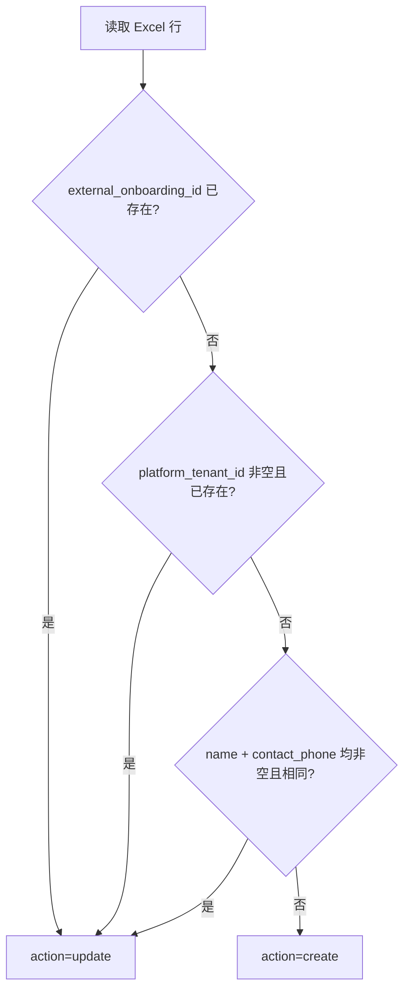
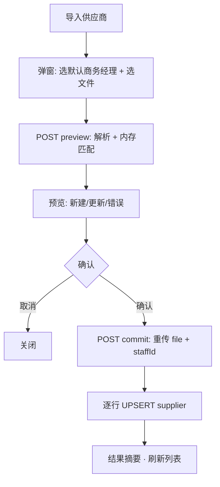

# 供应商信息 Excel 批量导入设计方案

> 版本：v1.2（设计稿）  
> 日期：2026-05-21  
> 状态：**设计稿 — 确认后再实施代码**  
> 关联：`suppliers-content.tsx`（入口按钮）、`supplier-form-dialog.tsx`、`crm-project-import-dialog.tsx`（两步流参考）、[supplier-database.md](./supplier-database.md)

---

## 1. 目标与原则

### 1.1 业务目标

| # | 目标 | 说明 |
|---|------|------|
| G1 | 批量导入供应商 | 用户在「供应商管理」页点击 **导入供应商**，上传 Excel，**直接写入 `supplier` 表** |
| G2 | 兼容企业与个人 | 同一表头覆盖企业（USCC、法人身份证）与个人（姓名、身份证号） |
| G3 | 弹窗指定商务经理 | 上传前在弹窗选择 **默认商务经理**，本次导入 **新建** 的行统一写入；**已存在** 记录 **不更新** 该字段 |
| G4 | 可预览、可部分成功 | **解析预览 → 用户确认 → 入库**；单行失败不阻断其它行 |
| G5 | 幂等可重导 | 重复导入时 **更新** 已有 `supplier`，不重复创建 |
| G6 | 与设备导入解耦 | 「设备信息」列写入 `supplier` 扩展字段存档；结构化设备入库仍走 [supplier-device-import-schema.md](./supplier-device-import-schema.md) |

### 1.2 非目标（本期）

- **不创建导入批次记录**（无 `supplier_import_batch`、无批次列表、无 OSS 归档）
- **不创建入驻档案表**（无 `supplier_onboarding_profile`、`supplier_kyc_document`；Excel 字段均为 `supplier` 属性）
- 不下载/转存证照到 OSS（Excel 内 URL 原样写入 `supplier` 对应列；非 URL 记 warning）
- 不自动创建 `supplier_contract`、`onboarding_batch`、`supplier_device`
- 不同步算算力 OpenAPI 实时租户详情

### 1.3 设计原则

1. **单表模型**：Excel 25 列全部映射到 `supplier` 现有列 + 增量扩展列；不引入中间实体。
2. **预览先于写入**：与 [project-import-design.md](./project-import-design.md) 一致。
3. **商务经理仅新建时写入**：弹窗选择的 `defaultBusinessManagerStaffId` 仅对 `action = create` 的行生效；`action = update` 时 **跳过** `business_manager_staff_id`。
4. **幂等键分层**：源系统 **ID** → **租户 ID**（非空）→ **名称 + 联系人电话**（两者均非空）。**证件号不参与幂等**。
5. **字段约束**：`identity_no` **可重复**；联系人/电话 **可空**；`platform_tenant_id` **可空、非空时全局唯一**。
6. **无服务端预览状态**：preview 结果保存在客户端；commit 时 **重新上传文件** 并携带商务经理 ID，服务端再次解析后入库（无 batchId）。

---

## 2. 源表结构

### 2.1 表头（25 列）

| 列序 | 表头 | 示例 / 说明 |
|------|------|-------------|
| 1 | ID | 入驻系统主键，如 `10001` |
| 2 | 租户ID | 平台租户 ID；可空 |
| 3 | 入驻类型 | `企业` / `个人` |
| 4 | 企业全称/真实姓名 | 企业：公司全称；个人：真实姓名 |
| 5 | 统一社会信用代码/身份证号码 | 企业：USCC；个人：身份证号 |
| 6 | 经营范围 | |
| 7 | 企业地址/地址 | |
| 8 | 联系人 | |
| 9 | 联系人电话 | |
| 10 | 营业执照 | URL；个人行忽略 |
| 11 | 法人身份证正面/身份证正面 | URL |
| 12 | 法人身份证反面/身份证反面 | URL |
| 13 | 银行名称 | |
| 14 | 开户行名称 | |
| 15 | 银行账号 | |
| 16 | 开户行地址 | |
| 17 | 管理员手机号 | |
| 18 | 管理员邮箱 | |
| 19 | 设备信息 | 自由文本或 JSON |
| 20 | 审核状态 | 如 `已通过` / `待审核` |
| 21 | 审核状态是否已确认 | `是`/`否`/`true`/`false` |
| 22 | 合作模式 | 如 `卡时` / `分成` |
| 23 | 审核备注 | |
| 24 | 创建时间 | |
| 25 | 最后更新时间 | |

> **复合表头**：列 4、5、7、11、12 按「入驻类型」分支解析，不要求 Excel 拆列。

### 2.2 文件要求

| 项 | 规则 |
|----|------|
| 格式 | `.xlsx` / `.xls` / `.csv` / `.tsv` |
| 编码 | CSV/TSV 须 **UTF-8**（含 BOM 可识别）；Excel 原生 |
| 大小 | ≤ 10MB |
| 表头 | 第一行必须为 §2.1 列名（别名见 §3.1） |
| 数据行 | **企业全称/真实姓名** 为空则跳过 |
| 单次上限 | ≤ **500** 行 |

---

## 3. 字段映射（全部 → `supplier`）

### 3.1 表头别名

| 标准表头 | 可接受别名 |
|----------|------------|
| ID | id、编号、入驻ID |
| 租户ID | 租户 ID、平台租户ID、tenant_id |
| 入驻类型 | 类型、主体类型 |
| 企业全称/真实姓名 | 企业全称、真实姓名、名称、供应商名称 |
| 统一社会信用代码/身份证号码 | 统一社会信用代码、身份证号码、证件号、USCC |
| 企业地址/地址 | 企业地址、地址 |
| 法人身份证正面/身份证正面 | 身份证正面、法人身份证正面 |
| 法人身份证反面/身份证反面 | 身份证反面、法人身份证反面 |
| 审核状态是否已确认 | 审核已确认、状态已确认 |
| 创建时间 | 创建日期 |
| 最后更新时间 | 更新时间、修改时间 |

### 3.2 入驻类型分支（解析逻辑）

| 规范化类型 | 列 4 | 列 5 | 列 10 | 列 11–12 |
|------------|------|------|-------|----------|
| `enterprise` | → `name` | → `identity_no` | → `business_license_uri` | → `id_card_front_uri` / `id_card_back_uri` |
| `individual` | → `name` | → `identity_no` | 忽略 | → `id_card_front_uri` / `id_card_back_uri` |

- `企业`、`公司`、`enterprise`、`Enterprise` → `enterprise`
- `个人`、`自然人`、`individual`、`personal`、`Personal` → `individual`

### 3.3 `supplier` 列映射总表

#### 现有列

| Excel 列 | DB 列 | 新建 | 更新 |
|----------|--------|------|------|
| 企业全称/真实姓名 | `name` | ✓ | ✓ |
| （派生） | `short_name` | ✓ | 可选更新（默认不覆盖已有简称） |
| （派生） | `code` | ✓ | **不更新**（UK 稳定） |
| 联系人 | `contact_person` | ✓ | ✓ | 可空 |
| 联系人电话 | `contact_phone` | ✓ | ✓ | 可空 |
| 管理员邮箱 | `contact_email` | ✓ | ✓ |
| 企业地址/地址 | `address` | ✓ | ✓ |
| 银行名称 | `bank_name` | ✓ | ✓ |
| 银行账号 | `bank_account` | ✓ | ✓ |
| 合作模式 | `default_cooperation_mode` | ✓ | ✓ |
| 审核状态 | `status` | ✓ | ✓（见 §3.5） |
| 创建时间 | `created_at` | ✓（可解析） | **不更新** |
| 最后更新时间 | `updated_at` | ✓ | ✓ |
| **弹窗·默认商务经理** | `business_manager_staff_id` | ✓ | **✗ 不更新** |

#### 增量扩展列（`ALTER supplier`）

| Excel 列 | DB 列（新增） | 类型 | 新建 | 更新 |
|----------|---------------|------|------|------|
| ID | `external_onboarding_id` | varchar(64) | ✓ | ✓ |
| 租户ID | `platform_tenant_id` | varchar(32) | ✓ | ✓ | **非空时 UK** |
| 入驻类型 | `onboarding_type` | varchar(16) | ✓ | ✓ |
| 统一社会信用代码/身份证号码 | `identity_no` | varchar(32) | ✓ | ✓ | **可重复** |
| 经营范围 | `business_scope` | text | ✓ | ✓ |
| 营业执照 | `business_license_uri` | varchar(1024) | ✓ | ✓ |
| 法人身份证正面/身份证正面 | `id_card_front_uri` | varchar(1024) | ✓ | ✓ |
| 法人身份证反面/身份证反面 | `id_card_back_uri` | varchar(1024) | ✓ | ✓ |
| 开户行名称 | `bank_branch_name` | varchar(255) | ✓ | ✓ |
| 开户行地址 | `bank_branch_address` | text | ✓ | ✓ |
| 管理员手机号 | `admin_phone` | varchar(32) | ✓ | ✓ |
| 管理员邮箱 | `admin_email` | varchar(255) | ✓ | ✓ |
| 设备信息 | `device_info_raw` | text | ✓ | ✓ |
| 审核状态 | `audit_status` | varchar(32) | ✓ | ✓ |
| 审核状态是否已确认 | `audit_confirmed` | boolean | ✓ | ✓ |
| 审核备注 | `audit_remark` | text | ✓ | ✓ |

**派生规则**：

| 字段 | 规则 |
|------|------|
| `short_name` | 新建：取 `name` 去后缀或截断 8–16 字；更新：默认保留库内值 |
| `code` | 新建：优先 `identity_no` 后 6 位前缀 `SUP-`；否则 `SUP-{external_onboarding_id}`；冲突追加 `-2`、`-3` |
| `contact_email` | 优先 Excel「管理员邮箱」；空则 warning |

**幂等匹配键**（仅用于判断新建/更新，**不含** `identity_no`）：

| 优先级 | 匹配条件 |
|--------|----------|
| 1 | `supplier.external_onboarding_id = Excel.ID` |
| 2 | `supplier.platform_tenant_id = Excel.租户ID`（**租户 ID 非空**） |
| 3 | `supplier.name + supplier.contact_phone` 与 Excel 相同（**两者均非空**） |

**唯一性约束（导入校验）**：

| 字段 | 规则 |
|------|------|
| `identity_no` | **允许重复**；同文件、跨 supplier 均不报错 |
| `contact_person` / `contact_phone` | **允许为空**；空时 warning，不阻断导入 |
| `platform_tenant_id` | **可为 null/空**；**非空值**在同文件内及库内须 **唯一**，冲突 → error |

### 3.4 合作模式映射

| Excel 值 | `default_cooperation_mode` |
|----------|----------------------------|
| 卡时、固定卡时、card_time | `card_time` |
| 分成、收益分成、revenue_share | `revenue_share` |
| 空 / 无法识别 | `card_time` + warning |

### 3.5 审核状态映射

| Excel「审核状态」 | `audit_status` | `status`（经营状态） |
|-------------------|----------------|----------------------|
| 已通过、审核通过 | `approved` | `cooperating` |
| 待审核、审核中 | `pending` | `negotiating` |
| 已驳回 | `rejected` | `negotiating` |
| 已暂停 | `suspended` | `suspended` |
| 已终止、已注销 | `terminated` | `terminated` |
| 无法识别 | 原文写入 `audit_status` | `negotiating` + warning |

「审核状态是否已确认」→ `audit_confirmed`（boolean），不单独驱动 `status`。

### 3.6 租户 ID

| 场景 | 处理 |
|------|------|
| **空** | 写入 `NULL`；不参与唯一性校验；不参与幂等匹配（除后续 name+phone） |
| **非空且库内已有同 `platform_tenant_id` 的 supplier** | 匹配为 **update**（优先级 2） |
| **非空且被其它 supplier 占用**（非当前匹配行） | error「平台租户 ID 已被其它供应商占用」 |
| **同文件内非空租户 ID 重复** | 第二行起 error「同文件内平台租户 ID 重复」 |
| 有值且本地 CRM `tenant.platform_tenant_id` 存在 | warning「已关联计费租户」（可选） |
| 有值但本地无 CRM tenant | warning；仍写入 `platform_tenant_id` |

不自动 INSERT `tenant`（见 [platform-tenant-import-design.md](./platform-tenant-import-design.md)）。

---

## 4. 商务经理规则（重点）

弹窗 **upload** 步骤必填：

```
默认商务经理  [ 张三 ▼ ]   ← 来自 user_staff，与 CreateSupplierDialog 同源
```

| 场景 | `business_manager_staff_id` |
|------|----------------------------|
| **新建**（`action = create`） | 写入弹窗所选 `defaultBusinessManagerStaffId` |
| **更新**（`action = update`） | **不写入、不覆盖** 库内已有值 |
| 弹窗未选商务经理 | preview 阶段整批 error，禁止进入 commit |

列表展示 `businessManager` 仍为 JOIN `user_staff.display_name` 读模型（与 [supplier-database.md](./supplier-database.md) R-S1.1 一致）。

---

## 5. 幂等与更新策略

### 5.1 匹配流程



### 5.2 更新字段白名单

**更新时写入**（§3.3 表中标 ✓ 且非「不更新」者）：联系信息、银行、地址、合作模式、审核相关扩展列、证照 URI、设备信息、`status`、`updated_at` 等。

**更新时绝不写入**：

- `business_manager_staff_id`
- `code`
- `created_at`
- `short_name`（默认保留；若产品后续要求同步可单独开开关）

---

## 6. 业务规则

| 编号 | 规则 |
|------|------|
| **R-SI1** | 不创建任何导入批次记录；commit 为无状态「重解析 + 逐行 UPSERT」 |
| **R-SI2** | `identity_no` **允许重复**；不做 UK、不做导入冲突校验 |
| **R-SI2a** | `platform_tenant_id` **可空**；**非空** 时全局 UK；同文件重复或占用其它 supplier → error |
| **R-SI2b** | `contact_person` / `contact_phone` **可空**；空时 warning，不阻断 |
| **R-SI3** | `supplier.code` 全局 UK；仅新建时生成 |
| **R-SI4** | 证照列非 http(s) URL → warning，仍允许 commit |
| **R-SI5** | `device_info_raw` 仅存档；禁止 INSERT `supplier_device` |
| **R-SI6** | 单行失败不影响其它行 |
| **R-SI7** | 非 `user` 角色可导入 |
| **R-SI8** | 单次 ≤ 500 行 |
| **R-SI9** | commit 前必须已选默认商务经理；新建行统一使用该 staff_id |
| **R-SI10** | 更新已有 supplier 时 **禁止** 修改 `business_manager_staff_id` |

---

## 7. 端到端流程



### 7.1 Preview 校验码

| 代码 | 级别 | 说明 |
|------|------|------|
| `MISSING_BUSINESS_MANAGER` | error | 弹窗未选商务经理 |
| `MISSING_DISPLAY_NAME` | error | 名称为空，跳过 |
| `EMPTY_CONTACT` | warning | 联系人或电话为空，仍可导入 |
| `INVALID_ONBOARDING_TYPE` | error | 入驻类型无法识别 |
| `DUPLICATE_TENANT_IN_FILE` | error | 同文件非空租户 ID 重复 |
| `TENANT_ID_ALREADY_USED` | error | 平台租户 ID 已被其它 supplier 占用 |
| `TENANT_NOT_FOUND` | warning | 租户 ID 未入 CRM 计费租户库 |
| `INVALID_COOP_MODE` | warning | 合作模式回退默认 |
| `DOC_NOT_URL` | warning | 证照非 URL |

### 7.2 Commit

1. 校验 session + 角色 + `defaultBusinessManagerStaffId` 有效
2. 重新解析 Excel（与 preview 相同逻辑）
3. 对每行：`INSERT supplier`（create，含商务经理）或 `UPDATE supplier`（update，**排除**商务经理 / code / created_at）
4. 返回 `{ created, updated, failed, errors[] }`

无 batch、无 `supplier_activity` 批次事件（可选：每行 create 写一条 `supplier_activity`，非必须）。

---

## 8. 界面设计

### 8.1 入口

`suppliers-content.tsx`「导入供应商」按钮 → `SupplierImportDialog`。

### 8.2 步骤

| Step | 内容 |
|------|------|
| **upload** | **默认商务经理**（必填 Select）；文件选择；表头说明 |
| **preview** | 摘要 + 表格（行号、名称、动作、商务经理列仅对「新建」显示「将设为 xxx」）；下载错误行 |
| **done** | 新建/更新/失败计数 |

### 8.3 预览表列

| 列 | 说明 |
|----|------|
| 行号 | |
| 名称 | |
| 入驻类型 | |
| 动作 | 新建 / 更新 |
| 商务经理 | 新建：「→ {所选经理}」；更新：「保留原值」 |
| 校验 | ok / warning / error |

### 8.4 线框

```
┌─────────────────────────────────────────────────────────────┐
│  导入供应商信息                                      [ × ]  │
├─────────────────────────────────────────────────────────────┤
│  默认商务经理 *  [ 李楠 ▼ ]                                  │
│  ⓘ 仅对本次「新建」的供应商生效；已存在记录不修改商务经理    │
│                                                             │
│  [ 选择文件 ]  supplier-export.xlsx                           │
├─────────────────────────────────────────────────────────────┤
│                              [ 取消 ]  [ 解析并预览 → ]      │
└─────────────────────────────────────────────────────────────┘
```

---

## 9. API 与模块

### 9.1 路由

| 方法 | 路径 | Body | 响应 |
|------|------|------|------|
| POST | `/api/supplier/import/preview` | `FormData`: `file`, `defaultBusinessManagerStaffId` | `SupplierImportPreviewResult` |
| POST | `/api/supplier/import/commit` | `FormData`: `file`, `defaultBusinessManagerStaffId` | `SupplierImportCommitResult` |

> 无 `batchId`；commit 与 preview 使用相同 FormData 字段，服务端重新解析。

### 9.2 类型（Preview 行）

```typescript
type SupplierImportPreviewRow = {
  row_no: number
  name?: string
  onboarding_type?: 'enterprise' | 'individual'
  identity_no?: string
  action: 'create' | 'update' | 'skip'
  matched_supplier_id?: string
  business_manager_note: 'will_set' | 'keep_existing'  // 预览展示用
  parse_status: 'ok' | 'warning' | 'error'
  parse_message?: string
}
```

### 9.3 文件清单

| 路径 | 职责 |
|------|------|
| `components/dashboard/supplier-import-dialog.tsx` | 弹窗 UI（含商务经理 Select） |
| `lib/supplier/parse-supplier-import-xlsx.ts` | Excel 解析 |
| `lib/supplier/supplier-import-utils.ts` | 匹配、映射、UPSERT 组装 |
| `lib/supplier/supplier-import-error-export.ts` | 错误行导出 |
| `lib/types/supplier-import.ts` | 类型 |
| `lib/server/dataaccess/supplier/supplier-import.ts` | 阶段二：preview/commit |
| `app/api/supplier/import/preview/route.ts` | |
| `app/api/supplier/import/commit/route.ts` | |

---

## 10. 数据库变更

仅扩展 `supplier` 表（`packages/db/src/supply-schema.ts`）：

| 列名 | 类型 | 约束 |
|------|------|------|
| `external_onboarding_id` | varchar(64) | UNIQUE，可空 |
| `platform_tenant_id` | varchar(32) | **UNIQUE**，可空 |
| `onboarding_type` | varchar(16) | 可空 |
| `identity_no` | varchar(32) | 可空，**可重复**（普通 INDEX 可选） |
| `business_scope` | text | 可空 |
| `business_license_uri` | varchar(1024) | 可空 |
| `id_card_front_uri` | varchar(1024) | 可空 |
| `id_card_back_uri` | varchar(1024) | 可空 |
| `bank_branch_name` | varchar(255) | 可空 |
| `bank_branch_address` | text | 可空 |
| `admin_phone` | varchar(32) | 可空 |
| `admin_email` | varchar(255) | 可空 |
| `device_info_raw` | text | 可空 |
| `audit_status` | varchar(32) | 可空 |
| `audit_confirmed` | boolean | DEFAULT false |
| `audit_remark` | text | 可空 |

**ER**：无新增表；`supplier` 仍为唯一写入目标。

---

## 11. 分阶段实施

### 阶段一 — Mock

- `SupplierImportDialog` + 客户端 xlsx 解析
- 新建行：`businessManager` = 所选 staff 的 `display_name`；更新行：保留原 `businessManager`
- `setSuppliers` 合并，无批次

### 阶段二 — 服务端

- `ALTER supplier` 增加 §10 列
- preview / commit API（无 batch 表）
- 列表读 DB

---

## 12. 测试要点

| 场景 | 预期 |
|------|------|
| 未选商务经理点预览 | error，阻断 |
| 新建企业行 | create；`business_manager_staff_id` = 弹窗所选 |
| 重复 ID 重导 | update；商务经理 **不变** |
| 个人行 | 无营业执照；身份证 URI 写入 |
| 联系人为空 | warning，仍可 create |
| 同文件非空租户 ID 重复 | 第二行 error |
| 同文件证件号重复 | 均可 import |
| 500+ 行 | preview 拒绝 |

---

## 13. 变更记录

| 版本 | 日期 | 说明 |
|------|------|------|
| v1.0 | 2026-05-21 | 首版：含入驻档案表、KYC 表、导入批次 |
| v1.1 | 2026-05-21 | **简化**：Excel 字段全部映射 `supplier`；取消批次与入驻表；弹窗默认商务经理仅新建写入、更新不覆盖 |
| v1.2 | 2026-05-21 | 证件号可重复；联系人可空；`platform_tenant_id` 非空唯一、可 null |
