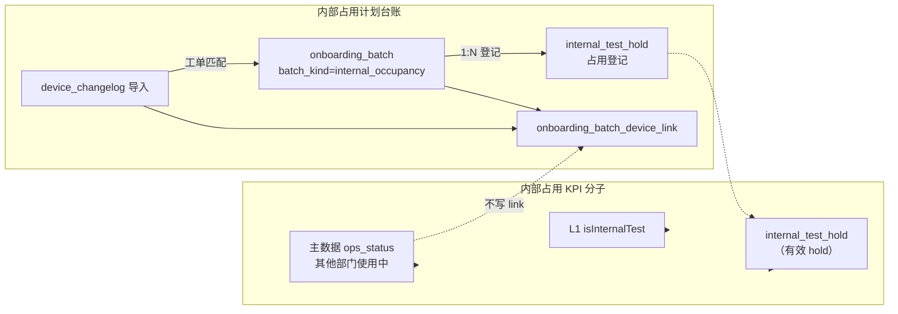
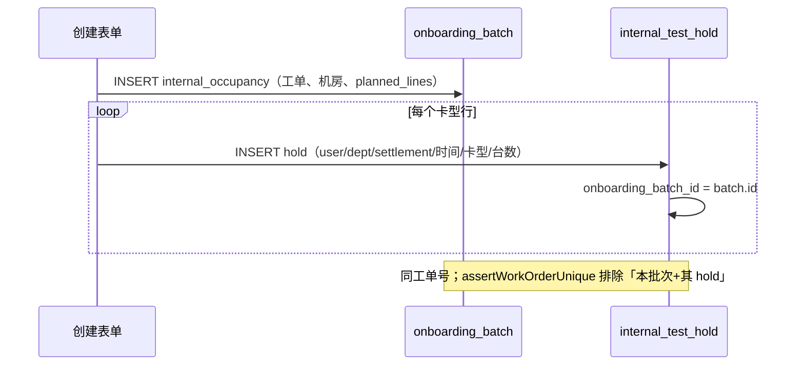
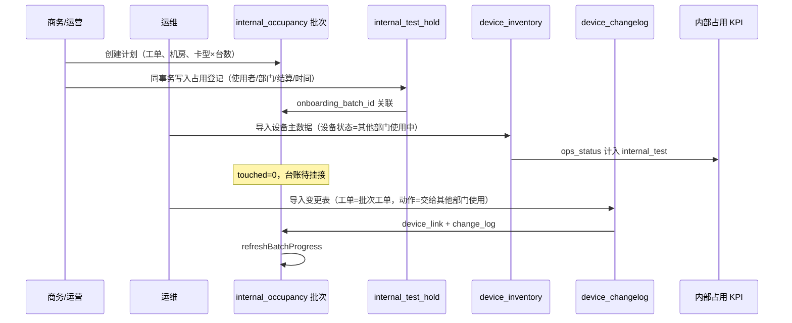
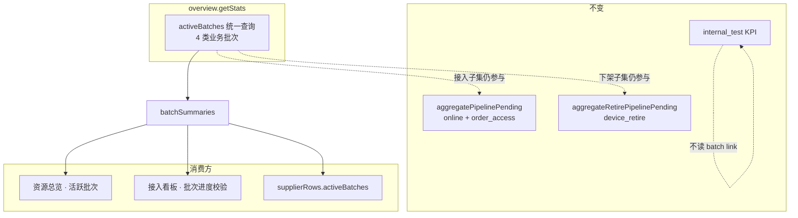

# 供应域 — 内部占用计划批次（路径 A）设计

**状态**：已确认（待实现）  
**版本**：v1.2（2026-05-31）  
**性质**：在既有供应域设计之上的 **增量专篇**；**不修改**其他设计文档正文，仅通过链接引用。

**关联（只读引用）**：

- [supplier-device-ops-pool-masterdata-design.md](./supplier-device-ops-pool-masterdata-design.md) — D1 主数据真源、D2 变更表边界、§6 内部占用 KPI 口径
- [supplier-planned-batches-hub-design.md](./supplier-planned-batches-hub-design.md) — 计划批次统一列表（现网 D5/D8：内部占用与计划批次分离）
- [supplier-onboarding-plan-changelog-tracking-design.md](./supplier-onboarding-plan-changelog-tracking-design.md) — 变更表挂批、`device_link`、进度刷新
- [supplier-device-import-schema.md](./supplier-device-import-schema.md) — 主数据 / 变更表 Excel 列
- [global-dashboard-period-composition-card-hours-design.md](./global-dashboard-period-composition-card-hours-design.md) — Period 计划卡时 vs 实体卡时
- [supplier-overview-scenarios-from-zero.md](./supplier-overview-scenarios-from-zero.md) — 现网 `batchSummaries` 仅含接入批次；§8.5 **覆盖** 其范围扩展约定
- [global-dashboard-kpi-caliber-spec.md](./global-dashboard-kpi-caliber-spec.md) — §5.4 差异校验；§8.5 扩展口径
- [datacenter-device-retire-design.md](./datacenter-device-retire-design.md) — 下架批次 `retired_device_count` 进度

---

## 1. 背景与问题

### 1.1 现网双轨

| 能力 | 现网实现 | 用户感知 |
|------|----------|----------|
| **内部占用 KPI** | 主数据 `ops_status = 其他部门使用中` + L1 库存测试标记 + `internal_test_hold` | 资源总览 / 大盘「内部占用」有数 |
| **内部占用台账** | 侧栏「内部占用」→ `internal_test_hold` 手工登记 | 与计划批次列表 **分离** |
| **计划批次** | `batch_kind ∈ { online, order_access, device_retire }` | 上架 / 接入 / 下架管道 |

运营反馈：设备主数据已标记「其他部门使用中」，但 **机房「计划与占用」、计划批次列表中看不到对应计划与挂接关系**；期望将内部占用纳入计划批次体系作 **台账展示**，同时 **不破坏** 主数据驱动的 KPI 口径。

### 1.2 本专篇范围

采用 **路径 A（轻量）**：

- 新增业务批次类型 **`internal_occupancy`（内部占用计划）**，作为 **计划 / 台账壳**；
- **设备状态真源** 仍为设备主数据（D1）；
- **批次挂接** 通过 **设备变更表 + 飞书工单号** 完成（复用现网 changelog 机制）；
- **保留** `internal_test_hold`，用于 L1 库存占用、部分 GPU scope、时间窗与结算等现网能力；
- **不在** 设备主数据导入 commit 时自动写 `onboarding_batch_device_link`（避免 Excel 无工单、误挂批）。
- **扩展** 资源总览「活跃批次」与接入看板「批次进度校验」读模型，纳入 `device_retire` + `internal_occupancy`（§8.5；**不** 改变待接入 / 内部占用 KPI 口径）。
- **登记** 内部占用时写入 **`internal_test_hold`（内部占用表）**：使用者、部门、结算、时间窗、卡型×台数；并与 **`internal_occupancy` 批次 1:N 关联**（§4.6）。

**明确不做（本期）**：

- 废弃 **`internal_test_hold` 表**（仍保留 L1 库存 / 凭据等独立登记能力）；
- 将内部占用 KPI 改为仅统计批次 link；
- 内部占用批次参与 Period「计划缺口」卡时积分（pipeline virtual）。

---

## 2. 已确认决策（ADR）

| # | 议题 | 决策 |
|---|------|------|
| **IO-1** | 方案路径 | **路径 A**：批次 = 台账与追溯；KPI = 主数据 + hold（与 [ops-pool-masterdata §6](./supplier-device-ops-pool-masterdata-design.md) 一致） |
| **IO-2** | 批次挂接入口 | **设备变更表** `device_changelog` commit；变更行 **工单号** 匹配内部占用计划批次的 `work_order_no` 或 `batch_code` |
| **IO-3** | 主数据导入 | 只写 `supplier_device` / 快照；**不**因 `ops_status=其他部门使用中` 自动写 `device_link` |
| **IO-4** | 推荐操作顺序 | **先** 导入设备主数据（状态截面）→ **后** 导入变更表（审计 + 挂批） |
| **IO-5** | `internal_test_hold` | **保留** 为 **内部占用登记表**；与批次 **关联** 后分工见 §5（非互斥废弃） |
| **IO-6** | KPI 防双计 | `internal_testGpu` / 资源构成 `internal_occupancy` **不**因批次 link 额外累加 |
| **IO-7** | Period 计划卡时 | 内部占用批次 **不参与** `planned − touched` pipeline 积分 |
| **IO-8** | 变更表与设备表 | 挂批路径 **遵循 D2 目标态**：变更表写 `change_log` + `device_link` + `refreshBatchProgress`；**不**依赖变更表刷新 `supplier_device.ops_status`（状态以主数据为准） |
| **IO-9** | 侧栏 IA | 实现阶段再定：可在计划批次列表增加类型「内部占用」，**不强制**移除 `/supplier/test-holds`（与 [planned-batches-hub D5](./supplier-planned-batches-hub-design.md) 的演进关系在实现 PR 中单独说明） |
| **IO-10** | 工单唯一性 | `work_order_no` 在 **supplier 维度** 全局唯一；**例外**：同一 `internal_occupancy` 批次与其 **关联** 的 `internal_test_hold` 行 **共享** 同工单号（见 IO-15，不视为冲突） |
| **IO-11** | 活跃批次读模型 | 资源总览 **「活跃批次」** 与接入看板 **「批次进度校验」** 共用 `batchSummaries`；范围扩展为 `batch_kind ∈ { online, order_access, device_retire, internal_occupancy }` 且 `batch_status` 非终态 |
| **IO-12** | UI 更名 | 资源总览卡片「活跃接入批次」→ **「活跃批次」**；接入看板「资源差异校验中心」副标题改为 **分类型进度校验**（见 §8.5） |
| **IO-13** | 分类型缺口 | 差异 / 摘要 **不得** 对全部类型统一使用 `planned − online`；按 §8.5.3 分支计算 `progressGap` |
| **IO-14** | KPI 边界不变 | 活跃批次扩展 **仅** 影响 `batchSummaries` / `discrepancies` / 供应商行 `activeBatches` 计数；**不** 将 `internal_occupancy` 并入 `aggregatePipelinePending`；下架仍仅通过 `aggregateRetirePipelinePending` 进 `retiring_pipeline` |
| **IO-15** | 占用登记落表 | 创建 `internal_occupancy` 批次时 **同事务** 写入 `internal_test_hold`（§4.6）；登记字段 **不** 仅写 `remark` |
| **IO-16** | 批次 ↔ 占用表关联 | `internal_test_hold.onboarding_batch_id` → `onboarding_batch.id`（`batch_kind=internal_occupancy`）；多卡型 = 多行 hold，同工单、同批次 |
| **IO-17** | 卡型与台数 | 登记表按 **卡型 × 台数** 一行一条 hold（与现网 `cardLines` 一致）；批次 `planned_lines_json` 与 hold 行 **同源写入**，保持计划台数一致 |

---

## 3. 概念模型

### 3.1 三条线分工（目标态）



### 3.2 与上架 / 下架批次的异同

| 维度 | 上架 / 接入 / 下架 | 内部占用计划 |
|------|-------------------|--------------|
| 进程语义 | 管道型：待接入 → 在线 / 下线中 → 退订 | **稳态占用**：计划台数 vs 已挂接台数 |
| 状态真源 | 主数据 +（历史）变更表 | **主数据**（D1） |
| 挂接触发 | 变更表 + 工单 | **同左** |
| 进度「在线」 | lifecycle = 在线 计 online | **不用**「已上线」语义；用 **已占用**（见 §6.3） |
| Period pipeline 缺口 | 可计 plan 卡时 | **不计**（IO-7） |

---

## 4. 数据模型（增量）

### 4.1 `onboarding_batch.batch_kind`

新增枚举值：

```text
internal_occupancy   -- 内部占用计划
```

与现网并存：`online` | `order_access` | `device_retire` | `device_inventory` | `device_changelog` | **`internal_occupancy`（新）**

### 4.2 内部占用计划批次字段（复用 + 扩展）

**复用**现网 `onboarding_batch` 列：

| 列 | 内部占用用途 |
|----|--------------|
| `work_order_no` | **必填**；变更表工单匹配键 |
| `batch_code` | 可选第二匹配键（与现网 changelog 一致） |
| `data_center_id` | 计划所属机房 |
| `planned_lines_json` / `planned_device_count` / `planned_gpu_count` | 计划占用台数 / 卡数 |
| `touched_device_count` | **已挂接**设备台数（refresh 刷新） |
| `batch_status` | `待开始` / `占用中` / `已完成` / `已取消`（文案见 §6.3） |

**登记类字段（使用者 / 部门 / 结算 / 时间窗）** 写入 **`internal_test_hold`**，**不** 写入 `onboarding_batch` 冗余列（见 §4.6）。

**不写入**：

- `online_device_count` 对内部占用批次 **不作为「已上线」展示**（见 §6.3）。

### 4.3 `onboarding_batch_device_link.link_kind`

新增：

```text
internal_occupancy   -- 内部占用挂接（变更表工单匹配后写入）
```

**禁止**对 `internal_occupancy` 业务批次使用 `link_kind = online`（避免与上架语义混淆）。

### 4.4 不变约束

- `supplier_device.onboarding_batch_id` **仍仅**指向最近一次 `device_inventory` 导入批次；**禁止**指向 `internal_occupancy` 业务批次（与 schema 注释一致）。
- 业务批次关联 **仅** 通过 `onboarding_batch_device_link.business_onboarding_batch_id`。

### 4.5 字典与变更动作

挂接行推荐变更动作（与 [supply-lifecycle-dictionary.ts](../../packages/db/src/supply-lifecycle-dictionary.ts) 一致）：

| 变更动作 | 默认 ops（参考） | 说明 |
|----------|------------------|------|
| `交给其他部门使用` | `其他部门使用中` | **推荐**挂接动作 |
| `状态更新` + 变更内容含设备状态 | 解析为目标 ops | 可选；挂接不依赖是否改 ops |

主数据 / 变更表设备状态别名：`其它` → `其他` 归一化（实现见 `normalizeDeviceOpsStatus`）。

### 4.6 内部占用登记（`internal_test_hold`）与批次关联

**内部占用表** = 现网 [`internal_test_hold`](../../packages/db/src/supply-schema.ts)（侧栏「内部占用」/ `/supplier/test-holds`）。创建 **`internal_occupancy` 计划批次** 时，除写入 `onboarding_batch` 外，**必须** 在同一事务内写入占用登记表，并建立与批次的关联。

#### 4.6.1 登记字段（创建表单必填 / 选填）

| 表单字段 | `internal_test_hold` 列 | 约束 | 说明 |
|----------|---------------------------|------|------|
| **使用者** | `user_name` | 必填 | 占用方联系人 / 使用人 |
| **使用部门** | `department` | 必填 | 字典与现网 hold 一致（如 `rd` / `ops` / `biz` 等，见 `INTERNAL_TEST_HOLD_DEPARTMENT_LABELS`） |
| **结算方式** | `settlement_mode` | 必填 | 字典与现网 hold 一致（如 `free` / `internal_charge` 等） |
| **开始时间** | `hold_from` | 必填 | 占用生效起点 |
| **计划结束时间** | `hold_until` | **可选** | 为空表示无固定结束；有效 hold 判定仍用现网 `isHoldActive` |
| **卡型 × 台数** | `gpu_card_type_id` + `unit_count` | 必填，可多行 | 与现网 `cardLines` 一致：**每种卡型一行** hold |
| 飞书工单号 | `work_order_no` | 必填 | 与批次 `work_order_no` **相同**（IO-10 例外） |
| 供应商 / 机房 | `supplier_id` + `data_center_id` | 必填 | 与批次一致 |
| 备注 | `remark` | 可选 | 补充说明 |

**卡型与计划对齐（IO-17）**：

- 表单「计划占用」多行 → 写入 **多行** `internal_test_hold`（每行一个 `gpu_card_type_id` + `unit_count`）；
- 同步写入批次 `planned_lines_json` / `planned_device_count` / `planned_gpu_count`（与 hold 行 **同源**，避免批次计划与登记表不一致）；
- `scope` 默认 `planned`（计划占用，尚未挂设备 / 库存）。

#### 4.6.2 批次关联（schema 增量）

在 `internal_test_hold` 增加外键：

```text
onboarding_batch_id  text NULL  → onboarding_batch.id
  -- 仅当 batch_kind = internal_occupancy 时写入
  -- 同一批次可关联多行 hold（多卡型）
  -- 独立登记（L1 库存 / 无计划批次）时保持 NULL
```

索引建议：

```text
internal_test_hold_onboarding_batch_id_idx  (onboarding_batch_id)
```

**约束**：

- `onboarding_batch_id` 指向的批次 **必须** 为 `batch_kind = internal_occupancy`；
- 批次作废 / 删除时：hold 行 **保留**（审计）；`onboarding_batch_id` 置 NULL 或随批次 soft-delete 策略在实现 PR 说明（默认 **置 NULL**，hold 仍可查）。

#### 4.6.3 创建事务（目标态）



**API**：扩展 `onboardingBatch.create`（`batchKind=internal_occupancy`）入参，包含 §4.6.1 登记字段；服务端 **禁止** 仅创建空批次而不写 hold。

#### 4.6.4 与 KPI 的关系（不变）

- 设备已挂接且 `ops_status=其他部门使用中` → KPI 仍走 **主数据**；
- **有效** hold（`hold_from` / `hold_until`）→ 仍参与 hold 解析与资源构成（IO-6：不因 **批次 device_link** 重复计数）；
- 批次路径新建的 hold 在 **未挂接设备前** 也可作为 **计划占用** 在 hold 侧可见（与 L1 库存 hold 并列规则）。

---

## 5. 与 `internal_test_hold` 的分工

| 场景 | 使用 |
|------|------|
| 商务已批占用计划、需飞书工单与 **使用者/部门/结算/时间/卡型台数** | **`internal_occupancy` 批次 + 关联 `internal_test_hold` 登记**（§4.6） |
| 运维已在主数据标记 `其他部门使用中` | **主数据** → KPI |
| 变更表证明「某工单下已交给某部门」 | **changelog** → `device_link` → 批次 touched |
| 尚未入库设备、仅 L1 库存计划占用 | **`internal_test_hold`**（`onboarding_batch_id` 为空，挂 `supplier_gpu_inventory_id`） |
| 部分 GPU scope、仅登记凭据 | **`internal_test_hold` + `internal_test_hold_device_link`**（可无批次） |
| 侧栏「内部占用」手工登记（无计划批次） | **`internal_test_hold`** 独立创建；`onboarding_batch_id = NULL` |

**工单规则（IO-10 修订）**：

- 独立 hold 与独立批次之间：`work_order_no` **互斥**；
- **`internal_occupancy` 批次与其关联 hold 行**：**共享** 同工单号；
- 仍 **不可** 与另一批次或无关 hold 重复同工单。

---

## 6. 业务流程

### 6.1 标准流程（IO-4）



### 6.2 变更表挂接规则

复用 [commitChangelog](../../apps/web/src/lib/server/dataaccess/supplier/device-import.ts) 现网逻辑，扩展如下：

1. 从导入行收集 `ticket_no`；
2. `resolveSingleBusinessBatchFromRows` 解析范围增加 `internal_occupancy`；
3. 匹配键：`work_order_no` **或** `batch_code`（与 `ticketRefsForBatch` 一致）；
4. 机房一致：设备 `data_center_id` = 批次 `data_center_id`；
5. 设备已存在于该 supplier + 机房（按设备 ID / 内网 IP / SN 匹配，与现网一致）；
6. 写入 `onboarding_batch_device_link`，`link_kind = internal_occupancy`；
7. 调用 `refreshBatchProgress(businessBatchId)`。

**动作校验（建议）**：

- 匹配到 `internal_occupancy` 批次时，若 `change_action` 不是 `交给其他部门使用` 且变更内容未体现「其他部门使用中」，仍 **允许挂接** 但写入 `bindWarnings` 提示复核（与下架动作不一致时的 warn 策略一致）。

### 6.3 进度刷新（`refreshBatchProgress`）

新增分支 `batch_kind === 'internal_occupancy'`：

```text
touched_device_count =
  COUNT(DISTINCT link.supplier_device_id)
  WHERE link.business_onboarding_batch_id = :batchId

occupied_gpu（展示用，可选缓存）=
  SUM(metricGpuCount(device))
  WHERE device.id IN linked AND isOtherDeptOpsStatus(device.ops_status)
```

**不更新** `online_device_count` 作为「已上线」；UI 展示 **已挂接 / 计划**。

**批次状态建议**：

| 条件 | `batch_status` |
|------|----------------|
| touched = 0 | `待开始` |
| 0 < touched < planned | `占用中` |
| touched ≥ planned（planned > 0） | `已完成`（可自动，与下架 auto-complete 类似） |

**不计** `onboarding`（待接入/接入中）计数。

### 6.4 异常与部分成功

| 情况 | 行为 |
|------|------|
| 工单未匹配任何批次 | 仅写 `change_log`；warning：未匹配到业务批次 |
| 工单匹配到 internal_occupancy 但机房不一致 | 跳过 link；warning 行级说明 |
| 仅主数据、无变更表 | KPI 正常；批次 touched=0；列表可标「待变更表挂接」 |
| 仅变更表、无主数据对齐 | link 可写入；KPI **可能**不含该设备直至主数据 `其他部门使用中` |
| 一行工单指向多批次 | **拒绝整单**（与现网一致） |

---

## 7. KPI 与大盘（边界）

### 7.1 内部占用 GPU（不变）

与 [ops-pool-masterdata §6.1](./supplier-device-ops-pool-masterdata-design.md) 保持一致：

```text
internal_occupancy_gpu =
  Σ L1 internal_test 标记与 hold 解析
  + Σ metricGpuCount(device) WHERE isOtherDeptOpsStatus(ops_status)
```

**批次 link 不参与上式。**

### 7.2 可售量（不变）

```text
sellable_gpu = online_gpu − internal_occupancy_gpu − fault_down_gpu − non_schedulable_gpu
```

### 7.3 资源构成饼图（不变）

设备分桶：`isOtherDeptOpsStatus(ops_status)` **或** active `internal_test_hold` → `internal_occupancy`（见 [global-dashboard-resource-composition-chart-design.md](./global-dashboard-resource-composition-chart-design.md)）。

### 7.4 Period 分析（IO-7）

- **实体卡时**：仍来自 `device_*_snapshot`（主数据驱动）；
- **计划卡时**：`internal_occupancy` 批次 **不**产生 `pending_access_pipeline` / 计划缺口扇区；
- `onboarding_batch_progress_event` 可写入 `progress_synced` 供批次详情时间轴，**不**进入 pipeline 阶梯积分。

---

## 8. API 与 UI（待实现）

### 8.1 批次 CRUD 与占用登记

| 能力 | 说明 |
|------|------|
| `onboardingBatch.create` | `batchKind: internal_occupancy`；必填 `workOrderNo`、机房、**登记字段**（§4.6.1）、计划行（卡型×台数） |
| 创建表单字段 | **使用者**、**使用部门**、**结算方式**、**开始时间**、**计划结束（可选）**、多行 **卡型+台数**、工单号、备注 |
| 落库 | 同事务：`onboarding_batch` + N 行 `internal_test_hold`（`onboarding_batch_id`） |
| `onboardingBatch.list` / `get` | 详情 **JOIN** 关联 hold 行，展示登记信息 |
| `internalTestHold.list` | 可选过滤 `onboarding_batch_id IS NOT NULL` → 「计划批次占用」 |
| 详情页 | 批次详情展示关联 hold 摘要；文案「已挂接」非「已上线」 |

### 8.2 计划批次列表

| `batch_kind` | Badge 文案 | 详情路径（建议） |
|--------------|------------|------------------|
| `internal_occupancy` | 内部占用 | `/supplier/online-tasks/[id]` 或专路径（实现时二选一） |

### 8.3 机房「计划与占用」面板

[datacenter-planned-batches-panel](../../apps/web/src/app/[locale]/(protected)/supplier/_components/datacenter-planned-batches-panel.tsx) 的「内部占用」Tab：

- **`internal_occupancy` 批次**（计划 + 挂接进度）；
- **关联 `internal_test_hold`** 行（使用者 / 部门 / 结算 / 时间 / 卡型台数）；
- 无批次关联的 legacy hold 仍单独列出（L1 / 凭据登记）。

### 8.4 变更表导入提示

commit 结果 warnings 增补文案：

```text
变更表工单号未匹配到上架/订单接入/下架/内部占用计划批次，仅写入变更审计
```

### 8.5 活跃批次读模型（资源总览 + 接入看板）

#### 8.5.1 背景与目标

现网 [`overview.getStats`](../../apps/web/src/lib/server/dataaccess/supplier/overview.ts) 的 `batchSummaries` **仅** 含 `online` / `order_access`；[`supplier-overview-scenarios-from-zero.md`](./supplier-overview-scenarios-from-zero.md) 亦约定 `device_retire` **不出现** 于摘要。运营反馈：

- 发起 **下架计划** 后在资源总览 / 接入看板 **看不到** 进行中批次；
- 新建 **内部占用计划** 后同样无法在总览 / 看板 **催办挂接**。

本专篇在实现 `internal_occupancy` 时 **一并** 统一「活跃业务批次」读模型：**扩展范围 + 更名 + 分类型进度口径**。

**涉及 UI**：

| 页面 | 路由 | 组件 | 现网标题 | 目标标题 |
|------|------|------|----------|----------|
| 资源总览 | `/supplier/overview` | `supplier-overview-content.tsx` | 活跃接入批次 | **活跃批次** |
| 接入看板 | `/dashboard/global` | `discrepancy-table-card.tsx` | 资源差异校验中心 | **批次进度校验**（CardTitle）；保留差异语义 |

两处数据 **同源**：`overview.getStats` → `batchSummaries` → 接入看板 `globalOps.getSnapshot` → `discrepancies`。

#### 8.5.2 活跃批次范围与筛选

**纳入**（IO-11）：

```text
batch_kind ∈ { online, order_access, device_retire, internal_occupancy }
AND batch_status ∉ { 已完成, 已取消 }   -- 与现网 TERMINAL_BATCH_STATUSES 一致
```

**排序**：`planned_ready_at DESC NULLS LAST`，`limit 20`（与现网一致；实现时可按 `progressGap > 0` 或临期优先二次排序，非本期强制）。

**区域 / 供应商 / 卡型筛选**：与现网 `overview` 过滤器一致；下架批次已支持 region 过滤（现网 `activeRetireBatches` 逻辑可合并进统一查询）。

**不纳入**：

| 类型 | 原因 |
|------|------|
| `device_inventory` / `device_changelog` | 导入批次，非业务计划 |
| `internal_test_hold` | 仍为独立台账（IO-5）；见 §8.3 |
| 终态批次 | 已完成 / 已取消 |

#### 8.5.3 分类型进度与缺口（IO-13）

各 `batch_kind` **完成度字段** 与 **缺口公式** 不同；读模型输出统一字段，供 UI / 差异表消费：

| `batch_kind` | 中间进度 | 完成进度 | `progressGap` | 差异表第三进度列 |
|--------------|----------|----------|---------------|------------------|
| `online` | `touched_device_count` | `online_device_count` | `max(0, planned − online)` | **在线** |
| `order_access` | `touched_device_count` | `online_device_count` | 同上 | **在线** |
| `device_retire` | `touched_device_count` | `retired_device_count` | `max(0, planned − retired)` | **已退订** |
| `internal_occupancy` | — | `touched_device_count` | `max(0, planned − touched)` | **已挂接** |

**禁止**：

- 对 `internal_occupancy` 使用 `online_device_count` 或「在线」文案；
- 对 `device_retire` 使用 `online_device_count` 计算缺口（会导致 gap 长期等于 `planned` 的误报）。

**`discrepancies` 状态机**（沿用 [global-dashboard-kpi-caliber-spec §5.4](./global-dashboard-kpi-caliber-spec.md)）：

```text
status = discrepancyStatus(progressGap, planned_ready_at, now)
gapLabel = progressGap > 0 ? 「计划 − {完成列} = {progressGap}」 : 「一致」
```

**接入看板自动待办**（`global-ops.ts` `todos`）：文案按类型分支，例如：

| 类型 | 待办标题模板 |
|------|--------------|
| 接入 | `接入缺口 · {supplier} / {dc}` |
| 下架 | `下架缺口 · {supplier} / {dc}` |
| 内部占用 | `占用未挂接 · {supplier} / {dc}` |

#### 8.5.4 DTO 扩展（`OnboardingBatchSummaryDto`）

在现网字段基础上 **增加**（实现期）：

| 字段 | 类型 | 说明 |
|------|------|------|
| `retiredDeviceCount` | number | 下架批次；其他类型为 `0` |
| `progressDoneCount` | number | 统一「完成进度」：`online` / `retired` / `touched`（内部占用） |
| `progressGap` | number | §8.5.3 公式 |
| `progressMidLabel` | string | UI 用：`接收` / `挂接` / `—` |
| `progressDoneLabel` | string | UI 用：`在线` / `已退订` / `已挂接` |
| `detailHref` | string | 按类型：`online-tasks` / `order-access` / `offline-tasks` |

> 若希望减少字段，可在 UI 层按 `batchKind` 映射文案，但 **`progressGap` 必须在服务端按类型计算**。

#### 8.5.5 资源总览「活跃批次」卡片

| 项 | 约定 |
|----|------|
| 标题 | **活跃批次** |
| 描述 | 进行中计划批次：接入、下架、内部占用 |
| 空态 | `暂无活跃批次` |
| 类型 Badge | `设备上架` / `订单接入` / `设备下架` / `内部占用` |
| 进度行 | `{progressMidLabel} {touched}/{planned} · {progressDoneLabel} {progressDoneCount}`；接入类保留 `计划就绪 {plannedReadyAt}` |
| 链接 | `detailHref`；列表入口仍 `/supplier/online-tasks`（计划批次 Hub） |
| 供应商行 `activeBatches` | 计数范围与 IO-11 **一致**（现网仅接入，需同步扩展） |

#### 8.5.6 接入看板「批次进度校验」卡片

| 项 | 约定 |
|----|------|
| CardTitle | **批次进度校验**（或保留「资源差异校验中心」主标题 + 副标题强调多类型） |
| CardDescription | 进行中计划批次：计划 / 中间进度 / 完成进度（按类型列含义不同） |
| 表头 | 固定 **计划 / 接收或挂接 / 完成** 三列；完成列 tooltip 按行类型解释 |
| 「处理」链接 | 使用 `detailHref` |
| 底链 | `查看全部计划批次` → `/supplier/online-tasks` |

#### 8.5.7 与 KPI / Pipeline 的边界（IO-14）

| 模块 | 是否变化 |
|------|----------|
| 待接入 KPI + `pipeline_gap` | **否** — 仍仅 `online` / `order_access` |
| `retiring_pipeline` / 资源构成下架扇区 | **否** — 仍由 `activeRetireBatches` + `aggregateRetirePipelinePending` |
| 内部占用 KPI / 可售 | **否** — IO-6 |
| Period pipeline 卡时 | **否** — IO-7；`internal_occupancy` 不进 M1 阶梯 |
| `batchSummaries` / `discrepancies` | **是** — 本 § |



#### 8.5.8 实现文件（增量）

| 文件 | 改动 |
|------|------|
| `overview.ts` | 合并活跃批次查询；输出扩展 DTO；`activeBatches` 供应商计数 |
| `supplier-overview-api.ts` | `OnboardingBatchSummaryDto` 扩展 |
| `global-ops.ts` | `discrepancies` / `todos` 使用 `progressGap`；待办文案分支 |
| `supplier-overview-content.tsx` | 更名 + Badge / 进度 / 链接 |
| `discrepancy-table-card.tsx` | 更名 + 表头 / 链接 |

---

## 9. 实现清单

| ID | 模块 | 任务 |
|----|------|------|
| IO-IMP-1 | `packages/db` / 类型 | `OnboardingBatchKind` 增加 `internal_occupancy` |
| IO-IMP-2 | `changelog-business-batch-link.ts` | `resolveBusinessBatchByTicketNo` / `ResolvedBusinessBatch` 含新 kind |
| IO-IMP-3 | `device-import-utils.ts` | `buildChangeLogsFromChangelogImport`：`link_kind=internal_occupancy` |
| IO-IMP-4 | `batch-progress.ts` | `refreshBatchProgress` 新分支 + 状态机 |
| IO-IMP-5 | `device-import.ts` | commitChangelog warnings 文案 |
| IO-IMP-6 | `onboarding-batch.ts` | create/list/get 支持新 kind |
| IO-IMP-7 | UI | 创建向导、列表 Badge、详情 copy |
| IO-IMP-8 | D2 对齐（可选同 PR） | changelog commit 路径停止写 `supplier_device`（若现网仍写，单独立项） |
| IO-IMP-9 | `overview.ts` + `supplier-overview-api.ts` | §8.5 活跃批次统一查询 + DTO（含 `progressGap` / `retiredDeviceCount`） |
| IO-IMP-10 | `global-ops.ts` | `discrepancies` / `todos` 分类型缺口与文案 |
| IO-IMP-11 | `supplier-overview-content.tsx` | 「活跃批次」卡片：Badge、进度行、`detailHref` |
| IO-IMP-12 | `discrepancy-table-card.tsx` | 「批次进度校验」更名与多类型表头 |
| IO-IMP-13 | `packages/db` | `internal_test_hold.onboarding_batch_id` 迁移 + 索引 |
| IO-IMP-14 | `onboarding-batch.ts` + `internal-test-hold.ts` | 创建 `internal_occupancy` 同事务写 hold；修订 `assertWorkOrderUnique`（IO-10） |
| IO-IMP-15 | UI | 创建表单：使用者 / 部门 / 结算 / 开始·结束时间 / 卡型台数；详情展示关联 hold |

---

## 10. 测试场景

| ID | 场景 | 预期 |
|----|------|------|
| T-IO-1 | 创建 internal_occupancy 批次 + 主数据 other_dept | KPI +N；touched=0 |
| T-IO-2 | 变更表工单匹配 + `交给其他部门使用` | link 写入；touched+N；KPI 不重复加 |
| T-IO-3 | 工单匹配但机房不一致 | 无 link；行级 warning |
| T-IO-4 | 主数据 `其它部门使用中` | 归一化后 KPI 计入 |
| T-IO-5 | 仅变更表、主数据仍为在集群中 | link 可有；KPI 不含至主数据更新 |
| T-IO-6 | 同工单创建 hold 与批次 | 创建第二批失败（工单冲突） |
| T-IO-7 | Period 构成 | 无 internal_occupancy pipeline 虚拟扇区 |
| T-IO-8 | 创建 `device_retire` 进行中批次 | `batchSummaries` / 活跃批次卡片 **1 条**；`progressGap = planned − retired`；**不**出现在待接入 pipeline |
| T-IO-9 | 创建 `internal_occupancy`，touched=0 | 活跃批次 **1 条**；gap=planned；差异状态 pending/abnormal（若临期）；**online 列展示已挂接 0** |
| T-IO-10 | internal_occupancy 变更表挂接后 touched=planned | gap=0；批次可 auto **已完成** 后从活跃列表消失 |
| T-IO-11 | 四类批次各 1 条进行中 | 活跃批次 ≤4 条；接入看板差异表同源；供应商 `activeBatches` 计数 =4 |
| T-IO-12 | 仅扩展读模型 | 待接入 KPI / `retiring_pipeline` / 内部占用 KPI **数值与扩展前一致** |
| T-IO-13 | 创建 internal_occupancy + 登记字段 | 1 批次 + N hold；`onboarding_batch_id` 正确；`planned_*` 与 hold 台数一致 |
| T-IO-14 | 同工单批次+hold | 不触发工单冲突；与 **无关** 第二批同工单仍失败 |
| T-IO-15 | hold 有效窗内 | KPI / 资源构成含 hold；批次 link 不重复加（IO-6） |
| T-IO-16 | 仅独立 hold（无批次） | `onboarding_batch_id` 为空；行为与现网 test-holds 一致 |

---

## 11. 历史数据与迁移

| 数据 | 策略 |
|------|------|
| 已存在 `其他部门使用中` 设备、无批次 | **不强制回填**；可选运维脚本按工单批量导入变更表补 link |
| 现有 `internal_test_hold` | **保留**；新增 `onboarding_batch_id` 可空；历史行 **不回填** 批次 |
| 已创建无 hold 的 internal_occupancy 批次（若有） | 可选脚本：按 `planned_lines` + 批次元数据补 hold 登记 |
| 现网 `test-holds` 路由 | 保持可用直至 UI 合并评审（IO-9） |

---

## 12. 修订记录

| 版本 | 日期 | 说明 |
|------|------|------|
| v1.0 | 2026-05-31 | 首版：路径 A；变更表 + 工单挂批；KPI / hold 边界 |
| v1.1 | 2026-05-31 | §8.5 活跃批次读模型：纳入下架 + 内部占用；资源总览 / 接入看板更名；IO-11～14 |
| v1.2 | 2026-05-31 | §4.6 占用登记落 `internal_test_hold` + 批次关联；IO-15～17；修订 IO-10 / IO-5 |
