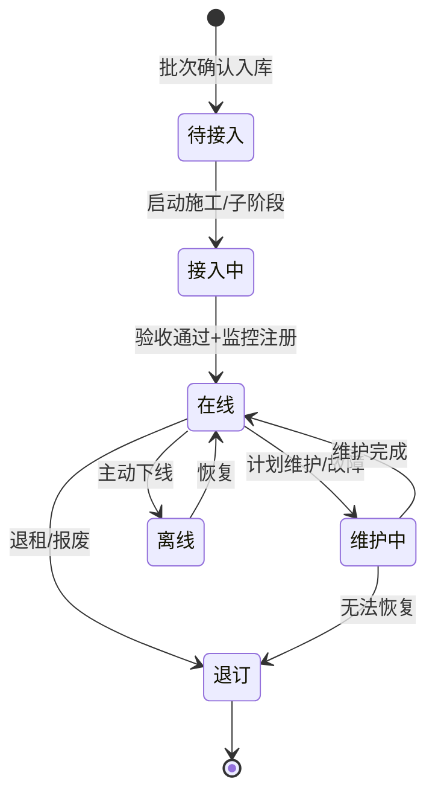
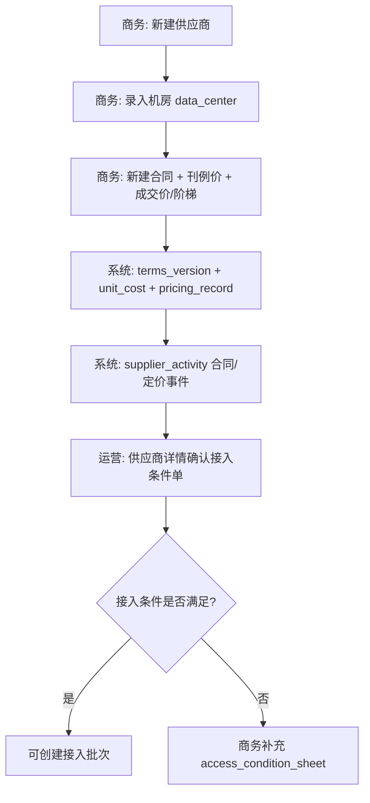
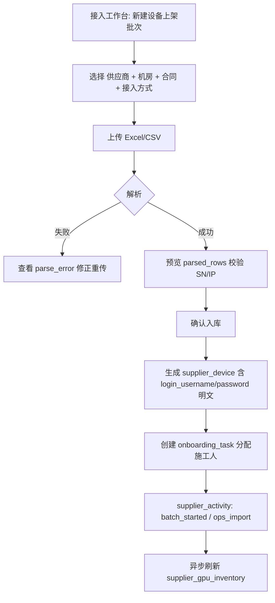
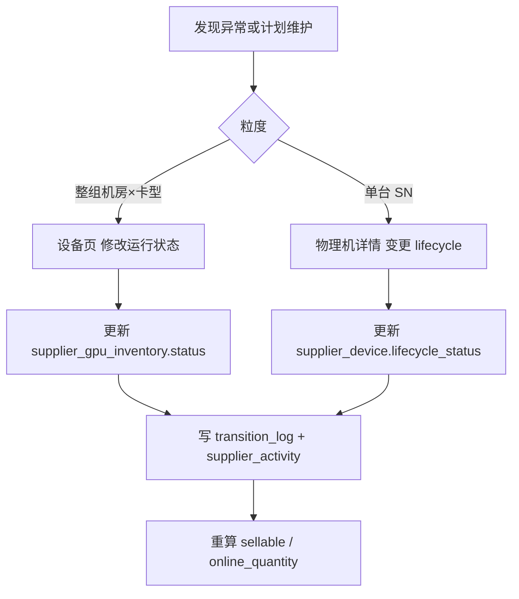
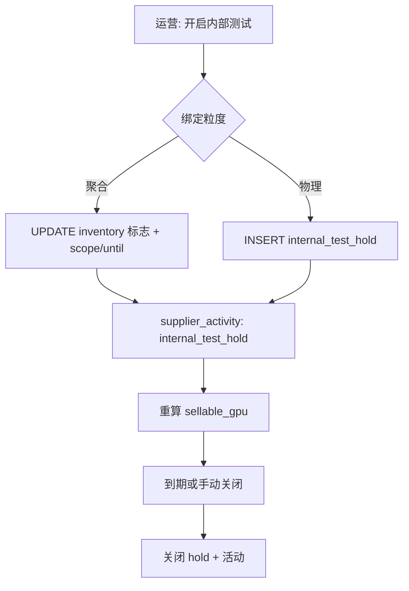
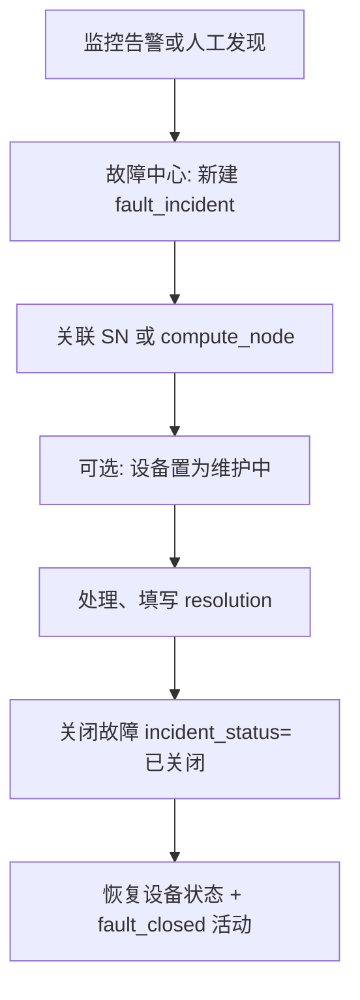
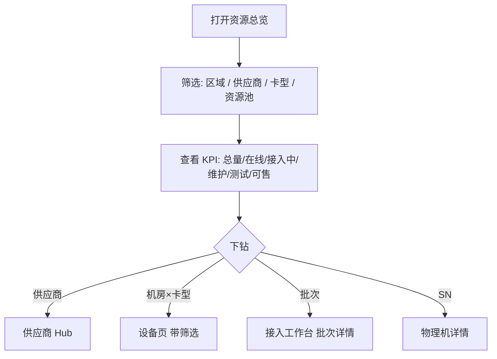
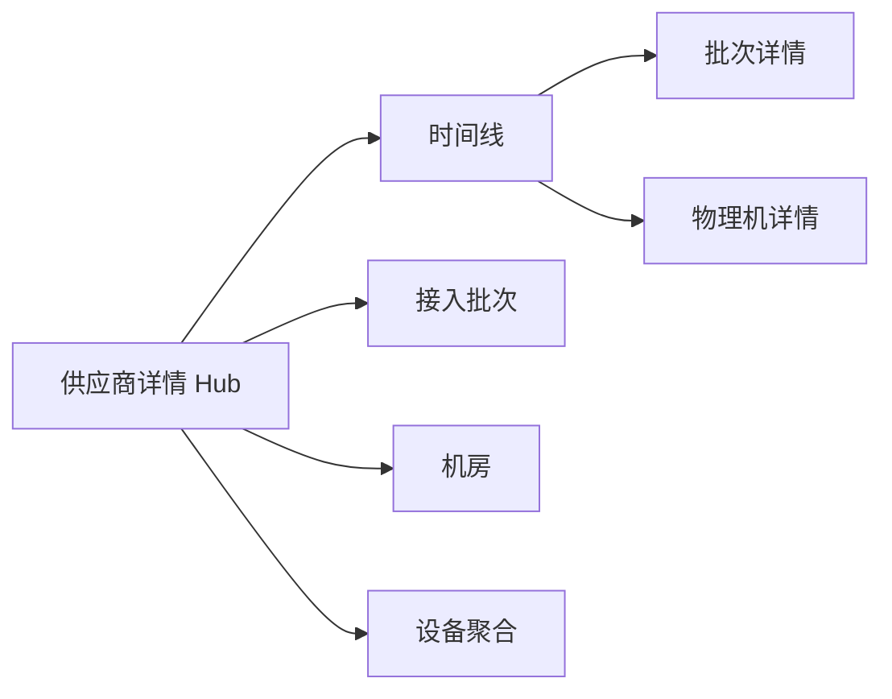

# 供应商算力资源全生命周期 — 产品实现方案

**依据**：`[supplier-database.md](./supplier-database.md)`（v1.4）、`[supplier-device-import-schema.md](./supplier-device-import-schema.md)`（设备/变更/故障 Excel 导入）、`apps/web/src/app/[locale]/(protected)/supplier` 现有路由与组件、`lib/types/supplier-domain.ts` / `supplier-ops-batch.ts` Mock。

**视角**：算力运营经理（以下简称「运营经理」）— 负责供应商侧资源接入、在线可售、故障与测试占用、与商务/财务协同，而非 CRM 客户侧交付。

**文档性质**：产品方案与用户操作流；不涉及代码修改。

**版本**：v1.1（2026-05-21）

---

## 1. 运营经理的核心诉求


| 诉求      | 说明                                           | 设计文档对应                                              |
| ------- | -------------------------------------------- | --------------------------------------------------- |
| **看得见** | 按供应商 → 机房 → 卡型 → 单机下钻，掌握总量、在线、接入中、维护、测试占用、可售 | §5 资源监控大盘、`supplier_gpu_inventory`                  |
| **接得进** | 合同与接入条件就绪后，批量导入物理机，施工任务可跟踪直至上线               | §3.3 接入批次、`supplier_device`                         |
| **管得住** | 运行状态、故障、内部测试、资源池绑定有审计与时间线                    | §3.4–§3.5、`supplier_activity`                       |
| **算得清** | 机房×卡型成本与合同/财务基准一致，支撑毛利与月结                    | §3.2、`supplier_unit_cost` → `platform_cost_monthly` |
| **追得到** | 任意一台 SN 从「批次入库 → 子阶段 → 上线 → 维护/退订」可追溯        | §7.3–§7.4、`entity_state_transition_log`             |


---

## 2. 现状分析：已实现 vs 规划

### 2.1 路由与页面落地情况


| 路由                          | 状态      | 入口组件                              | 数据层                                           | 与设计文档对齐度                                                 |
| --------------------------- | ------- | --------------------------------- | --------------------------------------------- | -------------------------------------------------------- |
| `/supplier`                 | ✅ 重定向   | → `/supplier/suppliers`           | —                                             | —                                                        |
| `/supplier/suppliers`       | ✅       | `SuppliersContent`                | `mock-data` · `Supplier`                      | 主数据列表；支持新建（Mock Store）                                   |
| `/supplier/suppliers/[id]`  | ✅       | `SupplierDetailContent` + 各 Panel | `mock-data`                                   | 概览/机房/设备/合同/卡型成本/账单 Tab；**无活动时间线 Tab**                   |
| `/supplier/contracts`       | ✅       | `ContractsContent`（路由内副本）         | `mock-data` · `SupplierContract`              | 列表/详情/新建合同；阶梯仍用 **累计卡时阈值** Mock，与 v1.2 **成交/刊例比例** 口径不一致 |
| `/supplier/devices`         | ✅       | `DevicesContent`                  | `mock-data` · `DataCenterDevice`（**L1 聚合**）   | 列表/详情、运行状态变更、内部测试开关；**无物理机 SN 下钻**                       |
| `/supplier/unit-costs`      | ✅       | `UnitCostsContent`                | `mock-data` · 定价记录/历史/卡型                      | 单价配置、变更历史、卡型字典；`CreateCardPricingDialog`                 |
| `/supplier/online-tasks`    | ⏳ 侧边栏已配 | **无 page**                        | `supplier-domain-mock` + `supplier-ops-batch` | 表结构 §3.3 已定义；`OPS_KIND_UI`、`parse-inventory-csv` 已备      |
| `/supplier/order-access`    | ⏳ 同上    | **无 page**                        | 同上                                            | `batch_kind = order_access`                              |
| `/supplier/fault-incidents` | ⏳ 同上    | **无 page**                        | `supplier-domain-mock` · `FaultIncident`      | 故障主数据 Mock 有，列表 UI 无                                     |
| `/supplier/test-holds`      | ⏳ 同上    | **无 page**                        | `InternalTestHold` Mock                       | 设备页有聚合层测试 UI，独立占用台账页无                                    |


**说明**：`components/dashboard/`* 与 `supplier/components/*` 存在并行实现（如 `contracts-content`），路由实际引用的是 `supplier/components` 或 `dashboard` 中对应导出，功能语义一致，均基于 **经营列表 Mock**（`lib/data/mock-data.ts`）。

### 2.2 按能力域拆解

#### A. 商务主数据（合作前 / 合作中）


| 能力       | 已实现 UI                              | 未实现 / 缺口                                                                             |
| -------- | ----------------------------------- | ------------------------------------------------------------------------------------ |
| 供应商 CRUD | 列表筛选、新建弹窗、详情概览                      | 「编辑信息」「同步数据」为占位；`business_manager_staff_id` 与 CRM `user_staff` 未打通                   |
| 机房管理     | 详情 Tab · `SupplierDatacentersPanel` | 无独立机房列表路由；新建/编辑机房表单未完整                                                               |
| 商务合同     | 全局合同页 + 详情内嵌                        | 刊例价 `supplier_card_list_price`、成交/刊例比例阶梯 **未在 UI 体现**；`access_condition_sheet` 无维护入口 |
| 卡型成本     | 全局 + 供应商详情嵌入                        | 与 `supplier_unit_cost` 财务 FK 的显式溯源展示弱                                                |
| 供应商账单    | `SupplierBillsPanel`                | 只读 Mock；与财务域对账流未串联                                                                   |


#### B. 资源视图（L1 聚合层）


| 能力      | 已实现 UI                      | 未实现 / 缺口                                                                  |
| ------- | --------------------------- | ------------------------------------------------------------------------- |
| 机房×卡型库存 | 设备列表、供应商详情设备 Tab            | 接入中/维护中 **分状态数量** 未单独展示；`sellable_quantity` 未算                            |
| 运行状态    | 在线/离线/维护 切换（聚合层）            | 变更 **未写** `entity_state_transition_log` / `supplier_activity`（前端本地 state） |
| 内部测试    | 设备页 Dialog（聚合标志位）           | 未落 `internal_test_hold` 表语义；无 `test-holds` 台账页                            |
| 资源监控大盘  | 全局「接入看板」`/dashboard/global` | 与供应商域 **未打通**；§5 下钻视图缺失                                                   |


#### C. 接入与物理设备（L2 层 — 全生命周期核心缺口）


| 能力                            | Mock / 工具                                             | UI           |
| ----------------------------- | ----------------------------------------------------- | ------------ |
| 接入批次 `onboarding_batch`       | `supplier-domain-mock`、ops batch seed                 | **无**        |
| Excel/CSV 解析入库                | `parse-inventory-csv.ts`、`import_status` 状态机（设计 §3.3） | **无**        |
| 设备主数据/变更/故障 Excel 导入         | [supplier-device-import-schema.md](./supplier-device-import-schema.md) | **无**        |
| 物理机 `supplier_device`         | domain mock（SN、子阶段、IP、登录凭据）                         | **无**列表/详情页  |
| 施工任务 `onboarding_task`        | mock                                                  | **无**        |
| 计算节点 `compute_node`           | mock                                                  | **无**        |
| 资源池绑定 `resource_pool_binding` | mock                                                  | **无**        |
| 供应商活动时间线                      | 表设计 §3.8                                              | 详情 **无 Tab** |


#### D. 运维事件


| 能力                  | 已实现                                | 缺口                    |
| ------------------- | ---------------------------------- | --------------------- |
| 故障 `fault_incident` | Mock 数据                            | 无列表/开单/关闭 UI；与设备详情未关联 |
| 故障清单 CSV            | `supplier_ops_upload_batch` 设计     | 无                     |
| 状态审计                | `entity_state_transition_log`（UI 手动）；`supplier_device_change_log`（Excel 变更） | 无排障只读视图               |


### 2.3 模型分层与当前前端错位（必须在方案中消化）

```
┌─────────────────────────────────────────────────────────────┐
│  L3 平台投影   platform_resource_id / 调度池   [未做]        │
├─────────────────────────────────────────────────────────────┤
│  L2 物理设备   supplier_device + compute_node   [Mock only] │
├─────────────────────────────────────────────────────────────┤
│  L1 聚合库存   DataCenterDevice / supplier_gpu_inventory     │
│                [devices 页 + 详情 Tab — 已做]                │
└─────────────────────────────────────────────────────────────┘
```

**风险**：运营经理在「设备」页操作的是 **聚合行**，无法管理单台 SN 的接入子阶段；与设计目标「接入可追溯」差距最大。

---

## 3. 产品定位与目标架构

### 3.1 一句话定位

**供应商 Hub + 接入流水线 + 资源大盘**：以供应商为协作单元，把「谈好的价」和「接进来的机」绑在同一条时间线上，直到可售 GPU 进入平台调度。

### 3.2 目标模块（运营经理日常）


| 模块          | 路由建议                                               | 优先级 | 说明                          |
| ----------- | -------------------------------------------------- | --- | --------------------------- |
| **资源总览**    | `/supplier/overview` 或强化 `/dashboard/global` 供应商维度 | P0  | 可售 GPU、接入漏斗、故障 SLA；下钻到机房×卡型 |
| **供应商 Hub** | 现有 `/supplier/suppliers/[id]`                      | P0  | 增加 **活动时间线**、**接入批次**快捷入口   |
| **接入工作台**   | `/supplier/online-tasks`、`/supplier/order-access`  | P0  | 批次创建 → 解析 → 入库 → 任务 → 上线    |
| **物理机台账**   | `/supplier/devices` 升级为双视图，或 `/supplier/machines`  | P0  | 聚合 / 物理机 Tab；SN 详情含节点、池、审计  |
| **运维中心**    | `/supplier/fault-incidents`、`/supplier/test-holds` | P1  | 故障与测试占用统一台账                 |
| **商务与成本**   | 现有 contracts、unit-costs                            | P1  | 阶梯 UI 迁移为成交/刊例比例            |
| **结算协同**    | 详情账单 + 链到 `/finance`                               | P2  | 账单确认活动写入时间线                 |


### 3.3 全生命周期状态机（运营视角）

**物理机 `lifecycle_status`**（与聚合层 `status` 映射，允许短暂不一致，以物理机为准做商务粒度）：




**接入批次 `import_status`**（与 `batch_status` 并行，运营关心「清单是否已入库」）：

`draft` → `uploaded` → `parsing` → `parsed` → `committing` → `committed` →（进入施工）→ 批次 `已完成`

**可售量**（读模型，每次状态变更后刷新）：

`sellable_gpu = online_gpu − internal_test_gpu − fault_down_gpu`

---

## 4. 分阶段实施路线图

### 阶段 0：现状巩固（1–2 周）

- 统一 Mock：聚合 `mock-data` 与 `supplier-domain-mock` 的供应商/机房 ID。
- 合同阶梯表单改为 **刊例价 + 成交/刊例比例**（对齐 v1.2，去除累计卡时档）。
- 设备页状态/内部测试变更 → 写入 Mock Store 的 `supplier_activity` + `transition_log`（为接 API 铺路）。

### 阶段 1：接入流水线 MVP（3–5 周）— 生命周期「前半段」

- 落地 `online-tasks`、`order-access` 页面（共用批次组件，`batch_kind` 区分）。
- 流程：选供应商+机房+合同 → 上传 Excel → 解析预览 → 确认入库 → 生成 `supplier_device`。
- 供应商详情：接入批次列表 + 链到批次详情。

### 阶段 2：物理机与上线（2–3 周）— 生命周期「后半段」

- 物理机列表/详情（SN、子阶段、IP、批次、合同）。
- 施工任务看板（按 assignee / 批次筛选）。
- 单台/批量「标记上线」→ 刷新 `supplier_gpu_inventory` + 时间线 `device_online`。

### 阶段 3：运维与大盘（3–4 周）

- `fault-incidents`、`test-holds` 页面；设备详情嵌入故障与测试卡片。
- `resource_pool_binding` 维护 UI。
- 供应商资源总览 / 全局看板供应商维度；`sellable_quantity` 展示。

### 阶段 4：生产化（持续）

- 落库 PostgreSQL schema（`supplier-database.md` §8）。
- 对接监控/调度 `platform_resource_id`、池代码同步。
- 财务月结 `supplier_unit_cost_id` 强校验。

---

## 5. 主要用户操作流

以下流程按 **运营经理** 高频场景编排；每节含：前置条件、步骤、系统写入、成功标准。

---

### 流 1：新供应商合作启动（商务协同）

**角色**：运营经理（发起）+ 商务经理（签合同、定价）

**前置**：CRM 侧已有 `user_staff`（商务经理账号）。




| 步骤  | 操作位置                  | 用户动作                            | 系统行为（落库目标）                                                                                                 |
| --- | --------------------- | ------------------------------- | ---------------------------------------------------------------------------------------------------------- |
| 1   | `/supplier/suppliers` | 商务新建供应商，指定商务经理                  | INSERT `supplier`                                                                                          |
| 2   | 供应商详情 · 机房            | 新增机房、配套费                        | INSERT `data_center`；活动 `datacenter_added`                                                                 |
| 3   | `/supplier/contracts` | 新建合同，上传附件，配置刊例/成交/阶梯            | INSERT `supplier_contract`、`supplier_card_list_price`、`supplier_pricing_tier`                              |
| 4   | 合同生效                  | 状态 → `active`                   | INSERT `supplier_terms_version`、`supplier_unit_cost`；UPSERT `supplier_pricing_record`；活动 `contract_signed` |
| 5   | 供应商详情                 | 运营确认当前 `access_condition_sheet` | 只读校验 `is_current = true`                                                                                   |


**成功标准**：同一供应商下，目标机房×卡型存在有效 `supplier_pricing_record` 与 `access_condition_sheet`，运营可在接入工作台选到该合同。

**现状**：步骤 1–4 部分在 UI（合同/供应商/卡型成本）；步骤 5 **无接入条件单 UI**。

---

### 流 2：设备上架批次（核心 — Excel 接入）

**角色**：运营经理

**前置**：流 1 完成；`supplier.status = cooperating`；机房归属供应商校验通过。




| 步骤  | 操作位置                     | 用户动作                             | 系统行为                                                                                                     |
| --- | ------------------------ | -------------------------------- | -------------------------------------------------------------------------------------------------------- |
| 1   | `/supplier/online-tasks` | 点击「新建上架批次」                       | INSERT `onboarding_batch`（`batch_kind=online`，`import_status=draft`，冗余供应商/机房快照）                          |
| 2   | 批次向导 Step 1              | 选择供应商、机房、生效合同、接入方式（SSH/IPMI/现场等） | FK 校验 `data_center.supplier_id`；绑定 `access_condition_sheet`                                              |
| 3   | Step 2                   | 上传清单文件                           | 更新 `import_file_*`，`import_status=uploaded` → 异步 `parsing`                                               |
| 4   | Step 3                   | 查看解析结果表（成功/警告/失败行）               | `parsed` + `parsed_rows_json` 或 `onboarding_batch_import_row`                                            |
| 5   | Step 4                   | 确认入库                             | `committing` → 每行 UPSERT `supplier_device`（含 `login_username`/`login_password` **阶段一明文**、`ops_status`→`lifecycle_status` 映射，`onboarding_batch_id` 一致）→ `committed` |
| 6   | 批次详情                     | 分配施工任务、设置计划就绪时间                  | INSERT `onboarding_task`；`batch_status=接入中`                                                              |
| 7   | —                        | —                                | `supplier_activity`：`ops_import`、`batch_started`；刷新对应机房×卡型 `quantity`                                    |


**成功标准**：批次 `committed_device_count` = 解析成功行数；供应商详情时间线可见导入事件；设备台账能按批次 SN 检索；物理机详情可查看登录凭据（**权限控制 + 默认脱敏**）。

**现状**：侧边栏有入口，**页面与向导均未实现**；`parse-inventory-csv.ts` 可复用。

---

### 流 2b：设备主数据表 / 设备变更表批量导入（运维台账）

**依据**：[supplier-device-import-schema.md](./supplier-device-import-schema.md)。

| 导入类型 | 批次 | commit 写入 |
|----------|------|-------------|
| **设备表** | `onboarding_batch.batch_kind=device_inventory` | `supplier_device` + `compute_node`；含登录凭据（阶段一明文） |
| **设备变更表** | `onboarding_batch.batch_kind=device_changelog`（**每次上传新建批次**） | **仅** `supplier_device_change_log`（含 `ticket_no`）；按行刷新 `ops_status` / `lifecycle_status`；**不写** `entity_state_transition_log` |
| **故障记录表** | `supplier_ops_upload_batch.kind=fault_records` | `fault_incident` |

**运营经理操作**：在供应商 Hub 或 `/supplier/suppliers/[id]` →「物理机」/「运维导入」上传对应 Excel → 预览 → 确认 commit。

**安全约定（阶段一）**：`login_password` 库内明文；UI 列表掩码显示；导出需单独权限（阶段二改 KMS 加密）。

---

### 流 3：订单接入批次（与上架差异）

与 **流 2** 相同 UI 组件，差异：


| 项      | 设备上架 `online` | 订单接入 `order_access`            |
| ------ | ------------- | ------------------------------ |
| 业务来源   | 供应商物理扩容       | 客户订单/商务承诺的交付清单                 |
| 批次编码前缀 | 如 `ONB-`*     | 如 `ORD-*`                      |
| 后续关联   | 直接进入施工        | 可选关联 CRM 项目/订单号（`metadata`，扩展） |


**运营经理操作**：在 `/supplier/order-access` 创建批次，其余步骤同流 2。

---

### 流 4：单台设备接入施工 → 上线

**角色**：运营经理 / 现场工程师（任务执行人）


| 步骤  | 操作位置        | 用户动作                             | 系统行为                                                                                |
| --- | ----------- | -------------------------------- | ----------------------------------------------------------------------------------- |
| 1   | 批次详情 · 任务列表 | 工程师开始/完成任务                       | UPDATE `onboarding_task`；子阶段 UPDATE `onboarding_substage`；活动 `device_onboarding`    |
| 2   | 物理机详情       | 填写 `platform_resource_id`（与监控对齐） | UPDATE `supplier_device`                                                            |
| 3   | 物理机详情       | 点击「确认上线」                         | `ops_status`/`lifecycle_status → 在线`；INSERT `entity_state_transition_log`（**仅 UI 手动**）；活动 `device_online` |
| 4   | 物理机详情       | 绑定资源池、Workload                   | INSERT `resource_pool_binding`；活动 `pool_bound`                                      |
| 5   | —           | —                                | 触发 `supplier_gpu_inventory` 汇总同步；活动 `inventory_sync`（system）                        |


**成功标准**：L1 聚合行 `online_quantity` 增加；大盘可售量上升；时间线存在 `device_onboarding` → `device_online` 连续记录。

**现状**：物理机详情与任务看板 **均未实现**。

---

### 流 5：日常运行 — 维护 / 离线 / 恢复

**角色**：运营经理

**入口**：`/supplier/devices`（聚合）或物理机台账。




| 步骤  | 用户动作         | 系统行为                                            |
| --- | ------------ | ----------------------------------------------- |
| 1   | 筛选供应商/机房/状态  | 查询 `supplier_gpu_inventory` 或 `supplier_device` |
| 2   | 选择「维护中」/「离线」 | 批量或单机 UPDATE；`reason_code` 必填（计划维护 / 故障 / 退租准备） |
| 3   | —            | `supplier_activity`：`device_status_change`      |
| 4   | 恢复           | → `online`，同上                                   |


**成功标准**：状态变更可在时间线与审计日志中查到；可售量随状态即时下降/回升。

**现状**：设备页 Dialog **仅改前端 state**，未接审计与时间线。

---

### 流 6：内部测试占用

**角色**：运营经理（研发联调、压测）

**双入口**（设计允许）：

1. **聚合层**：机房×卡型设备页（已实现 Dialog）— 适合「整组抽卡」。
2. **物理层**：`/supplier/test-holds` — 适合精确到 SN / GPU 范围。




| 步骤  | 用户动作                       | 系统行为                                                     |
| --- | -------------------------- | -------------------------------------------------------- |
| 1   | 填写占用范围（如 GPU0–GPU3）、计划结束时间 | INSERT/UPDATE `internal_test_hold`；同步 `is_internal_test` |
| 2   | —                          | 活动 `internal_test_hold`；可售量下降                            |
| 3   | 关闭测试                       | 结束 `hold_until` 或手动关闭；恢复可售                               |


**成功标准**：大盘「内部测试占用」与台账一致；财务/运营看可售时不含测试卡。

**现状**：设备页有 UI，**无** `internal_test_hold` 表写入；**无** `test-holds` 列表页。

---

### 流 7：故障处理

**角色**：运营经理 / 运维工程师




| 步骤  | 操作位置                        | 用户动作           | 系统行为                                               |
| --- | --------------------------- | -------------- | -------------------------------------------------- |
| 1   | `/supplier/fault-incidents` | 新建 P1–P4 故障单   | INSERT `fault_incident`；活动 `fault_opened`          |
| 2   | 故障详情                        | 关联设备/节点，上传排查记录 | UPDATE；可选 CSV 批量导入主机清单 `supplier_ops_upload_batch` |
| 3   | 物理机/聚合设备                    | 置维护            | 同流 5                                               |
| 4   | 故障详情                        | 关闭并填写结果        | `closed_at`；活动 `fault_closed`                      |


**成功标准**：故障关闭后，若设备恢复在线，可售量回升；时间线有开/关一对事件。

**现状**：仅 Mock，**无 UI**。

---

### 流 8：资源大盘巡检（运营经理每日）

**角色**：运营经理

**入口**：`/supplier/overview`（建议新建）或 `/dashboard/global` 增加「供应商资源」Tab。




| 指标                    | 运营解读     | 动作                 |
| --------------------- | -------- | ------------------ |
| `onboarding_gpu` 高    | 大量机器卡在接入 | 进接入批次/任务看板催办       |
| `maintenance_gpu` 升   | 维护或故障面扩大 | 进故障中心              |
| `internal_test_gpu` 升 | 测试占用侵蚀可售 | 检查 test-holds 是否到期 |
| `sellable_gpu` 低      | 影响交付     | 协同商务暂缓新单或加速上线      |


**现状**：全局接入看板存在，**未**按 `supplier-database.md` §5 维度聚合供应商域数据。

---

### 流 9：调价与成本追溯（低频，商务主导、运营知情）

**角色**：商务经理操作；运营经理 **只读** 确认影响可售成本展示。


| 步骤  | 位置                     | 系统行为                                                        |
| --- | ---------------------- | ----------------------------------------------------------- |
| 1   | `/supplier/unit-costs` | 修改刊例/成交价 → `supplier_pricing_history` + `pricing_change` 活动 |
| 2   | 财务月结                   | `platform_cost_monthly.supplier_unit_cost_id` 引用            |


运营经理在设备页看到的「卡时成本」应来自 `supplier_pricing_record`，与财务基准一致。

---

### 流 10：供应商 Hub 一站式协查

**角色**：运营经理（处理供应商来电、对账争议）


| Tab           | 用途                |
| ------------- | ----------------- |
| 概览            | 机房数、设备量、近期账单      |
| 机房            | 配套费、状态            |
| 设备资源          | L1 聚合             |
| 合同            | 商务条款              |
| 卡型成本          | 当前价               |
| 账单            | 结算状态              |
| **活动时间线**（待建） | 合同、批次、上线、故障、调价全链路 |
| **接入批次**（待建）  | 快捷列表 → 批次详情       |





---

## 6. 页面级功能清单（目标态）

### 6.1 `/supplier/online-tasks` — 设备上架


| 区域   | 功能                                                      |
| ---- | ------------------------------------------------------- |
| 列表   | 批次号、供应商、机房、合同、import_status、batch_status、已入库台数、计划就绪、创建人 |
| 新建向导 | 四步：归属 → 上传 → 预览 → 确认入库                                  |
| 详情   | 解析行表、设备列表、任务看板、时间线片段、取消批次                               |


### 6.2 `/supplier/order-access` — 订单接入

与上架共用组件；列表增加「关联订单/项目」列（扩展字段）。

### 6.3 `/supplier/devices` — 设备（升级）


| 视图    | 内容                          |
| ----- | --------------------------- |
| 聚合视图  | 现有列表 + **可售量**列 + 下钻「查看物理机」 |
| 物理机视图 | SN、批次、lifecycle、子阶段、池、最近故障  |
| 详情    | 聚合详情（现有）+ 物理机详情（新建）         |


### 6.4 `/supplier/fault-incidents` — 故障

列表、新建、详情、关闭、CSV 关联主机（可选）。

### 6.5 `/supplier/test-holds` — 测试占用

全局占用台账；支持从设备页跳转创建。

### 6.6 `/supplier/suppliers/[id]` — 增强

新增 Tab：**活动时间线**、**接入批次**；概览卡片增加「接入中 / 可售 GPU」。

---

## 7. 权限与协作（建议）


| 角色     | 典型权限                              |
| ------ | --------------------------------- |
| 算力运营经理 | 接入批次 CRUD、设备状态、测试占用、故障、资源池绑定、大盘只读 |
| 商务经理   | 供应商/合同/刊例价/成交定价                   |
| 财务     | 账单确认、`supplier_unit_cost` 只读、月结导入 |
| 系统     | 库存汇总同步、监控驱动状态（可选）                 |


---

## 8. 验收标准（对齐 `supplier-database.md` §9）


| ID     | 场景                  | 目标态验收                                         |
| ------ | ------------------- | --------------------------------------------- |
| US-S2  | 指定供应商+机房上传 Excel 入库 | 流 2 端到端可走通，`import_status` 状态机完整              |
| US-S2b | 批次登记至上线             | 流 4；时间线 `device_onboarding` → `device_online` |
| US-S3  | 大盘可售量               | 流 8；`supplier_gpu_inventory` 与物理机汇总一致         |
| US-S5  | 供应商时间线              | 流 10；`supplier_activity` 倒序 + 附件              |


---

## 9. 与现有代码资产对照（实施时直接复用）


| 资产         | 路径                                                             | 用途                  |
| ---------- | -------------------------------------------------------------- | ------------------- |
| 接入 CSV 解析  | `lib/supplier-ops/parse-inventory-csv.ts`                      | 流 2 解析预览            |
| Ops UI 元数据 | `lib/supplier-ops/ui-meta.ts`                                  | 上架/订单/故障页标题与接入方式选项  |
| 接入域类型      | `lib/types/supplier-domain.ts`                                 | API/表单字段对齐          |
| 设备导入表结构    | `content/design/supplier-device-import-schema.md`              | 设备/变更/故障 Excel 与 DB |
| 批次 Mock    | `lib/types/supplier-ops-batch.ts`、`supplier-ops-batch-seed.ts` | 阶段 1 前端联调           |
| 设备页交互      | `supplier/components/devices-content.tsx`                      | 状态/测试 Dialog 迁到 API |
| 定价弹窗       | `components/dashboard/create-card-pricing-dialog.tsx`          | 流 9                 |
| 详情骨架       | `components/dashboard/supplier-detail-content.tsx`             | 增加 Tab              |


---

## 10. 总结


| 维度         | 现状                  | 目标                        |
| ---------- | ------------------- | ------------------------- |
| **商务主数据**  | 供应商/合同/定价/账单 UI 较完整 | 刊例价与比例阶梯、接入条件单、时间线        |
| **资源可视**   | L1 聚合设备页            | + 可售量、大盘、L2 物理机下钻         |
| **接入生命周期** | Mock 齐全，**UI 缺失**   | 上架/订单批次 + 任务 + 上线（阶段 1–2） |
| **运维闭环**   | 设备页测试/状态仅前端         | 故障中心、测试台账、审计日志（阶段 3）      |


**运营经理最短路径**：先落地 **流 2 + 流 4**（接得进、上得了线），再补 **流 8 + 流 6 + 流 7**（看得见、管得住），最后与商务/财务通过 **流 1、流 9、流 10** 在同一供应商 Hub 对齐口径。

---

**变更记录**


| 版本   | 日期         | 说明                            |
| ---- | ---------- | ----------------------------- |
| v1.0 | 2026-05-20 | 首版：现状分析 + 运营经理视角方案 + 10 条主操作流 |
| v1.1 | 2026-05-21 | 对齐 v1.4 库表：流 2b 三类 Excel 导入；`supplier_device` 登录凭据阶段一明文；变更走 `supplier_device_change_log` |


