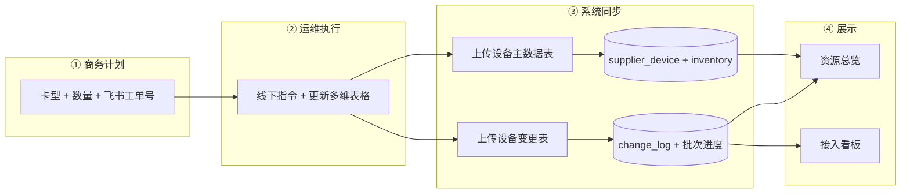
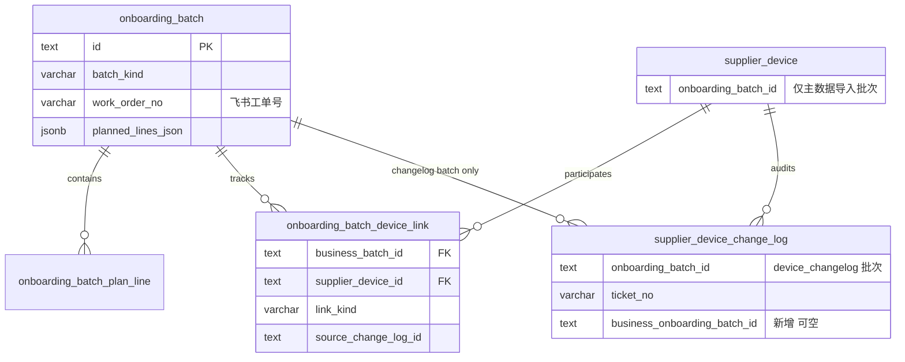

# 供应商接入计划 — 工单驱动与变更表进度跟踪方案

> 版本：v2.0（设计稿）  
> 日期：2026-05-23  
> 状态：**待实施**（替代 v1.1 中「设备 ↔ 业务批次」单 FK 假设）  
> 前置结论：**`supplier_device` 不得用 `onboarding_batch_id` 关联业务接入批次**；一设备在生命周期内会多次参与不同批次（机房上架、内部使用、下架等）。  
> 关联：[supplier-onboarding-quantity-tracking-design.md](./supplier-onboarding-quantity-tracking-design.md)（v1.1，部分作废）、[supplier-device-import-schema.md](./supplier-device-import-schema.md)、[supplier-database.md](./supplier-database.md)、`packages/db/src/supply-schema.ts`

---

## 1. 背景与问题

### 1.1 v1.1 设计的缺陷

v1.1 将 `supplier_device.onboarding_batch_id` 作为业务批次（`batch_kind=online|order_access`）的主关联键，并用 `COUNT(device WHERE onboarding_batch_id = 业务批次)` 计算进度。该模型在真实运维场景下 **不成立**：

| 场景 | 产生的批次 | 同一设备 |
|------|------------|----------|
| 机房上架 | 业务接入批次 A | 设备 D 参与 |
| 转内部使用 | 业务/运维批次 B | 设备 D 再次参与 |
| 下架退订 | 业务/运维批次 C | 设备 D 再次参与 |

因此：

- `supplier_device.onboarding_batch_id` **只能保留一种语义**（推荐：最近一次 **设备主数据导入** 批次，见 §4.2）；
- 业务计划进度 **必须** 通过 **工单号 + 设备变更表** 间接关联，而非设备表 FK。

### 1.2 当前业务流程（目标态）



| 步骤 | 角色 | 动作 | 系统 |
|------|------|------|------|
| 1 | 商务 | 填写 **卡型、数量、飞书审批工单号**（当前手动输入） | 创建 `onboarding_batch`（`online` / `order_access`），`batch_status=接入中` |
| 2 | 运维 | 线下执行，更新飞书多维表格 | — |
| 3 | 系统 | 先上传 **设备主数据表** → 设备表 + 库存表；再上传 **设备变更表** → 按工单关联计划批次，刷新进度 | `commitInventory` → `commitChangelog` |
| 4 | 全员 | 查看资源总览、接入看板 | 读模型聚合 |

**本期不做**：飞书多维表格 API 自动拉取（阶段三）；清单 CSV 可选路径降级为次要能力。

---

## 2. 目标与原则

### 2.1 业务目标

| # | 目标 | 说明 |
|---|------|------|
| G1 | 计划驱动 | 商务仅录 **卡型 × 数量 × 飞书工单号**，即可创建业务批次 |
| G2 | 设备主数据独立 | 主数据导入维护 `supplier_device` / `supplier_gpu_inventory`，不绑定业务批次 |
| G3 | 变更驱动进度 | 变更表导入按 **工单号** 关联业务批次，更新计划行进度与批次状态 |
| G4 | 设备多批次 | 同一设备可多次出现在不同业务批次的进度统计中（通过关联表 + 变更审计） |
| G5 | 双看板同步 | [supplier-overview-content.tsx](../../src/app/[locale]/(protected)/supplier/_components/supplier-overview-content.tsx)、[global/page.tsx](../../src/app/[locale]/(protected)/dashboard/global/page.tsx) 展示真实 DB 聚合 |
| G6 | 兼容导入体系 | 不破坏 `device_inventory` / `device_changelog` 批次语义与 `change_log.onboarding_batch_id` 审计 |

### 2.2 非目标（本期）

- 飞书审批 / 多维表格 Open API 对接
- 在计划创建时预生成占位设备
- 改造 `entity_state_transition_log`（Excel 导入仍不写）
- 自动推断「内部使用」「下架」的业务批次类型（可后续扩展 `batch_kind`）

### 2.3 设计原则

1. **三类批次语义分离**（沿用并强化 [supplier-device-import-schema.md §3.3](./supplier-device-import-schema.md)）：

   | `batch_kind` | 职责 |
   |--------------|------|
   | `online` / `order_access` | **商务计划批次**（数量 + 工单） |
   | `device_inventory` | **主数据同步批次** |
   | `device_changelog` | **变更流水导入批次** |

2. **工单号是业务桥接键**：`onboarding_batch.work_order_no` = 商务录入的飞书工单号；变更表 Excel「工单」列 `ticket_no` 与之匹配。

3. **进度可重建**：进度字段可由 `change_log` + 关联表 **重算**，避免与设备 FK 双写不一致。

4. **机房锚点不变**：`(supplier_id, data_center_id)` 约束计划批次与导入所选机房一致。

---

## 3. 核心模型：工单 + 变更表 + 关联表

### 3.1 关联拓扑（推荐）



### 3.2 字段语义修正

| 字段 | 正确语义 | 禁止用途 |
|------|----------|----------|
| `supplier_device.onboarding_batch_id` | 最近一次 **`device_inventory`** commit 的批次 ID | 指向 `online` / `order_access` 业务批次 |
| `supplier_device_change_log.onboarding_batch_id` | 本次 **`device_changelog`** 导入批次 ID | 指向业务批次 |
| `supplier_device_change_log.ticket_no` | Excel「工单」原文 | — |
| **`supplier_device_change_log.business_onboarding_batch_id`（新增）** | commit 时解析到的业务批次 ID | 替代改 `onboarding_batch_id` |
| `onboarding_batch.work_order_no` | **商务手动输入** 的飞书审批工单号 | 系统自动 `WO-{batchCode}`（v1.1 作废） |
| `onboarding_batch.parent_batch_id` | 仅 **导入批次** → 业务批次（可选，用于一次导入绑定） | 设备级归属 |

### 3.3 进度定义（业务批次）

对 `batch_kind IN ('online','order_access')` 的批次 `B`：

| 指标 | 定义 | 数据来源 |
|------|------|----------|
| **计划 `planned`** | `planned_device_count` 或计划行 `planned_quantity` 之和 | `onboarding_batch` / `onboarding_batch_plan_line` |
| **已触达 `touched`** | 本批次下 **至少有一条** 变更记录或关联表的 **去重设备数** | `onboarding_batch_device_link` 或 `change_log WHERE business_onboarding_batch_id = B` |
| **接入中 `onboarding`** | `touched` 中 `lifecycle_status IN ('待接入','接入中')` 的设备数 | `supplier_device` 当前状态 |
| **已上线 `online`** | `touched` 中 `lifecycle_status = '在线'` 的设备数 | `supplier_device` 当前状态 |
| **按卡型行进度** | 每计划行：按 `gpu_card_type_id` 过滤上述计数 | 计划行 + 设备卡型 |

**完成判定（可配置）**：

```
∀ 计划行: online_quantity >= planned_quantity
且 batch_status 由「接入中」→「已完成」
```

> **注意**：`online` 计数是「本批次曾触达且当前在线」而非全局在线设备总数；设备转内部使用后可能从本批次视角标记为完成或需人工结案（§7.4）。

---

## 4. 数据模型变更

### 4.1 `onboarding_batch`（业务计划批次）

**调整**：

| 列名 | 变更 | 说明 |
|------|------|------|
| `work_order_no` | **必填**（业务批次） | 飞书审批工单号；商务手动输入；`(supplier_id, work_order_no)` 唯一 |
| `planned_lines_json` | 结构简化 | 见 §4.1.1；**移除** `cooperation_type` 必填（商务计划不再录入） |
| `list_upload_mode` | 默认 `none` | 清单上传降为可选/废弃路径 |
| `parent_batch_id` | 保留 | 导入批次关联业务批次 |

**移除/废弃行为**：

- 创建时 **不再** 自动生成 `WO-{batchCode}`；
- `commitList` 简化清单路径 **不再** 作为进度主路径（可保留兼容，但不写 `supplier_device.onboarding_batch_id = 业务批次`）。

#### 4.1.1 `planned_lines_json` 元素（v2）

| 字段 | 类型 | 必填 | 说明 |
|------|------|------|------|
| `gpu_card_type_id` | text | 否 | FK → `gpu_card_type` |
| `gpu_card_type_code` | string | 是 | 卡型编码 |
| `planned_quantity` | integer | 是 | 计划台数，> 0 |

**唯一约束（应用层）**：同一批次内 `gpu_card_type_code` 唯一。

**可选**：拆表 `onboarding_batch_plan_line`（推荐 Phase 2，便于 SQL 聚合与行级冗余计数）。

| 列名 | 类型 | 说明 |
|------|------|------|
| `id` | text PK | |
| `onboarding_batch_id` | text FK | |
| `gpu_card_type_id` | text FK | |
| `planned_quantity` | integer | |
| `touched_quantity` | integer DEFAULT 0 | 变更/关联触达台数（冗余，commit 时刷新） |
| `online_quantity` | integer DEFAULT 0 | 当前在线台数（冗余） |

UK：`(onboarding_batch_id, gpu_card_type_id)`。

### 4.2 `supplier_device`（语义收紧）

| 列名 | 语义 |
|------|------|
| `onboarding_batch_id` | **仅** 指向最近一次 `device_inventory` 导入批次；文档与代码注释明确 |

**迁移**：

```sql
-- 将误指向 online/order_access 的 FK 置空（保留 inventory/changelog 指向）
UPDATE supplier_device d
SET onboarding_batch_id = NULL
FROM onboarding_batch b
WHERE d.onboarding_batch_id = b.id
  AND b.batch_kind IN ('online', 'order_access');
```

**代码**：删除 `commitChangelog` / `device-import-utils` 中 `deviceIdsToBind` 对 `supplier_device.onboarding_batch_id` 的回写。

### 4.3 `supplier_device_change_log`（新增业务批次引用）

| 列名 | 类型 | 约束 | 说明 |
|------|------|------|------|
| **`business_onboarding_batch_id`** | text | FK→`onboarding_batch`, 可空 | commit 时由 `ticket_no` 解析写入 |
| `onboarding_batch_id` | text | NOT NULL，不变 | **`device_changelog` 导入批次** |

索引：`(business_onboarding_batch_id)`、`(business_onboarding_batch_id, supplier_device_id)`。

**解析规则（commit 时）**：

```typescript
const businessBatch = await resolveBusinessBatchByTicketNo(supplierId, row.ticket_no)
// 匹配 work_order_no 或 batch_code（兼容历史填法）
log.business_onboarding_batch_id = businessBatch?.id ?? null
```

### 4.4 新增 `onboarding_batch_device_link`（设备 ↔ 业务批次 多对多）

解决「一设备多批次」进度统计与审计展示。

| 列名 | 类型 | 约束 | 说明 |
|------|------|------|------|
| `id` | text | PK | |
| `business_onboarding_batch_id` | text | FK→`onboarding_batch`, NOT NULL | 业务批次 |
| `supplier_device_id` | text | FK→`supplier_device`, NOT NULL | |
| `link_kind` | varchar(32) | NOT NULL | `touched` \| `online`（冗余快照，可选） |
| `source_change_log_id` | text | FK, 可空 | 首次触达的变更行 |
| `source_changelog_batch_id` | text | FK, 可空 | `device_changelog` 导入批次 |
| `gpu_card_type_id` | text | NOT NULL | 快照，便于计划行聚合 |
| `linked_at` | timestamptz | NOT NULL | |
| `created_at` | timestamptz | NOT NULL | |

索引：

- `(business_onboarding_batch_id, supplier_device_id)` — 查批次设备列表；
- `(supplier_device_id, linked_at DESC)` — 查设备参与过的业务批次。

**写入时机**：`commitChangelog` 中，当 `ticket_no` 命中业务批次且设备解析成功：

- `INSERT ... ON CONFLICT DO NOTHING`（或按业务规则更新 `link_kind`）；
- **不** 更新 `supplier_device.onboarding_batch_id`。

### 4.5 `onboarding_batch` 进度缓存（可选，推荐）

避免总览页每次全表扫描 `change_log`：

| 列名 | 类型 | 说明 |
|------|------|------|
| `touched_device_count` | integer DEFAULT 0 | 去重触达台数 |
| `online_device_count` | integer DEFAULT 0 | 触达且当前在线 |
| `progress_synced_at` | timestamptz | 上次刷新时间 |

由 `refreshBatchProgress(batchId)` 在每次相关 `commitChangelog` 后调用。

### 4.6 不修改的表

| 表 | 原因 |
|----|------|
| `supplier_gpu_inventory` | 仍由 `device_inventory` / 状态变更后重算 |
| `entity_state_transition_log` | Excel 导入不写 |
| `onboarding_batch_import_row` | 清单可选路径保留，非主路径 |

---

## 5. 端到端流程

### 5.1 路径 A：商务创建计划（主路径）

| 步骤 | 用户 | 系统 |
|------|------|------|
| 1 | 选供应商、机房、合同（可选）；添加上架计划行（**卡型 + 数量**）；填写 **飞书工单号** | 校验 `work_order_no` 在 supplier 内唯一 |
| 2 | 提交 | `INSERT onboarding_batch`：`batch_kind=online|order_access`，`planned_lines_json`，`planned_device_count`，`work_order_no`，`batch_status=接入中`，`import_status=none`，`list_upload_mode=none` |
| 3 | — | `INSERT supplier_activity`（`batch_started`） |
| 4 | — | **不** 创建 `supplier_device` |

**API 变更**：

```typescript
// onboardingBatch.create 增量
{
  planLines: { gpuCardTypeCode, plannedQuantity }[]  // 无 cooperationType
  workOrderNo: string  // 必填，飞书工单号
  uploadList?: false   // 默认 false
}
```

### 5.2 路径 B：设备主数据导入

```
commitInventory({ supplierId, dataCenterId, fileName, rows, parentBatchId?: businessBatchId })
```

| 行为 | 说明 |
|------|------|
| 新建 `device_inventory` 批次 | `parent_batch_id` 可指向业务批次（溯源） |
| INSERT/UPDATE `supplier_device` | `onboarding_batch_id` = **本次 inventory 批次 ID** |
| 刷新 `supplier_gpu_inventory` | 按机房×卡型重算 |
| **不写** `onboarding_batch_device_link` | 主数据不表示「本批次已上线 N 台」 |

**与业务批次关系**：仅通过 `parent_batch_id` 与活动流 metadata 记录「本次导入服务于哪张计划」，**不** 用设备 FK 计进度。

### 5.3 路径 C：设备变更表导入（进度主路径）

```
commitChangelog({ supplierId, dataCenterId, fileName, rows })
```

| 步骤 | 系统行为 |
|------|----------|
| 1 | 新建 `device_changelog` 批次 |
| 2 | 解析各行 `ticket_no` → `resolveSingleBusinessBatchFromRows`（已有 [changelog-business-batch-link.ts](../../src/lib/server/dataaccess/supplier/changelog-business-batch-link.ts)） |
| 3 | 每行写入 `supplier_device_change_log`：`onboarding_batch_id`=changelog 批次，`business_onboarding_batch_id`=解析结果，`ticket_no`=原文 |
| 4 | 更新设备 `ops_status` / `lifecycle_status`（既有逻辑） |
| 5 | 对命中业务批次的设备 `UPSERT onboarding_batch_device_link` |
| 6 | `refreshBatchProgress(businessBatchId)` 更新计划行/批次计数 |
| 7 | `INSERT supplier_activity`（`device_change_imported`，metadata 含 `business_batch_id`） |
| 8 | 刷新 `supplier_gpu_inventory` |

**机房校验 R-DC1**：设备 `data_center_id` 与业务批次 `data_center_id` 不一致时 **记 warning**，仍写 change_log，但不写 `device_link`（与现网 bindWarnings 一致）。

### 5.4 路径 D：读模型 — 资源总览

[`overview-stats.ts`](../../src/lib/supplier/overview-stats.ts) 改造要点：

| 模块 | 现状 | 目标 |
|------|------|------|
| `buildOnboardingBatchSummaries` | mock `committed_device_count` | 使用 `touched_device_count` / `online_device_count` / `planned_device_count` |
| `computeOverviewKpis.activeBatches` | 计数进行中批次 | 不变，数据源改 DB |
| 接入进度条（若有） | 按 device FK | 按 `getProgress(batchId)` 新语义 |
| 生命周期漏斗 | `supplier_device.lifecycle_status` | 保持；与批次进度解耦 |

**tRPC**：`supplier.onboardingBatch.list` / `getProgress` 供 `SupplierOverviewContent` 使用（替换 mock store 批次段）。

### 5.5 路径 E：读模型 — 接入看板（Global）

[`dashboard/global`](../../src/app/[locale]/(protected)/dashboard/global/page.tsx) 当前为静态 Mock，需新增服务端聚合：

| 卡片 | 数据源 |
|------|--------|
| `GlobalKpiSection` | 全平台 `supplier_gpu_inventory` + 进行中 `planned_device_count` 汇总 |
| `LifecycleFlowCard` | `supplier_device.lifecycle_status` 聚合（与供应商总览漏斗一致） |
| `GlobalTodosCard` | 进行中业务批次：`planned - online` 缺口、超期 `planned_ready_at` |
| `DiscrepancyTableCard` | 计划 vs 触达 vs 在线 差异（按供应商/机房） |

**新增 tRPC**（建议 `dashboard.globalOps`）：

| 过程 | 输出 |
|------|------|
| `getOnboardingPipeline` | 各 `batch_status` 批次数、计划台数、触达台数、在线台数 |
| `getPlanGaps` | `planned_quantity - online_quantity` Top N 计划行 |

---

## 6. 进度计算（实现参考）

### 6.1 `refreshBatchProgress(batchId)`

```sql
-- 触达设备（推荐以 link 表为准）
SELECT COUNT(DISTINCT l.supplier_device_id) AS touched
FROM onboarding_batch_device_link l
WHERE l.business_onboarding_batch_id = :batchId;

-- 触达且在线
SELECT COUNT(DISTINCT l.supplier_device_id) AS online
FROM onboarding_batch_device_link l
JOIN supplier_device d ON d.id = l.supplier_device_id
WHERE l.business_onboarding_batch_id = :batchId
  AND d.lifecycle_status = '在线';
```

### 6.2 按卡型计划行

```sql
SELECT
  pl.gpu_card_type_id,
  pl.planned_quantity,
  COUNT(DISTINCT l.supplier_device_id) AS touched,
  COUNT(DISTINCT l.supplier_device_id) FILTER (WHERE d.lifecycle_status = '在线') AS online
FROM onboarding_batch_plan_line pl
LEFT JOIN onboarding_batch_device_link l
  ON l.business_onboarding_batch_id = pl.onboarding_batch_id
 AND l.gpu_card_type_id = pl.gpu_card_type_id
LEFT JOIN supplier_device d ON d.id = l.supplier_device_id
WHERE pl.onboarding_batch_id = :batchId
GROUP BY pl.id, pl.gpu_card_type_id, pl.planned_quantity;
```

若 Phase 1 仍用 `planned_lines_json`，则在应用层按 `gpu_card_type_id` 分组聚合。

### 6.3 `getProgress` 返回结构（修订）

```typescript
type OnboardingBatchProgress = {
  planned: number
  touched: number      // 原 linked，改名避免歧义
  onboarding: number
  online: number
  planLines: Array<{
    gpu_card_type_code: string
    planned_quantity: number
    touched: number
    online: number
  }>
}
```

---

## 7. 业务规则汇总

| 编号 | 规则 |
|------|------|
| **R-PL1** | 商务计划至少一行；每行 `planned_quantity` 为正整数 |
| **R-PL2** | 同一业务批次内 `gpu_card_type_code` 唯一 |
| **R-PL3** | `planned_device_count = SUM(planned_quantity)`，服务端计算 |
| **R-WO1** | `work_order_no` 必填，为飞书审批工单号；`(supplier_id, work_order_no)` 唯一 |
| **R-WO2** | 变更表 `ticket_no` 应填写与计划相同的工单号；空则仅写 change_log，不更新业务进度 |
| **R-OB1** | 创建业务批次时 **不得** 创建 `supplier_device` |
| **R-DEV1** | `supplier_device.onboarding_batch_id` **仅** 指向 `device_inventory` 批次 |
| **R-DEV2** | **禁止** 通过设备 FK 统计业务批次进度 |
| **R-CL1** | `change_log.onboarding_batch_id` **仅** 指向 `device_changelog` 批次 |
| **R-CL2** | `change_log.business_onboarding_batch_id` 由 `ticket_no` 解析，可空 |
| **R-LINK1** | 命中工单且机房一致的变更行，写入 `onboarding_batch_device_link` |
| **R-LINK2** | 同一设备可存在多条 link（不同 `business_onboarding_batch_id`） |
| **R-DC1** | 导入匹配设备限定 `(supplier_id, data_center_id)` |
| **R-INV1** | inventory/changelog commit 后刷新 `supplier_gpu_inventory` |
| **R-ST1** | 设备状态以变更表为准；映射见 `OPS_STATUS_TO_LIFECYCLE` |

---

## 8. API 设计（tRPC 修订）

### 8.1 `supplier.onboardingBatch`

| 过程 | 变更 |
|------|------|
| `create` | 入参增加 **`workOrderNo`（必填）**；`planLines` 去掉 `cooperationType`；不再生成 `WO-{batchCode}` |
| `getProgress` | 返回 `touched` 替代 `linked`；数据源改为 `device_link` + 设备状态 |
| `getDetailPage` | 设备列表改为 `JOIN onboarding_batch_device_link`；变更时间线 `WHERE business_onboarding_batch_id = :id OR ticket_no = work_order_no` |
| `list` / `listBySupplier` | 附带 `touched_device_count`、`online_device_count` |

### 8.2 `supplier.deviceImport`

| 过程 | 变更 |
|------|------|
| `commitInventory` | 保留 `parentBatchId`；设备 `onboarding_batch_id` = inventory 批次 |
| `commitChangelog` | 写 `business_onboarding_batch_id`；维护 `device_link`；调用 `refreshBatchProgress`；**移除** `deviceIdsToBind` → `supplier_device.onboarding_batch_id` |
| `getContext` | 返回进行中业务批次（含 `work_order_no` 供运维对照） |

### 8.3 `dashboard.globalOps`（新增）

| 过程 | 说明 |
|------|------|
| `getKpis` | 全局 GPU / 在线 / 接入中 / 进行中计划台数 |
| `getOnboardingPipeline` | 接入管道统计 |
| `getLifecycleFunnel` | 全平台生命周期漏斗 |

---

## 9. UI 改造要点

| 位置 | 改造 |
|------|------|
| 上架/订单接入向导 | 上架计划：**卡型 + 数量**；**飞书工单号** 输入框（必填）；移除合作类型列（若产品确认）；去掉自动生成工单展示 |
| `onboarding-batches-content` / 批次详情 | 列：计划 / **已触达** / **已上线**；展示 `work_order_no`；变更时间线按 `business_onboarding_batch_id` |
| `supplier-device-import-panel` | 提示：变更表「工单」列填飞书工单号；主数据导入可选关联计划（`parentBatchId`） |
| `supplier-overview-content` | 接入批次区块接 tRPC；展示计划缺口 `planned - online` |
| `dashboard/global/*` | KPI / 生命周期 / 待办 接 `dashboard.globalOps` |

---

## 10. 实施分期

| 阶段 | 范围 | 交付 |
|------|------|------|
| **一** | Migration：`business_onboarding_batch_id`、`onboarding_batch_device_link`、进度缓存列；`work_order_no` 改手动必填；数据修复 SQL | Schema 就绪 |
| **二** | `commitChangelog` + `refreshBatchProgress`；`getProgress` / `getDetailPage` 修订；去掉 device FK 绑业务批次 | 变更导入驱动进度 |
| **三** | `onboardingBatch.create` API/UI（卡型+数量+工单）；废弃清单主路径 | 商务计划闭环 |
| **四** | `supplier-overview` 接真实数据 | 资源总览可用 |
| **五** | `dashboard.globalOps` + Global 看板组件 | 接入看板可用 |
| **六** | 可选：`onboarding_batch_plan_line` 拆表；飞书 API | 增强 |

---

## 11. 与 v1.1 差异对照

|  topic | v1.1 | v2.0（本文） |
|--------|------|--------------|
| 计划录入 | 卡型 + **合作类型** + 数量 | 卡型 + 数量 |
| 工单号 | 系统生成 `WO-{batchCode}` | **商务输入飞书工单号** |
| 进度 `linked` | `COUNT(device WHERE onboarding_batch_id=业务批次)` | **`device_link` / change_log 按工单触达** |
| `supplier_device.onboarding_batch_id` | 指向业务批次 | **仅 inventory 批次** |
| 清单 CSV | 可选主路径之一 | 降级兼容，非进度主路径 |
| 变更关联 | `ticket_no` + 设备 FK 回写 | `ticket_no` + **`business_onboarding_batch_id`** + **link 表** |

---

## 12. 风险与对策

| 风险 | 对策 |
|------|------|
| 运维变更表未填工单 | UI 强提示；进度为 0；活动流标记未关联 |
| 同一飞书工单重复建批次 | `(supplier_id, work_order_no)` 唯一约束 |
| 历史数据 device FK 指向业务批次 | 迁移 SQL 置空 + 一次性 backfill link 表（按 change_log.ticket_no） |
| 设备多次批次统计重复 | 按 **批次维度** 去重，非全平台去重 |
| 内部使用/下架后在线数下降 | 批次完成以「曾达计划数量」或人工结案为准；文档明确 |

---

## 13. 变更记录

| 版本 | 日期 | 说明 |
|------|------|------|
| v2.0 | 2026-05-23 | 作废设备 FK 关联业务批次；工单驱动 + 变更表进度；商务计划简化；总览/看板读模型 |
