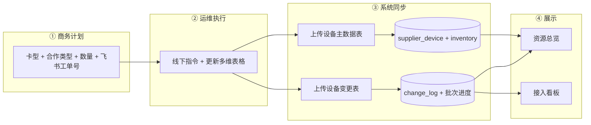
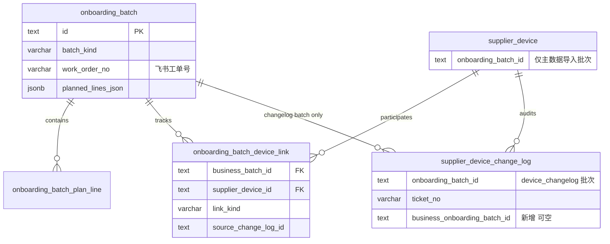
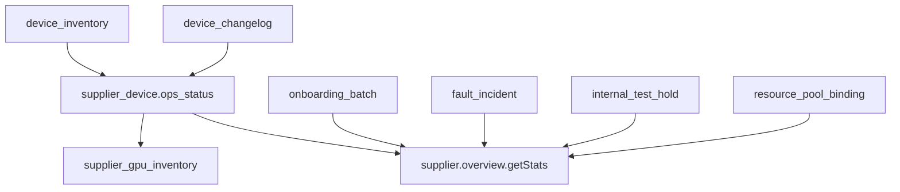

# 供应商接入计划 — 工单驱动与变更表进度跟踪方案

> 版本：v2.2.1（设计稿）  
> 日期：2026-05-23  
> 状态：**待实施**（替代 v1.1 中「设备 ↔ 业务批次」单 FK 假设）  
> 前置结论：**`supplier_device` 不得用 `onboarding_batch_id` 关联业务接入批次**；一设备在生命周期内会多次参与不同批次（机房上架、内部使用、下架等）。  
> 关联：[supplier-onboarding-quantity-tracking-design.md](./supplier-onboarding-quantity-tracking-design.md)（v1.1，部分作废）、[supplier-device-import-schema.md](./supplier-device-import-schema.md)、[supplier-database.md](./supplier-database.md)、`packages/db/src/supply-schema.ts`

---

## 1. 背景与问题

### 1.1 v1.1 设计的缺陷

v1.1 将 `supplier_device.onboarding_batch_id` 作为业务批次（`batch_kind=online|order_access`）的主关联键，并用 `COUNT(device WHERE onboarding_batch_id = 业务批次)` 计算进度。该模型在真实运维场景下 **不成立**：

| 场景 | 产生的批次 | 同一设备 |
|------|------------|----------|
| 机房上架 | 业务接入批次 A | 设备 D 参与 |
| 转内部使用 | 业务/运维批次 B | 设备 D 再次参与 |
| 下架退订 | 业务/运维批次 C | 设备 D 再次参与 |

因此：

- `supplier_device.onboarding_batch_id` **只能保留一种语义**（推荐：最近一次 **设备主数据导入** 批次，见 §4.2）；
- 业务计划进度 **必须** 通过 **工单号 + 设备变更表** 间接关联，而非设备表 FK。

### 1.2 当前业务流程（目标态）



| 步骤 | 角色 | 动作 | 系统 |
|------|------|------|------|
| 1 | 商务 | 填写 **卡型、合作类型、数量、飞书审批工单号**（当前手动输入） | 创建 `onboarding_batch`（`online` / `order_access`），`planned_lines_json` 含完整计划行，`batch_status=接入中` |
| 2 | 运维 | 线下执行，更新飞书多维表格 | — |
| 3 | 系统 | 先上传 **设备主数据表** → 设备表 + 库存表；再上传 **设备变更表** → 按工单关联计划批次，刷新进度 | `commitInventory` → `commitChangelog` |
| 4 | 全员 | 查看资源总览、接入看板 | 读模型聚合 |

**本期不做**：飞书多维表格 API 自动拉取（阶段三）；清单 CSV 可选路径降级为次要能力。

---

## 2. 目标与原则

### 2.1 业务目标

| # | 目标 | 说明 |
|---|------|------|
| G1 | 计划驱动 | 商务录 **卡型 × 合作类型 × 数量 × 飞书工单号**（一行计划 = 三者 + 工单在批次级），即可创建业务批次 |
| G2 | 设备主数据独立 | 主数据导入维护 `supplier_device` / `supplier_gpu_inventory`，不绑定业务批次 |
| G3 | 变更驱动进度 | 变更表导入按 **工单号** 关联业务批次，更新计划行进度与批次状态 |
| G4 | 设备多批次 | 同一设备可多次出现在不同业务批次的进度统计中（通过关联表 + 变更审计） |
| G5 | 双看板同步 | [supplier-overview-content.tsx](../../src/app/[locale]/(protected)/supplier/_components/supplier-overview-content.tsx)、[global/page.tsx](../../src/app/[locale]/(protected)/dashboard/global/page.tsx) 展示真实 DB 聚合 |
| G6 | 兼容导入体系 | 不破坏 `device_inventory` / `device_changelog` 批次语义与 `change_log.onboarding_batch_id` 审计 |
| G7 | 状态全量落库 | 运维 **设备状态**（`ops_status`）与变更表 **变更动作**（`change_action`）均入字典表 + 业务表原文，支撑资源总览多维统计 |

### 2.2 非目标（本期）

- 飞书审批 / 多维表格 Open API 对接
- 在计划创建时预生成占位设备
- 改造 `entity_state_transition_log`（Excel 导入仍不写）
- 自动推断「内部使用」「下架」的业务批次类型（可后续扩展 `batch_kind`）

### 2.3 设计原则

1. **三类批次语义分离**（沿用并强化 [supplier-device-import-schema.md §3.3](./supplier-device-import-schema.md)）：

   | `batch_kind` | 职责 |
   |--------------|------|
   | `online` / `order_access` | **商务计划批次**（卡型×合作类型×数量 + 工单） |
   | `device_inventory` | **主数据同步批次** |
   | `device_changelog` | **变更流水导入批次** |

2. **工单号是业务桥接键**：`onboarding_batch.work_order_no` = 商务录入的飞书工单号；变更表 Excel「工单」列 `ticket_no` 与之匹配。

3. **进度可重建**：进度字段可由 `change_log` + 关联表 **重算**，避免与设备 FK 双写不一致。

4. **机房锚点不变**：`(supplier_id, data_center_id)` 约束计划批次与导入所选机房一致。

---

## 3. 核心模型：工单 + 变更表 + 关联表

### 3.1 关联拓扑（推荐）



### 3.2 字段语义修正

| 字段 | 正确语义 | 禁止用途 |
|------|----------|----------|
| `supplier_device.onboarding_batch_id` | 最近一次 **`device_inventory`** commit 的批次 ID | 指向 `online` / `order_access` 业务批次 |
| `supplier_device_change_log.onboarding_batch_id` | 本次 **`device_changelog`** 导入批次 ID | 指向业务批次 |
| `supplier_device_change_log.ticket_no` | Excel「工单」原文 | — |
| **`supplier_device_change_log.business_onboarding_batch_id`（新增）** | commit 时解析到的业务批次 ID | 替代改 `onboarding_batch_id` |
| `onboarding_batch.work_order_no` | **商务手动输入** 的飞书审批工单号 | 系统自动 `WO-{batchCode}`（v1.1 作废） |
| `onboarding_batch.parent_batch_id` | 仅 **导入批次** → 业务批次（可选，用于一次导入绑定） | 设备级归属 |

### 3.3 进度定义（业务批次）

对 `batch_kind IN ('online','order_access')` 的批次 `B`：

| 指标 | 定义 | 数据来源 |
|------|------|----------|
| **计划 `planned`** | `planned_device_count` 或计划行 `planned_quantity` 之和 | `onboarding_batch` / `onboarding_batch_plan_line` |
| **已触达 `touched`** | 本批次下 **至少有一条** 变更记录或关联表的 **去重设备数** | `onboarding_batch_device_link` 或 `change_log WHERE business_onboarding_batch_id = B` |
| **接入中 `onboarding`** | `touched` 中 `lifecycle_status IN ('待接入','接入中')` 的设备数 | `supplier_device` 当前状态 |
| **已上线 `online`** | `touched` 中 `lifecycle_status = '在线'` 的设备数 | `supplier_device` 当前状态 |
| **按计划行进度** | 每计划行：按 `(gpu_card_type_id, cooperation_type)` 过滤上述计数 | 计划行 + 设备 `gpu_card_type_id` + `cooperation_type` |

**完成判定（可配置）**：

```
∀ 计划行: online_quantity >= planned_quantity
且 batch_status 由「接入中」→「已完成」
```

> **注意**：`online` 计数是「本批次曾触达且当前在线」而非全局在线设备总数；设备转内部使用后可能从本批次视角标记为完成或需人工结案（§12 风险）。

---

### 3.4 运维状态与变更动作字典（全量落库）

与 [supplier-device-import-schema.md §2](./supplier-device-import-schema.md) 对齐并 **补全** v2.1 缺失：资源总览所需「裸金属 / 线下交付 / 待下架」等列不能仅靠 CRM `lifecycle_status` 六元组，必须保留 **`ops_status` 原文** 并按字典映射到总览分桶。

#### 3.4.1 设备状态 `ops_status`（设备主数据 + 变更刷新）

**落库**：

| 层 | 表/字段 | 说明 |
|----|---------|------|
| 字典 | `lifecycle_state_definition`，`domain = device_ops_status` | `state_code` = Excel 原文（与下表一致）；`display_name` 同原文；`sort_order` 供总览排序 |
| 扩展元数据 | 同上，建议 `payload` jsonb | 见下表 `overview_bucket`、`lifecycle_status`、`tags` |
| 业务 | `supplier_device.ops_status` | NOT NULL，存 **原文**；导入/变更 commit 时写入 |
| 派生 | `supplier_device.lifecycle_status` | 由 `ops_status` + `in_maintenance` 计算（§3.4.3） |

**种子数据（11 种，与用户提供的设备状态一致）**：

| `state_code`（原文） | `lifecycle_status` | `overview_bucket` | `tags` | 总览语义 |
|----------------------|-------------------|-------------------|--------|----------|
| `预留闲置中` | `待接入` | `reserved` | — | 已入库未调度 |
| `在集群中` | `在线` | `in_cluster` | `sellable_candidate` | 可售候选 |
| `集群组件运行中` | `在线` | `in_cluster` | `sellable_candidate` | 可售候选 |
| `网关直连裸金属上架中` | `接入中` | `bare_metal_onboarding` | `bare_metal` | **裸金属** 上架流水线 |
| `网关代理裸金属上架中` | `接入中` | `bare_metal_onboarding` | `bare_metal` | **裸金属** 上架流水线 |
| `线下裸金属交付中` | `接入中` | `offline_delivery` | `bare_metal` | **线下交付** |
| `其他部门使用中` | `维护中` | `other_dept` | `not_sellable` | 占用不可售 |
| `不可调度节点运行中` | `在线` | `in_cluster` | `online_not_sellable` | 计在线，**不计可售**（与 import-schema §6 一致） |
| `网关节点上架中` | `接入中` | `gateway_onboarding` | — | 网关节点接入 |
| `已退订` | `退订` | `retired` | — | **待下架/已退订** 池 |

> `overview_bucket` 为应用层枚举（varchar），可存于 `payload.overview_bucket`，供 `supplier.overview` 聚合 SQL `CASE` 使用，**不要求**单独加列。

#### 3.4.2 变更动作 `change_action`（设备变更表）

**落库**：

| 层 | 表/字段 | 说明 |
|----|---------|------|
| 字典 | `lifecycle_state_definition`，`domain = device_change_action` | `state_code` = 变更动作原文 |
| 审计 | `supplier_device_change_log.change_action` | NOT NULL，存 **原文** |
| 快照 | `change_log.previous_*` / `new_*` | commit 时写入 ops/lifecycle 前后值 |

**种子数据（20 种）**：

| `state_code`（变更动作原文） |
|----------------------------|
| `设备接收` |
| `加入集群` |
| `配置变更` |
| `故障维修` |
| `维护结束` |
| `状态更新` |
| `带宽组调整` |
| `带宽限制调整` |
| `上架接入平台网关` |
| `上架单机模式裸金属` |
| `上架网关代理裸金属` |
| `上架网关直连裸金属` |
| `下架裸金属` |
| `线下裸金属交付` |
| `集群角色增加` |
| `集群角色删除` |
| `设备退订` |
| `非常规下线` |
| `交给其他部门使用` |

解析：`parseDeviceChangelog` 对不在字典中的动作 → `parse_status=warning`（与未知 `ops_status` 一致），**仍允许 commit** 并落库原文。

#### 3.4.3 `ops_status` ↔ `lifecycle_status` 映射（统一函数）

与代码 `resolveLifecycleStatus` / `OPS_STATUS_TO_LIFECYCLE` 保持一致；`in_maintenance = true` 时 **覆盖** 为 `维护中`。

```typescript
// 单一来源：DB 字典 device_ops_status 加载为 Map，或常量 OPS_STATUS_TO_LIFECYCLE 与种子同步
function resolveLifecycleStatus(opsStatus: string, inMaintenance: boolean): LifecycleStatus {
  if (inMaintenance) return '维护中'
  return OPS_STATUS_TO_LIFECYCLE[opsStatus] ?? '待接入'
}
```

#### 3.4.4 变更动作 → 设备状态（`commitChangelog` 增强）

当前实现仅从 `change_content` 含「设备状态」或 `change_action` 含「状态」时解析（过窄）。v2.2 增加 **动作级默认映射**（变更内容无状态时生效；有状态则仍以内容为准）：

| `change_action` | 默认 `ops_status` | 备注 |
|-----------------|-------------------|------|
| `设备接收` | `预留闲置中` | |
| `加入集群` | `在集群中` | |
| `配置变更` / `带宽组调整` / `带宽限制调整` | *不变* | 仅记 change_log |
| `故障维修` | *不变* | 可配合 `in_maintenance=true`（若变更内容含维修中） |
| `维护结束` | *不变* | |
| `状态更新` | 从 `change_content` 解析 | |
| `上架接入平台网关` | `网关节点上架中` | |
| `上架单机模式裸金属` | `网关直连裸金属上架中` | 与直连上架同桶 |
| `上架网关代理裸金属` | `网关代理裸金属上架中` | |
| `上架网关直连裸金属` | `网关直连裸金属上架中` | |
| `下架裸金属` | `预留闲置中` | 下架后回闲置；若内容有状态则以内容为准 |
| `线下裸金属交付` | `线下裸金属交付中` | **线下交付** |
| `集群角色增加` / `集群角色删除` | *不变* | 更新 `compute_node` |
| `设备退订` | `已退订` | |
| `非常规下线` | `已退订` | `lifecycle_status=退订`；总览计入「待下架」 |
| `交给其他部门使用` | `其他部门使用中` | |

实现位置：`device-import-utils.ts` → `applyChangelogRows`；字典表 `device_change_action.payload.default_ops_status` 可配置化（Phase 2）。

---

## 4. 数据模型变更

> **Drizzle 实现**：`packages/db/src/supply-schema.ts`（表定义）、`packages/db/src/supply-lifecycle-dictionary.ts`（字典种子常量）。  
> 本文档描述逻辑约束；**无需单独 migration 文件时**，以 schema 为准由团队自行生成迁移。

### 4.0 `lifecycle_state_definition`（字典扩展）✅

| 列名 | 类型 | 说明 |
|------|------|------|
| `domain` | varchar(32) | `device_ops_status` \| `device_change_action` |
| `state_code` | varchar(64) | Excel 原文 |
| `display_name` | varchar(128) | 展示文案 |
| `sort_order` | integer | 总览排序 |
| **`payload`** | jsonb | `device_ops_status`: `{ lifecycle_status, overview_bucket, tags? }`；`device_change_action`: `{ default_ops_status?, updates_compute_node? }` |

索引：`(domain, state_code)` UK；`(domain)`。

种子数据见 `supply-lifecycle-dictionary.ts`（11 + 20 条，与 §3.4 一致）。

### 4.1 `onboarding_batch`（业务计划批次）✅

**增量列**（`onboardingBatch`）：

| 列名 | 类型 | 说明 |
|------|------|------|
| `work_order_no` | varchar(64) | 飞书工单号；UK `(supplier_id, work_order_no)` WHERE NOT NULL |
| `planned_lines_json` | jsonb | 见 §4.1.1 |
| `touched_device_count` | integer DEFAULT 0 | 进度缓存 |
| `online_device_count` | integer DEFAULT 0 | 进度缓存 |
| `progress_synced_at` | timestamptz | 上次刷新 |
| `parent_batch_id` | text FK | 自引用 `onboarding_batch`，导入批次 → 业务批次 |

**移除/废弃行为**：

- 创建时 **不再** 自动生成 `WO-{batchCode}`；
- `commitList` 简化清单路径 **不再** 作为进度主路径（可保留兼容，但不写 `supplier_device.onboarding_batch_id = 业务批次`）。

#### 4.1.1 `planned_lines_json` 元素（v2）

与 v1.1 / 现有 `supply-schema.ts` 保持一致；**一行计划 = 卡型 + 合作类型 + 数量**。

| 字段 | 类型 | 必填 | 说明 |
|------|------|------|------|
| `gpu_card_type_id` | text | 否 | FK → `gpu_card_type` |
| `gpu_card_type_code` | string | 是 | 卡型编码，如 `A100-80G` |
| **`cooperation_type`** | string | 是 | `idle_time`（闲时合作）\| `whole_rent`（整租合作） |
| `planned_quantity` | integer | 是 | 本行计划台数，> 0 |

**唯一约束（应用层 R-PL2）**：同一批次内 **`(gpu_card_type_code, cooperation_type)` 组合唯一**。

```json
[
  {
    "gpu_card_type_code": "A100-80G",
    "cooperation_type": "idle_time",
    "planned_quantity": 10
  },
  {
    "gpu_card_type_code": "H100-80G",
    "cooperation_type": "whole_rent",
    "planned_quantity": 8
  }
]
```

**拆表 `onboarding_batch_plan_line`**（✅ 已实现，与 `planned_lines_json` 可双写）：

| Drizzle 导出 | PG 表名 |
|--------------|---------|
| `onboardingBatchPlanLine` | `onboarding_batch_plan_line` |

| 列名 | 类型 | 说明 |
|------|------|------|
| `id` | text PK | |
| `onboarding_batch_id` | text FK | → `onboarding_batch` CASCADE |
| `gpu_card_type_id` | text FK | |
| `cooperation_type` | varchar(32) | `idle_time` \| `whole_rent` |
| `planned_quantity` | integer | |
| `touched_quantity` | integer DEFAULT 0 | |
| `online_quantity` | integer DEFAULT 0 | |
| `created_at` / `updated_at` | timestamptz | |

UK：`(onboarding_batch_id, gpu_card_type_id, cooperation_type)`。

### 4.2 `supplier_device`（语义收紧）

| 列名 | 语义 |
|------|------|
| `onboarding_batch_id` | **仅** 指向最近一次 `device_inventory` 导入批次；文档与代码注释明确 |

**迁移**：

```sql
-- 将误指向 online/order_access 的 FK 置空（保留 inventory/changelog 指向）
UPDATE supplier_device d
SET onboarding_batch_id = NULL
FROM onboarding_batch b
WHERE d.onboarding_batch_id = b.id
  AND b.batch_kind IN ('online', 'order_access');
```

**代码**：删除 `commitChangelog` / `device-import-utils` 中 `deviceIdsToBind` 对 `supplier_device.onboarding_batch_id` 的回写。

### 4.3 `supplier_device_change_log`（业务批次引用）✅

| 列名 | Drizzle 字段 | 约束 | 说明 |
|------|--------------|------|------|
| `business_onboarding_batch_id` | `businessOnboardingBatchId` | FK→`onboarding_batch`, 可空 | `ticket_no` 解析 |
| `onboarding_batch_id` | `onboardingBatchId` | NOT NULL | **`device_changelog` 导入批次** |
| `change_action` | `changeAction` | NOT NULL | 字典 `device_change_action` 原文 |

索引：`business_onboarding_batch_id`、`(business_onboarding_batch_id, supplier_device_id)`。

**解析规则（commit 时）**：

```typescript
const businessBatch = await resolveBusinessBatchByTicketNo(supplierId, row.ticket_no)
// 匹配 work_order_no 或 batch_code（兼容历史填法）
log.business_onboarding_batch_id = businessBatch?.id ?? null
```

### 4.4 `onboarding_batch_device_link`（设备 ↔ 业务批次 多对多）✅

| Drizzle 导出 | PG 表名 |
|--------------|---------|
| `onboardingBatchDeviceLink` | `onboarding_batch_device_link` |

| 列名 | 类型 | 约束 | 说明 |
|------|------|------|------|
| `id` | text | PK | |
| `business_onboarding_batch_id` | text | FK NOT NULL | 业务批次 |
| `supplier_device_id` | text | FK NOT NULL | |
| `link_kind` | varchar(32) | DEFAULT `touched` | |
| `source_change_log_id` | text | 可空 | 无 FK（避免与 change_log 插入顺序循环） |
| `source_changelog_batch_id` | text | FK 可空 | changelog 导入批次 |
| `gpu_card_type_id` | text | NOT NULL | 计划行聚合快照 |
| `cooperation_type` | varchar(32) | NOT NULL | |
| `linked_at` | timestamptz | NOT NULL | |
| `created_at` | timestamptz | NOT NULL | |

UK：`(business_onboarding_batch_id, supplier_device_id)`。

**写入时机**：`commitChangelog` 中，当 `ticket_no` 命中业务批次且设备解析成功：

- `INSERT ... ON CONFLICT DO NOTHING`（或按业务规则更新 `link_kind`）；
- **不** 更新 `supplier_device.onboarding_batch_id`。

### 4.5 进度缓存列

已合并入 `onboarding_batch`（§4.1）。由 `refreshBatchProgress(batchId)` 在 `commitChangelog` 后刷新。

### 4.6 Drizzle 表清单（v2.2 增量）

| 表 | 变更类型 |
|----|----------|
| `lifecycle_state_definition` | ALTER：+`payload`，+`domain` 索引 |
| `onboarding_batch` | ALTER：+进度缓存、+`parent_batch_id` FK、+`work_order_no` UK |
| `onboarding_batch_plan_line` | **CREATE** |
| `onboarding_batch_device_link` | **CREATE** |
| `supplier_device_change_log` | ALTER：+`business_onboarding_batch_id` |
| `supplier_device` | 注释收紧；+`cooperation_type` 索引 |

### 4.7 不修改的表

| 表 | 原因 |
|----|------|
| `supplier_gpu_inventory` | 仍由 `device_inventory` / 状态变更后重算 |
| `entity_state_transition_log` | Excel 导入不写 |
| `onboarding_batch_import_row` | 清单可选路径保留，非主路径 |

---

## 5. 端到端流程

### 5.1 路径 A：商务创建计划（主路径）

| 步骤 | 用户 | 系统 |
|------|------|------|
| 1 | 选供应商、机房、合同（可选）；添加上架计划行（**卡型 + 合作类型 + 数量**）；填写 **飞书工单号** | 校验 `work_order_no` 在 supplier 内唯一；校验计划行 `(gpu_card_type_code, cooperation_type)` 唯一 |
| 2 | 提交 | `INSERT onboarding_batch`：`batch_kind=online|order_access`，`planned_lines_json`，`planned_device_count`，`work_order_no`，`batch_status=接入中`，`import_status=none`，`list_upload_mode=none` |
| 3 | — | `INSERT supplier_activity`（`batch_started`） |
| 4 | — | **不** 创建 `supplier_device` |

**API 变更**：

```typescript
// onboardingBatch.create 增量
{
  planLines: {
    gpuCardTypeCode: string
    cooperationType: 'idle_time' | 'whole_rent'
    plannedQuantity: number
  }[]
  workOrderNo: string  // 必填，飞书工单号
  uploadList?: false   // 默认 false
}
```

### 5.2 路径 B：设备主数据导入

```
commitInventory({ supplierId, dataCenterId, fileName, rows, parentBatchId?: businessBatchId })
```

| 行为 | 说明 |
|------|------|
| 新建 `device_inventory` 批次 | `parent_batch_id` 可指向业务批次（溯源） |
| INSERT/UPDATE `supplier_device` | `onboarding_batch_id` = **本次 inventory 批次 ID** |
| 刷新 `supplier_gpu_inventory` | 按机房×卡型重算 |
| **不写** `onboarding_batch_device_link` | 主数据不表示「本批次已上线 N 台」 |

**与业务批次关系**：仅通过 `parent_batch_id` 与活动流 metadata 记录「本次导入服务于哪张计划」，**不** 用设备 FK 计进度。

### 5.3 路径 C：设备变更表导入（进度主路径）

```
commitChangelog({ supplierId, dataCenterId, fileName, rows })
```

| 步骤 | 系统行为 |
|------|----------|
| 1 | 新建 `device_changelog` 批次 |
| 2 | 解析各行 `ticket_no` → `resolveSingleBusinessBatchFromRows`（已有 [changelog-business-batch-link.ts](../../src/lib/server/dataaccess/supplier/changelog-business-batch-link.ts)） |
| 3 | 每行写入 `supplier_device_change_log`：`onboarding_batch_id`=changelog 批次，`business_onboarding_batch_id`=解析结果，`ticket_no`=原文 |
| 4 | 更新设备 `ops_status` / `lifecycle_status`（既有逻辑） |
| 5 | 对命中业务批次的设备 `UPSERT onboarding_batch_device_link` |
| 6 | `refreshBatchProgress(businessBatchId)` 更新计划行/批次计数 |
| 7 | `INSERT supplier_activity`（`device_change_imported`，metadata 含 `business_batch_id`） |
| 8 | 刷新 `supplier_gpu_inventory` |

**机房校验 R-DC1**：设备 `data_center_id` 与业务批次 `data_center_id` 不一致时 **记 warning**，仍写 change_log，但不写 `device_link`（与现网 bindWarnings 一致）。

### 5.4 路径 D：读模型 — 资源总览（`/supplier/overview`）

页面：[supplier-overview-content.tsx](../../src/app/[locale]/(protected)/supplier/_components/supplier-overview-content.tsx)  
聚合实现：[overview-stats.ts](../../src/lib/supplier/overview-stats.ts)（逐步废弃 Mock，改服务端一次查询）

**原则**：

1. **L1 库存**（机房×卡型）：`supplier_gpu_inventory`（主数据 commit 后 `refreshSupplierGpuInventory`）。
2. **L2 物理机**：`supplier_device` 按 `ops_status` / `lifecycle_status` / `gpu_count` 聚合。
3. **计划态**：`onboarding_batch` 仅驱动「活跃批次数 / 批次列表 / 计划缺口」，**不**替代 L2 在线数。
4. **可售**：`online_gpu − internal_test − fault_down − ops_not_sellable`（见 §5.4.2）。



#### 5.4.1 顶部 KPI 卡片（6 项）

| KPI | 单位 | 聚合口径（GPU 卡数 = Σ `gpu_count`） |
|-----|------|--------------------------------------|
| GPU 总量 | 卡 | `SUM(inventory.quantity)` + 可选：未入库仅 `lifecycle∈{待接入,接入中}` 的设备（与现 Mock 一致） |
| 在线 GPU | 卡 | `SUM(inventory.online_quantity)` 或 L2：`ops_status` 映射后 `lifecycle=在线` 且非 `不可调度…` 且非 `in_maintenance` |
| 接入中 | 卡 | L2：`lifecycle_status IN ('待接入','接入中')` **或** `overview_bucket IN (bare_metal_onboarding, gateway_onboarding, offline_delivery)` |
| 维护 / 故障 | 卡 | L2：`lifecycle=维护中` 或 `in_maintenance`；hint = 未关闭 `fault_incident` **条数** |
| 内部测试占用 | 卡 | `internal_test_hold` + `supplier_gpu_inventory.is_internal_test` |
| 可售 GPU | 卡 | §5.4.2 公式；hint = 可售率 |

#### 5.4.2 可售量公式（与 import-schema §6 对齐）

```
sellable_gpu =
  online_gpu
  − internal_test_gpu
  − fault_down_gpu
  − other_dept_gpu

其中：
  online_gpu：lifecycle=在线 且 in_maintenance=false 且 ops_status≠不可调度节点运行中
  other_dept_gpu：ops_status=其他部门使用中 的 GPU（即使 lifecycle 映射为维护中，也单独扣减展示）
```

#### 5.4.3 物理机生命周期漏斗（左栏）

按 CRM **`lifecycle_status`** 分桶（6 段），与接入计划进度 **解耦**：

| 阶段 | 包含 `lifecycle_status` |
|------|-------------------------|
| 待接入 | `待接入` |
| 接入中 | `接入中` |
| 在线 | `在线` |
| 维护中 | `维护中` |
| 离线 | `离线` |
| 下线中 | `下线中` |

每段展示：`gpuCount`（Σ `gpu_count`）、`deviceCount`（台数）。`接入中` 数量 > 0 时 `warn=true`。

#### 5.4.4 运维状态管道（建议 v2.2 新增折叠区，可选）

在漏斗下方增加 **按 `ops_status` 原文** 的细分条（数据来自字典 `device_ops_status`），用于运维对照多维表格：

| 展示分组 | 包含 `ops_status` |
|----------|-------------------|
| 裸金属上架中 | `网关直连裸金属上架中`、`网关代理裸金属上架中` |
| 线下交付 | `线下裸金属交付中` |
| 网关上架 | `网关节点上架中` |
| 其他 | 其余非退订状态 |

#### 5.4.5 供应商维度汇总表（右栏）

**表头与数据列对齐**（修正现 UI 表头/单元格顺序不一致问题）：

| 列 | 字段 | 聚合口径 |
|----|------|----------|
| 供应商 | `supplierName` | `supplier` |
| 机房 | `regionCount` | 该供应商库存行 `data_center` 去重区域数 |
| 总量 | `totalGpu` | Σ `supplier_gpu_inventory.quantity` |
| 在线 | `onlineGpu` | Σ `online_quantity` |
| 可售 | `sellableGpu` | §5.4.2 按供应商汇总 |
| 活跃批次 | `activeBatches` | `COUNT(onboarding_batch)`，`batch_kind∈(online,order_access)` 且 `batch_status` 进行中 |
| 未关闭故障 | `openFaults` | `COUNT(fault_incident)` 未关闭 |
| 维护中 | `maintenanceGpu` | Σ `gpu_count` WHERE `lifecycle=维护中` OR `in_maintenance` |
| 待接入 | `pendingOnboardingGpu` | Σ `gpu_count` WHERE `lifecycle IN (待接入,接入中)` **或** `ops_status=预留闲置中` |
| 待下架 | `pendingRetireGpu` | Σ `gpu_count` WHERE `lifecycle=下线中` OR `ops_status=已退订` |
| 内部占用 | `internalTestGpu` | hold + 库存测试标记 |
| 线下交付 | `offlineDeliveryGpu` | Σ `gpu_count` WHERE `ops_status=线下裸金属交付中` |
| 裸金属上架中 | `bareMetalOnboardingGpu` | Σ `gpu_count` WHERE `ops_status IN (网关直连裸金属上架中, 网关代理裸金属上架中)` |
| 弹性服务 | `elasticServiceGpu` | Σ `gpu_count` 的设备存在 `resource_pool_binding.pool_code='platform'`（或 `workload_profile=elastic_service`） |
| 裸金属池 | `bareMetalPoolGpu` | 绑定 `pool_code` 为裸金属池的设备 GPU（与弹性互斥去重规则见 §5.4.6） |

> **说明**：裸金属/弹性两列来自 **资源池绑定**，与 `ops_status` 裸金属上架流水线 **并存**（一台设备可「上架中」且已划入某 pool）；总览展示为两个不同视角，不在 v2.2 强行合并为一列。

#### 5.4.6 机房 × 卡型库存表（下方全宽）

| 列 | 数据源 |
|----|--------|
| 总量 / 在线 / 维护 / 测试占用 / 可售 | `supplier_gpu_inventory` + §5.4.2 |
| 裸金属 / 弹性服务 | 该机房×卡型下设备 JOIN `resource_pool_binding` 汇总 |
| 状态 Badge | `supplier_gpu_inventory.status`（`online/offline/maintenance`） |

#### 5.4.7 接入批次侧栏 / 列表

| 字段 | 数据源 |
|------|--------|
| 批次号、机房、状态 | `onboarding_batch` |
| 计划台数 | `planned_device_count` |
| 进度 | `getProgress` → `touched` / `online`（**非**供应商表「在线」列） |
| 缺口 | `planned − online`（批次维度） |

#### 5.4.8 tRPC `supplier.overview`（新增）

| 过程 | 输出 |
|------|------|
| `getStats` | `{ kpis, lifecycleFunnel, opsPipeline?, supplierRows, inventoryRows, batchSummaries, faultSla }` |
| `getFilterOptions` | 区域、供应商、卡型、资源池（来自 DB） |

**`getStats` 实现要点**：

- 单次查询按 `supplier_id` 聚合 `supplier_device`（带 `ops_status` 分桶 CASE）。
- JOIN `supplier_gpu_inventory` 得 L1 表。
- 批次段调用 `onboardingBatch.list` 或内联 SQL。
- 替换 `useSupplierDomainMockStore` 中 overview 相关片段。

**与 v2.1 接入设计的关系**：

| 总览指标 | 是否用 `onboarding_batch_device_link` |
|----------|--------------------------------------|
| 供应商表「在线/可售/裸金属/线下交付」等 | **否**，用 `supplier_device` 当前态 |
| 活跃批次数、批次列表、计划缺口 | **是**，用批次 + `getProgress` |

### 5.5 路径 E：读模型 — 接入看板（Global）

[`dashboard/global`](../../src/app/[locale]/(protected)/dashboard/global/page.tsx) 当前为静态 Mock，需新增服务端聚合：

| 卡片 | 数据源 |
|------|--------|
| `GlobalKpiSection` | 全平台 `supplier_gpu_inventory` + 进行中 `planned_device_count` 汇总 |
| `LifecycleFlowCard` | `supplier_device.lifecycle_status` 聚合（与供应商总览漏斗一致） |
| `GlobalTodosCard` | 进行中业务批次：`planned - online` 缺口、超期 `planned_ready_at` |
| `DiscrepancyTableCard` | 计划 vs 触达 vs 在线 差异（按供应商/机房） |

**新增 tRPC**（建议 `dashboard.globalOps`）：

| 过程 | 输出 |
|------|------|
| `getOnboardingPipeline` | 各 `batch_status` 批次数、计划台数、触达台数、在线台数 |
| `getPlanGaps` | `planned_quantity - online_quantity` Top N 计划行 |

---

## 6. 进度计算（实现参考）

### 6.1 `refreshBatchProgress(batchId)`

```sql
-- 触达设备（推荐以 link 表为准）
SELECT COUNT(DISTINCT l.supplier_device_id) AS touched
FROM onboarding_batch_device_link l
WHERE l.business_onboarding_batch_id = :batchId;

-- 触达且在线
SELECT COUNT(DISTINCT l.supplier_device_id) AS online
FROM onboarding_batch_device_link l
JOIN supplier_device d ON d.id = l.supplier_device_id
WHERE l.business_onboarding_batch_id = :batchId
  AND d.lifecycle_status = '在线';
```

### 6.2 按卡型 × 合作类型计划行

```sql
SELECT
  pl.gpu_card_type_id,
  pl.cooperation_type,
  pl.planned_quantity,
  COUNT(DISTINCT l.supplier_device_id) AS touched,
  COUNT(DISTINCT l.supplier_device_id) FILTER (WHERE d.lifecycle_status = '在线') AS online
FROM onboarding_batch_plan_line pl
LEFT JOIN onboarding_batch_device_link l
  ON l.business_onboarding_batch_id = pl.onboarding_batch_id
 AND l.gpu_card_type_id = pl.gpu_card_type_id
 AND l.cooperation_type = pl.cooperation_type
LEFT JOIN supplier_device d ON d.id = l.supplier_device_id
WHERE pl.onboarding_batch_id = :batchId
GROUP BY pl.id, pl.gpu_card_type_id, pl.cooperation_type, pl.planned_quantity;
```

若 Phase 1 仍用 `planned_lines_json`，则在应用层对每行计划按 **`gpu_card_type_id` + `cooperation_type`** 过滤 `device_link` / 设备（与 v1.1 `getProgress` 行统计一致，仅数据源改为 link 表）。

### 6.3 `getProgress` 返回结构（修订）

```typescript
type OnboardingBatchProgress = {
  planned: number
  touched: number      // 原 linked，改名避免歧义
  onboarding: number
  online: number
  planLines: Array<{
    gpu_card_type_code: string
    cooperation_type: 'idle_time' | 'whole_rent'
    planned_quantity: number
    touched: number
    online: number
  }>
}
```

批次详情 UI 建议表格（与 v1.1 一致）：

| 卡型 | 合作类型 | 计划 | 已触达 | 已上线 |
|------|----------|------|--------|--------|
| A100-80G | 闲时合作 | 10 | 8 | 5 |
| H100-80G | 整租合作 | 8 | 8 | 8 |
| **合计** | | **18** | **16** | **13** |

---

## 7. 业务规则汇总

| 编号 | 规则 |
|------|------|
| **R-PL1** | 商务计划至少一行；每行 **卡型、合作类型、数量** 均有效 |
| **R-PL2** | 同一业务批次内 **`(gpu_card_type_code, cooperation_type)` 唯一** |
| **R-PL3** | `planned_device_count = SUM(planned_quantity)`，服务端计算，不信任客户端 |
| **R-PL4** | 计划行进度统计时，设备须同时匹配 `gpu_card_type_id` 与 `cooperation_type`；不匹配记 warning，不计入该行 |
| **R-WO1** | `work_order_no` 必填，为飞书审批工单号；`(supplier_id, work_order_no)` 唯一 |
| **R-WO2** | 变更表 `ticket_no` 应填写与计划相同的工单号；空则仅写 change_log，不更新业务进度 |
| **R-OB1** | 创建业务批次时 **不得** 创建 `supplier_device` |
| **R-DEV1** | `supplier_device.onboarding_batch_id` **仅** 指向 `device_inventory` 批次 |
| **R-DEV2** | **禁止** 通过设备 FK 统计业务批次进度 |
| **R-CL1** | `change_log.onboarding_batch_id` **仅** 指向 `device_changelog` 批次 |
| **R-CL2** | `change_log.business_onboarding_batch_id` 由 `ticket_no` 解析，可空 |
| **R-LINK1** | 命中工单且机房一致的变更行，写入 `onboarding_batch_device_link` |
| **R-LINK2** | 同一设备可存在多条 link（不同 `business_onboarding_batch_id`） |
| **R-DC1** | 导入匹配设备限定 `(supplier_id, data_center_id)` |
| **R-INV1** | inventory/changelog commit 后刷新 `supplier_gpu_inventory` |
| **R-ST1** | `ops_status` / `change_action` 以 Excel **原文** 落库；须存在于对应字典域 |
| **R-ST2** | `lifecycle_status` 由 `resolveLifecycleStatus(ops_status, in_maintenance)` 统一计算 |
| **R-ST3** | `commitChangelog` 优先解析 `change_content` 中的设备状态；否则按 §3.4.4 动作默认映射更新 `ops_status` |
| **R-ST4** | 未知 `ops_status` / `change_action`：解析 warning，允许 commit，总览计入「其他/未知」桶 |
| **R-OV1** | 资源总览「在线/可售/裸金属/线下交付」等来自 **`supplier_device` 当前态**，不用业务批次 `device_link` |
| **R-OV2** | `不可调度节点运行中` 计在线但不计可售；`其他部门使用中` 不计可售 |
| **R-OV3** | 供应商汇总表列与 `SupplierOverviewRow` 字段一一对应，禁止表头与单元格错位 |

---

## 8. API 设计（tRPC 修订）

### 8.1 `supplier.onboardingBatch`

| 过程 | 变更 |
|------|------|
| `create` | 入参增加 **`workOrderNo`（必填）**；`planLines` 保留 **`cooperationType`**（与卡型、数量成完整一行）；不再生成 `WO-{batchCode}` |
| `getProgress` | 返回 `touched` 替代 `linked`；按 **`(gpu_card_type, cooperation_type)`** 分行；数据源为 `device_link` + 设备状态 |
| `getDetailPage` | 设备列表改为 `JOIN onboarding_batch_device_link`；变更时间线 `WHERE business_onboarding_batch_id = :id OR ticket_no = work_order_no` |
| `list` / `listBySupplier` | 附带 `touched_device_count`、`online_device_count` |

### 8.2 `supplier.deviceImport`

| 过程 | 变更 |
|------|------|
| `commitInventory` | 保留 `parentBatchId`；设备 `onboarding_batch_id` = inventory 批次 |
| `commitChangelog` | 写 `business_onboarding_batch_id`；维护 `device_link`；调用 `refreshBatchProgress`；**移除** `deviceIdsToBind` → `supplier_device.onboarding_batch_id` |
| `getContext` | 返回进行中业务批次（含 `work_order_no` 供运维对照） |

### 8.3 `supplier.overview`（新增，§5.4.8）

| 过程 | 说明 |
|------|------|
| `getStats` | 资源总览一站式聚合（KPI / 漏斗 / 供应商表 / 库存表 / 批次 / 故障） |
| `getFilterOptions` | 筛选项 |

### 8.4 `dashboard.globalOps`（新增）

| 过程 | 说明 |
|------|------|
| `getKpis` | 全局 GPU / 在线 / 接入中 / 进行中计划台数（复用 §5.4.1 口径） |
| `getOnboardingPipeline` | 接入管道统计 |
| `getLifecycleFunnel` | 全平台 `lifecycle_status` 漏斗 |
| `getOpsPipeline` | 全平台 `ops_status` 分桶（§5.4.4） |

---

## 9. UI 改造要点

| 位置 | 改造 |
|------|------|
| 上架/订单接入向导 | 上架计划：**卡型 + 合作类型 + 数量**（`(卡型, 合作类型)` 批次内唯一）；**飞书工单号** 输入框（必填）；去掉自动生成 `WO-{batchCode}` |
| `onboarding-batches-content` / 批次详情 | 列：计划 / **已触达** / **已上线**；展示 `work_order_no`；变更时间线按 `business_onboarding_batch_id` |
| `supplier-device-import-panel` | 提示：变更表「工单」列填飞书工单号；主数据导入可选关联计划（`parentBatchId`） |
| `supplier-overview-content` | 接 `supplier.overview.getStats`；修正供应商表列顺序（§5.4.5）；新增列：`pendingOnboardingGpu`、`pendingRetireGpu`、`offlineDeliveryGpu`、`bareMetalOnboardingGpu`；可选「运维状态管道」折叠区 |
| `overview-stats.ts` | 废弃 Mock 聚合；改为消费 tRPC 或抽离共享 `overview-aggregation.ts`（服务端） |
| `device-import-utils` / `parse-device-import-csv` | 补齐 §3.4.1/3.4.2 字典校验；实现 §3.4.4 动作→状态映射 |
| `dashboard/global/*` | KPI / 生命周期 / 运维管道 / 待办 接 `dashboard.globalOps` |

---

## 10. 实施分期

| 阶段 | 范围 | 交付 |
|------|------|------|
| **一** | Migration：接入表字段 + **`lifecycle_state_definition` 种子**（`device_ops_status` 11 条、`device_change_action` 20 条） | Schema + 字典就绪 |
| **二** | `commitChangelog`（§3.4.4 动作映射）+ `device_link` + `refreshBatchProgress` | 变更驱动计划进度 |
| **三** | `onboardingBatch.create`（工单手动 + 计划行） | 商务计划闭环 |
| **四** | **`supplier.overview.getStats`** + overview 页接 DB（§5.4） | 资源总览可用 |
| **五** | `dashboard.globalOps` + Global 看板 | 接入看板可用 |
| **六** | 可选：`onboarding_batch_plan_line`；字典 `payload` 配置化；飞书 API | 增强 |

---

## 11. 与 v1.1 差异对照

|  topic | v1.1 | v2.0（本文） |
|--------|------|--------------|
| 计划录入 | 卡型 + 合作类型 + 数量 | **不变**（`planned_lines_json` 保留 `cooperation_type`） |
| 工单号 | 系统生成 `WO-{batchCode}` | **商务输入飞书工单号** |
| 进度 `linked` | `COUNT(device WHERE onboarding_batch_id=业务批次)` | **`device_link` / change_log 按工单触达** |
| `supplier_device.onboarding_batch_id` | 指向业务批次 | **仅 inventory 批次** |
| 清单 CSV | 可选主路径之一 | 降级兼容，非进度主路径 |
| 变更关联 | `ticket_no` + 设备 FK 回写 | `ticket_no` + **`business_onboarding_batch_id`** + **link 表** |

---

## 12. 风险与对策

| 风险 | 对策 |
|------|------|
| 运维变更表未填工单 | UI 强提示；进度为 0；活动流标记未关联 |
| 同一飞书工单重复建批次 | `(supplier_id, work_order_no)` 唯一约束 |
| 历史数据 device FK 指向业务批次 | 迁移 SQL 置空 + 一次性 backfill link 表（按 change_log.ticket_no） |
| 设备多次批次统计重复 | 按 **批次维度** 去重，非全平台去重 |
| 内部使用/下架后在线数下降 | 批次完成以「曾达计划数量」或人工结案为准；文档明确 |
| 变更动作无默认映射 | 仅写 change_log，不更新 `ops_status`；运营用「状态更新」+ 变更内容补状态 |
| 裸金属列与 ops 裸金属上架重复理解 | UI 标注：上架中为流水线状态，裸金属池列为资源池绑定视角 |

---

## 13. 变更记录

| 版本 | 日期 | 说明 |
|------|------|------|
| v2.0 | 2026-05-23 | 作废设备 FK 关联业务批次；工单驱动 + 变更表进度；总览/看板读模型 |
| v2.1 | 2026-05-23 | 明确 `planned_lines_json` **保留** `cooperation_type`；计划行唯一键与进度按 `(卡型, 合作类型)` 聚合 |
| v2.2 | 2026-05-23 | §3.4 设备状态/变更动作全量字典与落库；§3.4.4 动作→状态映射；§5.4 资源总览读模型与供应商表列口径；`supplier.overview` API |
| v2.2.1 | 2026-05-23 | Drizzle 落库：`supply-schema.ts` + `supply-lifecycle-dictionary.ts`；§4 标注已实现表结构 |
