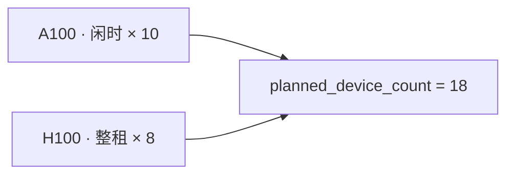
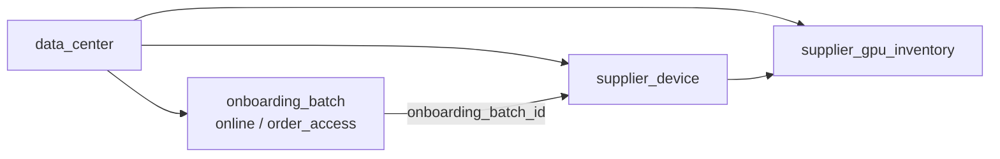
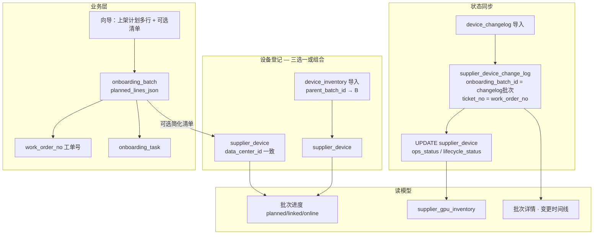

# 供应商接入批次 — 数量驱动与机房/工单关联跟踪方案

> 版本：v1.1（设计稿）  
> 日期：2026-05-22  
> 状态：**Phase 1 已实施**（tRPC + PostgreSQL；合同可选）  
> 变更：v1.1 — 上架计划改为 **卡型 + 合作类型 + 数量** 多行明细；`(gpu_card_type, cooperation_type)` 本批次唯一；`planned_device_count` 为各行合计  
> 关联：[supplier-lifecycle-product-plan.md](./supplier-lifecycle-product-plan.md)（流 2/2b/4）、[supplier-device-import-schema.md](./supplier-device-import-schema.md)（设备主数据/变更导入）、[supplier-database.md](./supplier-database.md)（`onboarding_batch`、`supplier_device`、`supplier_device_change_log`）、`onboarding-batch-wizard-dialog.tsx`（上架计划多行 + 可选清单向导）

---

## 1. 背景与问题

### 1.1 设计变更

接入工作台（`/supplier/online-tasks`、`/supplier/order-access`）向导已调整为：

| 项 | 原方案 | 新方案 |
|----|--------|--------|
| 必填 | 上传 CSV 清单 | **上架计划**（卡型 + 合作类型 + 数量，可多行） |
| 计划行 | — | 每行：选择 **GPU 卡型**、**合作类型**（闲时合作 / 整租合作）、**数量**（正整数） |
| 唯一性 | — | 同一批次内 **`(gpu_card_type_code, cooperation_type)` 组合唯一** |
| 合计 | 单字段上架数量 | **`planned_device_count` = 各计划行 `planned_quantity` 之和** |
| 清单 | 必传 | **可选**（「上传清单」checkbox，默认不勾选） |
| 无清单确认 | — | 按钮文案为「确认」，仅创建业务批次 |
| 有清单 | 上传 → 预览 → 入库 | 按钮为「下一步：上传清单」；清单行数 ≤ 计划总台数 |

### 1.2 待解决问题

在无清单或清单滞后到达时，如何：

1. **按机房管理设备归属**（设备落在哪个 `data_center_id`）；
2. **跟踪接入流程进度**（计划 N 台 → 已登记 → 接入中 → 已上线）；
3. **跟踪机房设备状态变更**（运维 Excel 变更表驱动的 `ops_status` / `lifecycle_status` 变化）；
4. 是否可复用 **`onboarding_batch_id`** 与变更表中的 **`ticket_no`（工单编号）** 作为关联键。

### 1.3 方案结论（摘要）

| 关联方式 | 是否可行 | 说明 |
|----------|----------|------|
| **`data_center_id` 管理机房归属** | **可行，且应作为主锚点** | 批次与设备均归属 `(supplier_id, data_center_id)` |
| **`supplier_device.onboarding_batch_id` → 业务批次** | **可行** | 设备登记后指向 `batch_kind=online/order_access` 批次 |
| **`change_log.onboarding_batch_id` 直接指向业务批次** | **不可行（语义冲突）** | 该字段固定指向 `device_changelog` 导入批次 |
| **`change_log.ticket_no` 关联业务批次** | **可行（推荐作辅助键）** | 业务批次生成工单号，运维变更表 Excel「工单」列填写同一编号 |

**推荐模型**：**机房双锚点 + 业务批次 ID + 工单号桥接**，不改造变更表 `onboarding_batch_id` 语义。

---

## 2. 目标与原则

### 2.1 业务目标

| # | 目标 | 说明 |
|---|------|------|
| G1 | 数量驱动创建批次 | 填写上架计划（可多行卡型×合作类型）即可创建 `online` / `order_access` 业务批次 |
| G2 | 机房维度管理 | 批次与设备均以 `data_center_id` 为机房归属；跨机房设备不得挂入同一业务批次 |
| G3 | 进度可跟踪 | 批次详情展示 `计划 / 已登记 / 接入中 / 已上线` 四段进度 |
| G4 | 状态变更可追溯 | 接入过程中运维变更表导入的状态变化，可回溯到业务批次与工单 |
| G5 | 与现有导入兼容 | 不破坏 `device_inventory` / `device_changelog` 既有 commit 逻辑 |
| G6 | 复用现有表 | 优先扩展 `onboarding_batch` 字段，避免新建平行批次表 |

### 2.2 非目标（本期）

- 不自动对接外部工单系统（Jira/飞书等）；`ticket_no` 先作为 **CRM 内业务编号**
- 不在数量-only 确认时预创建「占位设备」行
- 不改造 `entity_state_transition_log` 写入策略（Excel 导入仍不写该表）
- 不实现跨供应商、跨机房的合并批次

### 2.3 设计原则

1. **供应商 + 机房双锚点**：与 [supplier-device-retire-design.md](./supplier-device-retire-design.md) §1.3 一致，批次 `(supplier_id, data_center_id)` 为硬约束。
2. **业务批次与导入批次分离**：`online/order_access` 管编排；`device_inventory/device_changelog` 管运维台账同步。
3. **设备归属以 `data_center_id` 为准**：`idc_code` 为冗余快照；统计、校验、库存汇总均按 `data_center_id`。
4. **变更审计不改语义**：`supplier_device_change_log.onboarding_batch_id` 永远指向 **`device_changelog` 批次**。
5. **工单号作软关联**：`ticket_no` 连接「业务接入工单」与「运维变更流水」，需约定生成规则与唯一性。
6. **计划行粒度**：进度跟踪细化到 **卡型 × 合作类型** 行，而非仅批次总台数。

---

## 2.4 上架计划 UI（已实现 Mock）

向导 **Step meta** 中「上架计划」区块：

| 列 | 控件 | 必填 | 说明 |
|----|------|------|------|
| 卡型 | Select | ✓ | 数据源：`gpu_card_type`（tRPC `listActive`）；离线兜底见 `ONBOARDING_GPU_CARD_OPTIONS` |
| 合作类型 | Select | ✓ | `idle_time` 闲时合作 / `whole_rent` 整租合作 |
| 数量 | Input number | ✓ | 正整数，本行计划台数 |
| 操作 | 删除 | — | 至少保留一行；「添加一行」追加 |

**校验 R-PL1**：同一批次草稿内，`(gpu_card_type_code, cooperation_type)` **不可重复**。

**校验 R-PL2**：至少一行且每行三项均有效。

**展示**：底部显示「合计计划上架 N 台」。



---

## 3. 可行性分析：三个关联键

### 3.1 `data_center_id` — 机房归属（主锚点）

**结论：可行，必须使用。**

现有 schema 已支持：

| 实体 | 字段 | 约束 |
|------|------|------|
| `onboarding_batch` | `data_center_id` | NOT NULL，FK → `data_center` |
| `supplier_device` | `data_center_id` | 可空（历史），接入完成后应有值 |
| `supplier_gpu_inventory` | `data_center_id` | NOT NULL，UK 维度之一 |

**规则 R-DC1**：业务批次创建时选定机房；后续挂接设备时 `supplier_device.data_center_id` **必须等于** 批次 `data_center_id`。

**规则 R-DC2**：`device_inventory` / `device_changelog` 导入时，用户选择的机房必须与目标业务批次一致（若指定关联批次）。

**规则 R-DC3**：设备匹配（变更表按设备 ID/IP 找设备）在 `(supplier_id, data_center_id)` 范围内进行，与下架导入一致。



---

### 3.2 `supplier_device.onboarding_batch_id` — 业务批次关联

**结论：可行，用于「设备 ↔ 接入业务批次」的主关联。**

| 场景 | `supplier_device.onboarding_batch_id` 指向 |
|------|---------------------------------------------|
| 向导上传简化清单 commit | 业务批次 `batch_kind=online/order_access` |
| 运维 `device_inventory` 导入（关联业务批次） | **业务批次 ID**（非 inventory 批次 ID） |
| 未关联业务批次的独立 inventory 导入 | `device_inventory` 批次 ID |

**规则 R-BB1**：数量-only 创建业务批次时 **不创建** `supplier_device`，故此时无设备级 `onboarding_batch_id`。

**规则 R-BB2**：批次进度 `linked_count = COUNT(supplier_device WHERE onboarding_batch_id = 业务批次.id)`。

**规则 R-BB3**：`device_inventory` 批次与业务批次关系通过 **`parent_batch_id`**（新增字段，见 §5.1）表达，避免覆盖 `supplier_device.onboarding_batch_id` 语义。

---

### 3.3 `change_log.onboarding_batch_id` — 能否指向业务批次？

**结论：不可行，不应复用该字段指向业务批次。**

依据 [supplier-device-import-schema.md §3.5](./supplier-device-import-schema.md)：

- `supplier_device_change_log.onboarding_batch_id` **NOT NULL**
- 语义：**变更所属 `device_changelog` 导入批次**（每次上传变更 Excel 新建一个批次）
- 业务规则 **R-DI1**：设备变更导入必须创建 `batch_kind=device_changelog` 批次

若强行让该字段指向 `online` 业务批次，会导致：

1. 丢失「哪次变更 Excel 导入」的审计溯源；
2. 与 `commitChangelog` 现有实现冲突；
3. 同一业务批次多次变更导入无法区分批次。

**正确做法**：业务批次与变更日志通过 **`ticket_no`** 或 **设备级 `onboarding_batch_id`** 间接关联（§3.4）。

---

### 3.4 `change_log.ticket_no` — 工单编号桥接

**结论：可行，推荐作为业务批次 ↔ 变更流水的辅助关联键。**

变更表 Excel 已有「工单」列，映射为 `supplier_device_change_log.ticket_no`，并建有索引。

**桥接方案**：

业务批次创建时生成 **`work_order_no`（接入工单号）**，要求运维在变更表 Excel 的「工单」列填写同一编号。

| 业务批次字段 | 示例 | 用途 |
|--------------|------|------|
| `batch_code` | `ONB-202605-128` | 人类可读批次号（已有） |
| **`work_order_no`（新增）** | `WO-ONB-202605-128` | 对外/对运维的工单编号，写入变更表 |

**关联查询**：

```sql
-- 某业务批次下的全部变更审计（跨多次 changelog 导入）
SELECT cl.*
FROM supplier_device_change_log cl
JOIN supplier_device d ON d.id = cl.supplier_device_id
WHERE d.onboarding_batch_id = :businessBatchId
   OR cl.ticket_no = :workOrderNo
ORDER BY cl.occurred_at DESC;
```

**规则 R-TK1**：`work_order_no` 在 `(supplier_id)` 范围内唯一；创建业务批次时自动生成，UI 可复制给运维。

**规则 R-TK2**：`commitChangelog` 解析时，若 `ticket_no` 能匹配某进行中的业务批次 `work_order_no`，记 `metadata.linked_business_batch_id`（`supplier_activity`），**不修改** `change_log.onboarding_batch_id`。

**规则 R-TK3**：`ticket_no` 为空时，仍可通过 `supplier_device.onboarding_batch_id` 回溯业务批次；工单号为 **增强** 而非唯一依赖。

**规则 R-TK4**：同一 `ticket_no` 可出现在多行变更记录、多次 changelog 导入中（同一工单的多条操作流水）。

---

## 4. 端到端流程

### 4.1 总览



### 4.2 路径 A：仅数量（不勾选上传清单）

| 步骤 | 用户动作 | 系统行为 |
|------|----------|----------|
| 1 | 选供应商、机房、合同；添加上架计划（可多行：卡型 + 合作类型 + 数量） | — |
| 2 | 不勾选「上传清单」，点 **确认** | INSERT `onboarding_batch` + `planned_lines_json`（或明细表）；`planned_device_count = SUM(planned_quantity)`；`batch_status=接入中`；`import_status=none` |
| 3 | — | INSERT `work_order_no` |
| 4 | — | INSERT `onboarding_task`（批次级） |
| 5 | — | INSERT `supplier_activity`（`batch_started`） |
| 6 | — | **不** INSERT `supplier_device`；进度按行 `0 / planned_quantity` |

后续设备由 **运维 device_inventory 导入** 或 **批次详情补传清单** 挂接，挂接时校验 `data_center_id` 一致。

### 4.3 路径 B：数量 + 简化清单

与路径 A 相同创建批次，额外：

| 步骤 | 系统行为 |
|------|----------|
| 上传 CSV | `import_status=parsed`，`parsed_rows_json` 填充 |
| 确认入库 | INSERT `supplier_device`（`onboarding_batch_id=业务批次`，`data_center_id=批次机房`，`lifecycle_status=接入中`，`cooperation_type` 取自计划行或清单默认） |
| 校验 | `parsed_success_count <= planned_device_count`（计划总台数）；后续可增强：按卡型分配校验 |
| 进度 | 按行 `linked / planned_quantity`；批次合计 `linked_total / planned_device_count` |

### 4.4 路径 C：运维主数据导入（补登记）

在供应商 Hub「设备主数据表」导入，可选 **关联业务批次**：

```
commitInventory({
  supplierId, dataCenterId, fileName, rows,
  parentBatchId?: businessBatchId   // 新增参数
})
```

| 行为 | 说明 |
|------|------|
| 新建 `device_inventory` 批次 | `parent_batch_id = businessBatchId` |
| 新设备 INSERT | `supplier_device.onboarding_batch_id = businessBatchId` |
| 更新已有设备 | 可选：若 `onboarding_batch_id` 为空则回填业务批次 ID |
| 刷新 | `linked_count`、 `supplier_gpu_inventory` |

### 4.5 路径 D：运维变更表（状态跟踪）

```
commitChangelog({ supplierId, dataCenterId, fileName, rows })
```

与 [supplier-device-import-panel.tsx](../src/components/dashboard/supplier-device-import-panel.tsx) 现有逻辑一致，额外：

1. 解析行 `ticket_no` 若匹配某业务批次 `work_order_no`，写 `supplier_activity.metadata.business_batch_id`；
2. 批次详情按 `d.onboarding_batch_id = :id OR cl.ticket_no = :workOrderNo` 聚合变更时间线；
3. 设备 `ops_status` / `lifecycle_status` 更新后刷新 `supplier_gpu_inventory`。

---

## 5. 数据模型扩展

### 5.1 `onboarding_batch` 增量字段

| 列名 | 类型 | 约束 | 说明 |
|------|------|------|------|
| **`planned_lines_json`** | jsonb | NOT NULL DEFAULT `[]` | 上架计划明细数组（§5.1.1） |
| `planned_device_count` | integer | NOT NULL DEFAULT 0 | **派生**：`SUM(planned_lines_json[].planned_quantity)` |
| `list_upload_mode` | varchar(32) | NOT NULL DEFAULT `none` | `none` \| `simplified_csv` \| `deferred` |
| `work_order_no` | varchar(64) | UK（supplier 范围内）, 可空 | 接入工单号，供变更表 `ticket_no` 引用 |
| `online_reason` | varchar(64) | 可空 | `batch_kind=online` |
| `order_no` | varchar(128) | 可空 | `batch_kind=order_access` 关联订单 |
| `remark` | text | 可空 | 批次备注 |
| `parent_batch_id` | text | FK→`onboarding_batch`, 可空 | **导入批次** 指向业务批次；仅 `device_inventory` / `device_changelog` 使用 |

#### 5.1.1 `planned_lines_json` 单元素结构

| 字段 | 类型 | 必填 | 说明 |
|------|------|------|------|
| `gpu_card_type_id` | text | 否 | FK → `gpu_card_type.id` |
| `gpu_card_type_code` | string | 是 | 卡型编码，如 `A100-80G` |
| `cooperation_type` | string | 是 | `idle_time` \| `whole_rent` |
| `planned_quantity` | integer | 是 | 本行计划台数，> 0 |

**唯一约束（应用层 / 可选 DB）**：

```sql
UNIQUE (onboarding_batch_id, gpu_card_type_id, cooperation_type)
-- 若使用 jsonb 仅存于 batch 表，则在 create API 校验
```

**可选明细表** `onboarding_batch_plan_line`（行数多或需独立索引时）：

| 列名 | 类型 | 约束 |
|------|------|------|
| `id` | text | PK |
| `onboarding_batch_id` | text | FK → `onboarding_batch`, NOT NULL |
| `gpu_card_type_id` | text | FK → `gpu_card_type`, NOT NULL |
| `cooperation_type` | varchar(32) | NOT NULL |
| `planned_quantity` | integer | NOT NULL |
| `linked_quantity` | integer | NOT NULL DEFAULT 0 | 已登记台数（冗余或视图） |
| `online_quantity` | integer | NOT NULL DEFAULT 0 | 已上线台数 |

UK：`(onboarding_batch_id, gpu_card_type_id, cooperation_type)`。

> Phase 1 推荐 **jsonb**；Phase 2 若需按行 SQL 聚合再拆明细表。

> `linked_device_count`、`online_device_count` 建议 **应用层聚合**，不冗余落库（或作缓存字段定期刷新）。

### 5.2 `import_status` 扩展（清单可选场景）

在原有状态机基础上增加：

| 状态 | 含义 |
|------|------|
| **`none`** | 业务批次已确认，从未上传清单（数量-only 路径） |

状态组合示例：

| 场景 | `batch_status` | `import_status` |
|------|----------------|-----------------|
| 数量-only 已确认 | 接入中 | `none` |
| 已上传待确认 | 接入中 | `parsed` |
| 清单已入库 | 接入中 | `committed` |

### 5.3 不修改的表

| 表/字段 | 原因 |
|---------|------|
| `supplier_device_change_log.onboarding_batch_id` | 保持指向 `device_changelog` 批次 |
| `entity_state_transition_log` | Excel 导入仍不写入 |

---

## 6. 进度与状态跟踪

### 6.1 批次进度 — 合计与分行

**批次合计**（与 v1.0 兼容）：

```sql
SELECT
  b.planned_device_count AS planned,
  COUNT(d.id) AS linked,
  COUNT(d.id) FILTER (WHERE d.lifecycle_status IN ('待接入', '接入中')) AS onboarding,
  COUNT(d.id) FILTER (WHERE d.lifecycle_status = '在线') AS online
FROM onboarding_batch b
LEFT JOIN supplier_device d ON d.onboarding_batch_id = b.id
WHERE b.id = :batchId
GROUP BY b.id, b.planned_device_count;
```

**按卡型 × 合作类型分行**（推荐展示）：

```sql
-- planned_lines_json 展开后与 supplier_device 聚合
-- 应用层：对每行 plan line 统计
--   linked   = COUNT(d) WHERE d.gpu_card_type_id = line.gpu_card_type_id
--                    AND d.cooperation_type = line.cooperation_type
--   online   = 同上 + lifecycle_status = '在线'
```

批次详情 UI 建议表格：

| 卡型 | 合作类型 | 计划 | 已登记 | 已上线 |
|------|----------|------|--------|--------|
| A100-80G | 闲时合作 | 10 | 8 | 5 |
| H100-80G | 整租合作 | 8 | 8 | 8 |
| **合计** | | **18** | **16** | **13** |

**完成判定（可配置）**：

```
每行 online_quantity >= planned_quantity
且 linked >= planned（各计划行）
→ batch_status = '已完成'
```

### 6.2 机房维度汇总

按 `(supplier_id, data_center_id)` 汇总进行中的业务批次：

```sql
SELECT
  b.data_center_id,
  SUM(b.planned_device_count) AS planned_total,
  COUNT(d.id) AS linked_total,
  COUNT(d.id) FILTER (WHERE d.lifecycle_status = '在线') AS online_total
FROM onboarding_batch b
LEFT JOIN supplier_device d ON d.onboarding_batch_id = b.id
WHERE b.supplier_id = :supplierId
  AND b.batch_kind IN ('online', 'order_access')
  AND b.batch_status = '接入中'
GROUP BY b.data_center_id;
```

### 6.3 变更时间线（批次详情）

展示顺序：`occurred_at DESC`

| 来源 | 条件 |
|------|------|
| 主路径 | `supplier_device.onboarding_batch_id = :businessBatchId` |
| 工单增强 | `change_log.ticket_no = batch.work_order_no` |
| 过滤 | 可选仅展示本机房设备：`d.data_center_id = batch.data_center_id` |

---

## 7. 业务规则汇总

| 编号 | 规则 |
|------|------|
| **R-OB1** | 数量-only 确认 **不得** 创建 `supplier_device` |
| **R-OB2** | 至少一行上架计划；每行 `planned_quantity` 为正整数 |
| **R-OB3** | 上传清单时 `parsed_success_count` 不得超过 `planned_device_count` |
| **R-PL1** | 同一批次内 `(gpu_card_type_code, cooperation_type)` **唯一** |
| **R-PL2** | `planned_device_count = SUM(planned_lines[].planned_quantity)`，由服务端计算写入，不信任客户端 |
| **R-PL3** | 设备登记时 `supplier_device.gpu_card_type_id` + `cooperation_type` 应匹配某计划行（不匹配记 warning） |
| **R-DC1** | 设备 `data_center_id` 必须等于所属业务批次 `data_center_id` |
| **R-DC2** | 变更表/主数据导入匹配设备时限定 `(supplier_id, data_center_id)` |
| **R-BB1** | `supplier_device.onboarding_batch_id` 指向 **业务批次**（online/order_access） |
| **R-BB2** | `device_inventory` 批次通过 `parent_batch_id` 关联业务批次 |
| **R-CL1** | `change_log.onboarding_batch_id` **仅** 指向 `device_changelog` 批次 |
| **R-TK1** | 业务批次自动生成 `work_order_no`；变更表「工单」列填同一编号 |
| **R-TK2** | `ticket_no` 为空时仍可通过设备 `onboarding_batch_id` 关联业务批次 |
| **R-ST1** | 设备状态以变更表导入为准；映射规则见 `OPS_STATUS_TO_LIFECYCLE` |
| **R-ST2** | Excel 导入 **不写入** `entity_state_transition_log` |
| **R-INV1** | 每次 `device_inventory` / `device_changelog` commit 后刷新 `supplier_gpu_inventory` |

---

## 8. API 设计（tRPC 草案）

### 8.1 业务批次 `supplier.onboardingBatch`

| 过程 | 输入 | 输出 |
|------|------|------|
| `create` | 供应商、机房、合同、`planLines[]`（卡型、合作类型、数量）、元信息、`uploadList=false` | `{ batchId, batchCode, workOrderNo, plannedDeviceCount }` |
| `createDraftWithList` | 同上 + `uploadList=true` | `{ batchId }`（`import_status=draft`） |
| `parseList` | `batchId`, file | `{ rows, okCount }` |
| `commitList` | `batchId` | `{ linkedCount }` |
| `getProgress` | `batchId` | `{ planned, linked, onboarding, online, planLines[{ planned, linked, online }], changeLogs[] }` |
| `listByDataCenter` | `supplierId`, `dataCenterId?` | 批次列表 + 进度 |

```typescript
// planLines 元素 schema
{
  gpuCardTypeId?: string
  gpuCardTypeCode: string   // 必填
  cooperationType: 'idle_time' | 'whole_rent'
  plannedQuantity: number.int().positive()
}
// 服务端校验：planLines 内 (gpuCardTypeCode, cooperationType) 唯一
```

### 8.2 增强现有 `supplier.deviceImport`

| 过程 | 增量参数 |
|------|----------|
| `commitInventory` | `parentBatchId?: string` — 关联业务批次 |
| `commitChangelog` | 无 schema 变更；commit 后若 `ticket_no` 命中 `work_order_no` 写 activity |
| `getContext` | 返回进行中的业务批次列表（供导入面板下拉关联） |

---

## 9. UI 改造要点（确认后实施）

| 位置 | 改造 |
|------|------|
| `onboarding-batch-wizard-dialog.tsx` | ✅ Mock：上架计划多行（卡型 + 合作类型 + 数量）；唯一性校验；合计台数；待接 tRPC |
| `onboarding-batches-content.tsx` | 列：计划明细摘要 / 已登记 / 已上线；清单状态 |
| 批次详情页 | 进度条、变更时间线、工单号 |
| `supplier-device-import-panel.tsx` | 主数据导入可选「关联接入批次」；提示填写工单号 |
| 供应商详情 · 机房 Tab | 按 `data_center_id` 汇总进行中批次与设备状态 |

---

## 10. 实施分期

| 阶段 | 范围 | 交付 |
|------|------|------|
| **一** | DB migration + `onboardingBatch.create/getProgress` | 数量-only 可创建、进度可查 |
| **二** | 清单 parse/commit + 向导接 API | 可选上传路径打通 |
| **三** | `commitInventory.parentBatchId` + 导入面板关联 | 运维补登记挂接业务批次 |
| **四** | 变更时间线 + `work_order_no` 桥接 + 批次完成判定 | 端到端状态跟踪 |
| **五** | `onboarding_task`、手动上线、活动流 | 与 lifecycle 产品计划对齐 |

---

## 11. 风险与对策

| 风险 | 对策 |
|------|------|
| 运维变更表未填工单号 | 仍可通过 `supplier_device.onboarding_batch_id` 关联；UI 提示必填 |
| 同一工单号重复用于多批次 | `work_order_no` 在 supplier 内唯一；创建时校验 |
| 设备主数据导入未指定业务批次 | 设备 `onboarding_batch_id` 指向 inventory 批次；后续支持手动关联 |
| 设备 `data_center_id` 为空的历史数据 | 导入/关联时强制校验；报表排除空机房 |
| `ticket_no` 与 `batch_code` 混用 | 统一对外使用 `work_order_no`，文档与 UI 明确 |

---

## 12. 变更记录

| 版本 | 日期 | 说明 |
|------|------|------|
| v1.0 | 2026-05-22 | 首版：数量驱动接入；机房 `data_center_id` 主锚点；`onboarding_batch_id` / `ticket_no` 可行性结论与实现方案 |
| v1.1 | 2026-05-22 | 上架计划改为卡型 + 合作类型 + 数量多行；`(卡型, 合作类型)` 批次内唯一；`planned_lines_json` 与分行进度；向导 UI 已实现 Mock |
