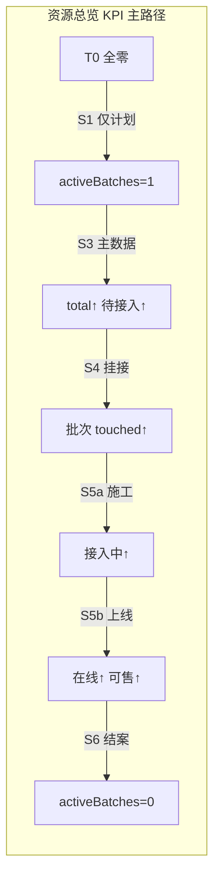
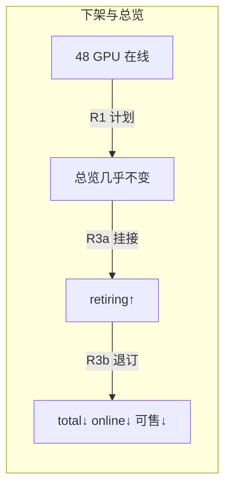

# 从零开始 — 三场景端到端作业流与资源总览状态变化

**依据**：`packages/db/src/supply-schema.ts`、`supplier.overview.getStats`（`overview.ts`）、接入/导入/下架现有实现、`[supplier-device-management-ops-panorama.md](./supplier-device-management-ops-panorama.md)`。

**读者**：商务 / 供应链运营经理。

**文档性质**：按 **端到端作业步骤** 说明三类计划创建后，**资源总览**（`/supplier/overview`）各模块数据如何变化；示例用量便于对照，可按实际台数等比缩放。

**版本**：v1.0（2026-05-27）

---

## 1. 前提：T0 从零基线

执行 `[supplier-device-data-cleanup-sql.md](./supplier-device-data-cleanup-sql.md)` **方案 A** 后，或全新环境尚未导入任何设备时，系统处于 **T0**：

| 数据域                                              | T0 状态       |
| ------------------------------------------------ | ----------- |
| `supplier` / `data_center` / `supplier_contract` | ✅ 保留（主数据已在） |
| `supplier_device`                                | 0 行         |
| `supplier_gpu_inventory`                         | 0 行         |
| `onboarding_batch`                               | 0 行         |
| `onboarding_batch_device_link`                   | 0 行         |
| `supplier_device_change_log`                     | 0 行         |

### T0 — 资源总览快照

| 模块           | 字段 / 指标                    | T0 值      | 说明                              |
| ------------ | -------------------------- | --------- | ------------------------------- |
| **顶部 KPI**   | 总量 `total`                 | 0 卡 · 0 台 | 无物理机                            |
|              | 在线 `online`                | 0 · 0     |                                 |
|              | 待接入 `pendingAccess`        | 0 · 0     | `lifecycle_status=待接入`          |
|              | 接入中 `onboarding`           | 0 · 0     | `lifecycle_status=接入中`          |
|              | 维护 `maintenance`           | 0 · 0     |                                 |
|              | 可售 `sellable`              | 0 · 0     |                                 |
|              | 下架中 `retiring`             | 0 · 0     | `lifecycle_status=下线中`          |
|              | 进行中批次 `activeBatches`      | **0**     | 无 `online`/`order_access` 非终态批次 |
|              | 可售率 `sellableRate`         | 0%        |                                 |
| **生命周期漏斗**   | 待接入 / 接入中 / 在线 / 维护中 / 下线中 | 均为 0      |                                 |
| **运维流水线**    | 裸金属直连/代理、线下交付、网关上架、其他      | 均为 0      | 依赖 `ops_status`                 |
| **供应商汇总表**   | `supplierRows`             | **空**     | 无库存行且无设备时为空                     |
| **机房×卡型库存表** | `inventoryRows`            | **空**     | 无 `supplier_gpu_inventory`      |
| **进行中接入批次**  | `batchSummaries`           | **空**     |                                 |
| **故障 SLA**   | `faultOpenCount` 等         | 0         | 与三场景无关，默认 0                     |

> **规律**：资源总览的 **GPU 台数类 KPI 全部来自 `supplier_device` + `supplier_gpu_inventory`**；**仅创建商务计划、尚未导入主数据时，总览数字保持 T0，只有「进行中批次」会出现条目。**

---

## 2. 资源总览模块 — 数据来源速查

便于对照下文「状态变化」列。

| 总览模块                  | 主要数据来源                                                              | 关键判定                                               |
| --------------------- | ------------------------------------------------------------------- | -------------------------------------------------- |
| 总量 `total.gpuCount`   | `supplier_gpu_inventory.quantity` 求和                                | 主数据导入后才有                                           |
| 在线 `online`           | `supplier_device.lifecycle_status = '在线'`                           | 按设备 `gpu_count` 累加                                 |
| 待接入 `pendingAccess`   | `lifecycle_status = '待接入'`                                          | 典型 `ops_status=预留闲置中`                              |
| 接入中 `onboarding`      | `lifecycle_status = '接入中'`                                          | 如 `网关节点上架中`、裸金属上架中等                                |
| 可售 `sellable`         | 在线 GPU − 内部测试 − 故障扣减 − `其他部门使用中` 等                                  | 见 `overview.ts`                                    |
| 下架中 `retiring`        | `lifecycle_status = '下线中'`                                          | 下架变更挂接后                                            |
| 进行中批次 `activeBatches` | `batch_kind ∈ {online, order_access}` 且 `batch_status ∉ {已完成, 已取消}` | `**device_retire` 不计入**                            |
| 生命周期漏斗                | 按 `lifecycle_status` 分桶                                             | 顺序：待接入→接入中→在线→维护中→下线中                              |
| 运维流水线                 | 按 `ops_status` 分桶                                                   | 如「网关直连裸金属上架中」→ 裸金属池·直连上架中                          |
| 库存明细行                 | `supplier_gpu_inventory` + 设备池绑定推算                                  | `quantity` / `onlineQuantity` / `sellableQuantity` |
| 批次摘要 `batchSummaries` | 同上 activeBatches 条件                                                 | 展示 `touched/online/planned`                        |

**商务批次进度字段**（批次详情 / 总览摘要，非 KPI 直接字段）：

| 字段                     | 含义                         |
| ---------------------- | -------------------------- |
| `planned_device_count` | 计划台数                       |
| `touched_device_count` | 变更表已挂接台数                   |
| `online_device_count`  | 已挂接且 `lifecycle_status=在线` |

---

## 3. 场景一：新机房上架计划（`online_reason = new_idc`）

**业务含义**：某供应商 **新机房** 首次接入 GPU，商务/运营创建上架批次，运维导入主数据与变更，直至设备在线可售。

**示例用量**（全文统一）：

- 机房：`HB-BJ-DC1`（已存在于 `data_center`，状态可为 `offline`）
- 计划：**4 台** H800，**8 卡/台**，共 **32 GPU**
- 计划行：`H800 × 闲时合作 × 4 台`
- 飞书工单：`WO-2026-001`

### 3.1 端到端步骤

| 步骤     | 角色    | 操作                                       | 系统写入                                      |
| ------ | ----- | ---------------------------------------- | ----------------------------------------- |
| **S1** | 商务/运营 | `/supplier/online-tasks` → 新建上架批次        | `onboarding_batch`（`online`）              |
| **S2** | 运维    | 线下施工、更新飞书多维表格                            | —                                         |
| **S3** | 运维    | 机房详情 → 导入 **设备主数据表**                     | `device_inventory` 批次 + `supplier_device` |
| **S4** | 运维    | 导入 **设备变更表**（工单 `WO-2026-001`，动作如「设备接收」） | `device_changelog` + `device_link`        |
| **S5** | 运维    | 继续导入变更（「上架接入平台网关」「加入集群」等）                | 更新 `supplier_device` 状态                   |
| **S6** | 运营    | 确认批次进度 = 计划，标记批次完成（若流程要求）                | `batch_status=已完成`                        |

### 3.2 各步骤 — 核心表状态

| 步骤      | `onboarding_batch`（业务）                                                     | `supplier_device`（4 台）                 | `supplier_gpu_inventory`                             | `device_link` |
| ------- | -------------------------------------------------------------------------- | -------------------------------------- | ---------------------------------------------------- | ------------- |
| **S1**  | `batch_status=接入中`，`import_status=none`，`planned=4`，`touched=0`，`online=0` | —                                      | —                                                    | —             |
| **S3**  | 不变                                                                         | **新增 4 行**：`lifecycle=待接入`，`ops=预留闲置中` | **新增 1 行**：`quantity=32`，`online=0`，`status=offline` | —             |
| **S4**  | `touched=4`，`online=0`                                                     | 仍为 `待接入`                               | `quantity=32`，`online=0`                             | **4 条** link  |
| **S5a** | `touched=4`，`online=0`                                                     | 4 台 → `接入中`（如 `ops=网关节点上架中`）           | `online=0`                                           | 4 条           |
| **S5b** | `touched=4`，`online=4`                                                     | 4 台 → `在线`（如 `ops=在集群中`）               | `quantity=32`，`**online=32`**，`status=online`        | 4 条           |
| **S6**  | `batch_status=已完成`                                                         | 4 台 `在线`                               | 不变                                                   | 4 条           |

### 3.3 各步骤 — 资源总览状态

| 步骤      | 总量       | 待接入      | 接入中      | 在线       | 可售        | 进行中批次 | 漏斗 / 库存 / 批次摘要                                   |
| ------- | -------- | -------- | -------- | -------- | --------- | ----- | ------------------------------------------------ |
| **T0**  | 0        | 0        | 0        | 0        | 0         | 0     | 全空                                               |
| **S1**  | 0        | 0        | 0        | 0        | 0         | **1** | `batchSummaries`：**1 条**，`0/0/4`；其余仍空            |
| **S3**  | **32·4** | **32·4** | 0        | 0        | 0         | 1     | 漏斗 **待接入 32 卡**；`inventoryRows` **1 行** `32/0/0` |
| **S4**  | 32·4     | 32·4     | 0        | 0        | 0         | 1     | 同上；批次摘要 `**4/0/4`**（已关联未上线）                      |
| **S5a** | 32·4     | 0        | **32·4** | 0        | 0         | 1     | 漏斗 **接入中 32 卡**；运维流水线 **网关上架** +32 卡             |
| **S5b** | 32·4     | 0        | 0        | **32·4** | **≈32·4** | 1     | 漏斗 **在线 32 卡**；库存 `**32/32/32`**；批次 `**4/4/4**`  |
| **S6**  | 32·4     | 0        | 0        | 32·4     | ≈32·4     | **0** | `batchSummaries` **清空**（批次已终态）；KPI 保持 S5b        |

**S5b 可售率说明**：若 4 台均为 `ops=在集群中`、无内部测试/故障，则 `sellableRate ≈ 100%`；若部分为 `不可调度节点运行中`，可售 GPU 低于在线 GPU。

### 3.4 场景一状态流转图

---

## 4. 场景二：增加上架设备计划（扩容，`online_reason = capacity_expansion`）

**业务含义**：**已有在线设备** 的机房追加 GPU，再建一条上架批次，流程与场景一相同，但总览在 **已有存量** 上累加。

**起点**：场景一 **S6 结束态** — 4 台 H800 在线，32 GPU 可售。

**本场景增量**：

- 新计划：**+2 台** H800（+16 GPU）
- 新工单：`WO-2026-002`
- 新批次：`batch_kind=online`，与 S1 相同创建方式

### 4.1 端到端步骤

与场景一相同（S1'→S6'），区别仅为 **增量台数** 与 **新工单号**。

### 4.2 各步骤 — 核心表状态（累计）

| 步骤       | 业务批次（新）                     | `supplier_device` 累计 | `supplier_gpu_inventory`（H800） | 新批次进度               |
| -------- | --------------------------- | -------------------- | ------------------------------ | ------------------- |
| **S1'**  | 新批次 `planned=2`，`touched=0` | 仍为 4 台在线             | `32/32` 不变                     | 旧批次已完成，不在 active 列表 |
| **S3'**  | —                           | **+2 行** 待接入，共 6 台   | `**48/32`**（+16 总量，在线暂不变）      | —                   |
| **S4'**  | `touched=2`                 | 4 在线 + 2 待接入         | 48/32                          | 2/0/2               |
| **S5b'** | `online=2`                  | 6 台在线                | `**48/48`**                    | 2/2/2               |
| **S6'**  | 新批次已完成                      | 6 台在线                | 48/48                          | —                   |

### 4.3 各步骤 — 资源总览状态（累计）

| 步骤       | 总量       | 待接入      | 接入中      | 在线       | 可售        | 进行中批次 | 要点                            |
| -------- | -------- | -------- | -------- | -------- | --------- | ----- | ----------------------------- |
| **起点**   | 32·4     | 0        | 0        | 32·4     | ≈32·4     | 0     | 场景一结束                         |
| **S1'**  | 32·4     | 0        | 0        | 32·4     | ≈32·4     | **1** | **总量不变**；仅多 1 条批次摘要 `0/0/2`   |
| **S3'**  | **48·6** | **16·2** | 0        | 32·4     | ≈32·4     | 1     | 总量 +16 卡；**待接入 +16**；在线/可售暂不变 |
| **S4'**  | 48·6     | 16·2     | 0        | 32·4     | ≈32·4     | 1     | 批次 `2/0/2`                    |
| **S5a'** | 48·6     | 0        | **16·2** | 32·4     | ≈32·4     | 1     | 接入中 +16；在线仍 32                |
| **S5b'** | 48·6     | 0        | 0        | **48·6** | **≈48·6** | 1     | 在线、可售 **+16**；库存 **48/48**    |
| **S6'**  | 48·6     | 0        | 0        | 48·6     | ≈48·6     | 0     | 批次结案                          |

> **运营巡检要点**：S3' 完成后会出现 **「总量已增、在线未增、待接入上升」** 的剪刀差 — 表示主数据已入库但尚未施工上线，需催运维导变更表。

---

## 5. 场景三：设备下架计划（`device_retire`）

**业务含义**：从已在线库存中 **退订部分设备**，运营在机房详情发起下架计划，运维通过变更表挂接执行。

**起点**：场景二 **S6' 结束态** — 6 台 H800 在线，48 GPU。

**本场景**：

- 下架计划：**2 台**（16 GPU）
- 入口：机房详情 → **设备下架 / 裁撤**
- 下架原因：如 `hardware_upgrade`
- 飞书工单：`WO-2026-RET-01`

### 5.1 端到端步骤

| 步骤     | 角色  | 操作                                       | 系统写入                                  |
| ------ | --- | ---------------------------------------- | ------------------------------------- |
| **R1** | 运营  | 机房详情发起下架，上传建议清单 Excel                    | `onboarding_batch`（`device_retire`）   |
| **R2** | 运维  | 线下执行下架                                   | —                                     |
| **R3** | 运维  | 导入 **设备变更表**（动作「设备退订」/「非常规下线」，挂接下架批次或工单） | `change_log` + `device_link` + 更新设备状态 |
| **R4** | 系统  | `refreshBatchProgress`                   | 更新 `touched` / `retired` / 批次状态       |
| **R5** | 运营  | 确认下架完成                                   | 批次 `已完成`                              |

### 5.2 各步骤 — 核心表状态

| 步骤      | `onboarding_batch`（下架）                                                            | `supplier_device`（2 台目标机）  | `supplier_gpu_inventory`      | 其余 4 台 |
| ------- | --------------------------------------------------------------------------------- | -------------------------- | ----------------------------- | ------ |
| **R1**  | `batch_kind=device_retire`，`planned=2`，`touched=0`，`retired=0`，`batch_status=待开始` | 仍 `在线`                     | `48/48`                       | 不变     |
| **R3a** | `touched=2`，`batch_status=下架中`                                                    | → `lifecycle=下线中`（中间态）     | 暂仍 48/48                      | 不变     |
| **R3b** | `touched=2`，`retired=2`                                                           | → `lifecycle=退订`，`ops=已退订` | `**32/32`**（退订设备 **不再计入** 聚合） | 仍在线    |
| **R4**  | `touched≥planned` → `**batch_status=已完成`**（auto）                                  | 2 台退订                      | 32/32                         | —      |
| **R5**  | 已完成                                                                               | —                          | —                             | —      |

### 5.3 各步骤 — 资源总览状态

| 步骤      | 总量       | 在线       | 可售        | 下架中 `retiring` | 进行中批次 | 库存行          | 要点                                                   |
| ------- | -------- | -------- | --------- | -------------- | ----- | ------------ | ---------------------------------------------------- |
| **起点**  | 48·6     | 48·6     | ≈48·6     | 0              | 0     | 48/48/48     | —                                                    |
| **R1**  | 48·6     | 48·6     | ≈48·6     | 0              | **0** | 48/48/48     | **下架批次不出现在 `batchSummaries` / `activeBatches`**      |
| **R3a** | 48·6     | 48·4     | ≈48·4     | **16·2**       | 0     | 48/48/48     | 漏斗 **下线中** 上升；在线 KPI 尚未降（仍算在线直到退订）                   |
| **R3b** | **32·4** | **32·4** | **≈32·4** | 0              | 0     | **32/32/32** | 总量、在线、可售 **−16**；退订设备移出统计                            |
| **R4**  | 32·4     | 32·4     | ≈32·4     | 0              | 0     | 32/32/32     | 下架进度在 **机房详情 / `/supplier/offline-tasks`** 查看，非总览批次区 |

> **注意 1**：资源总览 **「进行中批次」仅统计上架/订单接入**，下架计划请查看 **设备下架** 模块或机房详情「下架批次」表。  
> **注意 2**：`lifecycle=下线中` 阶段，`retiring` KPI 上升；`lifecycle=退订` 后设备 **退出** `supplier_gpu_inventory` 聚合（`ne 退订` 规则），`retiring` 回落，总量下降。

### 5.4 场景三状态流转图

---

## 6. 三场景总览 — 关键 KPI 对比表

以示例数字汇总 **各场景终点** 相对 T0 的变化：

| 指标      | T0  | 场景一终点 | 场景二终点 | 场景三终点 |
| ------- | --- | ----- | ----- | ----- |
| 总量 GPU  | 0   | 32    | 48    | 32    |
| 在线 GPU  | 0   | 32    | 48    | 32    |
| 可售 GPU  | 0   | ≈32   | ≈48   | ≈32   |
| 待接入 GPU | 0   | 0     | 0     | 0     |
| 接入中 GPU | 0   | 0     | 0     | 0     |
| 下架中 GPU | 0   | 0     | 0     | 0     |
| 进行中上架批次 | 0   | 0     | 0     | 0     |
| 库存行数    | 0   | 1     | 1     | 1     |
| 物理机台数   | 0   | 4     | 6     | 4     |

---

## 7. 运营经理检查清单（按总览模块）

创建或跟进任一场景时，可按模块自检：

### 7.1 仅创建计划（S1 / S1' / R1）

- `activeBatches` 是否 +1（**仅上架/订单接入**）
- `batchSummaries` 是否出现对应批次，`planned` 是否正确
- **总量 KPI 是否仍为 0**（若 >0 说明主数据已提前导入）
- 下架场景：**总览批次区无条目属正常**，去机房详情看下架批次表

### 7.2 主数据导入后（S3 / S3'）

- `total`、`pendingAccess` 是否上升至计划台数
- `inventoryRows` 是否出现机房×卡型行
- 在线 / 可售 **是否尚未上升**（正常，等待变更表）

### 7.3 变更表挂接后（S4+ / R3+）

- 批次 `touched` 是否对齐运维实际台数
- 漏斗 **待接入 → 接入中 → 在线** 是否按施工推进
- 上架场景：`online_device_count` 是否最终 = `planned`
- 下架场景：`retiring` 是否短暂上升后，`total` 是否下降

### 7.4 批次结案后

- `activeBatches` 是否归零（上架批次）
- KPI 是否稳定在最终在线/可售水位
- 机房详情在线率是否与总览一致

---

## 8. 常见问题

| 现象                          | 原因                               | 处理                                     |
| --------------------------- | -------------------------------- | -------------------------------------- |
| 创建了上架计划，总览全是 0              | 正常；尚无 `supplier_device`          | 催运维导主数据                                |
| 主数据已导，批次 `touched=0`        | 变更表未导或 **工单号不一致**                | 核对 `work_order_no` ↔ Excel `ticket_no` |
| 批次 `touched=4` 但 `online=0` | 设备仍 **待接入/接入中**                  | 继续导变更直至 `加入集群` 等                       |
| 总量增加了，在线没增加                 | 场景二 S3' 典型剪刀差                    | 等待变更表驱动上线                              |
| 发起了下架，总览批次无记录               | **设计如此**；下架批次不在 `batchSummaries` | 看 `/supplier/offline-tasks`            |
| 在线 KPI 与机房详情略差              | 总览按 **生命周期 + ops 规则** 算可售        | 以 `overview.ts` 判定为准                   |

---

## 9. 相关文档

| 文档                                                                                                                 | 内容           |
| ------------------------------------------------------------------------------------------------------------------ | ------------ |
| `[supplier-device-management-ops-panorama.md](./supplier-device-management-ops-panorama.md)`                       | 设备管理全景与 SOP  |
| `[supplier-device-data-cleanup-sql.md](./supplier-device-data-cleanup-sql.md)`                                     | T0 清零 SQL    |
| `[supplier-onboarding-plan-changelog-tracking-design.md](./supplier-onboarding-plan-changelog-tracking-design.md)` | 工单 + 变更表进度模型 |

