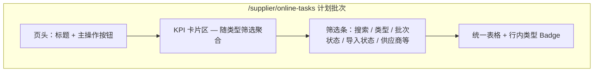

# 计划批次统一工作台 — 产品设计

**状态**：已实现（2026-05-29）  
**关联**：[supplier-device-management-ops-panorama.md](./supplier-device-management-ops-panorama.md)、[supplier-onboarding-plan-changelog-tracking-design.md](./supplier-onboarding-plan-changelog-tracking-design.md)、[global-dashboard-period-composition-m1-progress-event.md](./global-dashboard-period-composition-m1-progress-event.md)

---

## 1. 背景与目标

运营侧当前在侧栏分散进入「设备上架」「订单接入」「设备下架」三个计划批次入口，列表 KPI 与筛选各自独立，与统一的 **计划批次 / 进度事件（M1）** 心智不一致。**内部占用**为独立业务（`internal_test_hold`），继续在侧栏保留独立菜单。

**目标**：侧栏将三类计划批次合并为 **「计划批次」** → `/supplier/online-tasks`；页内 **不用 Tab**，通过 **类型筛选** 过滤列表，行内以 **Badge** 区分 `batch_kind`；顶部 KPI 随当前筛选结果聚合。与批次详情上的调整计划 / 确认完成 / 作废 / 进度时间轴流程保持一致。

---

## 2. 已确认决策（ADR）

| # | 议题 | 决策 |
|---|------|------|
| D1 | 菜单名称 | **计划批次** → `/supplier/online-tasks` |
| D2 | 列表主路由 | **保持** `/supplier/online-tasks`（不新增 `/supplier/planned-batches`） |
| D3 | 旧列表路由 | `/supplier/order-access`、`/supplier/offline-tasks` **保留可访问**，**不做** redirect；`/supplier/test-holds` 仍为内部占用列表 |
| D4 | 侧栏·计划批次 | **合并**「设备上架」「订单接入」「设备下架」为一项 **「计划批次」** |
| D5 | 侧栏·内部占用 | **保留**独立菜单 **「内部占用」** → `/supplier/test-holds`（不并入计划批次页） |
| D6 | 页内导航 | **不做 Tab**；仅用筛选区 **类型** 下拉（或等效控件） |
| D7 | 列表区分 | **同一表格**；每行 **类型 Badge**（上架 / 订单接入 / 下架） |
| D8 | 数据范围 | 列表仅 `onboarding_batch`，`batch_kind ∈ { online, order_access, device_retire }`；**不含** `internal_test_hold` |
| D9 | 详情路由 | **不变**（见 §3.3） |
| D10 | 列表 KPI | **单独设计**，实现于 **online-tasks 列表页**（§5）；随 **当前类型筛选** 变化 |
| D11 | 代码 | 已实现（`PlannedBatchesContent`） |

---

## 3. 信息架构

### 3.1 侧栏（目标态）

```text
算力供应链
  …
  计划批次          → /supplier/online-tasks     （合并：原设备上架 / 订单接入 / 设备下架）
  内部占用          → /supplier/test-holds       （保留，独立菜单）
  …
```

**移除的侧栏项**（仅上述三项）：设备上架、订单接入、设备下架。

### 3.2 路由与可达性

| 路由 | 侧栏 | 列表能力（目标态） |
|------|------|-------------------|
| `/supplier/online-tasks` | ✅ 计划批次 | **统一列表** + 类型筛选 + Badge（§4） |
| `/supplier/order-access` | ❌ | 可保留薄页/原组件供直链，**无 redirect** |
| `/supplier/offline-tasks` | ❌ | 同上 |
| `/supplier/test-holds` | ✅ 内部占用 | **现网** `TestHoldsContent`，与计划批次页 **无关** |

> **说明（D3）**：旧 URL 不自动跳转；内部占用用户仍从侧栏「内部占用」进入，不经过 `online-tasks`。

### 3.3 详情与深链（不变）

| `batch_kind` | 类型 Badge 文案 | 详情路径 |
|--------------|-----------------|----------|
| `online` | 设备上架 | `/supplier/online-tasks/[id]` |
| `order_access` | 订单接入 | `/supplier/order-access/[id]` |
| `device_retire` | 设备下架 | `/supplier/offline-tasks/[id]` |

内部占用详情：`/supplier/test-holds/[id]`（`TestHoldDetailContent`）。

列表入口可带筛选 query（可选）：`?batchKind=all|online|order_access|device_retire`，**无** `internal_test` 取值。

---

## 4. 列表页 `/supplier/online-tasks` — 统一列表（无 Tab）

### 4.1 页面结构



**页头标题**：计划批次  
**副标题（建议）**：集中查看上架、订单接入与下架计划；进度由批次进度事件时间轴驱动。内部占用请从侧栏「内部占用」进入。

**明确不做**：页顶 Tab 切换、在计划批次页嵌入内部占用列表。

### 4.2 类型筛选（替代 Tab）

| 筛选项值 | 展示名 | 查询 `batch_kind` |
|----------|--------|-------------------|
| `all` | 全部类型 | `online` + `order_access` + `device_retire` |
| `online` | 设备上架 | `online` |
| `order_access` | 订单接入 | `order_access` |
| `device_retire` | 设备下架 | `device_retire` |

- 控件：筛选条内 **Select**（单选），默认 `all`。
- URL（可选）：`?batchKind=` 与筛选同步，便于分享书签；**不**使用 `category` / Tab 语义。
- 切换类型时：**同一表格组件**刷新数据，不切换子页面/子组件树（除列显隐可按类型微调，见 §4.4）。

### 4.3 行内类型 Badge

每行固定展示 **类型** 列（或批次号旁 Badge），样式区分三类计划：

| `batch_kind` | Badge 文案 | 建议色板（实现参考） |
|--------------|------------|----------------------|
| `online` | 设备上架 | 蓝 / 主色 outline |
| `order_access` | 订单接入 | 紫 / secondary |
| `device_retire` | 设备下架 | 橙 / 警告色 outline |

批次号链接仍按 §3.3 跳转对应详情路径（与 Badge 类型一致）。

### 4.4 统一表格列（建议）

| 列 | 说明 |
|----|------|
| 批次号 | 链接 → 详情 |
| **类型** | Badge（§4.3），筛选为 `all` 时 **必填** |
| 供应商 · 机房 | 快照字段 |
| 计划 | 台数或 plan line 摘要 |
| 进度 | 上架/订单：`touched/planned`、已上线；下架：`touched/planned`、退订 |
| 批次状态 | `batch_status` |
| 导入状态 | `import_status` |
| 工单号 | `work_order_no` |
| 上架原因 / 订单号 | `online` 显示原因；`order_access` 显示 `order_no`；下架可显示场景/原因 |
| 更新时间 | `updated_at` |

**筛选条（与类型并列）**：关键词搜索、批次状态、导入状态、供应商（下架场景可沿用现 `OfflineTasksContent` 筛选项）。

**API（实现期）**：扩展 `onboardingBatch.list`，`batchKind` 支持 `all` | `online` | `order_access` | `device_retire`；下架逻辑与现 `deviceRetire.listBatches` 查询合并为同一接口。

### 4.5 页头主操作（随类型筛选）

| 当前类型筛选 | 主按钮行为 |
|--------------|------------|
| `online` | **新建上架批次**（现有 Wizard） |
| `order_access` | **新建订单接入批次**（现有 Wizard） |
| `device_retire` | **引导文案** + 可选链至机房列表/详情：下架在机房详情发起 |
| `all` | **下拉菜单**：新建上架 / 新建订单接入 / 去机房下架（说明） |

---

## 5. 列表页 KPI（online-tasks，随类型筛选）

KPI **仅在** `/supplier/online-tasks` 顶部展示；**随当前类型筛选**（及同行其他筛选）对 **当前列表结果** 聚合；首期前端 `useMemo` 即可，不强制服务端 `listStats`。

### 5.1 类型 = 设备上架 或 订单接入

与现 `OnboardingBatchesContent` 对齐（仅统计当前筛选后的 `items`）：

| KPI | 口径 |
|-----|------|
| 批次总数 | `items.length` |
| 接入中 | `batch_status === '接入中'` |
| 已入库 | `import_status === 'committed'` |
| 待确认入库 | `import_status === 'parsed'` |

### 5.2 类型 = 设备下架

与现 `OfflineTasksContent` 对齐：

| KPI | 口径 |
|-----|------|
| 批次总数 | 过滤后条数 |
| 已下架批次 | `import_status === 'committed'`（沿用现命名） |
| 累计下架设备 | Σ `retired_device_count` |
| 累计错误行 | Σ `parsed_error_count` |

### 5.3 类型 = 全部

**混合口径**（三类 batch 合并统计，建议默认展示）：

| KPI | 口径 |
|-----|------|
| 批次总数 | 当前列表条数 |
| 进行中 | `batch_status` 非终态（`已完成` / `已取消` / `cancelled`） |
| 计划台数合计 | Σ `planned_device_count` |
| 已触达台数合计 | Σ `touched_device_count` |

可选第二行小卡（P2）：按 Badge 分组计数（上架 N / 订单 N / 下架 N）。

### 5.4 内部占用 KPI

**不在** `online-tasks` 页展示；仍在 `/supplier/test-holds` 列表顶（进行中占用 / 历史总数），与现网一致。

### 5.5 与 M1 / 大盘

| 维度 | 列表 KPI | M1 `progress_event` / Period |
|------|----------|------------------------------|
| 作用 | 工作台当前截面 | 历史时点计划缺口 |
| 关系 | 详情「进度时间轴」看事件 | Period 不读本页 KPI |

---

## 6. 批次生命周期操作（不变）

仍在 **各详情页**：调整计划、确认完成、作废、进度时间轴、确认入库（上架/订单）等，见 M1 与现网组件。

列表行可对 `touched > 0` 标注「已接入不可作废」（上架/订单/下架 batch 均适用规则）。

---

## 7. 创建与入口协同

| 类型 | 创建入口 | 侧栏 |
|------|----------|------|
| 上架 / 订单 | `online-tasks` 列表（§4.5） | 计划批次 |
| 下架 | 机房详情 → 设备下架/裁撤 | 计划批次（列表仅查看+筛选） |
| 内部占用 | `test-holds` 列表「登记占用」 | **内部占用**（独立） |
| 主数据/变更 | 机房详情导入 | — |

---

## 8. 实现清单（开发任务分解）

| 序号 | 任务 |
|------|------|
| I1 | 侧栏：三项合并为「计划批次」；**保留**「内部占用」 |
| I2 | `online-tasks` 页：统一列表组件，**无 Tab** |
| I3 | 筛选条：类型 Select + 现有状态/搜索/供应商 |
| I4 | 表格：类型 Badge 列 + 按 `batch_kind` 详情链接 |
| I5 | `onboardingBatch.list` 支持 `all` / 三 kind |
| I6 | KPI 区按 §5 随 `batchKind` 筛选切换 |
| I7 | 可选 `?batchKind=` URL 同步 |
| I8 | 旧 `order-access` / `offline-tasks` 列表页保留直链（无 redirect） |
| I9 | 总览/大盘列表入口可指向 `online-tasks`（**详情链不变**） |

**非目标（本期）**：

- 计划批次页 Tab、页内内部占用列表
- `internal_test_hold` 并入 `onboarding_batch` 列表
- 旧 URL redirect
- 服务端 `listStats`（P1 可选）

---

## 9. 验收标准

| ID | 条件 |
|----|------|
| PB-1 | 侧栏有「计划批次」→ `online-tasks`，且有独立「内部占用」→ `test-holds` |
| PB-2 | `online-tasks` **无 Tab**，有类型筛选 |
| PB-3 | 列表每行有类型 Badge，「全部」时三类混排 |
| PB-4 | KPI 随类型筛选变化，口径符合 §5 |
| PB-5 | `test-holds` 列表与 KPI 与现网一致，不依赖计划批次页 |
| PB-6 | 直链 `order-access` / `offline-tasks` 仍可访问 |
| PB-7 | 点击批次号进入正确详情（按 `batch_kind`） |

---

## 10. 变更记录

| 版本 | 日期 | 说明 |
|------|------|------|
| v1.0 | 2026-05-29 | 初稿 |
| v1.1 | 2026-05-29 | 路由 online-tasks、无 redirect、KPI 写入列表页 |
| v1.2 | 2026-05-29 | **内部占用保留侧栏**；**取消 Tab**，改为类型筛选 + 列表 Badge；计划批次页仅含三类 `onboarding_batch` |
| v1.3 | 2026-05-29 | 代码落地：`planned-batches-content.tsx`、侧栏、API `list` 扩展 |
