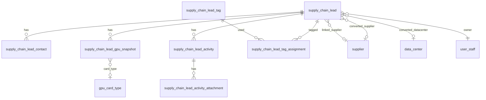
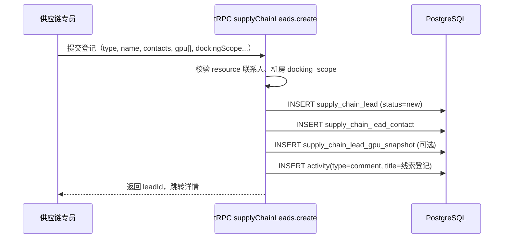
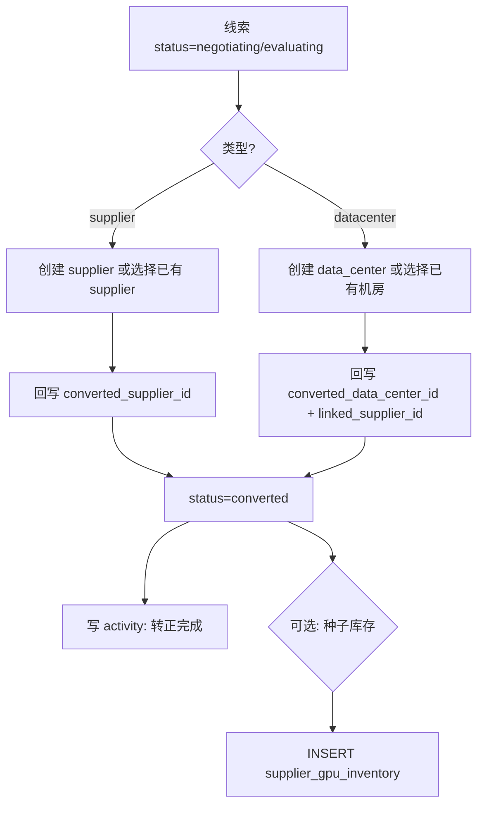

# 供应链线索 — 实现方案

> **版本**：v1.0（设计稿）  
> **日期**：2026-06-12  
> **状态**：待确认 — 确认后再实施数据库迁移与 tRPC / 前端接入  
> **页面 Demo**：`/supplier/leads`（`supply-chain-leads-content.tsx`、`supply-chain-lead-detail-content.tsx` 等，当前为 React Context Mock，未接 tRPC）

**关联文档**：

- [supplier-database.md](./supplier-database.md)（`supplier`、`data_center`、`supplier_gpu_inventory`、`supplier_activity`）
- [entity-contacts-design.md](./entity-contacts-design.md)（多联系人子表模式）
- [supplier-lifecycle-product-plan.md](./supplier-lifecycle-product-plan.md)（供应商转正后全生命周期）
- CRM 项目活动时间线：`project_activity` / `project_activity_attachment`（`crm-schema.ts`）

**文档性质**：从 Demo 页面反推的完整业务流程与数据模型设计；本文 **不修改代码**，供评审与排期。

---

## 1. 背景与目标

### 1.1 业务背景

算力供应链团队在拓展供应商与机房资源时，需要在 **正式接入主数据之前** 登记、跟进、评估线索。与已转正的 `supplier` / `data_center` 不同，线索阶段具有以下特点：

| 特点 | 说明 |
|------|------|
| 信息不完整 | 供应商名称、机房地址、卡型库存可能仅为口头或 Excel 口径 |
| 高频变更 | 对接人、闲置卡数、可用时间、商务条款在接洽期反复更新 |
| 协作跟进 | 供应链、商务、运维多方在同一线索上留痕（活动时间线） |
| 最终转正 | 评估通过后创建或关联正式 `supplier` / `data_center`，进入接入批次等后续流程 |

当前 Demo 页面已覆盖：**列表统计、登记弹窗、详情 Tabs（概览 / 卡型库存 / 活动时间线）、阶段进度、对接范围、卡型多选筛选** 等交互，可作为产品验收基线。

### 1.2 目标（G1–G6）

| # | 目标 | 说明 |
|---|------|------|
| G1 | **统一登记** | 支持登记「供应商线索」「机房线索」两类，字段与 Demo 一致 |
| G2 | **资源可视** | 按线索维护卡型维度：总数、闲置、预留、使用中、参考单价、可用时间 |
| G3 | **对接信息** | 资源对接人、商务对接人可维护；机房展示对接范围（仅Spot / 仅裸金属 / Spot+仅裸金属 / 正常） |
| G4 | **跟进闭环** | 状态机：新建 → 接洽中 → 评估中 → 商务谈判 → 已转正 / 已流失；活动时间线参考项目 |
| G5 | **转正衔接** | 转正后关联 `supplier.id` 或 `data_center.id`，可选将卡型快照写入 `supplier_gpu_inventory` |
| G6 | **权限一致** | 路由 `/supplier/leads` 归属算力供应链域，与现有 `admin` / `member` 角色一致 |

### 1.3 非目标（本期）

- **不** 替代 `supplier_gpu_inventory` 作为财务/运营真值库存（线索库存为经营快照，转正后以主数据为准）
- **不** 实现平台 OpenAPI 自动拉取线索（可二期对接外部招商系统）
- **不** 与 CRM「平台项目」(`project`) 做强制绑定（可二期做「商机关联」扩展字段）
- **不** 在本期删除 Demo Provider；接入 tRPC 后移除 `demo-provider.tsx` 与 `demo-data.ts`

---

## 2. 领域模型

### 2.1 实体关系总览

```text
                    ┌─────────────────────────┐
                    │   supply_chain_lead     │  线索主表（supplier | datacenter）
                    └───────────┬─────────────┘
            ┌───────────────────┼───────────────────┐
            │                   │                   │
            ▼                   ▼                   ▼
┌───────────────────┐ ┌─────────────────┐ ┌──────────────────────────┐
│ lead_contact      │ │ lead_gpu_snapshot│ │ supply_chain_lead_activity│
│ (资源/商务对接人)  │ │ (卡型经营快照)    │ │ (+ attachment)            │
└───────────────────┘ └─────────────────┘ └──────────────────────────┘
            │
            ▼
┌───────────────────┐     转正后 FK（可空）
│ lead_tag_assignment│ ──► supplier / data_center
└───────────────────┘
```

**设计选择：单表 + `type` 区分**（与 Demo `SupplyChainLead.type` 一致），避免供应商/机房线索字段高度重叠却维护两套表。

### 2.2 与现有主数据的关系

| 线索阶段 | 正式主数据 | 关系 |
|----------|-----------|------|
| 供应商线索 `type=supplier` | `supplier` | 转正写入 `converted_supplier_id`；此前 `supplier_name_text` 等文本字段独立存在 |
| 机房线索 `type=datacenter` | `data_center` | 转正写入 `converted_data_center_id`；可挂 `parent_supplier_lead_id` 或 `supplier_lead_id` |
| 机房线索所属供应商 | `supplier` | 接洽期用 `supplier_name_text`；若供应商已转正则 `linked_supplier_id` |

**原则**：线索表 **不** 对 `supplier` / `data_center` 建 NOT NULL FK，避免未转正记录污染主数据约束；转正动作在应用层事务中创建主数据并回写 FK。

### 2.3 卡型库存：快照 vs 主数据

| 层级 | 表 | 语义 |
|------|-----|------|
| 线索快照 | `supply_chain_lead_gpu_snapshot` | 人工登记或 Excel 导入的经营口径；含 `idle`、`reserved`、`available_time` 等 Demo 字段 |
| 正式库存 | `supplier_gpu_inventory` | 接入后的 L1 聚合；`quantity` / `online_quantity` 等，可平台同步 |

转正时可选策略（配置项）：

1. **仅关联**：只写 `converted_data_center_id`，不自动改库存  
2. **种子导入**：按快照 INSERT `supplier_gpu_inventory`（`source=lead_conversion`）  
3. **转正后同步**：若机房已绑定平台，定时 Job 用 `supplier_gpu_inventory` 回写线索快照只读区（详情页标注「来自主数据同步」）

---

## 3. 数据库表结构设计

约定对齐 `supply-schema.ts` / `crm-schema.ts`：主键 `text`（ULID）；金额 `numeric(15,4)`；时间 `timestamptz`；枚举用 `varchar` + 应用层校验。

### 3.1 `supply_chain_lead`（线索主表）

| 列名 | 类型 | 约束 | 说明 |
|------|------|------|------|
| `id` | text | PK | |
| `type` | varchar(16) | NOT NULL | `supplier` \| `datacenter` |
| `code` | varchar(64) | 可空 | 业务编码，转正后可与 `supplier.code` / `data_center.code` 对齐 |
| `name` | varchar(255) | NOT NULL | 供应商名或机房名 |
| `status` | varchar(32) | NOT NULL | 见 §4.1 |
| `priority` | varchar(16) | NOT NULL DEFAULT `medium` | `high` \| `medium` \| `low` |
| `description` | text | 可空 | 备注说明 |
| `source` | varchar(128) | 可空 | 来源渠道：行业峰会、合作伙伴引荐等 |
| `province` | varchar(64) | 可空 | |
| `city` | varchar(64) | 可空 | |
| `address` | text | 可空 | 详细地址（Demo `location`） |
| `supplier_name_text` | varchar(255) | 可空 | 机房线索：所属供应商名称（接洽期） |
| `linked_supplier_id` | text | FK → `supplier.id` SET NULL | 机房线索：已存在的正式供应商 |
| `parent_supplier_lead_id` | text | FK → `supply_chain_lead.id` SET NULL | 机房线索：挂在某供应商线索下 |
| `docking_scope` | varchar(32) | 可空 | 仅 `type=datacenter`：见 §3.6 |
| `estimated_online_date` | date | 可空 | 预计上线日期 |
| `owner_staff_id` | text | FK → `user_staff.id` SET NULL | 跟进人 |
| `converted_supplier_id` | text | FK → `supplier.id` SET NULL | 转正后供应商 |
| `converted_data_center_id` | text | FK → `data_center.id` SET NULL | 转正后机房 |
| `converted_at` | timestamptz | 可空 | 转正时间 |
| `converted_by` | text | FK → `user_staff.id` SET NULL | 转正操作人 |
| `lost_reason` | text | 可空 | 流失原因 |
| `lost_at` | timestamptz | 可空 | |
| `last_activity_at` | timestamptz | NOT NULL | 列表「最近动态」排序；写活动时更新 |
| `created_by` | text | FK → `user_staff.id` SET NULL | |
| `created_at` | timestamptz | NOT NULL DEFAULT now() | |
| `updated_at` | timestamptz | NOT NULL | |

**索引建议**：

```sql
CREATE INDEX supply_chain_lead_type_status_idx ON supply_chain_lead (type, status);
CREATE INDEX supply_chain_lead_owner_staff_id_idx ON supply_chain_lead (owner_staff_id);
CREATE INDEX supply_chain_lead_last_activity_at_idx ON supply_chain_lead (last_activity_at DESC);
CREATE INDEX supply_chain_lead_linked_supplier_id_idx ON supply_chain_lead (linked_supplier_id);
CREATE INDEX supply_chain_lead_converted_supplier_id_idx ON supply_chain_lead (converted_supplier_id);
CREATE INDEX supply_chain_lead_converted_data_center_id_idx ON supply_chain_lead (converted_data_center_id);
```

**CHECK（应用层为主，可选 DB）**：

- `type = 'datacenter'` 时 `docking_scope` 允许非空；`type = 'supplier'` 时 `docking_scope` 必须为 NULL  
- `status = 'converted'` 时 `converted_supplier_id` 或 `converted_data_center_id` 至少一个非空（按 type）

### 3.2 `supply_chain_lead_contact`（对接人）

对齐 [entity-contacts-design.md](./entity-contacts-design.md) 子表模式，一条线索多条联系人，用 `contact_role` 区分 Demo 中的资源/商务对接人。

| 列名 | 类型 | 约束 | 说明 |
|------|------|------|------|
| `id` | text | PK | |
| `lead_id` | text | FK NOT NULL CASCADE → `supply_chain_lead.id` | |
| `contact_role` | varchar(32) | NOT NULL | `resource`（资源对接人）\| `business`（商务对接人）\| `other` |
| `name` | varchar(128) | NOT NULL | |
| `title` | varchar(64) | 可空 | 职务 |
| `phone` | varchar(32) | 可空 | |
| `email` | varchar(255) | 可空 | |
| `wechat_id` | varchar(128) | 可空 | |
| `is_primary` | boolean | NOT NULL DEFAULT false | 同 role 下至多一条 primary |
| `sort_order` | integer | NOT NULL DEFAULT 0 | |
| `created_at` | timestamptz | NOT NULL | |
| `updated_at` | timestamptz | NOT NULL | |

**部分唯一索引**（每个 lead + role 至多一个 primary）：

```sql
CREATE UNIQUE INDEX supply_chain_lead_contact_primary_uk
  ON supply_chain_lead_contact (lead_id, contact_role)
  WHERE is_primary = true;
```

登记弹窗最小字段：至少一条 `contact_role=resource` 且 `name` 非空（与 Demo 校验一致）。

### 3.3 `supply_chain_lead_gpu_snapshot`（卡型经营快照）

| 列名 | 类型 | 约束 | 说明 |
|------|------|------|------|
| `id` | text | PK | |
| `lead_id` | text | FK NOT NULL CASCADE | |
| `gpu_card_type_id` | text | FK → `gpu_card_type.id` SET NULL | 优先关联字典；手工录入卡型名时可为空 |
| `card_type_name` | varchar(128) | NOT NULL | 展示名（与 Demo `cardType` 一致）；可与字典 name 冗余 |
| `total_quantity` | integer | NOT NULL DEFAULT 0 | 总数 |
| `idle_quantity` | integer | NOT NULL DEFAULT 0 | 闲置 |
| `reserved_quantity` | integer | NOT NULL DEFAULT 0 | 预留 |
| `in_use_quantity` | integer | NOT NULL DEFAULT 0 | 使用中；默认 `total - idle - reserved`，可人工覆盖 |
| `unit_price_per_hour` | numeric(15,4) | 可空 | 参考单价 |
| `available_time` | varchar(255) | 可空 | 可用时间，自由文本：「7×24」「工作日 9:00-18:00」 |
| `notes` | text | 可空 | |
| `source` | varchar(32) | NOT NULL DEFAULT `manual` | `manual` \| `import` \| `master_data_sync` |
| `snapshot_at` | timestamptz | NOT NULL DEFAULT now() | 本条快照时间（列表/详情展示「更新时间」） |
| `created_by` | text | FK → `user_staff.id` SET NULL | |
| `created_at` | timestamptz | NOT NULL | |
| `updated_at` | timestamptz | NOT NULL | |

**唯一约束**：`(lead_id, card_type_name)` — 同一线索下同卡型仅一行当前快照（更新走 UPDATE，历史进 changelog 表，见 §3.3.1）。

**索引**：`(lead_id)`、`(gpu_card_type_id)` — 支撑卡型多选筛选。

#### 3.3.1 `supply_chain_lead_gpu_snapshot_changelog`（可选，建议二期）

记录每次库存变更，用于活动时间线 `resource_update` 自动摘要与审计。

| 列名 | 说明 |
|------|------|
| `id`, `snapshot_id`, `lead_id` | |
| `changed_fields` | jsonb，如 `{ "idle_quantity": [128, 96] }` |
| `changed_by`, `changed_at` | |

### 3.4 标签

复用「字典 + 关联」模式（参考 `project_tag`）。

**`supply_chain_lead_tag`**

| 列名 | 类型 | 说明 |
|------|------|------|
| `id` | text PK | |
| `name` | varchar(128) UNIQUE NOT NULL | |
| `sort_order` | integer DEFAULT 0 | |

**`supply_chain_lead_tag_assignment`**

| 列名 | 类型 | 说明 |
|------|------|------|
| `lead_id` | text FK CASCADE | |
| `tag_id` | text FK CASCADE | |
| PK | `(lead_id, tag_id)` | |

### 3.5 `supply_chain_lead_activity`（活动时间线）

对齐 `project_activity` / `supplier_activity` 字段风格。

| 列名 | 类型 | 约束 | 说明 |
|------|------|------|------|
| `id` | text | PK | |
| `lead_id` | text | FK NOT NULL CASCADE | |
| `type` | varchar(32) | NOT NULL | 见 §4.3 |
| `title` | varchar(255) | NOT NULL | |
| `description` | text | 可空 | Markdown 正文 |
| `author_staff_id` | text | FK → `user_staff.id` SET NULL | |
| `author_name` | varchar(128) | 可空 | 冗余展示名 |
| `author_role` | varchar(32) | 可空 | `supply` \| `business` \| `ops` \| `system` |
| `metadata` | jsonb | 可空 | 会议时长、参与人等 |
| `ref_domain` | varchar(64) | 可空 | 扩展：关联合同、批次等 |
| `ref_id` | text | 可空 | |
| `occurred_at` | timestamptz | NOT NULL | 业务发生时间；默认 now() |
| `created_at` | timestamptz | NOT NULL | |
| `updated_at` | timestamptz | 可空 | 评论编辑时间（Demo `editedAt`） |

**索引**：`(lead_id, occurred_at DESC)`

**`supply_chain_lead_activity_attachment`**

| 列名 | 类型 | 说明 |
|------|------|------|
| `id` | text PK | |
| `activity_id` | text FK CASCADE | |
| `file_name` | varchar(255) | |
| `file_size` | bigint | |
| `mime_type` | varchar(128) | |
| `storage_uri` | varchar(1024) | 对象存储路径 |

### 3.6 枚举字典

#### 线索状态 `status`

| 值 | 中文 | 说明 |
|----|------|------|
| `new` | 新建 | 刚登记 |
| `contacting` | 接洽中 | 已建立联系 |
| `evaluating` | 评估中 | 技术/资源评估 |
| `negotiating` | 商务谈判 | 合同与条款 |
| `converted` | 已转正 | 已创建/关联主数据 |
| `lost` | 已流失 | 关闭，需 `lost_reason` |

阶段条 UI 展示 `new → contacting → evaluating → negotiating → converted`；`lost` 单独展示，不占进度条节点（与 Demo 一致）。

#### 机房对接范围 `docking_scope`

| 值 | 中文 |
|----|------|
| `spot_only` | 仅Spot |
| `bare_metal_only` | 仅裸金属 |
| `spot_and_bare_metal` | Spot+仅裸金属 |
| `normal` | 正常 |

#### 活动类型 `activity.type`

| 值 | 中文 | 触发方式 |
|----|------|----------|
| `comment` | 评论 | 用户手动 |
| `meeting` | 会议 | 用户手动 |
| `site_visit` | 现场勘查 | 用户手动 |
| `file` | 附件 | 上传文件 |
| `stage_change` | 状态变更 | 系统：`status` 变更时自动写入 |
| `resource_update` | 资源数据更新 | 系统：GPU 快照变更时自动写入 |

### 3.7 ER 图（Mermaid）



---

## 4. 业务流程

### 4.1 线索登记



**规则**：

- 默认 `owner_staff_id` = 当前登录员工  
- 机房线索必须选 `docking_scope`（默认 `normal`）  
- 卡型 `available_time` 选填；`in_use_quantity` 可由 `total - idle - reserved` 推导  

### 4.2 跟进与状态推进

| 动作 | 权限 | 系统行为 |
|------|------|----------|
| 修改 status | owner 或 admin | 写 `supply_chain_lead_activity`(stage_change)；更新 `last_activity_at` |
| 发表评论 | 有供应链菜单权限 | 写 activity(comment)；可编辑自己的 comment（更新 `updated_at`） |
| 更新 GPU 快照 | 同上 | UPSERT snapshot；写 activity(resource_update) |
| 标记流失 | 同上 | status=lost；必填 `lost_reason` |

状态 **禁止** 从 `converted` 回退到跟进中（需走「复制为新线索」或管理员特例，二期定义）。

### 4.3 转正（Convert）



**供应商线索转正** — 创建 `supplier` 最小字段：

- `code`：可由线索 code 生成或系统流水  
- `name` / `short_name`  
- `status`：`pending` 或 `active`（与 supplier-database 口径一致）  
- `contact_*`：从 `contact_role=resource` 主联系人映射  
- `business_manager_staff_id`：线索 `owner_staff_id`  
- `source`：`lead_conversion`  

**机房线索转正** — 创建 `data_center`：

- 必须解析 `linked_supplier_id`（选已有供应商）或同时转正/创建供应商  
- `docking_scope` **不** 直接映射 `data_center` 列（主数据无此字段）；可写入 `description` 或扩展 `region_tags` / jsonb 元数据，或在 `data_center` 增加 `docking_scope` 列（需 supplier-database 小版本升级）  
- 建议在 `data_center` 增加可空列 `docking_scope varchar(32)`，避免信息丢失  

**转正 UI**：详情页增加「转正」按钮 → 向导 Dialog（预览将创建的主数据字段、选择种子库存策略）→ 成功后跳转 `/supplier/suppliers/[id]` 或 `/supplier/datacenters/[id]`。

### 4.4 列表查询与筛选

与 Demo 对齐的查询参数：

| 参数 | 类型 | 说明 |
|------|------|------|
| `search` | string | 名称、supplier_name_text、城市、对接人姓名、标签名 ILIKE |
| `type` | `supplier` \| `datacenter` \| `all` | |
| `status` | 枚举 \| `all` | |
| `priority` | 枚举 \| `all` | |
| `cardTypeIds` | string[] | 多选：`gpu_card_type_id` 或 `card_type_name` 匹配，线索 OR 逻辑 |
| `ownerStaffId` | string | 跟进人筛选（admin 可见全员） |
| `page` / `pageSize` | number | 分页 |

**统计卡片 SQL 口径**：

- 线索总数：`COUNT(*)`  
- 跟进中：`status NOT IN ('converted','lost')`  
- 机房 GPU 总量 / 闲置：仅 `type=datacenter` 的 snapshot 聚合 `SUM(total_quantity)` / `SUM(idle_quantity)`  

### 4.5 「实时」库存理解

Demo 文案「实时了解机房卡型」在实现上分阶段：

| 阶段 | 行为 |
|------|------|
| **M1** | 人工在详情页编辑快照，立即生效 |
| **M2** | 转正且 `converted_data_center_id` 非空时，详情只读区展示 `supplier_gpu_inventory` 对比（差异高亮） |
| **M3** | 定时 Job 从 `supplier_gpu_inventory` 同步到 snapshot（`source=master_data_sync`），列表标注同步时间 |

---

## 5. API 设计（tRPC）

命名空间建议：`supplier.supplyChainLeads` 或顶层 `supplyChainLeads`（与 `supplier.list` 并列）。以下用 `supplyChainLeads` 示例。

### 5.1 Procedures

| Procedure | 类型 | 说明 |
|-----------|------|------|
| `list` | query | 列表 + 筛选分页 |
| `getById` | query | 详情（含 contacts、snapshots、tags、recent activities） |
| `create` | mutation | 登记 |
| `update` | mutation | 更新基本信息 |
| `updateStatus` | mutation | 状态变更 + 自动 activity |
| `upsertGpuSnapshot` | mutation | 单卡型 UPSERT |
| `deleteGpuSnapshot` | mutation | 删除卡型行 |
| `replaceGpuSnapshots` | mutation | 批量覆盖（导入用） |
| `listActivities` | query | 时间线分页 |
| `createActivity` | mutation | 评论/会议等 |
| `updateActivity` | mutation | 编辑自己的 comment |
| `createActivityAttachment` | mutation | 上传附件（base64 / presigned） |
| `convert` | mutation | 转正向导提交 |
| `listTags` | query | 标签字典 |
| `setTags` | mutation | 替换线索标签 |
| `stats` | query | 列表顶栏统计 |
| `listCardTypeFilterOptions` | query | 从 snapshot 聚合 DISTINCT 卡型 |

### 5.2 权限

沿用 `route-access`：`admin` / `member` 可访问；写操作使用现有 supply 写 procedure（与 `supplier.createSupplierActivity` 同级）。

| 操作 | admin | member |
|------|-------|--------|
| 列表/详情 | ✓ | ✓ |
| 登记/编辑/活动 | ✓ | ✓ |
| 转正 | ✓ | 可配置仅 admin |
| 删除线索 | ✓ | ✗ |

### 5.3 输入 Schema 示例（Zod 摘要）

```typescript
// create
{
  type: z.enum(['supplier', 'datacenter']),
  name: z.string().min(1),
  priority: z.enum(['high', 'medium', 'low']).default('medium'),
  supplierNameText: z.string().optional(),      // datacenter
  dockingScope: z.enum([...]).optional(),       // datacenter 必填
  province, city, address, source, description,
  estimatedOnlineDate: z.string().date().optional(),
  resourceContact: contactSchema,
  businessContact: contactSchema.optional(),
  gpuSnapshots: z.array(gpuSnapshotInputSchema).optional(),
  tagIds: z.string().array().optional(),
}

// list
{
  search: z.string().optional(),
  type: z.enum(['supplier', 'datacenter', 'all']).default('all'),
  status: z.enum([...]).or(z.literal('all')).default('all'),
  priority: z.enum([...]).or(z.literal('all')).default('all'),
  cardTypeIds: z.string().array().optional(),
  ownerStaffId: z.string().optional(),
  page: z.number().int().min(1).default(1),
  pageSize: z.number().int().min(1).max(100).default(20),
}
```

---

## 6. 前端接入计划

### 6.1 替换 Demo 数据层

| 现状 | 目标 |
|------|------|
| `SupplyChainLeadsDemoProvider` | 删除；页面直接 `trpc.supplyChainLeads.*` |
| `demo-data.ts` | 删除；可选保留为 Storybook seed |
| `supply-chain-lead-create-dialog.tsx` | `create` mutation + 卡型联想 `gpu_card_type` 下拉 |
| `supply-chain-leads-content.tsx` | `list` + `stats` query |
| `supply-chain-lead-detail-content.tsx` | `getById` + `updateStatus` |
| `supply-chain-lead-timeline-panel.tsx` | 对齐 `ProjectTimelinePanel`：附件上传、会议元数据 |

### 6.2 新增/增强 UI（转正后）

| 组件 | 说明 |
|------|------|
| `SupplyChainLeadConvertDialog` | 转正向导 |
| `SupplyChainLeadGpuEditDialog` | 详情页编辑单卡型（含 available_time） |
| `SupplyChainLeadImportDialog` | 二期：Excel 批量登记 |
| 主数据跳转链接 | `converted_*_id` 存在时显示「查看正式供应商/机房」 |

### 6.3 卡型筛选

- 多选数据源：`listCardTypeFilterOptions` 返回 `{ id, name, leadCount }[]`  
- 筛选逻辑：线索存在任一选中卡型（按 `gpu_card_type_id` 或 `card_type_name`）  
- UI 保持 Demo 的 `DropdownMenuCheckboxItem` 模式  

---

## 7. 数据访问层（dataaccess）

建议目录：`apps/web/src/lib/server/dataaccess/supplier/supply-chain-leads.ts`

| 函数 | 职责 |
|------|------|
| `listSupplyChainLeads(input)` | 动态 WHERE + JOIN snapshot 做卡型筛选 |
| `getSupplyChainLeadById(id)` | 聚合查询 |
| `createSupplyChainLead(input, actorStaffId)` | 事务：lead + contacts + snapshots + activity |
| `updateLeadStatus(id, status, actor)` | 事务 + stage_change activity |
| `upsertLeadGpuSnapshot(...)` | UPSERT + resource_update activity |
| `listLeadActivities(leadId, cursor?)` | 按 `occurred_at` 降序 |
| `convertLead(input, actor)` | 转正大事务 |
| `aggregateLeadStats()` | 顶栏统计 |

**列表性能**：卡型筛选使用 `EXISTS (SELECT 1 FROM supply_chain_lead_gpu_snapshot s WHERE s.lead_id = l.id AND s.gpu_card_type_id = ANY(...))`，避免 JOIN 放大行数。

---

## 8. 迁移与上线

### 8.1 Drizzle 迁移步骤

1. 在 `packages/db/src/supply-schema.ts` 增加 §3 各表定义与 relations  
2. `pnpm db:generate` 生成 migration SQL  
3. 评审 SQL 后 `pnpm db:migrate`  
4. （可选）`data_center` 增加 `docking_scope` 列 — 单独 migration  

### 8.2 种子数据

- 插入常用 `supply_chain_lead_tag`：IB 网络、训练场景、推理场景等  
- 不导入 Demo 假数据到生产  

### 8.3 回滚

- 线索表独立，删除 migration 即可回滚（注意无生产数据前）  
- 转正后 FK 指向 `supplier` / `data_center` 时，删除线索应 **restrict** 或软删除 — 建议线索 **不物理删除**，仅 `lost` / 归档  

---

## 9. 实施分期

| 阶段 | 范围 | 交付物 |
|------|------|--------|
| **P1 — 核心 CRUD** | 表 3.1–3.3、3.5；tRPC list/get/create/update/status；前端去掉 Demo Provider | 可登记、列表筛选、详情概览 |
| **P2 — 时间线** | 活动 + 附件；评论编辑 | 与项目时间线体验一致 |
| **P3 — 标签与统计** | 3.4、stats API；卡型多选筛选接 DB | 与 Demo 功能 parity |
| **P4 — 转正** | convert 流程、`data_center.docking_scope`、跳转主数据 | 业务闭环 |
| **P5 — 库存同步** | 读 `supplier_gpu_inventory`、changelog、导入 | 「实时」库存 |

---

## 10. 测试要点

| 场景 | 预期 |
|------|------|
| 登记机房无 docking_scope | 校验失败 |
| 登记供应商带 docking_scope | 忽略或校验失败 |
| 卡型仅填名称不关联字典 | 允许，`gpu_card_type_id` 为空 |
| 多选卡型筛选 H800+L40S | 返回含任一卡型的线索 |
| 状态改为 evaluating | 自动产生 stage_change 活动 |
| 转正供应商线索 | `supplier` 创建，`converted_supplier_id` 回写，status=converted |
| 转正后编辑快照 | 允许但 UI 提示「已转正，建议改主数据库存」 |
| 并发编辑 GPU | `updated_at` 乐观锁或最后写入 wins（二期加强） |

---

## 11. 开放问题（待产品确认）

1. **机房线索是否必须关联供应商线索**，还是仅文本 `supplier_name_text` 即可？  
2. **转正是否必须走审批流**（如仅 admin 可点转正）？  
3. **`Spot+仅裸金属` 与 `正常` 的业务定义** 是否需要帮助文案/tooltip？  
4. **可用时间** 是否二期改为结构化（星期 + 时段 CRON），还是长期自由文本？  
5. **已转正线索** 是否从默认列表隐藏（筛选默认排除 `converted`）？  
6. **`data_center.docking_scope`** 是否纳入 [supplier-database.md](./supplier-database.md) v1.5 正式字段？  

---

## 12. 附录：Demo 字段 → 数据库列映射

| Demo 字段 | 数据库 |
|-----------|--------|
| `id` | `supply_chain_lead.id` |
| `type` | `type` |
| `name` | `name` |
| `code` | `code` |
| `status` | `status` |
| `priority` | `priority` |
| `supplierName` | `supplier_name_text` / `linked_supplier_id` |
| `location` | `address` |
| `province` / `city` | 同名列 |
| `description` | `description` |
| `source` | `source` |
| `ownerStaffName` | JOIN `user_staff.display_name` |
| `resourceContact` | `supply_chain_lead_contact` (`contact_role=resource`) |
| `businessContact` | `contact_role=business` |
| `dockingScope` | `docking_scope` |
| `gpuResources[].cardType` | `card_type_name` + 可选 `gpu_card_type_id` |
| `gpuResources[].total/idle/reserved/inUse` | `total_quantity` 等 |
| `gpuResources[].unitPrice` | `unit_price_per_hour` |
| `gpuResources[].availableTime` | `available_time` |
| `gpuResources[].updatedAt` | `snapshot_at` |
| `tags[]` | `supply_chain_lead_tag_assignment` |
| `estimatedOnlineDate` | `estimated_online_date` |
| `lastActivityAt` | `last_activity_at` |
| Activity 全部字段 | `supply_chain_lead_activity` (+ `updated_at` 作 `editedAt`) |

---

**文档结束** — 确认 §11 开放问题后，可进入 P1 数据库迁移与 tRPC 开发。
