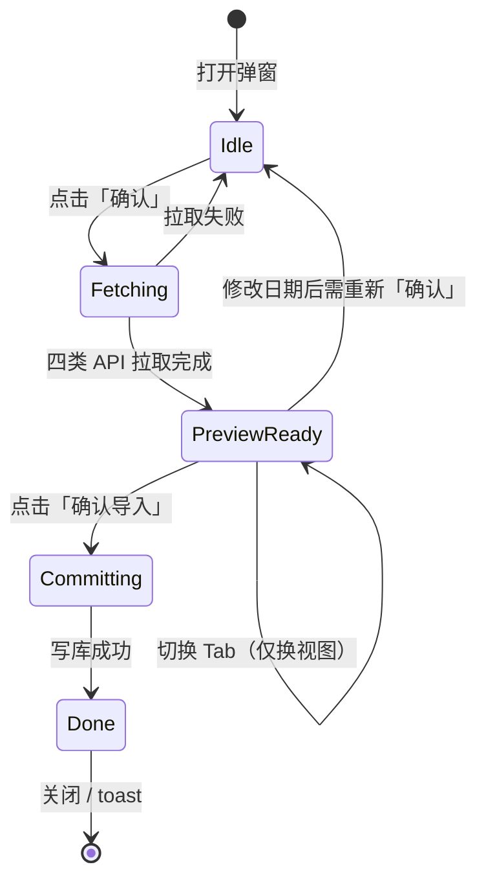
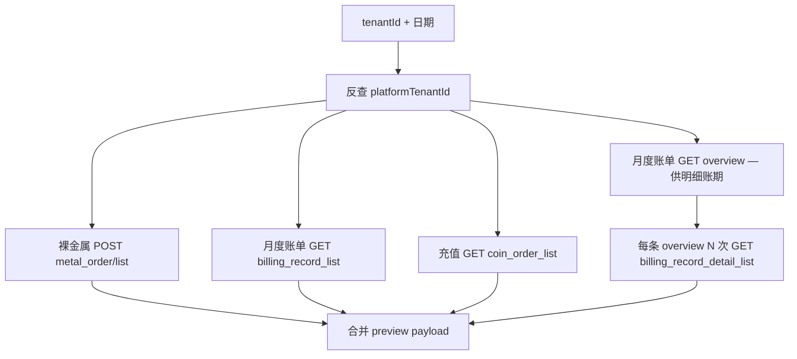
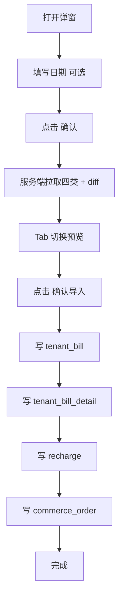

# 租户账单与明细导入设计方案

> 版本：v1.2（设计稿）  
> 日期：2026-05-22  
> 变更：v1.2 — 确认 UI 交互：「确认」拉取数据 → Tab 切换预览 →「确认导入」写库  
> 变更：v1.1 — 确认 Q1/Q2/Q4/Q6；租户详情页仅展示平台租户 ID；金额固定换算为人民币元  
> 状态：**设计稿 — §5.2 明细数据源策略待确认后可实施**  
> 关联：`apps/web/src/lib/server/integrations/api.ts`、`packages/db/src/crm-schema.ts`（`tenant_bill` / `tenant_bill_detail` / `commerce_order` / `recharge`）、`platform-tenant-import-design.md`

---

## 1. 目标与原则

### 1.1 业务目标


| #   | 目标              | 说明                                                                                                     |
| --- | --------------- | ------------------------------------------------------------------------------------------------------ |
| G1  | 按平台租户 ID 拉取账单数据 | 输入 **平台租户 ID**（`tenant_tid`，如 `984`），可选 **开始日期 / 结束日期**，从算算力 OpenAPI 拉取                                |
| G2  | 四类数据 **Tab 分别预览** | 裸金属订单、月度账单、充值、账单明细在 **同一弹窗** 内用 Tab 切换预览；**一次「确认」拉取、一次「确认导入」写库** |
| G3  | 写入 CRM 域表       | 落库至 `commerce_order`（+ `commerce_order_item`）、`tenant_bill`、`recharge`、`tenant_bill_detail`            |
| G4  | 账单明细依赖账单头       | `getBillOverviewDetailAPI` 的查询范围 **必须** 与 `getBillOverviewAPI` 返回的每条记录的 `start_time` / `end_time` 一一对应 |
| G5  | 幂等与可重导          | 同一平台订单号 / 充值流水 / 租户账期重复导入时 **更新** 而非重复插入                                                               |


### 1.2 非目标（本期）

- 不替代财务域 `billing_period` Excel 导入（见 `billing-period-import-design.md`）
- 不同步 Pod 任务级消费流水、Harbor 明细行级账单（仅月度汇总 + 产品线拆分）
- 不自动创建 `customer` / `project`；租户须 **已存在于 CRM**（通过平台租户导入或手工维护）
- 不拉取裸金属订单 **详情接口**（`getMetalOrderDetail`），列表字段足够则不入详情 API

### 1.3 设计原则

1. **平台请求走服务端**：复用 `request.ts` / 环境变量鉴权，浏览器不直连 OpenAPI。
2. **三步交互**：**确认（获取）→ Tab 预览 → 确认导入（写库）**；Tab 切换 **不触发** 新请求，仅切换已拉取数据的展示。
3. **分页拉全量**：所有列表 API 按 `page` / `page_size` 循环直至 `results.length < page_size` 或累计 ≥ `count`。
4. **金额统一为人民币元**：平台 API 返回的数值经专用函数 `platformAmountToRmb()` **固定换算为 RMB（元）** 后入库；不依赖 `SUANLI_COIN_UNIT` 环境变量；`money` 字段保留 4 位小数。
5. **租户上下文在服务端解析**：租户详情页 **不向用户暴露 CRM 内部 ID**；路由 `[id]` 仅在服务端用于反查 `platformTenantId` 与写库 `tenant_id`。

---

## 2. 输入参数

### 2.1 入口与租户标识（已确认）

**唯一入口：租户详情页**（`/crm/tenants/[id]`）。

| 层级 | 标识 | 说明 |
|------|------|------|
| 用户可见 | **平台租户 ID** | 弹窗顶部只读展示，如 `984 · 面壁数据中心`；用户 **无需输入、不见 CRM UUID** |
| 服务端内部 | CRM `tenant.id` | 来自详情页路由 `[id]`，仅 tRPC / data access 使用 |
| OpenAPI | `tenant_tid` / `tenant_ids` | 由服务端从 `billingTenant.platformTenantId` 解析；缺失则 preview 失败 |

弹窗内用户仅需（可选）填写 **开始日期 / 结束日期**；点击 **「确认」** 后开始拉取，再用 **Tab** 切换预览四类数据。

### 2.2 公共入参（tRPC / 服务端）


| 参数 | 类型 | 必填 | 说明 |
|------|------|------|------|
| `tenantId` | `string` | 是 | CRM 租户主键；**由详情页上下文传入**，非用户手填 |
| `startDate` | `string` (YYYY-MM-DD) | 否 | 过滤起始；不传则 API 传空字符串 |
| `endDate` | `string` (YYYY-MM-DD) | 否 | 过滤结束；不传则 API 传空字符串 |

服务端流程：`tenantId` → 查 `billingTenant` → 得到 `platformTenantId` → 调 OpenAPI。

> **日期校验**：若只传 `startDate` 不传 `endDate`（或反之），preview 报错；要么都传要么都不传。

### 2.3 金额换算（已确认：统一为 RMB）

平台四类 API 中的金额字段（如 `total_price`、`total_billing_value`、`total_amount`、`billing_value`、`discount_value`）在 **写入 DB 前** 一律转换为 **人民币元（CNY）**：

```typescript
/** 平台计费整数 → 人民币元；规则写死在代码中，不读环境变量 */
function platformAmountToRmb(raw: number | null | undefined): string {
  // 除数在首次联调租户 984 时确定并固化（如 /10000 或 /100）
  return (raw / DIVISOR).toFixed(4)
}
```

| 要求 | 说明 |
|------|------|
| 存储单位 | 元（RMB），`money` / `decimal(15,4)` |
| 预览展示 | 格式化为「¥ x,xxx.xx」 |
| 与租户余额导入 | **独立规则**：本功能不使用 `platformCoinToYuan` / `SUANLI_COIN_UNIT` |

实施第一步：用租户 984 抽样（充值 43000000、月账单 234703140855 等）反推并 **写死** `DIVISOR`，写入单元测试。

### 2.4 日期 → OpenAPI 传参规则

不同 API 对时间格式要求不同，需在 adapter 层统一转换：


| 导入类型  | API                        | 时间参数名                                 | 建议格式                                                             |
| ----- | -------------------------- | ------------------------------------- | ---------------------------------------------------------------- |
| 裸金属订单 | `getMetalOrderListList`    | `conditional.start_time` / `end_time` | 空字符串或 `"YYYY-MM-DD HH:mm:ss"`（待联调确认）                             |
| 月度账单  | `getBillOverviewAPI`       | `start_time` / `end_time`             | ISO UTC，如 `2026-03-31T16:00:00.000Z`（用户选日期按 **东八区日界** 转 UTC）     |
| 充值列表  | `getCoinOrderListAPI`      | `start_time` / `end_time`             | 空字符串或 ISO / 平台约定格式（待联调）                                          |
| 账单明细  | `getBillOverviewDetailAPI` | `start_time` / `end_time`             | **必须与账单头一致**，如 `2026-05-01T00:00:00+08:00`（来自 overview 返回值，原样传递） |


**月度账单 overview 的 UTC 换算示例**（与用户示例一致）：

- 用户选 `startDate=2026-04-01`、`endDate=2026-05-31`（含首尾，东八区自然日）
- 传给 overview：`start_time=2026-03-31T16:00:00.000Z`，`end_time=2026-05-31T16:00:00.000Z`
- 固定 `range=month`

---

## 3. 外部 API 与封装

现有封装位于 `apps/web/src/lib/server/integrations/api.ts`，实施时新增 `**suanli-billing-api.ts`**（Zod 校验 + 分页 + 错误类 `SuanliOpenApiError`），避免在 data access 层直接依赖弱类型 `ResWithAny`。

### 3.1 裸金属订单 — `getMetalOrderListList`


| 项    | 值                                                                                                                            |
| ---- | ---------------------------------------------------------------------------------------------------------------------------- |
| 方法   | `POST`                                                                                                                       |
| Path | `/admin/metal_order/list`                                                                                                    |
| Body | `{ page, page_size, conditional: { tenant_tid, condition:"", idc_ids:"", status:"", is_paid: true, start_time, end_time } }` |


**关键响应字段 → 目标表**


| 平台字段           | 目标                        | 规则                                                                       |
| -------------- | ------------------------- | ------------------------------------------------------------------------ |
| `order_no`     | `commerce_order.order_no` | 幂等键；`order_no` 唯一索引                                                      |
| `order_id`     | `commerce_order.id`       | 建议 `metal-{order_id}` 稳定主键                                               |
| `tenant_id`    | 解析 CRM `tenant_id`        | 经 `platformTenantId`                                                     |
| `total_price`  | `amount`                  | `platformAmountToRmb`                                                    |
| `status`       | `status`                  | 映射：`Finished`→`completed`，其它待补全                                          |
| `create_time`  | `created_at`              | 解析时区                                                                     |
| `billing_type` | `unit`                    | `Hour`→`hour` 等                                                          |
| `idc_name`     | `data_center_name`        |                                                                          |
| `device_count` | `device_count`            |                                                                          |
| `gpu_models[]` | `commerce_order_item`     | 每 GPU 型号一行；`name=gpu_model`，`quantity=gpu_count`，`total=total_price`（行级） |
| —              | `product_line`            | 固定 `bare_metal`                                                          |
| —              | `project_id`              | **null**（租户级导入，不绑项目）                                                     |


**过滤**：请求体固定 `is_paid: true`，仅导入已支付订单。

### 3.2 月度账单 — `getBillOverviewAPI`


| 项     | 值                                                                          |
| ----- | -------------------------------------------------------------------------- |
| 方法    | `GET`                                                                      |
| Path  | `/admin/tenant/billing_record_list`                                        |
| Query | `tenant_tid`, `range=month`, `start_time`, `end_time`, `page`, `page_size` |


**关键响应字段 → `tenant_bill`**


| 平台字段                   | DB 列             | 规则                                                         |
| ---------------------- | ---------------- | ---------------------------------------------------------- |
| `start_time`           | `bill_month`     | 取东八区月份 `YYYY-MM`；**同时持久化** `platform_period_start`（见 §4.2） |
| `end_time`             | —                | 持久化 `platform_period_end`，供明细 API 使用                       |
| `total_billing_value`  | `total_amount`   | `platformAmountToRmb`                                      |
| `total_discount_value` | `coupon_amount`  | 券/优惠消费                                                     |
| —                      | `balance_amount` | `total_amount - coupon_amount`（≥0）                         |
| —                      | `tenant_id`      | CRM 租户 ID                                                  |
| —                      | `customer_id`    | 来自 `billingTenant.customerId`                              |
| —                      | `project_id`     | **null**（已确认：租户级导入不绑项目）                                      |
| —                      | `status`         | 默认 `paid`（平台月结视为已出账）                                       |
| —                      | `due_date`       | `bill_month` 当月 15 日（可配置常量）                                |
| —                      | `paid_at`        | `end_time` 或 null                                          |


**幂等键**：`(tenant_id, bill_month)` — **已确认** 需 migration 增加 `tenant_bill_tenant_month_uk (tenant_id, bill_month)`（见 §4.2）。

### 3.3 充值列表 — `getCoinOrderListAPI`


| 项     | 值                                                                                                                |
| ----- | ---------------------------------------------------------------------------------------------------------------- |
| 方法    | `GET`                                                                                                            |
| Path  | `/admin/tenant/coin_order_list`                                                                                  |
| Query | `tenant_ids`, `status=Completed`, `types=`, `start_time`, `end_time`, `page`, `page_size`, `order_type=Recharge` |


**关键响应字段 → `recharge`**


| 平台字段               | DB 列             | 规则                                                   |
| ------------------ | ---------------- | ---------------------------------------------------- |
| `order_id`         | `transaction_id` | 幂等键；唯一索引                                             |
| `id`               | `id`             | `recharge-{id}`                                      |
| `tenant_id`        | `tenant_id`      | CRM 租户 ID                                            |
| `total_amount`     | `amount`         | `platformAmountToRmb`                                  |
| `pay_channel`      | `payment_method` | `Offline`→`bank`，`WeChat`→`wechat`，`Alipay`→`alipay` |
| `status`           | `status`         | `Completed`→`paid`                                   |
| `create_time`      | `created_at`     |                                                      |
| `last_update_time` | `completed_at`   |                                                      |
| `remark`           | `remark`         | 可选写入 `project_activity` 或忽略（本期忽略）                    |
| —                  | `project_id`     | null                                                 |


> **表选择**：使用 `recharge`（含 `transaction_id`、支付方式、状态），不使用 `recharge_order`（字段较少且无流水号唯一约束）。

### 3.4 月度账单明细 — `getBillOverviewDetailAPI`


| 项     | 值                                                     |
| ----- | ----------------------------------------------------- |
| 方法    | `GET`                                                 |
| Path  | `/admin/tenant/billing_record_detail_list`            |
| Query | `tenant_tid`, `start_time`, `end_time`, `range=month` |


**依赖关系（核心）**

```mermaid
flowchart LR
  A[getBillOverviewAPI] --> B[results 共 N 条]
  B --> C1[明细请求 1: start_time/end_time 来自 result[0]]
  B --> C2[明细请求 2: result[1]]
  B --> CN[明细请求 N: result[N-1]]
  C1 --> D1[写入 tenant_bill_detail]
  C2 --> D2[写入 tenant_bill_detail]
  CN --> DN[写入 tenant_bill_detail]
```


1. **获取阶段（点击「确认」）**：以 **当次** `getBillOverviewAPI` 返回的每条 `start_time/end_time` 串行调用 detail API；**不依赖**本地是否已有 `tenant_bill`（与 §5.4 推荐策略一致）。
2. **导入阶段（点击「确认导入」）**：先 upsert `tenant_bill`，再 replace 对应 `tenant_bill_detail`。
3. 将 detail 的 `amounts` 对象 **展开为多行** `tenant_bill_detail`；跳过 `billing_value=0 && discount_value=0` 的项（preview 展示跳过数）。

**产品线映射**（`amounts` key → `product_line` / `resource_name`）


| 平台 Key                | product_line        | resource_name |
| --------------------- | ------------------- | ------------- |
| `Pod:Job`             | `pod_job`           | Job           |
| `Pod:Deployment`      | `pod_deployment`    | Deployment    |
| `Pod:Development`     | `pod_development`   | Development   |
| `BareMetalFullRental` | `bare_metal`        | 裸金属整租         |
| `Juicefs`             | `juicefs`           | JuiceFS       |
| `ShareStorage`        | `share_storage`     | 共享存储          |
| `Harbor`              | `harbor`            | Harbor        |
| `PrepaidDeduction`    | `prepaid_deduction` | 预付费抵扣         |
| *未知 key*              | 原样 snake_case       | 原 key         |


**明细行字段**


| 来源                       | DB 列                            | 规则                                     |
| ------------------------ | ------------------------------- | -------------------------------------- |
| `billing_value`          | `amount`                        | `platformAmountToRmb`                      |
| `discount_value`         | `coupon_amount`                 | `platformAmountToRmb`                      |
| `amount - coupon_amount` | `balance_amount`                |                                        |
| —                        | `type`                          | 其他 `postpaid`（后付费）；裸金属/预留资源包预付费prepaid |
| —                        | `usage` / `unit` / `unit_price` | null（汇总级无用量）                           |


**幂等与重导**：同一 `bill_id` 下明细采用 **先删后插**（DELETE WHERE bill_id = ? → INSERT 新行），保证与平台一致。

---

## 4. 数据模型变更（已确认）

### 4.1 `tenant_bill` 扩展列

为支持明细导入时 **不重复调用 overview**，在 `tenant_bill` 增加：


| 列                       | 类型                     | 说明                           |
| ----------------------- | ---------------------- | ---------------------------- |
| `platform_period_start` | `timestamptz` nullable | overview 返回的 `start_time` 原值 |
| `platform_period_end`   | `timestamptz` nullable | overview 返回的 `end_time` 原值   |


### 4.2 索引


| 索引 | 说明 |
|------|------|
| **新增** `UNIQUE (tenant_id, bill_month)` | 租户级月账单幂等（**已确认**） |
| **删除** `UNIQUE (project_id, bill_month)` | 项目级出账不走 `tenant_bill`；避免与租户级导入冲突（**已确认**） |


### 4.3 `commerce_order` / `recharge` 外部键（可选）

若需与平台双向追溯，可增加 nullable 列 `platform_order_id`；**本期可仅用 `order_no` / `transaction_id` 幂等，不强制 migration**。

---

## 5. 交互流程与写库顺序

### 5.1 弹窗三阶段（已确认）



| 阶段 | 用户操作 | 系统行为 | 按钮状态 |
|------|----------|----------|----------|
| **1. 待获取** | 填写可选日期 | 展示租户信息；Tab 区为空或占位 | 「确认」可用；「确认导入」**禁用** |
| **2. 获取中** | 点击 **「确认」** | 服务端 **并行** 拉取四类 OpenAPI，组装预览 payload；**不写库** | 「确认」loading；「确认导入」禁用 |
| **3. 预览** | 切换 Tab | 展示对应类型的预览表（新增/更新/跳过/错误）；**不再请求 API** | 「确认」可再次点击（重拉）；「确认导入」**可用** |
| **4. 导入** | 点击 **「确认导入」** | 按 §5.3 顺序 **写入本地 DB** | 「确认导入」loading |
| **5. 完成** | — | toast 汇总；关闭弹窗；刷新租户相关数据 | — |

**交互规则**

- Tab **仅用于预览**，不是四个独立导入入口；切换 Tab **不会** 单独拉取或单独写库。
- 修改开始/结束日期后，清空预览缓存，回到阶段 1，须重新点击「确认」。
- 某类 API 拉取失败：该类 Tab 标红并展示错误；其余 Tab 仍可预览；「确认导入」时 **跳过失败类** 或 **整体阻断**（**建议：部分失败可导入成功的类，汇总 toast 说明**）。

### 5.2 获取阶段 — 服务端并行拉取

点击「确认」触发 **单次** tRPC `fetchBillingImportPreview`，服务端依次/并行：



| 预览块 | API | 说明 |
|--------|-----|------|
| `metalOrders` | `getMetalOrderListList` | 分页拉全 |
| `monthlyBills` | `getBillOverviewAPI` | 分页拉全 |
| `recharges` | `getCoinOrderListAPI` | 分页拉全 |
| `billDetails` | `getBillOverviewAPI` + `getBillOverviewDetailAPI` | **同次 overview 结果** 驱动 N 次 detail；与本地是否已有 `tenant_bill` **无关**（见 §5.4） |

返回结构与本地已有数据 **diff**（toCreate / toUpdate / skipped），供各 Tab 表格展示。

### 5.3 导入阶段 — 写库顺序（已确认）

点击「确认导入」触发 tRPC `commitBillingImport`，使用 **同一次 preview 的 payload**（见 §6.1），在 **单事务或分步事务** 中按依赖顺序写入：

| 顺序 | 类型 | 表 | 说明 |
|------|------|-----|------|
| 1 | 月度账单 | `tenant_bill` | upsert；写入 `platform_period_start/end` |
| 2 | 账单明细 | `tenant_bill_detail` | 依赖刚 upsert 的 bill；**先删后插** |
| 3 | 充值 | `recharge` | upsert |
| 4 | 裸金属订单 | `commerce_order` + `commerce_order_item` | upsert |

充值与裸金属顺序可互换（3/4 无依赖）；**1 必须在 2 之前**。

### 5.4 账单明细数据源（**待确认 — Q5**）

获取阶段明细 API 的账期列表来源：

| 策略 | 获取 preview 时 | 导入 commit 时 |
|------|-----------------|----------------|
| **推荐（配合统一 UI）** | 以 **当次** `getBillOverviewAPI` 返回的 N 条 `start_time/end_time` 调 detail | 先 upsert 这 N 条 `tenant_bill`，再写对应 `tenant_bill_detail` |
| 模式 A（严格分离） | 仅读 **本地已有** `tenant_bill.platform_period_*`；无头则明细 Tab 为空/报错 | 仅 replace 明细，不写头 |

统一「确认 → 确认导入」流程下，**推荐** 采用上表第一行：一次操作完成头+明细，用户无需分两次导入。若仍要求「明细必须依赖历史已导头、禁止同次补头」，则选模式 A，但明细 Tab 在首次同步时可能为空。

> **Q5 待确认**：是否采用「同次 overview 驱动明细 + commit 时先写头再写明细」？与 §5.1 统一 UI **默认一致**。

### 5.5 端到端总览



---

## 6. 模块与文件规划


| 层级          | 路径                                                     | 职责                                                 |
| ----------- | ------------------------------------------------------ | -------------------------------------------------- |
| API 封装      | `lib/server/integrations/suanli-billing-api.ts`        | Zod schema、分页 fetch、金额/状态映射常量                      |
| 工具          | `lib/crm/tenant-billing-import-utils.ts`               | 日期转换、产品线映射、幂等键生成                                   |
| 类型          | `lib/types/tenant-billing-import.ts`                   | Preview/Commit 结果类型                                |
| Data access | `lib/server/dataaccess/crm/tenant-billing-import.ts`   | `fetchPreview` / `commitImport` |
| tRPC        | `lib/server/routers/crm/index.ts`                      | `tenants.fetchBillingImportPreview`、`tenants.commitBillingImport` |
| UI          | `crm/_components/crm-tenant-billing-import-dialog.tsx` | 三阶段：确认 → Tab 预览 → 确认导入 |


### 6.1 tRPC 接口草案

**Step 1 — 获取预览（点击「确认」）**

```typescript
// tenants.fetchBillingImportPreview
input: {
  tenantId: string,
  startDate?: string,
  endDate?: string,
}

output: {
  previewId: string,  // 服务端缓存 key，commit 时引用（TTL 建议 15min）
  tenant: { platformTenantId, name },
  dateRange: { startDate?, endDate? },
  sections: {
    metalOrders: { summary, items, error? },
    monthlyBills: { summary, items, error? },
    recharges: { summary, items, error? },
    billDetails: { summary, items, error? },  // 按 billMonth 分组展示
  },
}
```

> **previewId**：避免 commit 时重复拉 API；服务端 Redis/内存 Map 存原始 payload + diff 结果；过期则提示重新「确认」。

**Step 2 — 写入数据库（点击「确认导入」）**

```typescript
// tenants.commitBillingImport
input: {
  previewId: string,
}

output: {
  metalOrders: { created, updated, errors },
  monthlyBills: { created, updated, errors },
  recharges: { created, updated, errors },
  billDetails: { created, updated, deleted, errors },
}
```

前端 **无需** 传 `kind`；Tab 仅消费 `sections.*` 展示。若不用服务端缓存，可改为 commit 时重放 preview payload（体积较大，不推荐）。

---

## 7. 错误处理与边界


| 场景 | 处理 |
|------|------|
| `code !== "0000"` | 该类标记失败；其它类继续（见 §5.1） |
| 租户无 `platformTenantId` | 「确认」失败，弹窗提示 |
| previewId 过期 | 「确认导入」失败，提示重新点击「确认」 |
| 未点击「确认」直接点「确认导入」 | 按钮禁用，不发起请求 |
| overview 有某月、detail API 空 | 该月明细 warning；commit 时跳过或清空旧明细 |
| 分页 `count` 与 results 不一致 | 以 results 为准继续翻页直至空页 |
| 金额换算 | `platformAmountToRmb` 写死除数；联调 984 固化单元测试 |
| 日期为空 | 拉全量历史（preview 超阈值时 Tab 顶栏警告） |


---

## 8. 界面草案（已确认）

入口：**仅租户详情页** —「从平台同步账单」按钮。

### 8.1 布局与按钮

```
┌─────────────────────────────────────────────────────────────┐
│  从平台同步账单                                      [ × ]  │
├─────────────────────────────────────────────────────────────┤
│  租户: 面壁数据中心                                          │
│  平台租户 ID: 984                              [只读]       │
│  开始日期: [ 2026-04-01 ]   结束日期: [ 2026-05-31 ]       │
│                                                             │
│  [ 确认 ]  ← 点击后开始从平台拉取数据（loading 态）          │
│                                                             │
│  ┌─────────┬─────────┬─────────┬─────────────┐             │
│  │裸金属(12)│月度(2) │充值(3) │ 明细(2)     │  ← Tab      │
│  └─────────┴─────────┴─────────┴─────────────┘             │
│  （Tab 在「确认」成功前禁用或显示空态；括号内为条数）          │
│  ┌─────────────────────────────────────────────────────┐   │
│  │ 当前 Tab 预览表：新增 / 更新 / 跳过 / 错误             │   │
│  │ （切换 Tab 仅换表格，不重新请求）                      │   │
│  └─────────────────────────────────────────────────────┘   │
│                              [ 取消 ]  [ 确认导入 ]         │
│                                        ↑ 预览就绪后可点      │
└─────────────────────────────────────────────────────────────┘
```

### 8.2 按钮语义

| 按钮 | 触发时机 | 作用 |
|------|----------|------|
| **确认** | 用户填好日期后 | 调用 `fetchBillingImportPreview`；**只读拉取 + diff**，不写库 |
| **确认导入** | 预览就绪后 | 调用 `commitBillingImport`；按 §5.3 **写入本地数据库** |
| **取消** | 任意时刻 | 关闭弹窗；丢弃未提交的 previewId |

### 8.3 前端状态（React）

```typescript
type DialogPhase = 'idle' | 'fetching' | 'preview' | 'committing'

// preview 数据按 section 缓存；activeTab 仅控制展示
// phase !== 'preview' && phase !== 'committing' → 确认导入 disabled
// phase === 'fetching' → 确认 disabled + loading
```

---

## 9. 测试计划（实施后）


| # | 用例 | 预期 |
|---|------|------|
| T1 | 点击「确认」 | 四类 API 被调用；Tab 展示条数；不写库 |
| T2 | 切换 Tab | 表格切换；无新网络请求 |
| T3 | 未「确认」点「确认导入」 | 按钮禁用，无请求 |
| T4 | 点击「确认导入」 | 按顺序写库；toast 汇总 created/updated |
| T5 | 重复 T4（同 previewId 过期后重拉） | 幂等 upsert |
| T6 | 租户无 platformTenantId | 「确认」失败 |
| T7 | 修改日期 | 预览清空，须重新「确认」 |
| T8 | 某类 API 失败 | 该类 Tab 报错；其它类可预览/可导入（见 §5.1） |


---

## 10. 确认事项


| #   | 问题 | 状态 | 结论 |
| --- | ---- | ---- | ---- |
| Q1  | 租户详情页是否向用户暴露 CRM ID？ | **已确认** | **否**；仅展示平台租户 ID；`tenantId` 由路由/context 传入服务端 |
| Q2  | 金额如何入库？ | **已确认** | 统一换算为 **人民币元（RMB）**；专用 `platformAmountToRmb`，不用 `SUANLI_COIN_UNIT` |
| Q3  | 裸金属 / 充值的 `start_time` 格式 | 待联调 | 实施时各写 adapter 并联调 |
| Q4  | `tenant_bill.project_id` 是否绑项目？ | **已确认** | **null**（租户级导入） |
| Q5 | 明细 preview/commit 是否用同次 overview（先写头再写明细）？ | **待确认** | 与统一 UI **推荐一致**；见 §5.4 |
| Q7 | 弹窗交互：确认 → Tab 预览 → 确认导入？ | **已确认** | **是**；见 §5.1、§8 |
| Q6  | 是否增加 `platform_period_*` + `(tenant_id, bill_month)` 唯一索引？ | **已确认** | **是**；删除 `(project_id, bill_month)` 唯一索引 |


---

## 11. 实施步骤（确认后）

1. Migration：`tenant_bill` 增加 `platform_period_start/end` + 唯一索引 `(tenant_id, bill_month)`
2. 实现 `suanli-billing-api.ts` + 单元测试（schema / 映射函数）
3. 实现 `tenant-billing-import.ts`（`fetchPreview` + `commitImport` + previewId 缓存）
4. 注册 tRPC + 租户详情 UI（§8 三按钮流程）
5. 租户 984 联调 + 文档更新状态为「已实施」

---

**Q7（UI 交互）已确认。Q5 确认后即可开始编码。**