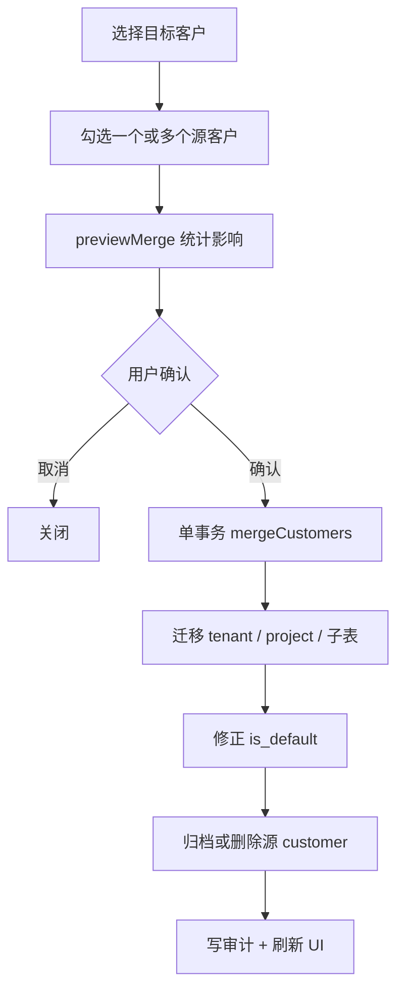

# 客户合并与租户/项目迁移设计方案

> 版本：v2.0  
> 日期：2026-05-29  
> 状态：**§11 已确认 — 已实施**  
> 确认：2026-05-29 — Q1 软归档；Q2 目标空字段可从唯一源回填；Q3 默认保留 target default、UI 可改；Q4 客户详情+列表入口  
> 变更：v2.0 — 从「单租户改绑」调整为 **客户合并**：解决平台导入 1:1 建客户导致的冗余 Customer，同步迁移 tenant、project 及关联数据  
> 关联：`packages/db/src/crm-schema.ts`、`platform-tenant-import-design.md`、`billing-tenants.ts`、`project-import-design.md`、`crm-database.md` §1.1

---

## 1. 背景与问题

### 1.1 根因

平台租户 API 导入（及 Excel 租户导入）在 **本地无对应 tenant** 时，会 **同事务** 执行：

```
INSERT customer  →  INSERT tenant (customer_id, is_default=true)
```

原平台/业务侧 **没有 Customer 语义**，同一真实客户下的多个平台租户（多开票主体、多子账号、历史重复导入等）在 CRM 中被建成了 **多个 Customer**，典型形态：

```
真实客户「甲公司」
  ├── Customer C1  ← 导入 tenant 984 时自动创建
  ├── Customer C2  ← 导入 tenant 1205 时自动创建
  └── Customer C3  ← 导入 tenant 3301 时自动创建
        各带 1 个 tenant、可能各带 1 个项目
```

导致：客户列表膨胀、同一主体充值/消费被拆散、项目与租户无法在同一 Customer 视图聚合。

### 1.2 核心诉求

| # | 诉求 |
|---|------|
| **M1** | 将 **多个冗余 Customer** 合并为 **一个** 目标客户（保留主体） |
| **M2** | 源客户下所有 **tenant** 迁移到目标客户 |
| **M3** | 源客户下所有 **project** 同步迁移到目标客户（满足 R1.3，不断开项目–租户关联） |
| **M4** | 客户级经营数据、计费冗余 `customer_id` **一并迁移** |
| **M5** | 合并后源 Customer **归档或删除**，避免继续出现在列表 |

### 1.3 与 v1.0 方案差异

| 维度 | v1.0（单租户改绑） | v2.0（本方案） |
|------|-------------------|----------------|
| 操作粒度 | 1 tenant → 另一 customer | N 个 source customer → 1 target customer |
| 项目 | 解除跨客户关联，**不迁移** project | **迁移** project.customer_id |
| 客户级数据 | 不迁移 follow_up / milestone 等 | **全部迁移** |
| 典型场景 | 个别绑错修正 | 导入后批量去重合并 |

> 单租户改绑可作为合并的特例（仅选 1 个源客户且该客户只有 1 个 tenant）；**首期以「客户合并」为主 API**，不再单独做 tenant 级改绑入口。

---

## 2. 目标与原则

### 2.1 业务目标

| # | 目标 | 说明 |
|---|------|------|
| G1 | 客户合并 | 管理员选定 **目标客户** + **一个或多个源客户**，预览后确认合并 |
| G2 | 租户迁移 | 源客户下全部 `tenant.customer_id` → 目标客户 |
| G3 | 项目迁移 | 源客户下全部 `project.customer_id` → 目标客户；`primary_tenant_id` / `project_tenant` **保留** |
| G4 | 关联同步 | 凡冗余 `customer_id` 的行，按 §4 规则批量 UPDATE |
| G5 | 不变量 | 合并后仍满足 R1.3、R1.2（每 customer 至多一个 `is_default` tenant） |
| G6 | 可预览、可审计 | 两步流 + `account_activity` 审计 |

### 2.2 非目标（本期）

- **不**合并目标客户自身（target 不可出现在 source 列表）
- **不**自动推断「哪些 Customer 是重复的」（由运营人工选择；二期可做同名/同 cert 推荐）
- **不**修改平台 OpenAPI 侧数据
- **不**在合并时覆写目标客户主数据字段（名称、销售经理等 **以 target 为准**，§5.3）
- **不**处理跨 CRM 域（supplier/finance）的外键

### 2.3 设计原则

1. **一次合并 = 一次事务**：失败整体回滚。
2. **Target 主数据保留**：合并是「收纳」而非「字段级 merge」；源 customer 行最终删除或归档。
3. **Project 与 Tenant 同迁**：两者 `customer_id` 同步改为 target，R1.3 自然成立，无需解除 `project_tenant`。
4. **按 customer_id 迁移优先**：先迁主表（tenant、project），再迁挂 `customer_id` 的子表；挂 `tenant_id` 且冗余 `customer_id` 的表在 tenant 迁移后统一修正。
5. **幂等**：源列表为空或与 target 相同 → no-op；已合并过的源 customer（已 inactive 且无 tenant）→ blocked。

---

## 3. 合并模型

### 3.1 术语

| 术语 | 说明 |
|------|------|
| **目标客户** `targetCustomerId` | 合并后保留的 Customer 主体 |
| **源客户** `sourceCustomerIds[]` | 将被「掏空」并归档/删除的冗余 Customer（≥1） |
| **迁移集** | 源客户 id 集合；所有 `customer_id IN 迁移集` 的行改挂 target |

### 3.2 合并前后结构（示例）

**合并前**（同一真实客户被拆成 3 个 Customer）：

```
C1「甲公司-984」  →  T1 (platform 984),  P1
C2「甲公司-1205」 →  T2 (platform 1205), P2
C3「甲公司-3301」 →  T3 (platform 3301), P3
```

**合并后**（target = C1）：

```
C1「甲公司-984」  →  T1, T2, T3
                   →  P1, P2, P3
                   →  （C2、C3 已归档/删除）
```

### 3.3 流程概览



---

## 4. 迁移范围：表级清单

以下凡 `customer_id IN sourceCustomerIds` 的行，合并时 **`SET customer_id = targetCustomerId`**（`tenant_id` / `project_id` 等其他 FK **不变**）。

### 4.1 主实体（必迁）

| 表 | 列 | 说明 |
|----|-----|------|
| `tenant` | `customer_id` | 源客户下全部租户 |
| `project` | `customer_id` | 源客户下全部项目；**项目子表仅挂 project_id，随 project 逻辑归属迁移，无需改 customer_id** |

**项目子表（不单独 UPDATE customer_id，随 project 归属变化）**：

`project_tenant`、`project_tag_assignment`、`project_staff_assignment`、`project_activity`、`project_activity_attachment`、`billing_sync_job_item`（含 project_id 时）

### 4.2 客户级经营数据（必迁）

| 表 | 说明 |
|----|------|
| `account_manager_assignment` | 客户经理分配 |
| `lifecycle_milestone` | 生命周期里程碑 |
| `milestone_evidence` | 经 milestone 关联，无需单独迁 |
| `conversion_record` | 转正记录 |
| `engagement_document` | 过程文档 |
| `follow_up_task` | 协作跟进 |
| `engagement_comment` | 动态评论 |
| `account_activity` | 客户动态（含 `tenant_id` 为空的手工事件） |

### 4.3 商务 / 计费（冗余 customer_id 同步）

| 表 | 迁移条件 | 备注 |
|----|----------|------|
| `contract` | `customer_id IN 源` | `tenant_id` / `project_id` 保留 |
| `consumption_record` | 同上 | |
| `commerce_order` | 同上 | |
| `tenant_bill` | 同上 | |
| `test_voucher_issue` | 同上 | |
| `contract_snapshot` | 同上 | |
| `recharge_order` | 同上 | |
| `consumption_usage_daily` | 同上 | |
| `tenant_consumption_daily_detail` | 同上 | |
| `tenant_balance_snapshot` | 同上 | |

### 4.4 仅 tenant_id、无 customer_id（不 UPDATE）

`recharge`、`coupon`、`compute_task`、`billing_sync_job_item`（仅 tenant）、`balance_snapshot_job_item`

客户维度查询经 `tenant.customer_id = target` 自动归集。

### 4.5 合并后 R1.3 校验

迁移完成后执行断言（开发/测试环境可 `SELECT` 校验）：

```sql
-- 不应存在：project 已属 target，但 primary_tenant 仍属其它 customer 的 tenant
SELECT p.id FROM project p
JOIN tenant t ON t.id = p.primary_tenant_id
WHERE p.customer_id = :targetCustomerId
  AND t.customer_id <> :targetCustomerId;

-- 不应存在：project_tenant 跨 customer
SELECT pt.id FROM project_tenant pt
JOIN project p ON p.id = pt.project_id
JOIN tenant t ON t.id = pt.tenant_id
WHERE p.customer_id = :targetCustomerId
  AND t.customer_id <> :targetCustomerId;
```

正常合并路径下结果应为 **0 行**（因 tenant 与 project 同批改挂 target）。

---

## 5. 主数据与 `is_default`

### 5.1 目标客户字段

| 规则 | 说明 |
|------|------|
| **保留 target** | `name`、`customer_code`、`salesManagerId`、生命周期字段等 **不**被源客户覆盖 |
| **空值回填（已确认）** | 若 target 某可空字段为空、且 **仅一个** 源客户该字段非空，合并时 **自动回填**；多源冲突则保留 target、preview warning |

### 5.2 `customer_code` 冲突

`customer_code` 有 UK。若源客户有 code、target 为空 → 可选回填；若双方都有且不同 → preview **warning**，合并时 **保留 target**，源 code 丢弃。

### 5.3 `is_default` 租户

合并后 target 下可能有多个 `is_default = true`（每个源客户曾各有默认 tenant）。

| 规则 | 说明 |
|------|------|
| 合并后仅保留 **一个** default | 默认保留 **target 客户原 default tenant**；若 target 无 default，保留 **第一个源客户的 default** |
| 其余 tenant | `is_default = false` |
| UI | preview 展示 default 决策；可提供下拉「合并后默认计费账户」供用户覆盖 |

### 5.4 源 Customer 处置

| 策略 | 说明 | 建议 |
|------|------|------|
| **软归档** | `UPDATE customer SET status = 'inactive'` | 首期采用，可回溯 |
| **硬删除** | 源客户无 tenant/project/子表后 `DELETE` | 二期；需确认无法务引用 |

归档前须确认源客户下 **tenant、project 计数均为 0**（均已迁走）。

---

## 6. API 与交互

### 6.1 tRPC

| 过程 | 输入 | 输出 |
|------|------|------|
| `crm.customers.previewMerge` | `{ targetCustomerId, sourceCustomerIds: string[] }` | §6.2 |
| `crm.customers.merge` | `{ targetCustomerId, sourceCustomerIds, defaultTenantId?: string }` | 合并结果摘要 |

权限：`adminProcedure`。

校验：

- `sourceCustomerIds` 去重、非空、不得含 `targetCustomerId`
- 所有 id 存在
- 源客户不能已被合并（`status = inactive` 且无 tenant 的可 blocked 或允许 no-op）

### 6.2 预览结构

```typescript
type CustomerMergePreview = {
  targetCustomer: { id: string; name: string; tenantCount: number; projectCount: number }
  sourceCustomers: {
    id: string
    name: string
    tenantCount: number
    projectCount: number
    tenants: { id: string; name: string; platformTenantId?: string; isDefault: boolean }[]
    projects: { id: string; name: string }[]
  }[]
  blocked: boolean
  blockReason?: string
  impacts: {
    tenantsToMove: number
    projectsToMove: number
    rowsByTable: Record<string, number> // §4 各表 COUNT
  }
  defaultTenant: {
    currentTargetDefaultId?: string
    recommendedId: string
    candidates: { id: string; name: string; fromCustomerName: string }[]
  }
  warnings: string[] // 如 customer_code 冲突、源客户将归档
}
```

### 6.3 写库事务顺序

```
1. 校验 target / sources（§6.1）
2. UPDATE tenant SET customer_id = :target WHERE customer_id IN (:sources)
3. UPDATE project SET customer_id = :target WHERE customer_id IN (:sources)
4. UPDATE §4.2 客户级表 SET customer_id = :target WHERE customer_id IN (:sources)
5. UPDATE §4.3 计费冗余表 SET customer_id = :target WHERE customer_id IN (:sources)
6. 修正 is_default（§5.3）
7. UPDATE source customers SET status = 'inactive' WHERE id IN (:sources)
8. INSERT account_activity 审计（§7）
```

### 6.4 UI 入口

| 位置 | 行为 |
|------|------|
| **客户详情页** `/crm/customers/[id]` | 「合并客户」：当前客户为 **target**，弹窗多选源客户 |
| **客户列表页** `/crm/customers` | 批量操作（可选）：选中多个客户 →「合并到…」选 target |
| 弹窗 `crm-customer-merge-dialog.tsx` | Step1 确认 target → Step2 多选 sources（搜索、展示 tenant/项目数）→ Step3 preview → Step4 选 default tenant → 确认 |

租户详情页 **不再** 单独提供「改绑客户」；如需只迁 1 个 tenant，走「源客户仅含该 tenant 的合并」。

---

## 7. 审计

在 **目标客户** 下写入 `account_activity`：

| 字段 | 值 |
|------|-----|
| `customer_id` | `targetCustomerId` |
| `tenant_id` | NULL |
| `title_snapshot` | `客户合并` |
| `summary_snapshot` | `合并 N 个源客户：…` |
| `ref_domain` | `customer_merge` |
| `payload` | `{ targetCustomerId, sourceCustomerIds, movedTenants, movedProjects, defaultTenantId, operatorStaffId }` |

---

## 8. 边界与错误

| 场景 | 处理 |
|------|------|
| source 含 target | `blocked` |
| 源客户不存在 | `blocked` |
| 源客户已无 tenant/project（已合并过） | `blocked` 或 warning + no-op |
| 合并后 target 下项目同名 | **允许**（库表无 UK）；preview 仅 **warning** 列重名项目 |
| 并发合并同一源客户 | 事务 + 合并前锁源 customer 行或检查 tenant 仍属源 |
| 合并后列表 | 源客户 `inactive` 后默认列表过滤掉（与现有 status 筛选一致） |

---

## 9. 示例

### 9.1 场景

真实客户「几何科技」被导入为 3 个 Customer：

| Customer | Tenant (platform) | Project |
|----------|-----------------|---------|
| C1 | T1 / 984 | P1 几何Docker |
| C2 | T2 / 1205 | P2 几何训练 |
| C3 | T3 / 3301 | — |

操作：以 **C1** 为目标，合并 **C2、C3**。

### 9.2 结果

| 对象 | 结果 |
|------|------|
| C1 | 保留；下属 T1+T2+T3，P1+P2 |
| C2、C3 | `status = inactive`；无 tenant/project |
| P2.`customer_id` | C2 → **C1** |
| P2.`primary_tenant_id` | 仍为 T2（T2 也已属 C1，R1.3 ✓） |
| `tenant_bill` 等 | 凡原 `customer_id IN (C2,C3)` → **C1** |
| `follow_up_task` 等 | 原挂 C2/C3 → **C1** |
| `is_default` | 仅 T1（或用户指定）为 true |

---

## 10. 代码改动清单（确认后实施）

| 层级 | 文件 | 改动 |
|------|------|------|
| Data access | `customer-merge.ts` | `previewMerge`、`mergeCustomers` |
| Types | `lib/types/customer-merge.ts` | Preview/Result 类型 |
| Router | `routers/crm/index.ts` + `schemas.ts` | `previewMerge` / `merge` |
| UI | `customer-merge-dialog.tsx` | 合并弹窗 |
| UI | `customer-detail-content.tsx`、`customers-content.tsx` | 入口 |

**无需** schema migration。

### 10.1 后续改进（非本期）

| 项 | 说明 |
|----|------|
| 导入时去重 | 平台租户导入 Step2 按 `company_name` / `cert_code` **推荐已有 Customer**，减少新建 |
| 自动发现重复 | 同名、同 cert、同联系人启发式列表 |
| 源 customer 硬删除 | 归档后定时清理 |

---

## 11. 待确认项

| # | 问题 | 结论 | 确认 |
|---|------|------|------|
| Q1 | 源 customer 合并后处置 | **软归档** `status=inactive` | ☑ |
| Q2 | 目标客户主数据是否允许从源回填空字段 | **是** — 唯一源非空时自动回填 | ☑ |
| Q3 | 合并后 default tenant 默认策略 | **保留 target 原 default**；UI 可改 | ☑ |
| Q4 | 入口 | **客户详情 + 列表** | ☑ |
| Q5 | 是否支持一次合并 >3 个源客户 | **支持**，上限 20 | 沿用建议 |
| Q6 | inactive 源客户是否出现在列表 | **默认隐藏**，筛选可显 | 沿用建议 |

---

## 12. 参考

- `crm-database.md` §1.1 R1.1–R1.3、R2.1、R3.4
- `platform-tenant-import-design.md` §3.2 — 新建 customer 根因
- `billing-tenants.ts` — `is_default` 互斥逻辑可复用
